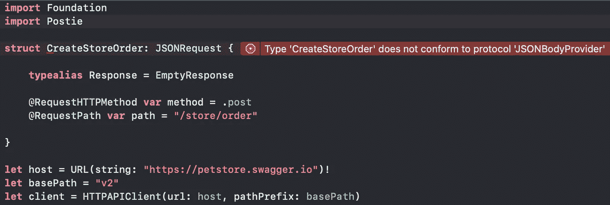

# 使用 Postie 将 Swift HTTP APIs 升级到下一个级别

> 原文：<https://itnext.io/upgrading-swift-http-apis-to-the-next-level-using-postie-942ec33f7a24?source=collection_archive---------2----------------------->

在 Swift 中定义 HTTP APIs 还不完善(还？).大多数 iOS 和 macOS 应用程序都使用它们来与远程数据端点通信。根据不同的边缘情况，编写和验证请求、发送请求、解析响应曾经是一件很麻烦的事情…你可能认为现在有很多框架可以解决这种复杂性…

…但是有了 [Postie](https://github.com/kula-app/Postie/) 你可以进一步提升你的能力！

下一级 Swift HTTP API 包

## 现有的解决方案很笨重

那么，我们目前最先进的技术有什么问题呢？

最受欢迎的 Swift 网络框架是 [Alamofire](https://github.com/Alamofire/Alamofire) ，它在 GitHub 上获得了 **36.000+** 颗星。自 2014 年首次发布以来，它已经有了很长的改进、重构和扩展历史。

不幸的是，如此长的历史最终会导致代码膨胀，您可能不需要框架中包含的所有特性。
几年前，我很高兴能有一个帮助使用`URLSession`的库，并带走了 JSON 解析，这一切都发生在`JSONDecoder`发布之前。
今天我们不再需要它了，因为使用内置特性处理响应变得非常简单。

## OpenAPI 定义

为了开始解释 Postie 的核心概念，让我们回顾一下关于 API 定义的知识。

最初称为 Swagger API 定义的 [OpenAPI 规范](https://swagger.io/specification/)是当今 API 定义的通用标准。请看这个来自 [Petstore 示例](https://editor.swagger.io/)的片段，包括一个下订单的端点:

1.  定义的`host`被用作我们需要发送 HTTP 请求的 URL 中的域
2.  `basePath`是一个路径前缀，在 API 版本控制中很常见，因为它允许在同一台主机上有多个 API
3.  在`paths`中，我们定义我们的资源路径。`/store/order`是静态的，但是`/pet/{petId}`需要设置一个路径参数`petId`，需要用某个标识符来替换。
4.  `/store/order`端点在主体中需要一个参数，该参数必须是模式为`Order`的对象。这是在`definitions`一节中宣布的。
5.  `/store/order`返回一个状态码`200`，在响应体中有另一个`Order`对象，或者如果验证失败，返回状态码`400`，而不是在响应体中有一个`Error`对象。
6.  `Order`对象包含多个不同类型的字段，包括`int64`、`int32`、`date-time`字符串甚至字符串枚举。

如您所见，请求和响应定义得非常好。不幸的是，这个端点带来了一些警告，因为在实现过程中我们需要考虑一些边缘情况:

1.  响应正文模式因状态代码而异
2.  请求正文参数是必需的，不应缺失。
3.  请求 URL 可能需要参数(比如`petId`)，甚至可能需要特定的类型(比如`UUID`)。

> 另一个话题是认证，这不是我在这篇文章中讨论的。存在许多不同的认证机制，包括 HTTP Basic(用户名+密码)、API 密钥和 OAuth 令牌。所有这些都需要以不同的方式处理，因此对于这个介绍来说太多了。

现在你知道我们面临什么样的挑战了。那么，我们如何利用 Swift 的力量来帮助我们定义结构良好的 API 代码呢？

# 介绍帖子

[Postie](https://github.com/philprime/Postie) 是我们新的 Swift 包，它负责将我们的 API 请求类型转换成`URLRequest`对象，将它们发送到端点，接收`URLResponse`并将其转换回我们定义的 API 响应类型。

Swift 编译器及其强大的类型范例允许我们负责所有的数据结构管理。
从高层次的角度来看，主要概念结合 Swift 5.1 的属性包装器，使用了已经内置的创建自定义`Encoder`和`Decoder`的选项。

听起来很复杂，但幸运的是，您不必担心 Postie 的魔力是如何工作的，相反，您只需定义您的 API🎉

像往常一样，这个例子更容易理解，所以让我们从一个简单的 HTTP 请求开始，请求我们的`/store/order`端点:

我们可以看到这个请求包括一个 HTTP 方法、URL 路径、一个带有远程域的`Host`头、一个声明我们正在发送的数据类型的`Content-Type`头，以及主体中的实际 JSON 数据。此外，我们还定义了一个`Accept`头，它告诉远程端点我们想要接收什么类型的数据(也是 JSON)。

那么如何使用 Postie 来声明这个请求呢？

## 定义 API 请求

我们从最简单的方法开始，然后添加更多的信息。

创建以下请求:

现在我们使用`@RequestHTTPMethod`属性包装器将默认的 HTTP 方法`GET`更改为`POST`。

接下来，我们需要使用`@RequestPath`属性包装器定义资源路径。

**注意:**如前所述，我们*而不是*向请求路径添加前缀`v2`，因为请求类型本身与实际的远程主机没有关联。相反，我们必须用 HTTP 客户端定义主机 URL 和前缀:

接下来，我们需要添加请求体。从 HTTP 请求中我们知道

1.  该对象被定义为一个`Order`结构
2.  它需要是一个 JSON 对象

为了解决第二个要求，将`CreateStoreOrder`的类型从`Request`改为`JSONRequest`。这将指示 Postie 的编码逻辑，请求体应该转换为 JSONdata，并且需要设置头`Content-Type: application/json`。

这也是 Swift 编译器支持我们的一个很好的例子。在更改请求类型之后，它要求我们立即修改请求以添加属性`body`。

声明一个必须实现`Encodable`模式的结构`Body`,就万事俱备了。

现在我们可以修改`Body`使其具有与我们的`Order`模式相同的结构，但是我们定义了一个`Definitions`结构，这样我们就可以重用它。

太好了！我们已经完成了请求类型的声明🎉

## 定义 API 响应

是时候定义我们的响应类型了，所以看一下预期的 HTTP 响应:

它主要包含响应状态代码、响应头和主体数据。

要从响应中访问任何信息，相关联的类型`Response`需要变成实际的`struct`。我们之前使用了`EmptyResponse`，这是一个方便的类型别名，用于以下内容:

第一步，我们要读取响应状态代码。使用包装器`@ResponseStatusCode`添加一个属性。

> **注:** *您可以随意命名属性。如果协议没有要求(例如* `*body*` *)，只有属性包装器是相关的。*

当解码响应时，Postie 现在将找到`statusCode`属性，并看到它应该用实际的 HTTP 响应代码进行设置。

在定义响应体之前，让我们快速回顾一下 OpenAPI 的定义:

看起来我们需要定义两个响应，它们根据响应代码的不同而不同。这也是 Postie 中内置的，因为您不仅可以定义一个`@ResponseBody`，还可以定义一个`@ResponseErrorBody`属性，该属性仅在状态代码介于 400 和 499 之间时才会被填充。

为了让这个代码片段工作，我们需要更改`Defintions.Order`类型，不仅要实现`Encodable`协议，还要实现`Decodable`协议。此外，我们需要定义`Definitions.Error`，这一点应该很清楚。

在最后一步，我们再次需要指出 Postie 的解码逻辑，以期待一个 JSON 请求体，这是通过将类型`Order`的`Decodable`协议改为`JSONDecodable`来完成的(对于`Error`也是如此)。

干得好！让我们拍拍自己的背，我们的 API 定义已经准备好了💪🏼

## 发送请求

使用请求定义很容易。你所要做的就是创建一个对象`CreateStoreOrder`并使用我们之前声明的`HTTPAPIClient`发送它。

> **注:** Postie 使用异步事件框架[结合](https://developer.apple.com/documentation/combine)进行通信。因为它使用底层的`URLSession`，其他的异步模式也是可能的(如果需要的话)。

由于我们的`CreateStoreOrder`有一个关联的`Response`类型，我们不必再次定义预期的响应类型，也不必担心它的解析逻辑。

从现在开始，我们简单地**使用**我们的 API。

# 更多功能

还有更多可用的特性，但我无法在本文中一一介绍。强烈建议您查看大量的[自述指南](https://github.com/kula-app/Postie/)来查看完整的特性集。

只是让你看一下还有什么可用的:

*   `@RequestHeader`定义请求头
*   `@ReponseHeader`从响应中读取特定标题
*   `@QueryItem`向请求 URL 查询添加键入的字段
*   `@RequestPathParameter`在 URL 中设置类型化参数(例如我们示例中的`petId`)

…以及更多！

# 那么，有什么不同呢？

你可能想知道为什么我们认为 Postie 不同于其他框架/包。

我前面提到过，其他框架很笨重，包含许多特性，大多数用户都没有使用过。由于 Postie 最终也会随着它的特性集而增长，我们的对策是保持内核的精简，可能实现多包方法，并且在定义 API 时需要尽可能少的信息。

我们使用属性包装器的方法正好实现了这一点。其他框架要求在发送请求时将额外的头或值作为函数参数传递，但是 Postie 坚持使用面向对象的方法:

> 请求是一个单一的数据对象，它包含接收预期响应的所有相关信息。

# 路线图

Postie 最终将发展成为一个成熟的 HTTP 框架，负责所有的数据转换和需求验证。主要目标是拥有一个面向对象的`Request-Response`模式，这允许开发者更少地担心*如何*使用 API，而是*用它做什么。*

在撰写本文时，Postie 支持 JSON 和表单 URL 编码的数据，但我们也计划在未来支持 XML。

随着 Swift 5.5 中 async-await 的出现，当前基于组合的发送逻辑将得到扩展。如果需要，我们还将包括传统风格的回调。

其他想法包括一个 [Swiftgen](https://github.com/SwiftGen/SwiftGen) 模板，用于自动将 OpenAPI 规范直接转换成随时可用的 Postie 请求定义。

尽管该软件包仍在积极开发中，但我们将在 [techprimate](https://www.techprimate.com/) 上将其用于生产应用，并验证其用途，最终将其升级到版本 1.0.0

# 结论和贡献

遵循[库](https://github.com/kula-app/Postie/)并提交您的特性请求。它是作为一个开源项目开始的，并且应该一直保持下去，这样我们就可以互相受益。发现了窃听器？[让我们知道吧！](https://github.com/kula-app/Postie/issues/new)

我也很想听听你对这个项目的看法。在推特[上关注我](https://twitter.com/philprimes),随时留下你的想法。
也结账[我的其他文章](philpri.me/blog)。你有具体的话题想让我说吗？让我知道！😃