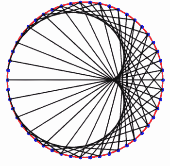

# 升级到 React 挂钩:地块、Web 动画和 React 挂钩

> 原文：<https://itnext.io/upgrading-to-react-hooks-parcel-web-animations-and-react-hooks-3a3cd044a6b9?source=collection_archive---------4----------------------->


主要是为了好玩，我决定使用 React 钩子将我的一个旧项目升级到 React 的当前版本。

*   项目代码:[https://github.com/ajcrites/times-tables](https://github.com/ajcrites/times-tables)
*   直播项目:[https://times-tables.explosionpills.com/](https://times-tables.explosionpills.com/)

这是一个相当简单的 React 应用程序，可以显示和动画显示一个时间表。它从根本上分为三个组件:维护状态的应用程序容器、可视化本身以及操纵可视化的控件。

***更新*** *:这篇文章最初是 React 钩子在 alpha 时写的，因此有了下面这段。本文中的所有代码都已经过 React 最新稳定版本的测试(包括钩子)，你可以简单地用* `*yarn add react react-dom*` *安装。*

我的第一步是用钩子更新 React 的版本。这目前是通过`yarn add --exact react@next react-dom@next`完成的，因为钩子仍然在 alpha 中。注意这里的`--exact`是推荐的，因为在你的`package.json`里如果你有`"^16.8.0-alpha.1"`，yarn/npm 可能会安装 v16 而不是 alpha 版本。使用`"16.8.0-alpha.1"`可以避免这个潜在的陷阱。

# 使用包裹

我用 Create React App 和现在已经过时的`react-scripts-ts`创建了这个项目。我所做的一些更改导致应用程序不再编译。很久以来我一直想使用 package，所以我硬着头皮更新了我的项目来使用它。

我被包裹的便利程度所折服。我所要做的就是将`public/index.html`移动到`src/index.html`，并更新它以包含`<script src="./index.tsx">`。Parcel 用`yarn parcel serve src/index.html`做了几乎所有的事情。使用类似的`yarn parcel build`也适用于生产。除了开发和林挺，我甚至不需要任何特殊的 TypeScript 配置。

`react-scripts`现在也支持 TypeScript 了，不过我还没测试过。如果你还没有尝试过，我会推荐你试试 package。它快速方便，几乎不需要配置，内置功能性热重装。我还使用`parcel-plugin-static-files-copy`在构建时复制一些静态文件。

# 使用元素动画

虽然仍处于试验阶段，但现在已经有 JavaScript APIs 允许你在 DOM 元素上调用`.animate`来触发动画。与我之前所做的相比，我更喜欢这样做——设置 CSS 动画，在超时和使用过渡时更新样式。使用`.animate` API 更干净、更简单、更直接。

使用 CSS 过渡的之前的*代码可能看起来简单一点，但是注意你必须单独处理后动画过渡。您也可以使用类似于`transitionend`事件的东西来设置状态，但是我会发现这几乎和使用超时一样不可靠。*

使用`.animate`的代码一开始可能看起来有点复杂，但那只是因为我们有额外的动画设置来显示持续时间和方向。我更喜欢明确的一组动画关键帧，你可以选择向前和向后动画。等待动画结束也是显式的。在你不得不等待多个动画完成的情况下，这也是很好的选择；否则你将不得不做一些事情，比如管理多个`transitionend`，或者选择等待最长的超时。

请注意，部分或全部的 web 动画 API 并不是在所有的浏览器中都可用，它仍然是一项实验性的技术。通过`import 'web-animations-js/web-animations-next-lite.min'`，polyfill 库正好满足了我的需求。根据您的特定需求，该库还有其他聚合填充文件。我强烈推荐。

# 反应钩

我的项目的组件层次结构如下:

```
<TimesTableApp>
  <TimesTableVisualization />
  <TimesTableControls />
  <About />
</TimesTableApp>
```

“控件”和“可视化”还有一些子控件，分别用于控件的 UI 和时间表本身。很难想象我能从我正在使用的组件中获得更多的重用。基本上就是 HTML。因此，除了将事物分开一点并试图将相似的事物放在一起之外，我没有在组件层次结构上花太多心思。

我所指的**应用状态**包括三个值:

*   乘法表
*   点数
*   线条颜色

你可以在网站上看到这个时间表是如何工作的，但是“时间表”是显示的时间表的数字(2 次表，3 次表，4.2 次表，等等)。)，“点数”是在可视化上的圆周围有多少个点供乘法表使用，“线颜色”是显示乘法的线的颜色。这是一张 gif 图片，显示了从 2 倍到 10 倍的表格中的 50 个点，每次一个点。线条颜色每 0.5 倍表格改变一次。



这可以使用组件组合来完成——可视化部分和时间表编号、点数和线条颜色的控件都可以位于顶层。旧版本的应用程序将这些值向下钻了一层— `TimesTableApp`通过其状态传递这些值，并将操作时间表的方法传递给输入/按钮等使用的控件。

我决定升级到 hooks 主要是实验性的，但是我也做了一些额外的清理工作。我将一步步回顾我经历的每一个变化。

## 状态和参考

要更新的最简单的组件是“关于”组件。这主要是静态信息，与应用程序状态无关。唯一有趣的是，它是一个使用我上面展示的 web 动画来制作动画的模型。

`useRef`与 React 挂钩真的没有任何不同，比`React.createRef`为我的需要在这里。注意，您可以使用`useRef`代替`this`来维护组件的任何可变值，但是它也可以用于组件的`ref`属性。

这里更值得注意的变化是`About`从类组件变成了功能组件。钩子是用于功能组件的。否则，除了我们不再使用`this.`之外，这个`contentRef`的用法是一样的。

我们还需要维持我们的状态，`show`从早。这仅仅用于确定内容是否正在实际显示。

为了清楚起见，上面的例子包括了之前的`useRef`。添加的是`useState`。对于门外汉来说，状态挂钩可能有点不寻常——尤其是如果你习惯使用`this.state`的话，但是我会试着解释它是如何工作的。

`useState`返回一个包含两个值的数组。第一个是当前渲染周期的 state 属性值。第二个是允许您更新这个状态值的函数。因为在这种情况下我们只有一个值，所以我们不需要像处理`state` / `setState`那样的对象。相反，`show`是布尔值。当我们想要更新它时，我们调用`setShow`，一个我们可以随意命名的函数。我坚持传统。

如果这是你第一次在工作中看到`useState`，你可能会想:

> `show`怎么更新？

记住`About`是一个组件函数。每次收到更新时都会调用它。钩子更新组件的状态——调用`setShow`用新的`show`值触发更新。当再次调用这个组件函数时，`useState`将从更新后的状态返回新的*值，组件将被相应地渲染。`useState`的参数是初始渲染时使用的初始值。*

调用`setShow`更新`show`的方式与`this.setState({ show })`更新`this.state.show`的方式相同。希望这是清楚的。如果没有，您可能想尝试更新您的项目中的一些简单的、有状态的组件来使用`useState`来看看它是如何工作的。

## 效果和状态管理

更新的下一步是更新时间表可视化本身。这是一个相当简单的组件，完成一些数学运算并绘制到画布上。调整大小时，图形会调整大小以匹配窗口大小，并且它会在时间表编号、点数或线条颜色发生变化时重新绘制。这些都是时间表可视化的支撑。

完成钩子更新有几个步骤:

1.  低垂的果实:`useRef`而不是`createRef`
2.  生命周期挂钩(`component...`方法)需要替换为`useEffect`
3.  必须像`forceUpdate`一样使用`useState`来触发重绘。

我发现`useEffect`有点难以理解，因为它不是生命周期挂钩的一对一转换。`useEffect`钩子通常会在挂载和任何更新时运行。

`useEffect`采取回调处理你的副作用逻辑。你可以选择从这个回调函数中返回一个函数来消除你的副作用。“副作用”可以广义地理解为在组件状态之外的组件中运行的效果。浏览器窗口上的`'resize'`事件是副作用的一个理想例子。

这对我们来说意味着三件事:

1.  效果必须设置初始宽度/高度。
2.  一个效果必须在窗口上添加`'resize'`事件监听器。
3.  效果必须返回一个函数来移除此事件侦听器。

为了让`resize`事件正常工作，它必须更新一些组件状态来触发渲染…否则，画布将不会被重绘，因为`resize`实际上没有更新任何状态或道具。我们可以为此使用任意的`useState`。这可能看起来有点奇怪，但你可以认为这是在使用`forceUpdate`。

第一步将是为`useRef`更新。

我现在已经停止了大部分的功能。这只是设置了`canvas`参考值。

`<canvas ref={this.canvasRef}`改为`<canvas ref={canvasRef}`。否则，处理方式与之前相同。

敏锐的读者可能会注意到，我们在顶层(组件函数的作用域)没有类似于`const canvas = canvasRef.current`的东西。相反，我们在里面做这个*`redraw`。原因是如果我们执行`const canvas = canvasRef.current`，那么`canvas`永远不会在`redraw`方法中被重新计算。它是初始值`canvas`附近的一个闭包，因此将被设置为初始值。在我们这里:`null`。*

相反，我们需要在任何时候使用`canvasRef.current`来访问给定范围内当前渲染周期的`canvasRef`。注意，`const canvas = canvasRef.current`在我们的`redraw`函数内部工作。这是因为只要调用`redraw`就会调用`.current`。

当画布的宽度/高度改变时，我们可以使用`useState`强制更新来重绘画布。如果我们不这样做，画布不会被重画，因为没有状态或道具被更新。在早期的版本中，我已经记录了这个效果的宽度/高度。那也行得通，但是我发现这种方法更简单。

上面的`forceUpdate`的参数是 TypeScript 所必需的，但是它可以是任何东西。调用由`useState`返回的 set 函数将触发渲染。您也可以随意命名这个函数——不一定非得是`forceUpdate`。

这导致了我们对`useEffects`的使用，它将对`redraw`进行初始调用，以触发画布尺寸的初始绘制，并设置 resize 事件。当调用`useEffect`回调函数时，画布 ref 已经被设置为`<canvas>`。

这花了我一点时间来理解，但是第一个`useEffect`在初始渲染时被调用，然后会因为`redraw()`而触发*另一个*渲染。然而，我们必须等待画布被绘制以访问 ref，这样我们就可以设置它的尺寸，所以第二次渲染是合适的。

`useEffect`的第二个参数用作比较器——如果数组中的值都不变，就不会再次调用`useEffect`回调。如果你使用`[]`，没有值可以比较，回调只被调用一次(在初始渲染时)。对于`[]`没有特殊处理，它只是不会再次运行效果，因为没有比较器值发生变化。在我们的例子中，这是可取的，因为我们只想对画布进行初始调整，只要显示可视化，我们就不需要多次添加/删除窗口侦听器。

> 听起来可能很奇怪，在我更新的早期版本中，最终由`useEffects`完成的与旧值的比较`==`花费了太长时间，导致了闪烁。在实际项目中，我省略了条件检查。实际上，连续渲染比进行这种检查更有效。

## 使用上下文

这是我不用钩子也能完成的事情，但是这里有一个方便的`useContext`钩子，我可以利用它。

与其让`TimesTableApp`在同级可视化和控件之间显式传递应用程序状态数据，我认为更简单的方法是拥有一个允许可视化/控件根据需要检索和更新状态属性的上下文。这确实大大简化了事情，但是正如 React 文档中所建议的，这创建了可视化和控件与上下文的耦合。由于我既没有计划也没有看到如何使这些组件在项目间可重用，我认为这是一个很好的妥协。

`TimesTableApp`仍然需要管理上下文，所以除了属性本身之外，它还需要更新相应状态属性的方法。

`{} as any`用于避免必须在上下文中设置初始值的冗余，而`TimesTableApp`用于管理顶级上下文。使用初始值，`{ pointCount: 0, ... }`等。也会很好。

下一步，我想更新控件和可视化来使用上下文。我没有更新`TimesTableApp`来使用钩子，而是开始坚持使用`this.state`并传递上下文，而不是单个的状态值(时间表、点数和线条颜色)。

可视化和控件现在可以使用这些值。乘法表控件有一个“播放”按钮，用于递增乘法表。我们可以用`setTimesTable`上下文方法更新时间表。

上面的`useRef`用于跟踪间隔计时器。记住`useRef`可以用来跟踪任何可变的值，间隔计时器将在我们再次`play`时改变。

希望上面的代码看起来合理，但是我们有一个小问题。如果您还记得我说过的关于`const canvas = canvasRef.current`的话，闭包将使用创建闭包时评估的任何值。这意味着`setInterval`回调中的`timesTable`将始终是初始值(`2`，并且乘法表的增量永远不会超过`2.1`。

相反，当我们需要读取时，我们需要一种方法来访问在*上下文*中的`timesTable`值。不允许在组件函数范围之外的任何地方使用`useContext`，所以我们不能在`setInterval`内部使用它。此外，像`const ctx = useContext()`和`ctx.timesTable`这样做也不起作用，因为`ctx`是每次渲染的新对象，而不是对最初创建的对象的引用。

我们可以从 React 的`setState`中得到提示，允许我们的状态更新函数接受一个提供当前上下文值的回调。为此，我们可以更新`TimesTableApp`中现有的`changeValue`函数:

这确保了无论`setInterval`回调在哪里被设置，无论何时运行，我们都有正确的时间表值。例如，我们的控件也可以有一个带有`onChange={({ target: { value } } => setTimesTable(+value)}`的输入，所以设置一个值而不是使用回调仍然有效。

我们也可以更新可视化来使用上下文而不是道具。这里的变化很小，因为它们都来自同一个来源(应用程序状态),所以这是必要的还是可取的还存在争议。然而，我这样做是为了一致性。

简单来说`const props = useContext(TimesTableContext)`应该没问题，也可以显式通过道具。我认为这主要取决于个人喜好。

## 顶级状态管理

最后的改动是更新`TimesTableApp`使用钩子。这相当简单，因为我们可以从`this.state`移动到`useState`

这实际上不是一个简化…除了一些风格上的东西，这正是我把`TimesTableApp`改成的。您会注意到不再需要`changeValue`函数工厂。相反，`useState`中的`set*`函数方便地满足了我们的这些需求，因为您也可以向提供当前值的`set*`函数传递回调。也就是说，我们仍然可以在 controls 组件内部使用`setTimesTable`而不做任何更改。

> 我当前的应用程序在播放时会改变时间表和线条颜色。由于线条颜色依赖于两个当前的上下文值，这导致了用于更新状态的嵌套回调。我认为这有点不靠谱，我更喜欢一种管理多个状态值的机制，尽管这可能只是一个带有值对象的单个`useState`，而不是单个的`useState`…但这也使得更新单个值变得更加复杂。

# 结论

包裹、`web-animations-js`、React 挂钩都很棒。我已经很久没有更新这个项目了，所以我做的一些改变，比如转移到一个 React 上下文，并不需要钩子来参与。这使得我更难看出对我的代码的一些有争议的改进是严格地来自钩子还是来自我本可以用于 React 类的另一个范例。

我对钩子很感兴趣，尽管除了创建可重用钩子的潜力之外，我还没有看到使用 React 类的实质性优势。React 团队认为，因为 JavaScript 中的`this`一般来说很难掌握，而且并不是每个想使用 React 的人都来自面向对象的状态管理背景，所以钩子将降低一些开发人员的入门门槛。这可能是真的，但是我认为它们仍然带来了自己的挑战，比如要求对函数范围有更好的理解。我认为钩子的使用也可能很快变得笨拙……你没有强制的单一状态对象和生命周期，但是你可以用各种方式管理状态、生命周期和范围值。是什么让`const val = useRef()`比`this.val`好？

我知道钩子在很大程度上是向后兼容的，所以这可能会限制它们的功能。我不认为钩子能解决任何新的问题，尽管我认为一旦它们被更广泛地采用，这种情况可能会改变。我期待看到使用钩子的改进的和明智的状态管理模式，因为我认为这是他们现在最大的弱点。

还有，为什么 JavaScript 中的比较操作符明显很慢？