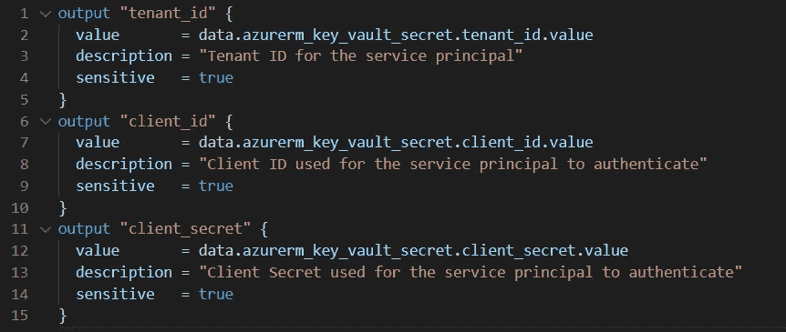
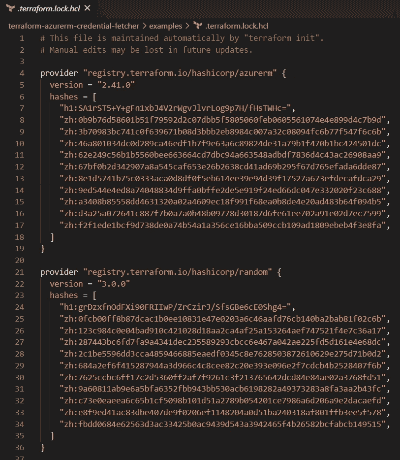
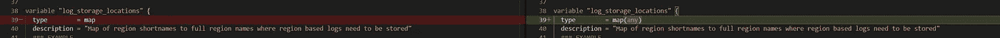

# 升级到 Terraform 0.14 体验-警告！

> 原文：<https://itnext.io/upgrading-to-terraform-0-14-experience-warning-18ea3f4bc396?source=collection_archive---------0----------------------->

当假期平静下来的时候，我想我会尝试用 Terraform 0.14 来验证我们的模块。本文的目标是关注现有模块所需的变更，而不是全部变更。

HashiCorp 在[发布了升级到 Terraform v0.14 的全部变更—由 HashiCorp](https://www.terraform.io/upgrade-guides/0-14.html) 发布的 Terraform。

在这篇博客中，我回顾了对提供者配置、敏感输出(这很好，但有一个阻塞错误)、更严格的 linter 和名为 *alltrue* 的新函数的更改。

# 提供商配置

在 Terraform 0.13 中，HashiCorp 引入了一种定义模块需求的新方法，如下所示:

```
terraform {
  required_providers {
    github = {
      source = "hashicorp/github"
      version = "4.1.0"
    }
  }
}
```

从 0.14 开始，它们为 provider 资源中版本的弃用铺平了道路。因此，如果您的代码中有这样的片段，您将会收到一个反对警告

```
provider "azurerm" {
  version = ">=2.17"
  features {}
}
```

警告(原谅来自 terratest 的日志记录)

```
TestCoreCompliance 2020-12-21T12:31:39-05:00 logger.go:66: Warning: Version constraints inside provider configuration blocks are deprecated
TestCoreCompliance 2020-12-21T12:31:39-05:00 logger.go:66: 
TestCoreCompliance 2020-12-21T12:31:39-05:00 logger.go:66:   on ../provider.tf line 2, in provider "azurerm":
TestCoreCompliance 2020-12-21T12:31:39-05:00 logger.go:66:    2:   version = ">=2.17"
TestCoreCompliance 2020-12-21T12:31:39-05:00 logger.go:66: 
TestCoreCompliance 2020-12-21T12:31:39-05:00 logger.go:66: Terraform 0.13 and earlier allowed provider version constraints inside the
TestCoreCompliance 2020-12-21T12:31:39-05:00 logger.go:66: provider configuration block, but that is now deprecated and will be removed
TestCoreCompliance 2020-12-21T12:31:39-05:00 logger.go:66: in a future version of Terraform. To silence this warning, move the provider
TestCoreCompliance 2020-12-21T12:31:39-05:00 logger.go:66: version constraint into the required_providers block.
```

准备弃用的快速解决方法是删除版本属性

```
provider "azurerm" {
  features {}
}
```

# 敏感输出

我认为这个变化是一个很好的补充，但却是一个突破性的变化。当使用输出公开模块中的数据时，terraform 允许您使用属性 **sensitive = true** 将输出标记为敏感。这有效地在应用阶段从输出中隐藏了它。例如，您仍然可以使用 *terraform output -json* 来检索值。此外，敏感信息仍然存在于状态文件中。这种改变主要是为了让日志尽可能不包含敏感数据。

哈希公司已经将这种能力提升到了一个新的水平。如果任何资源或模块将其输出标记为敏感，Terraform 将通过让您将输出标记为敏感来增强其敏感性。

因此，如果您习惯于输出一个完整的对象，如**data . azure RM _ key _ vault _ secret**，您将需要将输出标记为敏感，因为它的属性是敏感的(密钥)



输出配置示例

该功能的引入与依赖锁文件的引入紧密相关。依赖锁通过跟踪使用的每个模块的版本并将数据存储在名为 *.terraform.lock.hcl* 的文件中，允许可重复的部署。这个文件应该提交给源代码管理。有关依赖锁文件系统的全部细节，请查阅[文档](https://www.terraform.io/docs/configuration/dependency-lock.html)。

> 迄今为止，很少有上游模块将其输出标记为敏感。当他们开始利用这个特性时，我希望他们会相应地升级版本，因为这是一个突破性的变化。此外，您应该对上游模块进行版本控制，以确保当上游发生更改时，您可以将它们优雅地级联到您的模块输出中。

样本:



最后，敏感值的引入有一个缺陷，当您有一个资源循环并且这些资源有敏感值时，这个缺陷就会显现出来。这会导致恐慌。因此，我们暂停了向 Terraform 0.14 的迁移，直到问题得到解决。

HashiCorp 的工作人员已经承认并重现了这个问题，我希望在 0.14.4 中会有一个修复。

链接:[带有敏感值的 for 循环的模板出现混乱:“值已标记，因此必须先取消标记”问题# 27336 hashi corp/terraform(github.com)](https://github.com/hashicorp/terraform/issues/27336)

# 林挺改进

我注意到林挺似乎更具侵略性。Terraform 格式似乎在*地图*输入变量上强制类型。它会将其更改为 map(any)。参见下面的 diff。



# 变量验证— alltrue 函数

Terraform 还引入了一个名为 alltrue 的新函数，它在输入验证中非常有用。例如，见下文:

```
variable "network" {
  description = "Network configuration object to define the CIDR ranges for the VNet and Subnets. Optionally, you can also configure a list of route tables"
  type = object({
    routes = optional(list(map(string)))
    vnet   = list(string)
    subnets = map(object({
      address_prefixes    = list(string)
      exclude_route_table = optional(bool)
    }))
  })
  validation {
    # The condition here identifies if the variable contains subnets outside of the expected 
    # "PAZ, OZ, RZ, MAZ, AzureBastionSubnet"
    condition = alltrue([
      for subnet in keys(var.network.subnets) :
      contains(["PAZ", "OZ", "RZ", "MAZ", "AzureBastionSubnet"], subnet)
    ])
    error_message = "ERROR: Unexpected subnet(s) declared, expected PAZ|OZ|RZ|MAZ|AzureBastionSubnet."
  }
}
```