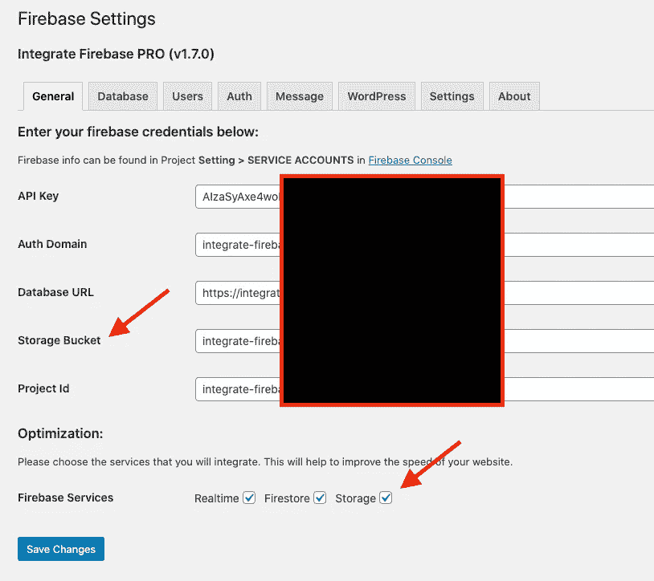
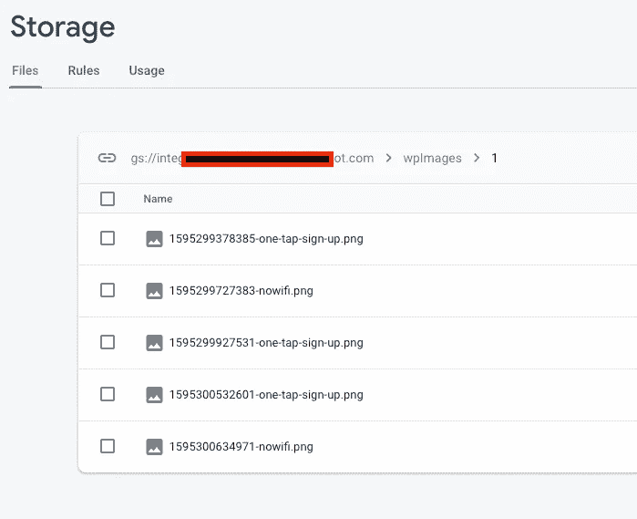

# 从 WordPress 上传文件到云存储

> 原文：<https://itnext.io/upload-files-to-cloud-storage-from-wordpress-e8acc8ce70cd?source=collection_archive---------4----------------------->


> 如果你对 Integrate Firebase PRO 版本感兴趣，请阅读完整的更新文档:[*【https://firebase-wordpress-docs.readthedocs.io/】*](https://firebase-wordpress-docs.readthedocs.io/)

**演示:**[**https://wordpress.dalenguyen.me/**](https://wordpress.dalenguyen.me/)

*   文章 1: [如何将 Firebase 整合到 WordPress](/how-to-integrate-firebase-and-wordpress-b017ee274687)
*   第 2 篇:[如何从 Firestore 检索数据并显示在 WordPress 上](/how-to-retrieve-data-from-firestore-and-display-on-wordpress-8638854a762e)
*   第 3 篇:[如何在 WordPress 中使用 Firebase 自定义声明](https://medium.com/@dalenguyen/how-to-work-with-firebase-custom-claims-in-wordpress-aaf83965bd20?sk=85786e3739d42b18c3e2c7344bc5f436)
*   第 4 条:[将数据从 WordPress 保存到 Firebase(实时+ Firestore)](/how-to-save-data-from-wordpress-to-firebase-realtime-firestore-2eda917d01fb)
*   第五条: [Firebase WordPress 用户集成](/firebase-wordpress-user-integration-c18a28e41cbd)
*   第六篇:[如何在 WordPress 仪表盘中管理 Firebase 用户](/firebase-users-management-in-wordpress-dashboard-61b4a1ca066)
*   第 7 篇:[如何将数据从 WordPress 同步到 Firebase](/sync-data-from-wordpress-to-firebase-d6e5860d3a06)
*   第 8 条:[一键登录 WordPress & Firebase 或通过电子邮件链接](https://medium.com/@dalenguyen/one-click-login-to-wordpress-firebase-or-via-email-link-d7610d71cd23)
*   第九条: [**从 WordPress**](https://medium.com/@dalenguyen/upload-files-to-cloud-storage-from-wordpress-e8acc8ce70cd) 上传文件到云存储
*   第十条:[远程 URL 登录到 Firebase & WordPress](/remote-url-login-to-firebase-wordpress-2027fad7c159)
*   第 11 条:[添加 Firebase 认证到 WordPress 的 2 种方法& WooCommerce](https://dalenguyen.medium.com/2-ways-to-add-firebase-authentication-to-wordpress-woocommerce-df500c3b104e)
*   第 12 条:[如何将 WooCommerce 购买数据发送到 Firebase](https://dalenguyen.medium.com/how-to-send-woocommerce-purchase-data-to-firebase-8c8b4c8cff39)
*   第 13 条:[从 WordPress](https://dalenguyen.medium.com/create-manage-firebase-database-from-wordpress-13347d8ffb2e) 创建&管理 Firebase 数据库

将文件从 WordPress 上传到云存储类似于将数据从 WordPress 保存到 Firebase。一切都可以通过联系表 7 来完成。但是，您可以设计自定义表单来满足您的需要。

**启用云存储**

在 general 选项卡中，您必须从您的 firebase 项目中添加**存储桶**，然后在 Firebase Services 下选中**存储**选项。



启用云存储

**上传文件到云存储**

这是一个从上传图片到云存储和保存路径到 firestore 的联系形式 7 的例子。

```
// This form will create a path of the file to "users" collection
// If you want to generate a random id, you can leave out the documentId
// The file will be uploaded to "wpImages/documentId/timestamp+filename" path under Storage

[hidden collectionName "users"]
[hidden documentId "some-random-id"]
[hidden databaseType "firestore"]
[hidden fileType "imageUrl"]

[file imageUrl limit:1mb filetypes:gif|png|jpg|jpeg]

[submit "Upload File"]
```

提交文件后，会上传到云存储的 **wpImages/som-random-id** 路径下。图像名称将以时间戳为前缀。



云存储中的映像路径


Firestore 中的图像路径