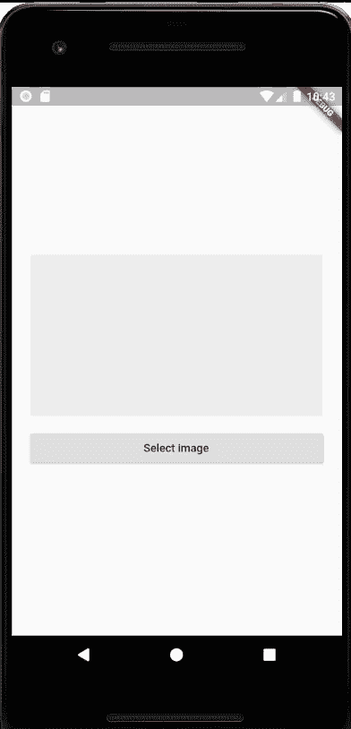
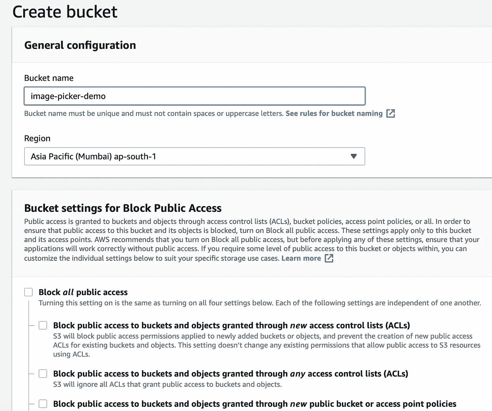
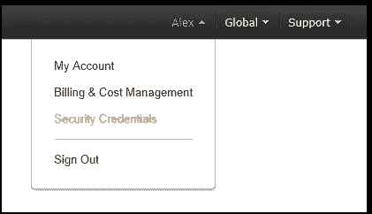
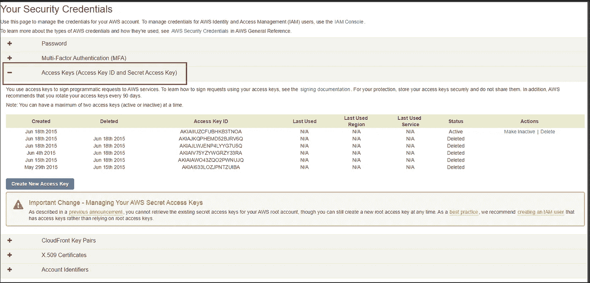
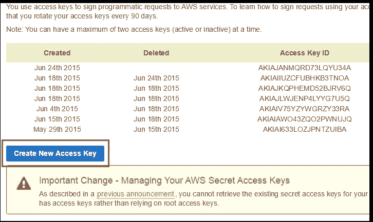
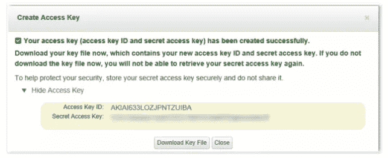
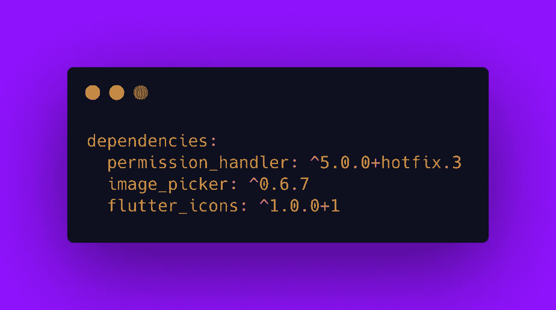
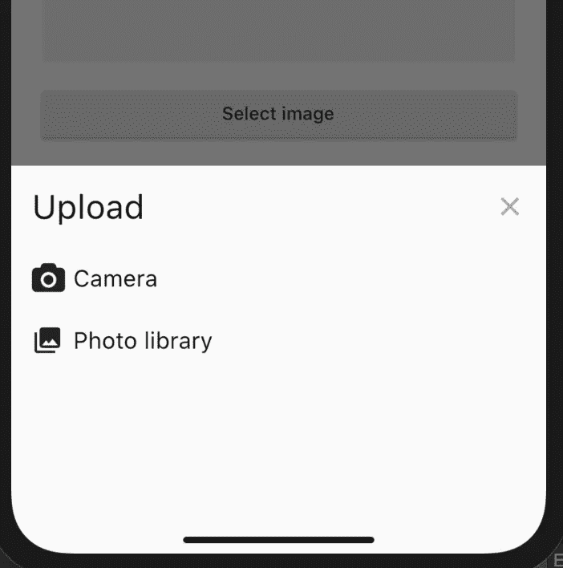
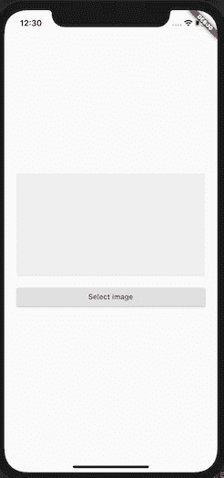

# 将图像上传到 S3 AWS 变得简单——Flutter

> 原文：<https://itnext.io/upload-image-to-aws-s3-made-simple-flutter-fd3356b5b5bb?source=collection_archive---------0----------------------->

欢迎光临！今天我们将学习上传图像到 S3 自动气象站

也可以在 [Instagram](https://www.instagram.com/theboringdeveloper/) 上和我联系。你可以告诉我你想了解什么。

> 这将有助于你作为一个模板，然后你可以根据自己的需要改进用户界面和 UX
> 
> 不要害怕文章的长度，大部分都是代码，你只需要复制和粘贴

**如果你在寻找深入的解释-**

 [## 使用 Flutter 将图像上传到 S3 自动气象站—第 1 部分

### 欢迎来到上传图片到 S3 的教程-第一部分

medium.com](https://medium.com/swlh/uploading-images-to-s3-flutter-part-1-92c52ce62432)  [## 使用 Flutter 将图像上传到 S3 自动气象站—第 2 部分

### 欢迎来到上传图片到 S3 的教程-第二部分

levelup.gitconnected.com](https://levelup.gitconnected.com/uploading-images-to-s3-flutter-part-2-6a6fb000ba7b) 

# 让我们从看到我们的最终目标开始

**会发生什么？**

*   当我们点击选择图像按钮时，会显示从*相机*或*图库*中选择图像的选项
*   如果用户点击*相机*或*图库*，那么我们会请求相应的许可。
*   如果用户拒绝权限，我们无法显示*内置的*权限对话框，那么我们会显示一个自定义对话框来打开应用程序设置并授予权限。
*   **在 android-** 如果用户选择不再询问并拒绝，那么我们无法显示*内置的*权限对话框，但为了提供良好的 UX，我们将允许用户直接从应用打开应用设置。
*   **在 IOS-** 中，如果你*第一次不允许*权限，那么我们就无法显示*内置的*权限对话框，所以我们显示打开应用设置的选项。

## 让我们开始建造吧

**先决条件:**

1.  AWS S3 的公共存储桶
2.  能够访问 AWS S3 存储桶的访问令牌和秘密令牌

# 要创建公共存储桶:

**步骤 1:** 在 AWS 上登录或创建帐户

**第 2 步:**转到 AWS S3 服务部

**步骤 3:** 根据用户的地理位置创建一个具有公共访问权限和区域的存储桶

# 要创建/获取访问令牌和机密令牌，请执行以下操作:

**第一步:**进入 [**亚马逊网络服务**](https://console.aws.amazon.com/) 控制台，点击你的账户名称(位于控制台右上角)。然后，在展开的下拉列表中，选择**安全凭证**。

**步骤 2:** 展开**访问密钥(访问密钥 ID 和秘密访问密钥)**选项。您将看到激活的和删除的访问键列表。

**第三步:**生成新的访问键，点击**创建新的访问键**按钮。

**步骤 4:** 点击**显示访问键**使其显示在屏幕上。请注意，您可以将其作为文件下载到您的机器上，并在需要时打开它。要下载它，只需点击**下载密钥文件**按钮。

**重要提示:**如果您在按下“关闭”或“取消”之前没有将密钥文件下载到您的电脑上，您以后将无法取回密钥。

现在我们已经具备了所有的先决条件，让我们开始上传吧。

**后端将使用什么？**

> *带有 express framework 的 NodeJs 服务器*

**我们如何上传图片？**

1.  请求我们的 NodeJs 服务器给我们一个**下载和上传 Url。**
2.  然后将图片上传到**上传网址。**
3.  保存**下载** **网址**在某处

**让我们先准备好服务器**

 [## GursheeshSingh/flutter-AWS-S3-上传

### 在 GitHub 上创建一个帐户，为 GursheeshSingh/flutter-AWS-S3-upload 开发做出贡献。

github.com](https://github.com/GursheeshSingh/flutter-aws-s3-upload) 

> 已经给你准备好了:)

你需要做什么？

1.  下载存储库
2.  更新***config-AWS . js***
3.  在终端中打开存储库
4.  使用 ***npm 安装*** 安装节点包
5.  运行服务器使用 ***npm 启动***

## 现在服务器已经准备好并正在运行

## 将包添加到 pubspec.yaml

 [## 图像拾取器| Flutter 包

### 一个适用于 iOS 和 Android 的 Flutter 插件，用于从图像库中拾取图像，并使用…

公共开发](https://pub.dev/packages/image_picker#-readme-tab-)  [## 权限处理程序| Flutter 包

### 在大多数操作系统上，权限不仅仅是在安装时授予应用程序的。相反，开发人员必须问…

公共开发](https://pub.dev/packages/permission_handler)  [## 颤振 _ 图标|颤振包

### 受 react-native-vector-Icons v 1 . 0 . 0 的启发，Flutter 的可定制图标有重大的 Api 变化…

公共开发](https://pub.dev/packages/flutter_icons) 

# ios

将以下键添加到位于`<project root>/ios/Runner/Info.plist`的 *Info.plist* 文件中:

*   `NSPhotoLibraryUsageDescription` -描述你的应用需要照片库权限的原因。这在可视编辑器中被称为*隐私照片库使用说明*。
*   `NSCameraUsageDescription` -描述为什么你的应用需要访问摄像头。这在可视编辑器中被称为*隐私摄像机使用说明*。
*   `NSMicrophoneUsageDescription` -描述如果您打算录制视频，为什么您的应用程序需要使用麦克风。在可视编辑器中，这被称为*隐私麦克风使用描述*。

# 机器人

## API 29 以上

不需要配置——插件应该开箱即用。

## 在针对 Android Q 的应用上，API < 29

Add 【 as an attribute to the 【 tag in AndroidManifest.xml. The [属性](https://developer.android.com/training/data-storage/compatibility)默认为`false`。

## 现在你需要复制并粘贴一些文件

***GenerateImageUrl 类-***

**目的？**

*   用于调用本地 NodeJs 服务器生成上传图片的 url

*上传文件类-*

**目的？**

*   将给定图像上传到上传 url

***AddAttachmentModalSheet 小部件-***

**目的？**

*   这是一个模态表单小部件，显示了从相机或图库中选择图像的选项

> 目前我们有相机和画廊作为选项，但你可以添加更多的选项

***CustomDialog 类-***

**目的？**

*   要显示特定于平台对话框
*   为了给人原生的感觉，IOS 和 Android 显示了不同风格的对话框

> 您也可以在其他项目中使用该类:)

***GetImagePermission 类-***

**目的？**

*   这将处理相机和画廊的权限

> 这个类的另一个很酷的地方是，对于大多数权限来说，流是可重用的，这意味着您也可以将相同的流用于位置或其他权限

***SingleImagePicker 类-***

**目的？**

*   这是处理主逻辑的主类
*   它使用了上面所有的类和小部件
*   您将使用这个类来调用图像拾取器

***单图像拾取器* *参数* -**

*   *PickImageSource-* 可以有 3 个值: *PickImageSource.both，PickImageSource.camera 或 PickImageSource.gallery*
*   *onImagePicked-* 当用户用路径拾取图像时调用回调
*   *onSaveImage* -当图像成功上传到上传 url 时调用回调，现在您可以将 url 保存到类似数据库的地方。如果保存到数据库成功，返回真，否则返回假
*   *onImageSuccessfullySaved*-当图像成功保存到数据库并且您在 *onSaveImage* 中返回 true 时调用回调
*   *onImageUploadFailed*——当 image 无法将图像保存到数据库，并且您返回 false 或在 *onSaveImage 中出现一些错误时调用回调。*

**注意:**你只需要使用 *SingleImagePicker 类*来调用图像拾取器

## 让我们创建主屏幕

**我们做了什么？**

*   我们创建了一个带有按钮的基本屏幕
*   如果光源是*资产*，我们将使用 *Image.asset()* 显示来自源的图像
*   如果图片来源是*网络*，我们将使用 *Image.network()* 显示图片来源
*   *源*将用于存储图像本地路径或下载 url
*   如果正在加载*，我们会显示一个进度条*
*   *如果图像状态是*错误*，我们将显示一个错误图标*

> *我们将在 SingleImagePicker 的回调中更新光源、源或图像状态*

*让我告诉你怎么做*

**

*我们该怎么办？*

*   *当用户点击按钮时，我们打开图像拾取器*
*   *当用户成功拾取图像时，调用 *onImagePicked* ，然后我们将光源更改为*资产*并更新源*
*   *当选择的图像成功上传后，调用 *onSaveImage* ，然后我们将图像 url 保存到数据库*
*   *当保存 url 到数据库成功时，我们将返回 true，如果失败，则在 *onSaveImage* 中返回 false*
*   *如果保存到数据库失败，我们返回 false，则调用*onImageUploadFailed**

## *让我们看看如果保存到数据库失败会发生什么*

**

*正如你所看到的，你所要做的就是使用 *SingleImagePicker* 类*

> *完成了:)*

*点击这里查看完整的项目-*

* [## GursheeshSingh/flutter _ AWS _ S3 _ image _ picker-master

### 新的颤振应用。这个项目是颤振应用的起点。一些资源让你…

github.com](https://github.com/GursheeshSingh/flutter_aws_s3_image_picker-master) 

# 更多 flutter spinner 博客

 [## 输入格式—颤动

### 欢迎光临！今天我们将学习在 Flutter 中添加输入格式

itnext.io](/input-formatting-flutter-5237bf09e61f)  [## 实时模板— Flutter

### 欢迎光临！今天我们将学习 flutter 的实时模板。

medium.com](https://medium.com/swlh/live-templates-flutter-6e48683e14e0)  [## Instagram stories swiper — Flutter

### 欢迎使用本教程创建像 swiper 一样的 instagram 故事！

levelup.gitconnected.com](https://levelup.gitconnected.com/instagram-stories-swiper-flutter-bb53f9377431)  [## 更新应用程序— Flutter

### 欢迎来到本教程，为你的 flutter 应用程序添加更新应用程序

medium.com](https://medium.com/swlh/update-app-flutter-402c528235e4)  [## 信用卡滑块—颤动

### 欢迎来到本教程，创建一个可怕的信用卡滑块。

levelup.gitconnected.com](https://levelup.gitconnected.com/credit-card-slider-flutter-1edec451103a)  [## 信用卡滑块变得简单——颤动

### 欢迎光临！今天我们将学习如何用简单的方法创建一个令人敬畏的信用卡滑块。

medium.com](https://medium.com/dev-genius/credit-card-slider-made-easy-flutter-6c0473d0e8bb)  [## 简单易用的通用底部导航栏——Flutter

### 欢迎来到本教程，在 Flutter 中创建一个普通的底部导航栏。

medium.com](https://medium.com/swlh/common-bottom-navigation-bar-made-easy-flutter-199c9f683b29)*