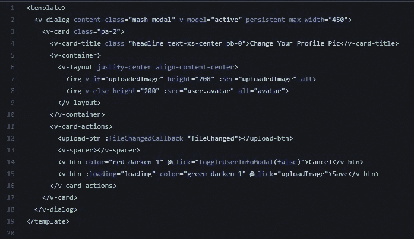
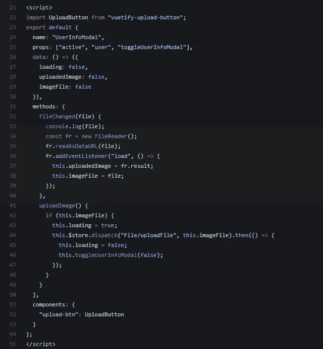
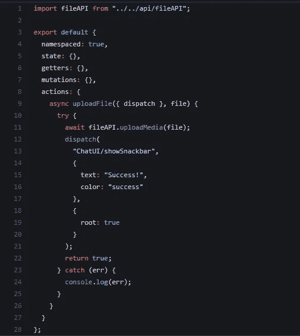
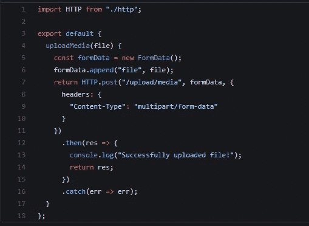
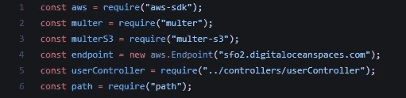
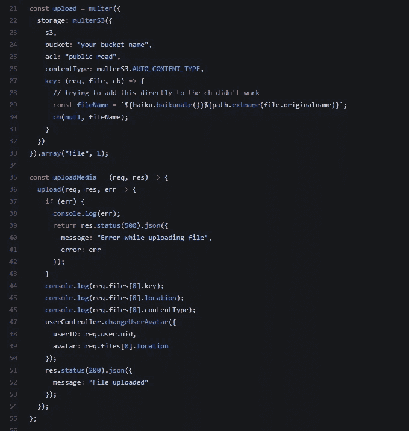
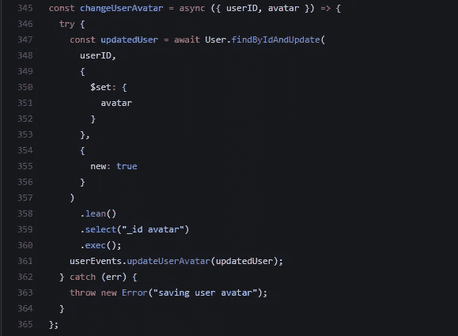
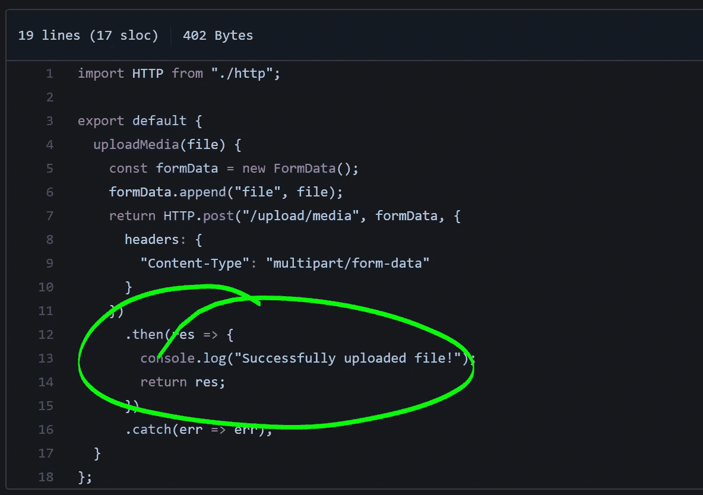
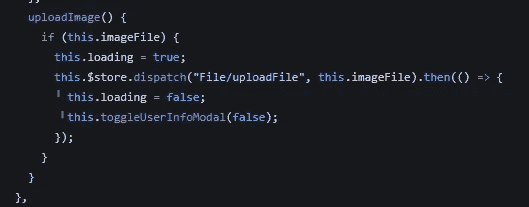

# 使用 VueJS & Node / Express 将文件上传到数字海洋空间

> 原文：<https://itnext.io/uploading-files-to-digital-ocean-spaces-with-vuejs-node-express-5d2361553518?source=collection_archive---------5----------------------->

最近在我的最新项目中，我想整合文件上传。过去我使用 React、Node 和亚马逊 S3 来做这件事，但这次我使用 Vue (w/ Vue CLI 3) &运行一个数字海洋盒子。虽然设置它很容易，但有几个问题让我疯狂地搜索 Stack Overflow/Github——在本文中，我想我会概述我所经历的过程/代码，所以希望你能学到一些东西并节省时间；)到最后，你将可以从 Vue 应用程序上传文件到数字海洋空间。

# 技术堆栈

在我们开始之前——这里是我在(Ubuntu 18.0.4)服务器上使用的主要技术:

*   节点 10
*   快递 4.16.14
*   Multer 1.4.1 和 Multer S3 2.9.0
*   AWS SDK (JavaScript)

而客户端:

*   带有 Vue CLI 3 的 Vue 2.5.21
*   15 年 3 月 1 日
*   Vuex 3.0.1
*   Axios 0.18

# 让我们从客户端开始。

我将假设您已经建立了一个 Vue 项目，如果您没有使用 Vuetify，大部分代码仍然适用，只是标记略有不同。对于这篇文章，我将使用上传个人资料图片/头像的例子，但它适用于任何类型的文件上传！

为了使人们能够上传文件，你需要某种组件，我选择在用户点击他们当前的个人资料图片时打开一个模态。在该模式中，我包含了当前用户的个人资料图片，以及 3 个按钮:上传、保存和取消:

在这里，我使用 v-if 指令显示用户的旧个人资料图片，直到新图片加载到客户端

你会注意到上传按钮不同于取消和保存——它是一个叫做*的组件，你可以在这里找到它:https://github.com/doritobandito/vuetify-upload-button*

我之所以使用这个组件，是因为 Vuetify 目前还没有一个专门的上传组件，它包含了一些方便的默认设置。单击 local 按钮将打开本地文件系统对话框，让您选择一个文件——在本例中是一个图像(您可以添加额外的代码来限制客户机和服务器上的文件类型和大小)。

一旦文件被选中，upload 按钮上的:fileChangedCallback 将被触发。回调被命名为 fileChanged，并在模板的方法中定义:

当用户从他们的本地目录中选择一个文件时，fileChanged 被触发

UploadButton 自动获取文件数据并将其提供给回调。你必须自己定义回调代码，当第一次使用 UploadButton 时，我没有意识到我必须包含 FileReader API，这是一个本地 Web API:[https://developer.mozilla.org/en-US/docs/Web/API/FileReader](https://developer.mozilla.org/en-US/docs/Web/API/FileReader)

FileReader API 处理读取存储在用户计算机上的文件内容，并且可以处理 File 和 Blob 对象。值得阅读一下 MDN 页面，以便对它在幕后做了什么有一个基本的了解！

FileReader API 是异步的，所以我们向“load”事件添加一个 eventListener，并在文件被读取时提供一个回调——这里我添加了一个 arrow 函数，然后将图像和文件保存到我的模板的数据对象中。更新数据会触发模板上的 v-if 块，并在模态中显示新图像，向用户反馈他们选择的图像就是他们想要的。

完成后，用户可以 1。)取消操作 2。)添加新图像或 3。)将新图像保存到他们的个人资料中。我使用的命名约定可能不是最好的，将来可能会改变，但这是它的基本要点:)我们感兴趣的是当用户单击 Save 按钮时会发生什么——调用@click 回调，名为 *uploadImage* 。当 uploadImage 被调用时，我们做两件事:

1.  将模板数据的“加载”属性更改为 true 以触发任何加载动画
2.  将文件发送到我们的 Vuex 商店

我喜欢将我的 Vuex 存储拆分成多个模块，使其更易于管理，因此这里我将一个动作分派给“File/uploadFile”——这将在一个我称为“File”的 Vuex 模块中触发该动作。你想叫它什么都可以。当动作成功返回时，它会将“loading”切换回 false &还会自动关闭模态，但这取决于您。让我们看看在这两个步骤之间会发生什么..

# 与来自 Vue 的 Express REST API 通信

在文件模块中，动作被触发，并调用我在 Vue 应用程序中命名的‘File API’。我喜欢在我的 Vue 项目中有一个专门的部分来与服务器交互——有些人可能会称之为“服务”,再说一次，因为我们正在使用 JavaScript，所以选择最终取决于你——找到一个你喜欢的约定并坚持下去。文件模块如下所示:

我们在顶部导入“fileAPI ”,并从动作中调用它

由于对服务器的调用将是异步的，所以我将 uploadFile 操作设为异步，允许我们等待服务器上完成上传和处理，然后让客户端知道什么时候完成了(或者出错了！).fileAPI 也非常简单——它使用 Axios 向服务器发出 HTTP 请求，然后处理响应:

“HTTP”模块只是 Axios 的一个包装器，用于处理定制的 auth 头

在上面的例子中，如果你使用的是普通的 Axios，那么它会显示 *HTTP* 。帖子上会说 *Axios* 。发帖代替。这里有几件事需要注意。因为我们通过网络发送特定类型的数据，所以我们想让我们的服务器知道“Content-Type”头，并创建一种 Multer 能够在文件发送时为我们处理的数据类型。为此，我们使用了 FormData 接口:【https://developer.mozilla.org/en-US/docs/Web/API/FormData】的

FormData 接口将从图像文件中创建一个 FormData 对象，将其分配给我们将在服务器端使用的键“file”。

所以，深呼吸，我们已经完成了将近一半，我们成功地从用户的电脑上抓取了一个文件，并通过网络将其发送到服务器，现在我们必须处理请求，将文件发送到我们的数字海洋空间，确保一切按计划进行，并让客户知道！

# 在 Express 服务器上处理文件上传

我将再次忽略设置节点/快速服务器的基础知识，并假设您已经完成了设置。在这里，我们将检查请求的处理，处理文件，发送给数字海洋空间，然后响应客户端。

**路线&控制器**

在服务器上，我已经分离了路由和控制器，所以我首先处理路由，然后将它传递给控制器(在运行完我想要用来过滤请求的任何中间件之后)。因此，对于路由 api.domain.com/upload/media，我有以下处理程序:

路由处理器将把请求传递给 uploadController(在 auth 之后)

uploadController 是真正完成工作的地方，所以让我们来看看它。这里有几个部分，所以我将把它分成几个部分:

由于数字海洋空间与 AWS S3 API 兼容，我们可以使用 AWS SDK 来建立与空间的连接。当你在数字海洋创建一个空间的时候，你的终点就已经决定了——如果你还没有这样做的话，这里有一个指南:[https://www.digitalocean.com/docs/spaces/how-to/create/](https://www.digitalocean.com/docs/spaces/how-to/create/)

我们需要 Multer 和 Multer S3 来处理从客户端发送的表单数据，需要 path 模块来处理文件扩展名(默认情况下 Multer 不处理)。

将您的秘密和 API 密钥存储在流程变量中

**存储密钥**

顺便说一下，当在服务器上存储秘密信息时，最好不要将文件签入版本控制，而是直接在服务器上处理它们。有几种方法可以做到这一点，包括 dotenv([https://github.com/motdotla/dotenv](https://github.com/motdotla/dotenv))，将它们设置在你的 package.json 中，或者使用类似于 http://pm2.keymetrics.io/docs/usage/environment/PM2 的过程管理器

在上面的例子中，因为我们使用的是 AWS SDK，所以这些键被称为 AWS_ACCESS_example，但是当使用数字海洋空间时，这些键将是您的空间凭证。此外，您可能会遇到一些教程，建议您将 AWS 机密存储在用户文件夹中——我对此并不在意，而是将它们保存在本地的 dotenv 上，并在服务器上单独处理它们。

**发送文件到空间&处理响应**

我使用了一个名为“haikunate”的模块来创建独特的、人类可读的文件名

在这里，我们使用 Multer & Multer S3 添加我们的凭证，定义一个名称，并从表单数据中选择“文件”属性。在定义文件名时，我在试图直接将它添加到回调中时遇到了一点问题，所以我在调用回调之前定义了它(这花了我 30 分钟的时间才弄明白为什么没有应用自定义名称……)。

这里还有一个问题，我花了一点时间才弄明白。uploadMedia 控制器接收请求对象(req ),将其传递给“upload”Multer 函数，并在我们传递给“upload”的回调中接收 req 对象。当 req 对象最初返回时，我不确定如何获取我上传的文件的名称——因此正如您所看到的，关于上传文件的信息在 req.files[0]对象中 location 属性为您提供了完整的上传 URL。这是很有必要的，因为你可能会想把这个网址保存到一个数据库中，例如保存到一个用户档案中。我在一个单独的控制器中实现了这一点，该控制器使用 MongoDB 数据库(通过 Mongoose 接口)将 URL 保存到用户集合中。我将把它粘贴到这里，这样您就可以看到我在成功地将文件发送到数字海洋后是如何处理它的了:

控制器/userController.js

在 userController 中，我有用户 ID 和“头像”(文件 URL)。由于数据库写入是异步的，所以我使用了异步箭头函数，并运行一个快速查询，通过 ID 定位用户，然后将文档中的 avatar 属性设置为新的文件 URL。我使用 new: true 选项返回更新的文档(在本例中实际上没有必要)，使用。lean()方法返回一个普通的 JSON 对象，并且只从更新后的用户中选择 _id & avatar 属性。

您可能会注意到，我已经在 uploadController 中向客户端发送了一个响应——这是一个急切的更新，因为成功响应是在我更新数据库中的用户之前发送的，但是在这样一个简单的操作中，我可以这样做——对于更复杂的上传/更大或更多的文件，您可能希望在确认和发送成功响应之前发送一个关于上传进度的更新流。在我的 userEvents 文件中，我实际上使用 socket.io 向用户的朋友广播头像更新，因此更新不仅传播给用户，还传播给他们的所有联系人。

**提醒客户端**

重申一下——一旦服务器完成了它的工作，它就以 HTTP 状态 200 进行响应，Axios 处理该响应并将其传递回文件模块中的动作，该动作以原始模式返回对初始调用的“真”响应:

我们可以将“then”调用链接到处理承诺解决方案的操作上

# 成功！

就这样——我们完成了从客户端到服务器的往返，通过数字海洋空间，更新了数据库中的用户，并成功返回到客户端。有相当多的准备工作要做，但是一旦底层代码设置好了，就非常简单了。

为了反映更新后的用户头像，你需要在你的商店中处理它(我有一个用户商店)，然后它会在你的 Vue 应用中更新用户头像 URL。

当然，你可以对此进行改进——例如，你可以包括上传进度通知，在文件上传到服务器后对其进行额外的处理，或者在用户上传视频或音乐文件时想办法将数据流回。

希望这给了你一个良好的工作基础，并在这个过程中节省了你一点时间！如果你想澄清，如果你发现了任何错误，或者你有更好的方法来处理 Vue 上传，请在评论中告诉我:)

干杯！

##我在 Twitter、Github、LinkedIn 和大多数其他地方都是/jacobedawson——随时联系。