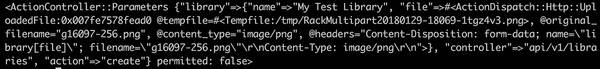

# 将文件上传到 Rails API

> 原文：<https://itnext.io/uploading-files-to-your-rails-api-6b293a4a5c90?source=collection_archive---------1----------------------->


我最近在做一个项目，需要从我的前端(使用 React)上传相对大量的文件到一个独立的 API 后端(使用 Rails)。这些由图像和音频组成的文件将使用回形针进行处理，并存储在 S3。到目前为止，我只使用 JSON 与 API 交互——尽管[我写的第一篇博文](https://medium.com/@dakota.lillie/uploading-files-using-carrierwave-in-rails-81ef54ebbcdb)是关于使用 CarrierWave 上传图像的，那是在全栈 Rails 环境中，在那里我可以依靠 Rails 的神奇表单助手来简化这种方式。然而，上传文件是一项非常普通的任务——能有多难呢？

事实证明，非常困难。接下来是三天的痛苦，我不停地谷歌和搜索 Stack Overflow，找到几个与我的特定设置相关的资源，没有一个能解决我遇到的问题。然而，当我最终找到答案(不是从网上，而是从一个同事那里)时，它是如此简单和平庸，以至于我无法相信在我访问过的任何一个网站上都没有人提出过这个答案。

因此，在我不断寻求填补我在互联网知识方面遇到的任何空白的过程中，本指南旨在充当我希望找到的演练。

## 两种方法:表单数据与 Base64

有两种上传文件的方法可供选择:使用表单数据或将文件编码为 base64 字符串。根据我的理解，表单数据是更好的选择，但是为了理解为什么，让我们先来仔细看看 base64。

Base64 是一种将二进制数据转换为 ASCII 文本的编码形式。这很有用，因为如果文件(通常由二进制组成)被表示为字符串，它们可以使用 JSON 传输。

但是通过 base64 编码传输文件有它的缺陷。首先，base64 增加了编码/解码过程的一些计算开销，实际上增加了 33%的文件大小，使其不太适合较大的文件。如果你感兴趣的话，这里有一段视频解释了原因:

第二个问题是，根据我的经验，在 base64 编码/解码过程中，文件很容易丢失它们的 MIME 类型(和其他元数据),成为无用的二进制文件堆。你可能会问，什么是哑剧类型？嗯，当你看一个 base64 字符串时，它可能看起来像这样(这个例子是从[这里的](https://www.pluralsight.com/guides/ruby-ruby-on-rails/handling-file-upload-using-ruby-on-rails-5-api)偷来的):

```
data:image/gif;base64,iVBORw0KGgoAAAANag...//rest of the base64 text
```

第一部分`image/gif`，是一个 MIME 类型。MIME 代表*多用途互联网邮件扩展*，它本质上是对给定文件应该是哪种文件的描述。MIME 类型以一种`type/subtype`格式构建，一些常见的例子包括`text/html`、`image/jpg`或`audio/mpeg`(你可以在这里找到[一个更广泛的列表](https://www.freeformatter.com/mime-types-list.html#mime-types-list))。如果没有检测到 MIME 类型，一个文件被赋予类型`application/octet-stream`，这基本上意味着它只是普通的二进制数据。

我一直遇到的问题是，当我上传的文件(wav 音频文件，在这个时间点)被解码时，它们的类型会变成`application/octet-stream`。这意味着它们不能被打开，也不能被有效地破坏。我最终设法解决了这个问题，使用了一种没有任何文档的曲别针方法。但是很明显这并不理想，这个过程不应该如此困难。有一种更好的方法:表单数据。

根据 [W3C](https://www.w3.org/) ，表单数据是在 HTML 4 中明确引入的，目的是处理"[包含文件、非 ASCII 数据和二进制数据](https://www.pluralsight.com/guides/ruby-ruby-on-rails/handling-file-upload-using-ruby-on-rails-5-api)的表单。它由一组键/值对组成，类似于 JSON，每一对都代表表单中的一个输入。它非常适合我们的目的——事实上，我研究 base64 的唯一原因是，有一段时间，我无法让表单数据工作。所以让我们探索一下:如何让它工作。

## 前端

在这个例子中，我将使用普通的 Javascript，以确保它的可访问性最大化(如果你愿意，一切都应该可以很容易地转换成 React 或任何其他框架):

这个例子所做的只是显示文件的元数据——要让它真正做任何事情，您需要提供自己的 API 端点来代替我在这里使用的未定义的`API_ROOT`变量。我用注释对代码进行了注释，试图弄清楚每一步发生了什么，并提供了两个单独的例子来说明如何向一个`FormData`对象添加数据，要么在实例化时添加，要么在之后使用`.append()`添加。

希望您能理解要点，即表单数据是通过用`new`关键字实例化的`FormData`对象连接的，该对象填充了数据并用作`POST`请求的主体。但是请注意一个非常重要的细节 fetch 请求不包含任何头。如果您习惯于使用 JSON 与 API 交互，就像我一样，您可能习惯于这样定义请求的头:

```
{'Content-Type': 'application/json'}
```

这是我花了几天时间才弄明白的事情— **使用表单数据时，不要在请求中包含内容类型的标题**。

你可能会像我想的那样，将`Content-Type`头改为`multipart/form-data`。当我这样做时，我的 Rails 服务器上出现错误消息，指出我上传的内容(在我的例子中是 wav 音频文件)与请求的内容类型不匹配。然而，将`Content-Type`更改为`audio/wav`，消除了错误，使得数据根本不会显示在 Rails 控制器中。找不到任何与我的困境相关的有用文章，我愤怒地转向 base64 和更熟悉的 JSON 格式，这带来了上面详述的一系列问题。

这样，一个简单的问题就解决了，只需要拖三天就可以解决。


现在我已经发泄完了我的沮丧，让我们简单地看一下后端。

## 后端

我假设如果您正在阅读本文，您可能已经熟悉 Rails，并且知道如何启动和运行 API。一旦您为端点设置了路由，配置了一个控制器操作来处理该端点，并将您的获取请求定向到该端点，您应该会收到如下所示的数据:



显然，对于您的特定设置，许多细节看起来会有所不同——这张截图来自我正在开发的应用程序，该应用程序涉及上传与音乐样本库相关联的图像。但大体结构应该差不多。你应该能够看到上传的文件及其文件名，内容类型等。

从这里开始，它应该是相当简单的——具体的实现将根据您使用的是回形针还是 CarrierWave 而有所不同。我不打算详细介绍如何设置它们或配置它们在 S3 上存储文件……这超出了我试图涵盖的范围，并且有大量[的](https://scotch.io/tutorials/file-upload-in-rails-with-paperclip)[文章](https://code.tutsplus.com/articles/uploading-with-rails-and-carrierwave--cms-28409)的[已经](https://devcenter.heroku.com/articles/paperclip-s3)描述了[如何](https://gist.github.com/cblunt/1303386)到[做](http://www.rubydoc.info/github/thoughtbot/paperclip/Paperclip/Storage/S3) [那个](https://medium.com/@dakota.lillie/uploading-files-using-carrierwave-in-rails-81ef54ebbcdb)。不管怎么说，这并不是最难的部分，至少对我来说…让这个过程如此令人沮丧的是首先要弄清楚如何将数据从 React/JavaScript 转移到 Rails。

## 结论

我应该注意到这不是唯一的方法——如果你使用 react，还有一个叫做 [react-s3-uploader](https://github.com/odysseyscience/react-s3-uploader) 的组件，它可以让你直接从 React 上传到 s3，然后把文件的 url 保存到你的后端。这是可行的，但是我个人仍然建议通过后端处理 S3 集成，原因如下:

1.  由于使用回形针/CarrierWave 时，文件直接与数据库中的记录相关联，因此当这些记录被删除时，文件也将被删除。对你来说，这可能不是重要的(甚至是令人想要的)行为——但是，对我来说，这是一个重要的因素。我正在做的项目涉及到上传数千个文件，我特别不想让一堆没用的文件占用宝贵的空间。
2.  回形针和 CarrierWave 可以轻松地为您的上传添加预处理。在我的例子中，我将 wav 音频文件转换成 mp3，同时生成更小的“缩略图”版本的图像文件。我实际上没有使用过 react-S3-uploader——它似乎有一个`preprocess`道具，所以它可能允许你做这样的事情。但是回形针和 CarrierWave 的设计使得这种处理变得非常简单。

就这些了，伙计们！

## 来源:

[](https://www.pluralsight.com/guides/ruby-ruby-on-rails/handling-file-upload-using-ruby-on-rails-5-api) [## 使用 Ruby on Rails 5 API 处理文件上传

### 喜欢这个指南吗？通过点击心脏让社区知道！贡献者感谢以下用户…

www.pluralsight.com](https://www.pluralsight.com/guides/ruby-ruby-on-rails/handling-file-upload-using-ruby-on-rails-5-api) [](http://blog.littleblimp.com/post/119230396893/direct-uploads-to-s3-with-react-rails-and) [## 使用 React、Rails 和回形针直接上传到 S3

### 终于，续集来了！或者也许这是好莱坞式的重启，但不是狗屎。很久以前，我写了一点…

blog.littleblimp.com](http://blog.littleblimp.com/post/119230396893/direct-uploads-to-s3-with-react-rails-and)