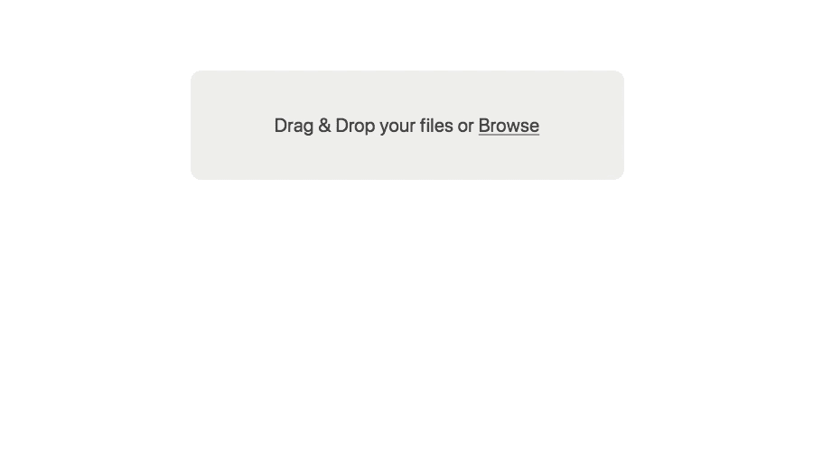
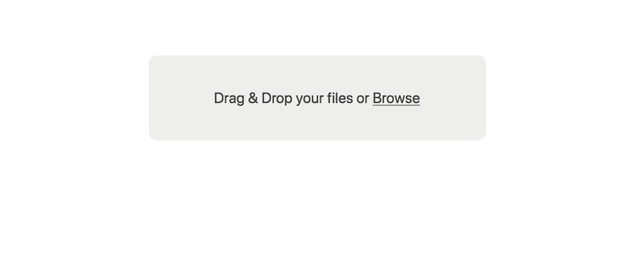
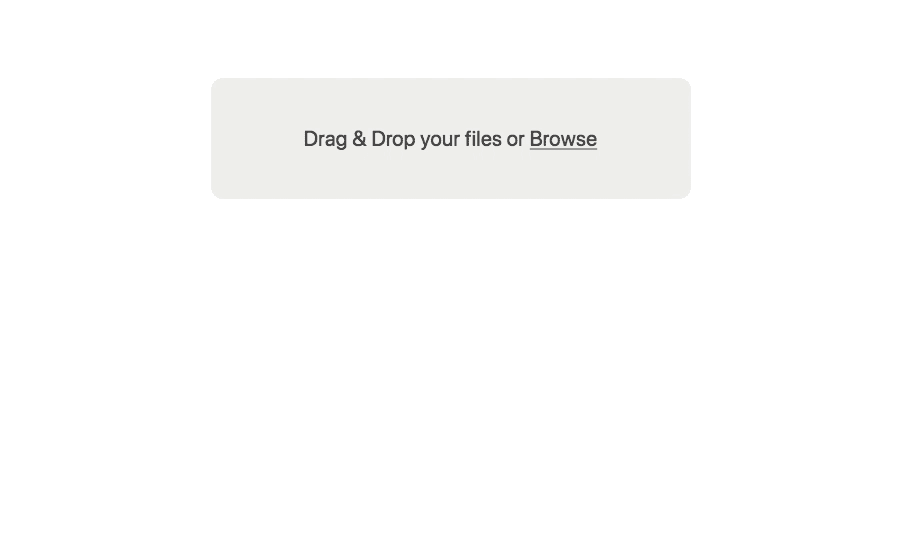

# 使用 React 平滑上传文件

> 原文：<https://itnext.io/uploading-files-with-react-and-filepond-f8a798308557?source=collection_archive---------0----------------------->

## 关于如何快速设置 FilePond React 适配器的教程


[FilePond](https://pqina.nl/filepond) 是一个相对较新的 JavaScript 文件上传库，在本教程中，我们将建立一个新的 [React](https://reactjs.org) 应用程序，与 [FilePond React Adapter](https://github.com/pqina/react-filepond) 组件集成，并建立一个到后端的连接，该后端将接收我们上传的文件。

我们将使用 [Create React App](https://github.com/facebook/create-react-app) 节点模块来快速组装我们的基本 React 应用程序。如果你熟悉这个过程，你可以跳到[与 FilePond](#17db) 部分。

# 创建基础 React 应用程序

假设您已经安装了[节点](https://nodejs.org/)版本 6 或更高版本，从您的终端运行以下命令(如果没有，现在是安装它的时候了)。它将创建一个文件夹“我的应用程序”，其中将包含我们的反应应用程序。

```
npx create-react-app **my-app**
```

好了，我们有了起点，让我们导航到“我的应用程序”目录。

```
cd my-app
```

现在启动开发服务器，它会自动打开一个浏览器窗口。

```
npm start
```

您可以通过同时按下`CTRL`和`C`键从命令行停止应用程序。

# 与 FilePond 集成

随着 React 应用程序的运行，我们现在可以添加 FilePond React 适配器。

让我们停止应用程序并安装适配器。

```
npm install **filepond** **react-filepond** --save
```

安装好适配器文件后，让我们再次启动应用程序，这样我们就可以开始进行更改了。

我们将把 FilePond 组件添加到应用程序登录页面，实际上您可能会把它移动到其他地方，但是对于本文的目的来说，这已经足够了。

我们首先需要导入`FilePond`组件和它的 CSS 文件。

打开“App.js”文件，将以下几行添加到文件的顶部。

```
import { **FilePond** } from 'react-filepond';
import **'filepond/dist/filepond.min.css';**
```

下一步是将组件添加到 HTML 中。让我们在`render()`函数中编辑 HTML 并添加`<FilePond/>`标签。

```
<div *className*="App"> <header *className*="App-header">
   
   <h1 *className*="App-title">Welcome to React</h1>
  </header> <p *className*="App-intro">
    To get started, edit <code>src/App.js</code> and save to reload.
  </p> **<FilePond/>**</div>
```

文件池拖放区现在应该显示在介绍文本的下面。它看起来会像这样:


现在，我们可以开始按照自己的意愿配置 FilePond 了。

默认情况下，FilePond 只接受一个文件，这是因为它增强了默认的 file input 元素并复制了它的标准行为。


要启用多文件模式，让我们添加`allowMultiple`道具。

```
<FilePond **allowMultiple={true}**/>
```

放下一个文件夹或选择多个文件来查看它的运行。



就像经典的文件输入一样，文件被加载到 FilePond，但不做任何其他事情，它们只是呆在那里。我们很可能希望将它们发送到我们的后端。我们将通过为 FilePond 提供`server`属性来实现这一点。

如果你有一个可以处理发送给它的文件对象的服务器端点，你可以使用它，如果没有，我们可以设置 [FilePond PHP 样板](https://github.com/pqina/filepond-boilerplate-php)(下载存储库并运行`vagrant up`)。

```
<FilePond allowMultiple={true} **server="http://192.168.33.10"**/>
```

配置好服务器位置后，FilePond 会自动将拖放的文件发布到提供的 URL。



默认的文件池服务器调用在[服务器配置文档](https://pqina.nl/filepond/docs/patterns/api/server/)中有描述。可以将`server`属性微调到最低级别(参见文档)，这使得 FilePond 基本上可以与任何远程或本地文件存储解决方案集成。

为了增加趣味，让我们启用图像预览。

我们将从安装图像预览插件开始。

```
npm install **filepond-plugin-image-preview** --save
```

现在我们需要导入并向 FilePond 核心注册插件。我们将不得不修改 FilePond 导入来导入`registerPlugin`方法。

```
import { FilePond, **registerPlugin** } from 'react-filepond';
```

我们已经准备好导入和注册图像预览插件。

```
import **FilePondPluginImagePreview** from 'filepond-plugin-image-preview'**;**
import **'filepond-plugin-image-preview/dist/filepond-plugin-image-preview.min.css'**;registerPlugin(**FilePondPluginImagePreview**);
```

搞定了。让我们重新启动应用程序，并删除一个图像。



这就是用 FilePond 上传文件的基础。

你可以通过自动 [EXIF 方向校正](https://github.com/pqina/filepond-plugin-image-exif-orientation)、[图像裁剪](https://github.com/pqina/filepond-plugin-image-crop)、[调整大小](https://github.com/pqina/filepond-plugin-image-resize)、[客户端图像变换](https://github.com/pqina/filepond-plugin-image-transform)和[各种其他插件](https://github.com/pqina/filepond#plugins)等特性进一步增强该组件。

这里有一个完整的[道具列表](https://pqina.nl/filepond/docs/patterns/api/filepond-instance/#properties)和[事件](https://pqina.nl/filepond/docs/patterns/api/filepond-instance/#callbacks)你可以配置让 FilePond 满足你的需求。

如果你有任何问题，[在推特上找我](https://twitter.com/rikschennink)