# 当用户注册时，使用 Auth0 操作将用户信息发送到 Apache Kafka

> 原文：<https://itnext.io/use-auth0-actions-to-send-user-info-to-apache-kafka-when-they-register-1fbcce706c3b?source=collection_archive---------2----------------------->

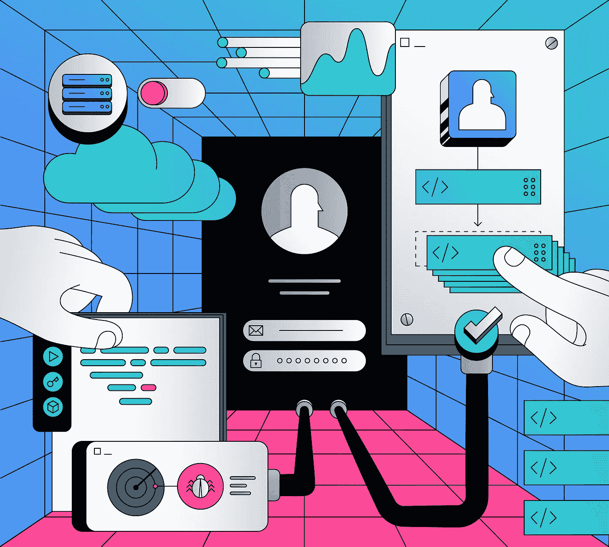

在这篇文章中，你将学习如何使用 Actions 将 Auth0 与 Apache Kafka 集成。您将通过编写一个动作来实现这一点，该动作将新用户注册的信息推送到 Kafka 集群。通过这样做，您打开了许多分析和用户体验的可能性，包括:

*   处理注册事件(与 [Apache Flink](https://flink.apache.org/) 或 [Spark](https://spark.apache.org/) )以在新用户注册账户时通知您的业务和销售团队。
*   触发流程，例如发送欢迎电子邮件或松弛消息以响应用户注册。
*   使用 [Kafka 连接器](https://docs.snowflake.com/en/user-guide/kafka-connector-overview.html)将从注册过程中收集的用户数据移动到数据库或数据仓库，以提供报告和分析应用程序。
*   向您的 CRM 应用程序提供新的用户数据。

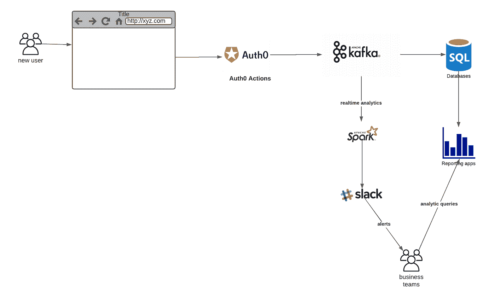

# 为什么是阿帕奇卡夫卡？

Apache Kafka 是一个分布式消息传递平台，它以事件的形式实时接收来自传感器、移动设备、数据库、应用程序和服务(包括 Auth0)等来源的数据，并将这些数据提供给目标系统。它支持发布/订阅和分布式队列场景。Kafka 为您提供了对数据进行流处理和批处理的灵活性。Kafka 的复制功能和耐用性允许您将其用作数据的持久中心。

# Auth0 操作

Auth0 操作是无服务器 Node.js 函数，由注册 Auth0 用户帐户或使用 Auth0 进行身份验证时发生的某些事件触发。使用操作，您可以使用自定义逻辑自定义和扩展 Auth0 的功能，您可以将自定义逻辑添加到登录、注册、更改密码等事件中。Auth0 操作是无状态的，因此如果您使用它们来收集数据，您将需要一个外部存储。查看[这篇文章](https://auth0.com/docs/customize/actions/actions-overview)，了解更多关于行动的信息。

在这篇文章中，我们将编写一个 Auth0 动作，它将由 post 用户注册流程触发，在用户完成注册帐户后发生。

# 创建 Kafka 集群

因为 Auth0 动作是无状态的，所以我们需要一个不需要有状态连接的 Kafka 服务。我们将使用 [Upstash 的 Kafka 服务](https://upstash.com/kafka)，它有一个 REST API，是为无服务器环境设计的，并且有一个适合这个项目的免费计划。

如果你还没有暴发户账户，[注册一个](https://console.upstash.com/login)。这个过程非常快，尤其是如果你使用亚马逊、GitHub 或谷歌账户注册的话。随后，您将立即被带到[桌面控制台](https://console.upstash.com/):

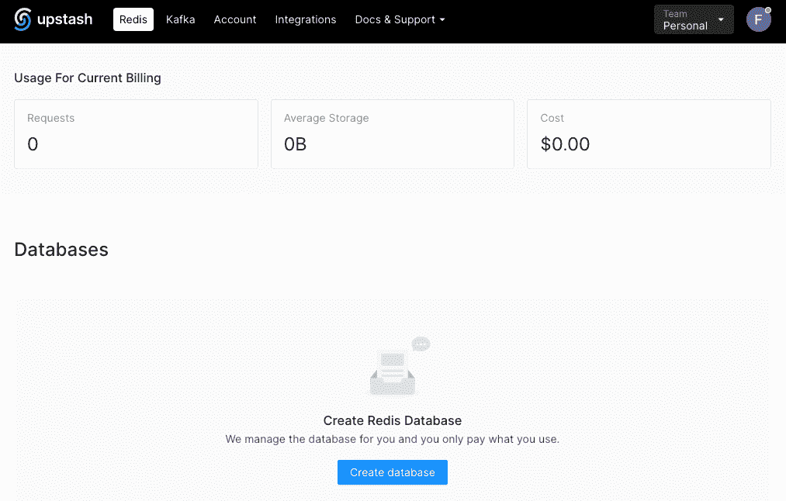

在页面顶部的菜单栏中选择**卡夫卡**。你会被带到这里:

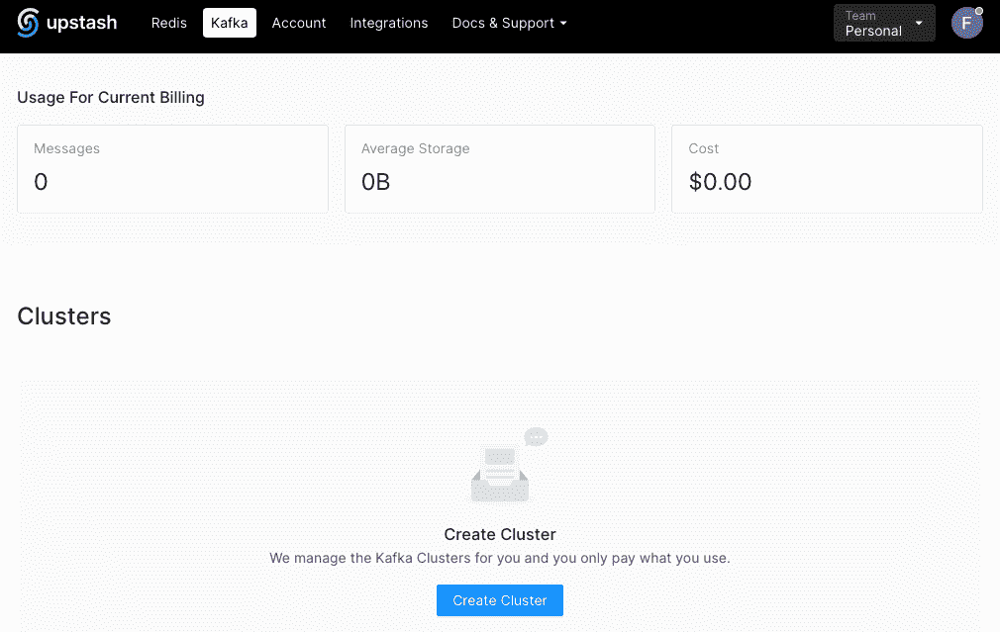

为了使用 Kafka，您需要一个集群，它是一个或多个运行 Apache Kafka 的服务器的集合。点击**创建集群**按钮。该表单将会出现:

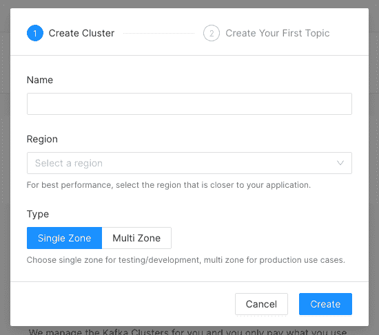

为每个字段提供以下信息:

*   **名称:**选择一个易于识别的名称，例如“Auth0 Actions Test”
*   **地区:**选择离你最近的地区。
*   **类型:**选择**单区**

点击**创建**按钮继续。您将看到表单的第二页:

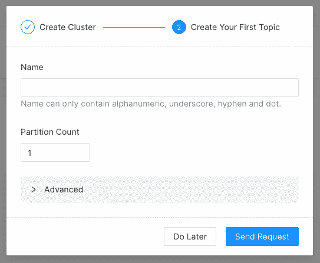

您需要为一个*主题提供一个名称，*，这就是卡夫卡组织事件的方式。如果你认为事件就像文件，那么主题就像目录。在**名称**字段中输入主题名称**用户-事件-主题**，点击**发送请求**按钮。

Upstash 将创建集群，并立即带您进入其**详细信息**页面:

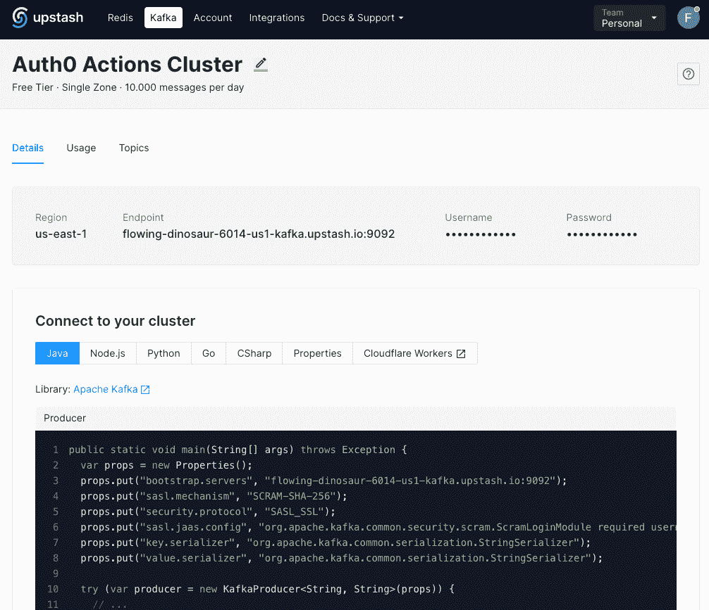

向下滚动到 **REST API** 部分，在这里您将看到复制`UPSTASH_KAFKA_REST_URL` 、`UPSTASH_KAFKA_REST_USERNAME` 和`UPSTASH_KAFKA_REST_PASSWORD` 的值的控件，您将在下一步中使用这些控件。

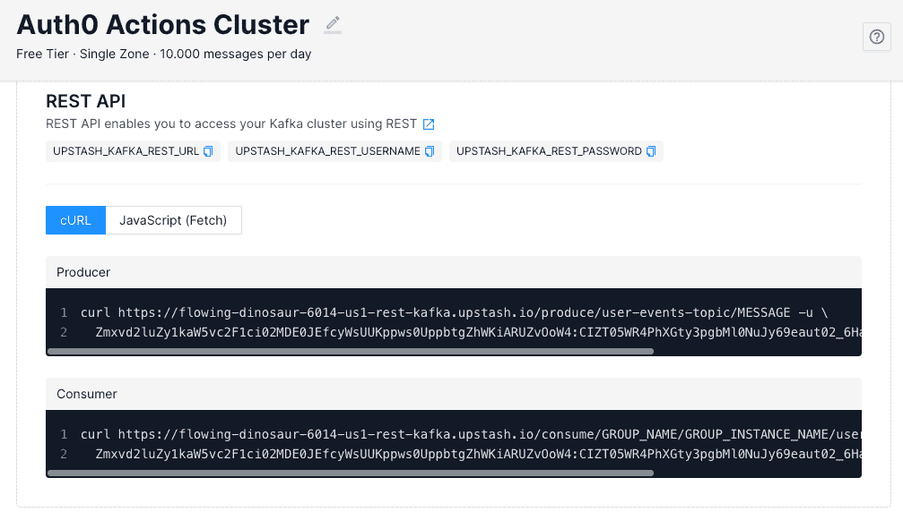

在浏览器选项卡或窗口中保持此网页打开；你很快就会需要它。

# 实施行动

在此步骤中，您需要一个 Auth0 帐户。如果您还没有帐户，您可以免费注册一个。

# 创建新操作

登录 Auth0 仪表板。在左侧菜单中，选择**动作** → **库**，然后点击**构建定制**按钮。这将打开**创建动作**弹出窗口:

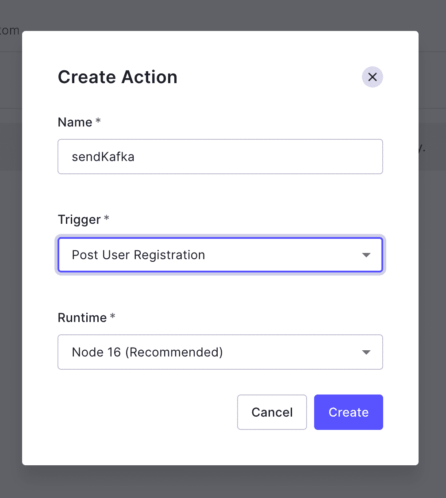

为动作提供一个名称(我使用了 **sendKafka** )。

由于目标是在用户注册帐户后向 Kafka 发送消息，因此该操作应该由 Post 用户注册事件触发。从**触发器**菜单中选择**发布用户注册**，然后点击**创建**按钮。

您现在应该会看到代码编辑器:

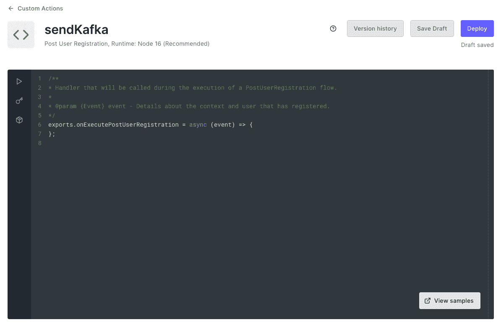

# 定义动作的秘密

要向 Kafka 集群发送消息，该操作需要 Kafka 集群的`UPSTASH_KAFKA_REST_URL` 、`UPSTASH_KAFKA_REST_USERNAME`和`UPSTASH_KAFKA_REST_PASSWORD`值，您可以从 Upstash 控制台复制这些值。您可以简单地使用这些值来定义常量，但是隐藏它们更安全。您可以使用 Actions 特性来实现这一点，该特性允许您安全地存储敏感值，并将其作为`event.secrets`对象的属性来访问。

让我们从第一个值开始，`UPSTASH_KAFKA_REST_USERNAME` 。切换到带有桌面控制台的浏览器选项卡或窗口，点击`UPSTASH_KAFKA_REST_USERNAME`旁边的图标复制其值。然后切换回动作代码编辑器，并单击“秘密”图标:

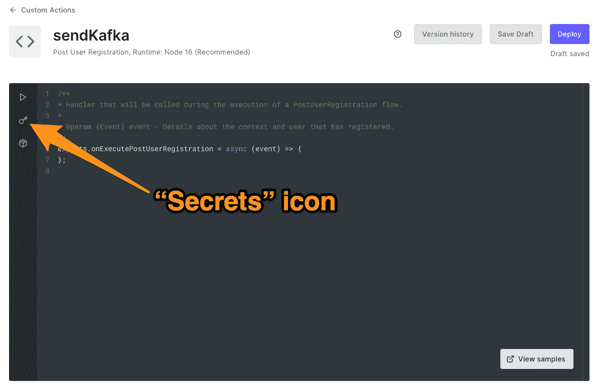

一个标题为**秘密**的新列将出现在代码编辑器中:

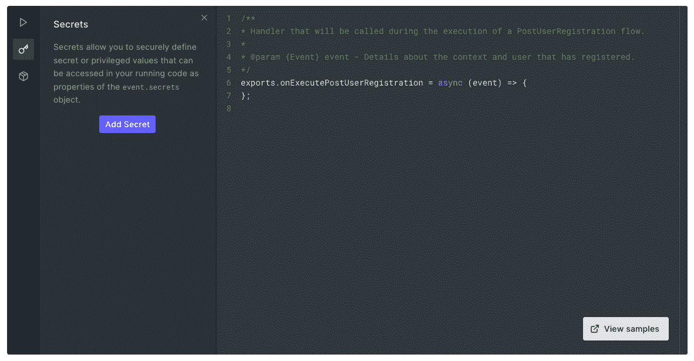

点击**添加密码**按钮。将出现一个弹出窗口，您可以定义您的第一个密码值:

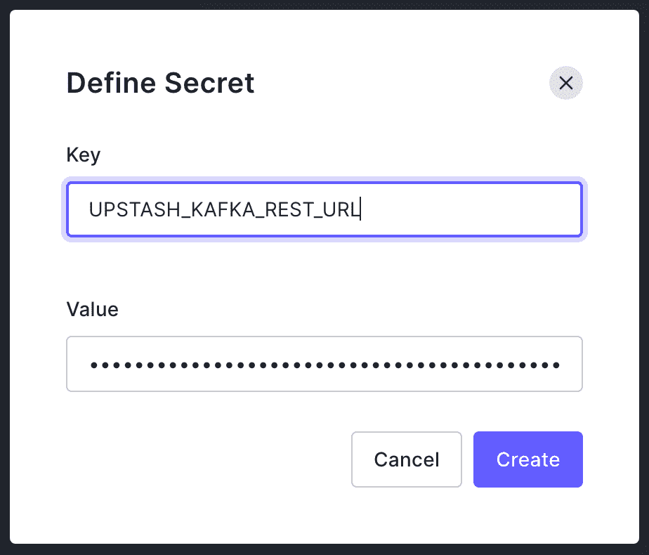

在**键**字段中输入`UPSTASH_KAFKA_REST_URL`，将您从桌面控制台复制的值粘贴到**值**字段中，并点击**创建**按钮。这将创建一个名为`event.secrets. UPSTASH_KAFKA_REST_URL` 的属性，您将能够在您的操作中使用它。

再次点击**添加秘密**按钮。这一次，通过从 Upstash 复制其值并填写如下所示的**定义秘密**表格来定义`UPSTASH_KAFKA_REST_USERNAME`秘密:

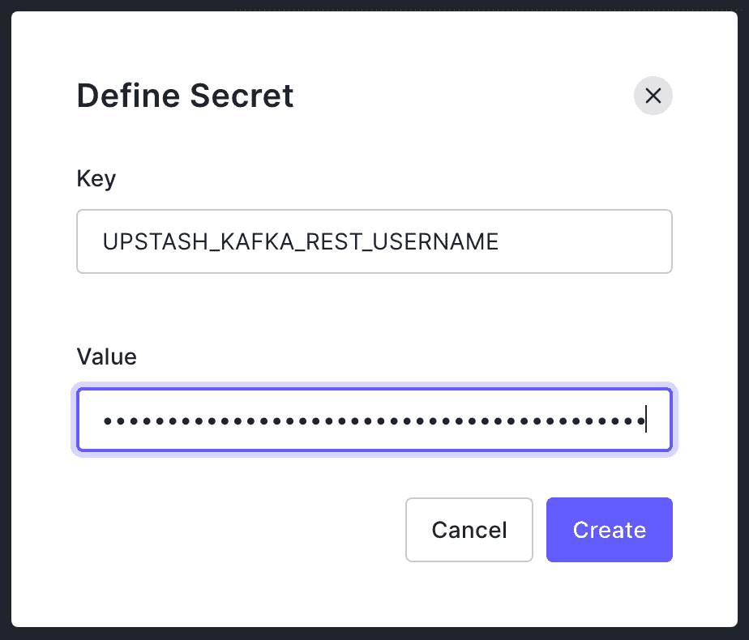

点击**创建**按钮，然后再次点击**添加秘密**按钮。通过从 Upstash 复制其值并填写如下所示的**定义秘密**表来定义`UPSTASH_KAFKA_REST_PASSWORD`秘密...


…然后点击**创建**按钮。**机密**列现在应该包含三个机密的列表:

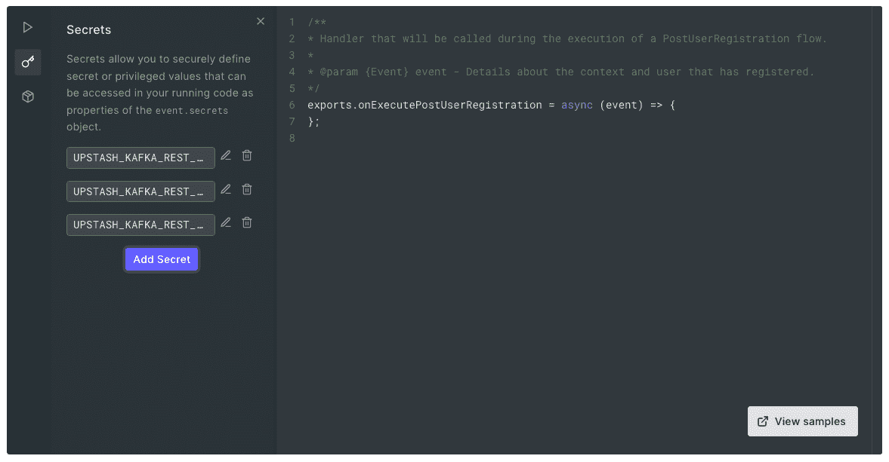

# 将节点提取模块添加到操作中

您可以将任何 npm 模块导入到一个动作中，这使得它们非常强大。该操作使用[节点获取](https://www.npmjs.com/package/node-fetch)模块向 Kafka 集群发送事件，因此您需要将它添加为一个依赖项。您可以使用功能来完成此操作。

单击“模块”图标，该图标位于“机密”图标的正下方:

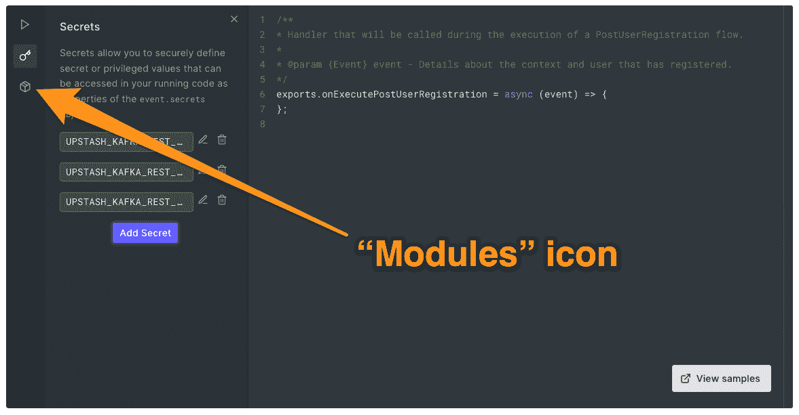

一个标题为**模块**的新列将出现在代码编辑器中:

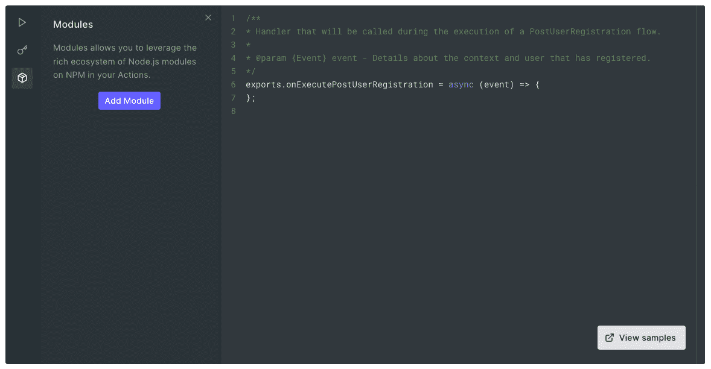

点击**添加模块**按钮。将出现一个弹出窗口:

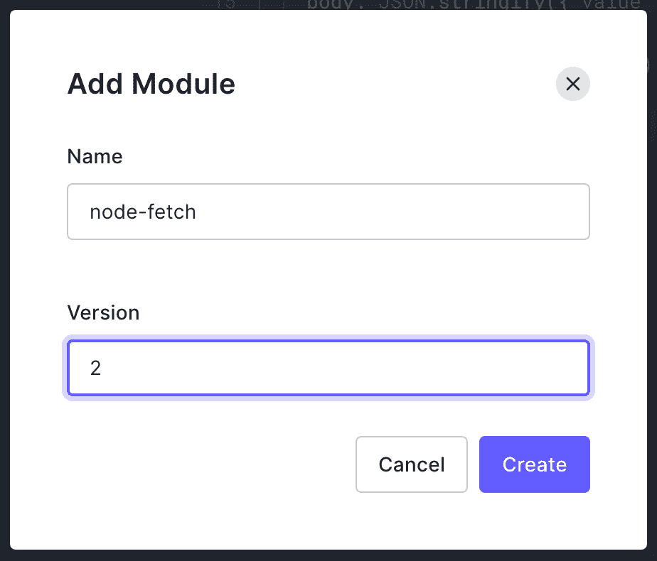

在**名称**字段中输入**节点提取**，在**版本**字段中输入 **2** 。不要*不要*选择最新版本(编写时为 3)，因为它不允许导入。

点击**创建**按钮。**模块**列现在应该列出*节点获取*模块:

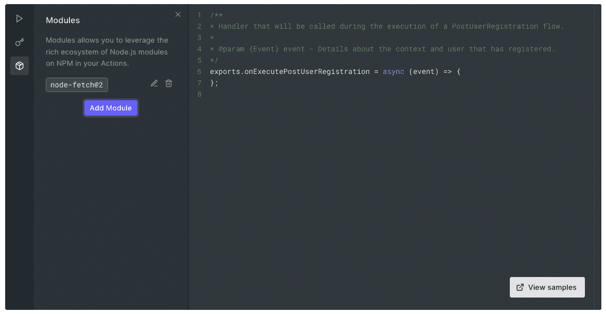

# 写动作

现在你已经提供了先决条件，是时候写动作了！

将下面的代码粘贴到编辑器中:

```
const fetch = require('node-fetch');

exports.onExecutePostUserRegistration = async (event) => {
  const address = event.secrets.UPSTASH_KAFKA_REST_URL
  const user = event.secrets.UPSTASH_KAFKA_REST_USERNAME
  const pass = event.secrets.UPSTASH_KAFKA_REST_PASSWORD
  const auth = Buffer.from(`${user}:${pass}`).toString('base64')
  const topic = 'user-events-topic'

  const userData = JSON.stringify(event.user);
  const x = await fetch(`${address}/produce/${topic}`, {
    method: 'POST',
    headers: {'Authorization': `Basic ${auth}`},
    body: JSON.stringify({"value" : userData})
  })
  const response = await x.json();
  console.log(response)
};
```

此操作使用 Auth0 提供的函数。当用户完成注册一个帐户时，调用该函数。它接受一个参数`event`，其`user`属性是一个包含新注册用户信息的对象，比如他们的电子邮件地址和用户 ID。

该代码检索存储在动作秘密中的秘密值，并使用它们连接到 Kafka 集群。它接受`user`对象，将其转换成原始的 JSON 字符串，并将其发送给 Kafka 集群中的主题。用户数据到 Kafka 主题。

# 测试动作

现在，我们可以通过点击编辑器侧边栏上的**测试**图标来运行该功能:

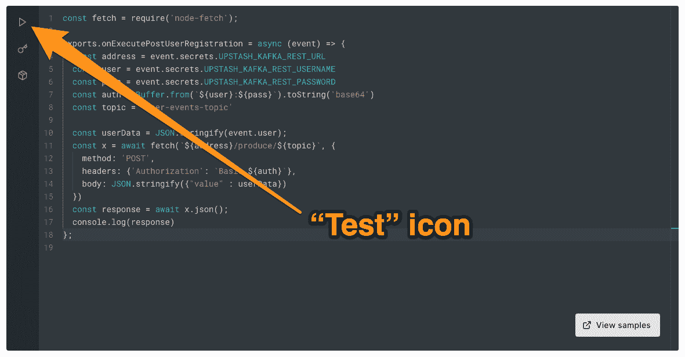

一个标题为**测试**的新列将出现在代码编辑器中:

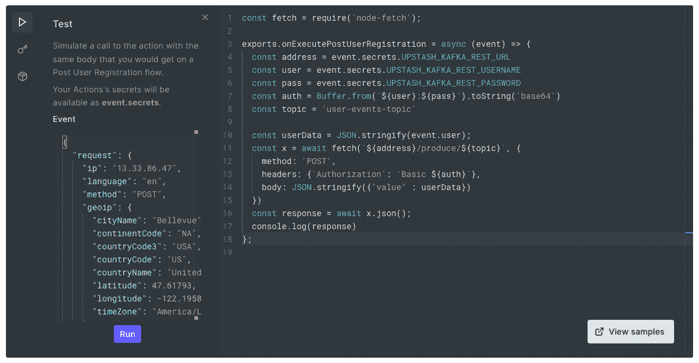

点击**运行**按钮运行测试。一个**测试结果**窗格将出现在代码编辑器的下部:

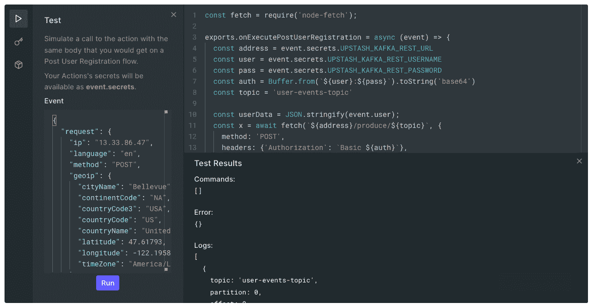

您应该在**日志**部分看到类似下面的输出:

```
Logs:
[
  {
    topic: 'user-events-topic',
    partition: 0,
    offset: 317,
    timestamp: 1641950606804
  }
]
```

您现在有一个工作动作。是时候部署了！

# 部署行动

点击页面右上角附近的**部署**按钮。这将保存您的操作并使其成为库中的当前版本，

现在您的操作已经在库中了，您需要将它添加到 Post 用户注册流中。通过从左侧菜单中选择**动作**导航至流程，然后**流程** → **发布用户注册**。你会看到这个:

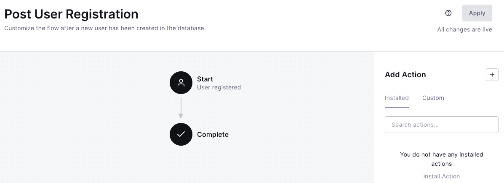

在页面右侧的**添加动作**部分，选择**自定义**选项卡查看您创建的动作:

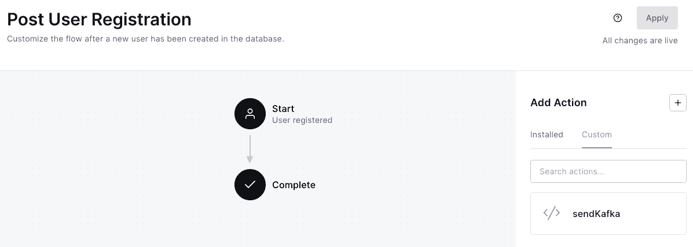

您应该会看到 **sendKafka** 动作。拖放到流程中**开始**和**完成**节点之间的区域，如下图所示:


现在您已经将您的操作添加到了流程中，通过单击页面右上角附近的 **Apply** 按钮来应用更改。

# 测试动作

现在行动部署好了，是时候检验一下了！

# 创建新用户

只要有新用户注册，您刚刚创建的操作就会运行，因此测试它的一种方法是使用 Auth0 仪表板创建一个新用户。

在 Auth0 仪表盘的左侧菜单中，选择**用户管理** → **用户** → **创建用户**并创建新用户:

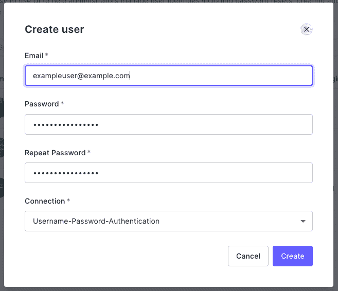

创建用户后，切换到 Upstash 浏览器选项卡或窗口，选择**主题**选项卡，然后选择**用户-事件-主题**主题:

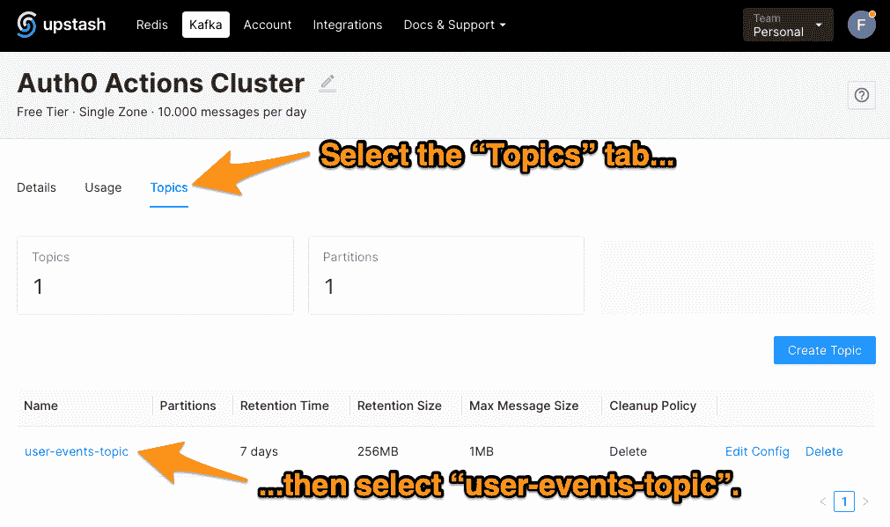

这将显示您的 Kafka 主题的统计数据:

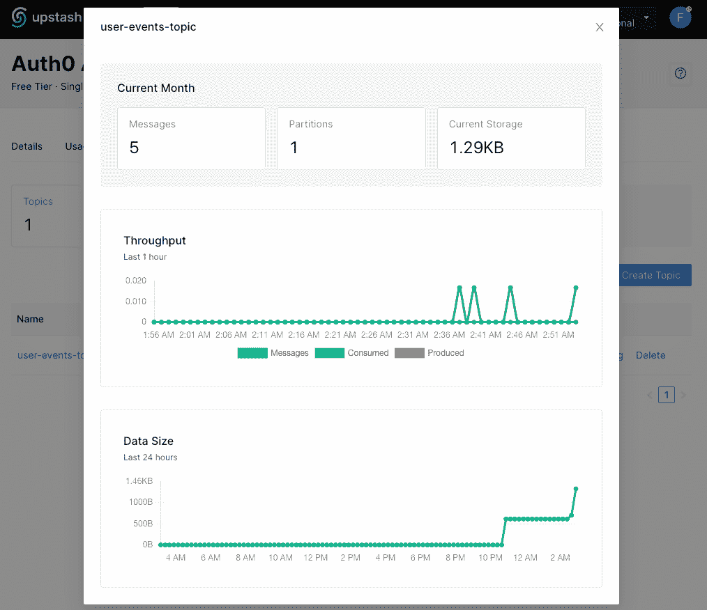

每创建一个新用户，就会有一条新消息被推送到 Kafka 主题，其计数(显示在**消息**下)增加 1。

您可以通过使用 **Details** 选项卡下的 **REST API** 部分中的 **Consumer** curl 脚本来检查 Kafka 主题:

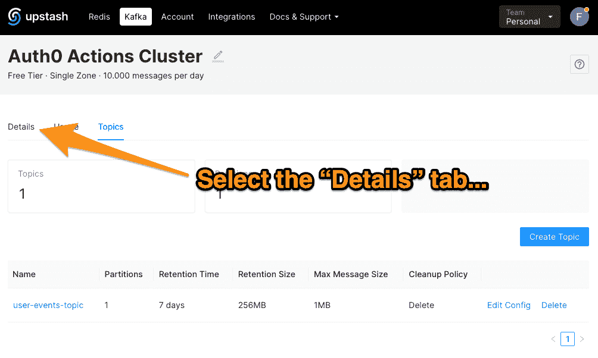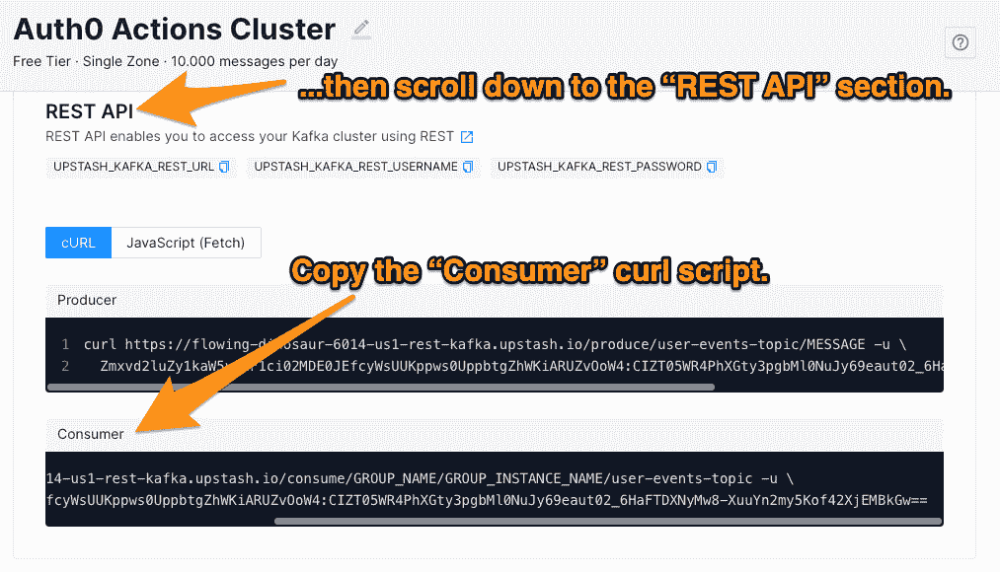

在命令行控制台中运行 curl 脚本。结果应该是这样的:

# 结论

Auth0 操作使开发人员能够将自定义逻辑注入用户生命周期，为登录过程添加额外的行为和功能。在本文中，我们使用 Auth0 动作为 Kafka 生成由新用户注册触发的事件。一旦存储在 Kafka 中，就有无限的可能性来利用这些数据。

*原载于【https://auth0.com】[](https://auth0.com/blog/send-auth0-events-to-kafka-for-realtime-processing/)**。***