# 使用 AWS App Runner、DynamoDB 和 CDK 部署和运行云原生 Go 应用

> 原文：<https://itnext.io/use-aws-app-runner-dynamodb-and-cdk-to-deploy-and-run-a-cloud-native-go-app-d4f2945610f6?source=collection_archive---------4----------------------->

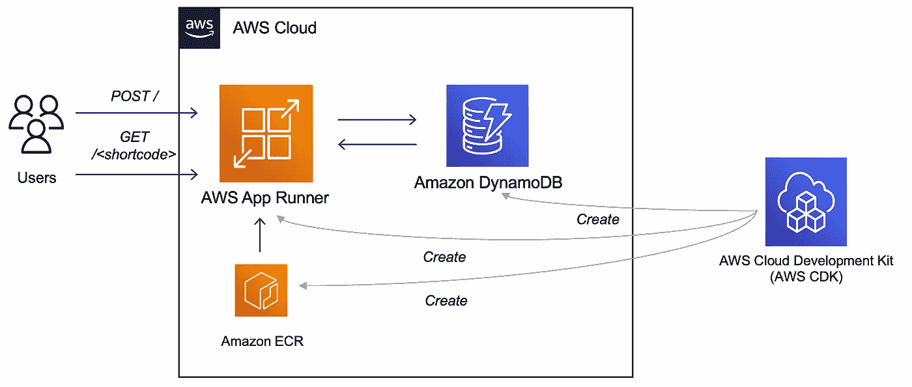

由 DynamoDB 支持的 AWS App Runner 上的 Go 应用程序

## …并运行基准测试来测试自动扩展

前面，我介绍了如何使用 DynamoDB、AWS Lambda 和 API Gateway 在 AWS 上构建一个无服务器的 URL shortener 应用程序。

[](https://betterprogramming.pub/build-a-serverless-url-shortener-with-go-ca198cb4d627) [## 用 Go 建立一个无服务器的网址缩写器

### 使用 AWS Lambda、DynamoDB 和 API 网关

better 编程. pub](https://betterprogramming.pub/build-a-serverless-url-shortener-with-go-ca198cb4d627) 

在这篇博文中，我们将把它作为 REST API 部署在 [AWS App Runner](https://docs.aws.amazon.com/apprunner/latest/dg/what-is-apprunner.html) 上，并继续使用`DynamoDB`作为数据库。AWS App Runner 是一种计算服务，可以轻松地从容器映像(或源代码)部署应用程序，管理它们的可伸缩性、部署管道等。

借助本博客中的一个实例，你将:

*   了解 AWS App Runner，如何将其与`DynamoDB`集成
*   运行简单的基准测试，探索您的应用程序运行者服务的可伸缩性特征，以及`DynamoDB`
*   使用 [AWS CDK Go](https://docs.aws.amazon.com/cdk/v2/guide/work-with-cdk-go.html) 应用“基础设施即代码”并部署整个堆栈，包括数据库、应用程序和其他 AWS 资源。
*   另请参见 [DynamoDB Go SDK](https://pkg.go.dev/github.com/aws/aws-sdk-go-v2/service/dynamodb) (v2)的运行以及一些基本操作，如`PutItem`、`GetItem`。

# 让我们从部署 URL shortener 应用程序开始

> *在你开始之前，确保你已经安装了* [*Go 编程语言*](https://go.dev/dl/)*(****v 1.16****或更高版本)和*[*AWS CDK*](https://docs.aws.amazon.com/cdk/v2/guide/getting_started.html#getting_started_install)*。*

克隆项目并切换到正确的目录:

```
git clone https://github.com/abhirockzz/apprunner-dynamodb-golang
cd cdk
```

**开始部署…**

运行`cdk deploy`并提供您的确认以继续。随后的部分将为您提供 CDK 代码的浏览，让您更好地理解正在发生的事情。

```
cdk deploy
```

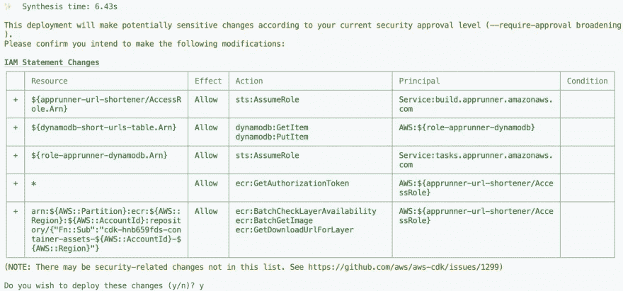

CDK 部署(启动)

这将开始创建我们的应用程序所需的 AWS 资源。

> *如果您想查看将在后台使用的 AWS CloudFormation 模板，运行* `*cdk synth*` *并检查* `*cdk.out*` *文件夹*

您可以在终端中跟踪进度或导航到 AWS 控制台:`CloudFormation > Stacks > DynamoDBAppRunnerStack`

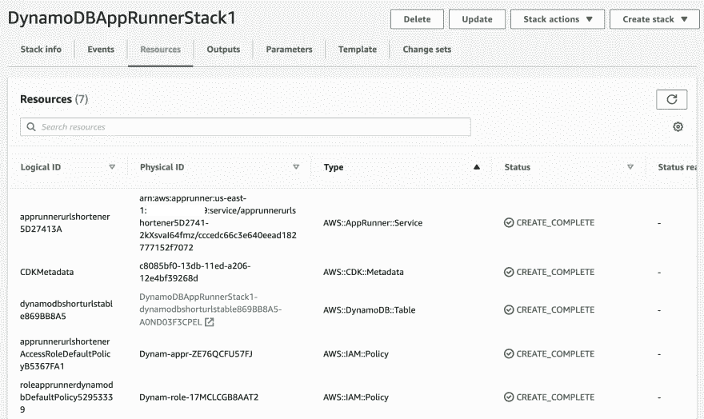

云形成堆栈资源

一旦创建了所有的资源，您就应该拥有`DynamoDB`表、App Runner 服务(以及相关的 IAM 角色等)。).

**App Runner 上的 URL shortener 服务**

您应该会看到刚刚部署的 App Runner 服务的登录页面。

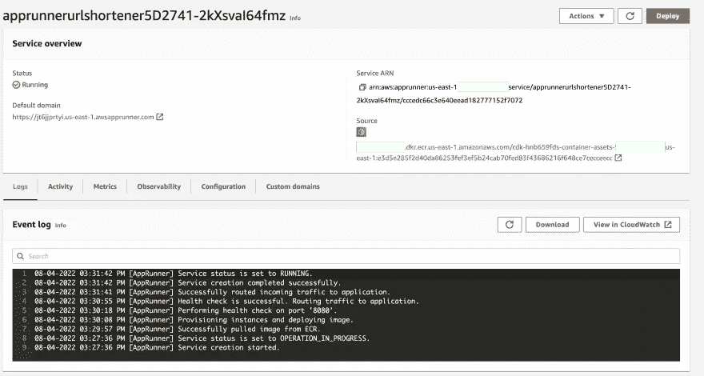

App Runner 服务概述

还要查看**配置**下的**服务设置**，它显示了环境变量(由 CDK 在运行时配置)以及我们指定的计算资源(1 `VCPU`和 2 `GB`

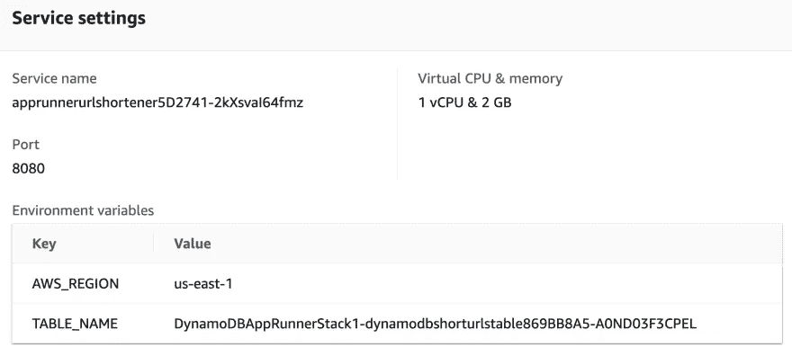

App Runner 服务设置

# 我们的网址缩写已经准备好了！

该应用程序相对简单，公开了两个端点:

1.  创建 URL 的短链接
2.  通过短链接访问原始 URL

要试用该应用程序，您需要通过 App Runner 服务获得端点 URL 提供者。它在堆栈输出中可用(在终端或 AWS CloudFormation 控制台的**输出**选项卡中，用于您的堆栈):

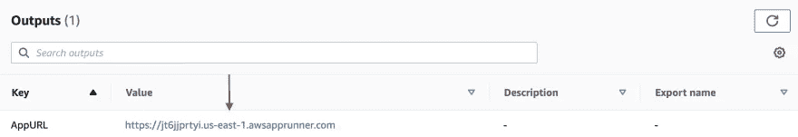

App Runner URL

首先，将 App Runner 服务端点导出为环境变量，

```
export APP_URL=<enter App Runner service URL># example
export APP_URL=https://jt6jjprtyi.us-east-1.awsapprunner.com
```

使用您希望通过一个短链接访问的 URL 来调用它。

```
curl -i -X POST -d 'https://abhirockzz.github.io/' $APP_URL# output
HTTP/1.1 200 OK
Date: Thu, 21 Jul 2022 11:03:40 GMT
Content-Length: 25
Content-Type: text/plain; charset=utf-8{"ShortCode":"ae1e31a6"}
```

您应该得到一个带有简短代码的`JSON`响应，并在`DynamoDB`表中看到一个条目:

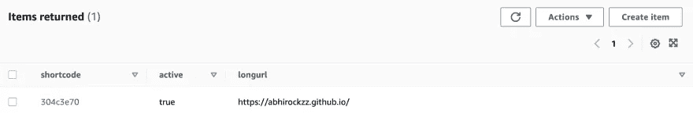

DynamoDB 记录

您可以使用其他一些 URL 继续测试应用程序。

**访问与短代码相关联的 URL**

…在浏览器中输入以下内容`http://<enter APP_URL>/<shortcode>`

比如你输入`https://jt6jjprtyi.us-east-1.awsapprunner.com/ae1e31a6`，就会被重定向到原来的网址。

也可以用`curl`。这里有一个例子:

```
export APP_URL=https://jt6jjprtyi.us-east-1.awsapprunner.comcurl -i $APP_URL/ae1e31a6# output
HTTP/1.1 302 Found
Location: https://abhirockzz.github.io/
Date: Thu, 21 Jul 2022 11:07:58 GMT
Content-Length: 0
```

# 自动缩放正在运行

App Runner 和`DynamoDB`都能够根据工作负载进行伸缩。

**AWS 应用程序运行器**

AWS App Runner 会自动增加实例数量以响应流量的增加，并在流量减少时减少实例数量。

> *这基于自动扩展配置，由以下用户定义的属性驱动——最大并发、最大大小和最小大小。详见* [*管理 App Runner 自动缩放*](https://docs.aws.amazon.com/apprunner/latest/dg/manage-autoscaling.html)

以下是 URL shortener App Runner 服务的自动缩放配置:

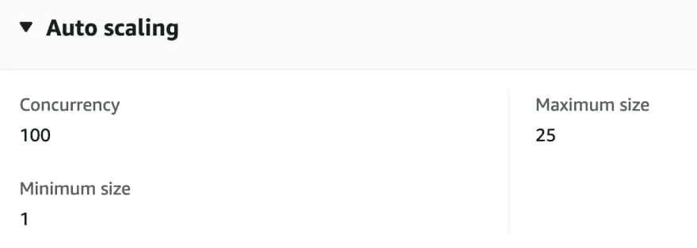

App Runner 自动扩展配置

**DynamoDB**

在[按需模式](https://docs.aws.amazon.com/amazondynamodb/latest/developerguide/HowItWorks.ReadWriteCapacityMode.html#HowItWorks.OnDemand)的情况下，`DynamoDB`会在您的工作负载上升或下降到任何先前达到的流量水平时立即适应它们。[调配模式](https://docs.aws.amazon.com/amazondynamodb/latest/developerguide/HowItWorks.ReadWriteCapacityMode.html#HowItWorks.ProvisionedThroughput.Manual)要求我们指定您的应用所需的每秒读写次数，但您可以使用自动缩放功能来自动调整您的表的调配容量，以响应流量变化。

# 让我们运行一些测试

我们可以运行一个简单的基准测试，并见证我们的服务如何反应。我将使用名为[嘿](https://github.com/rakyll/hey#installation)的负载测试工具，但是你也可以使用 Apache Bench 等。

这是我们要做的:

1.  从一个简单的测试开始，检查响应。
2.  增加负载，使其超过为`DynamoDB`表提供的容量。
3.  更新`DynamoDB`表容量并重复。

[安装 hey](https://github.com/rakyll/hey#installation) 并与`50`工作人员同时执行基本测试— `200`请求(按照默认设置):

```
hey $APP_URL/<enter the short code>#example
hey [https://jt6jjprtyi.us-east-1.awsapprunner.com/ae1e31a6](https://jt6jjprtyi.us-east-1.awsapprunner.com/ae1e31a6)
```

这应该在我们堆栈的容量范围之内。让我们把它提升到`500`并发工作器来执行*持续*4 分钟的请求。

```
hey -c 500 -z 4m $APP_URL/<enter the short code>#example
hey -c 500 -z 4m [https://jt6jjprtyi.us-east-1.awsapprunner.com/ae1e31a6](https://jt6jjprtyi.us-east-1.awsapprunner.com/ae1e31a6)
```

**dynamo db 做的怎么样？**

在`DynamoDB`控制台的**表容量指标**下，检查**读取使用量(平均单位/秒)**:

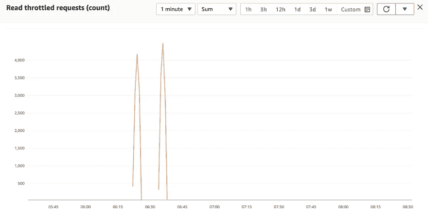

DynamoDB 节流

更重要的是，检查**读取节流事件(计数)**:

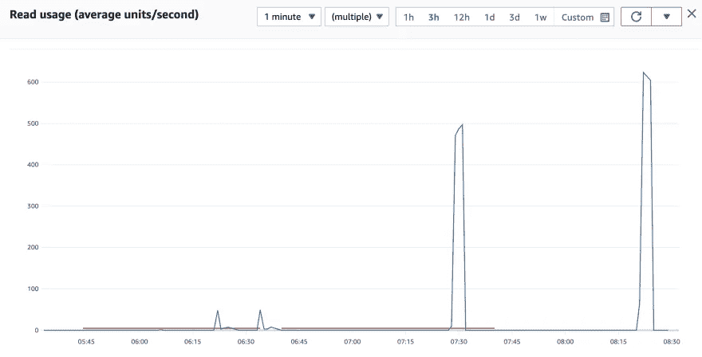

DynamoDB 节流

由于我们的表处于`Provisioned`容量模式(有 5 个`RCU`和`WCU`，请求受到限制，其中一些失败了。

编辑表格，将其模式更改为**按需**，重新运行负载测试。您现在应该不会看到节流错误，因为`DynamoDB`会根据负载自动伸缩。

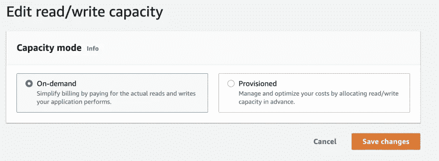

更新 DynamoDB 容量

**App Runner 怎么样？？**

在 App Runner 控制台的**指标**设置中，检查**活动实例**计数。

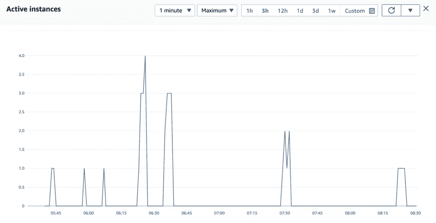

App Runner 自动缩放

> *您还可以跟踪其他指标，试验各种负载能力*

好了，现在你已经看到了**应用程序做了什么**并且检查了堆栈的基本可伸缩性特征，让我们继续讨论**如何做**。

但是，在那之前…

**别忘了删除资源！**

完成后，要删除所有服务，只需使用:

```
cdk destroy
```

# AWS CDK 代码演练…

我们将讨论`NewDynamoDBAppRunnerStack`函数的关键部分，它定义了 URL shortener 应用程序所需的整个堆栈(*为了简洁起见，我省略了一些代码*)。

> *可以参考* [*GitHub*](https://github.com/abhirockzz/apprunner-dynamodb-golang/tree/master/cdk) 上的完整代码

我们首先定义一个`DynamoDB`表，用`shorturl`作为分区键(我们的例子不需要范围/排序键)。请注意，`BillingMode`属性决定了表容量模式，在本例中是**提供的**(带有 5 个`RCU`和`WCU`)。如前一节所示，这是有意选择的。

```
func NewDynamoDBAppRunnerStack(scope constructs.Construct, id string, props *DynamoDBAppRunnerStackProps) awscdk.Stack {
  //....
    dynamoDBTable := awsdynamodb.NewTable(stack, jsii.String("dynamodb-short-urls-table"),
        &awsdynamodb.TableProps{
            PartitionKey: &awsdynamodb.Attribute{
                Name: jsii.String(shortCodeDynamoDBAttributeName),
                Type: awsdynamodb.AttributeType_STRING,
            },
            BillingMode:   awsdynamodb.BillingMode_PROVISIONED,
            ReadCapacity:  jsii.Number(5),
            WriteCapacity: jsii.Number(5),
            RemovalPolicy: awscdk.RemovalPolicy_DESTROY,
        })
  //...
```

然后，我们用 [awsiam。NewRole](https://pkg.go.dev/github.com/aws/aws-cdk-go/awscdk/v2/awsiam#NewRole) 定义一个新的 IAM 角色，并添加一个允许 App Runner 执行`DynamoDB`中的操作的策略。在这种情况下，我们提供粒度权限- [GetItem](https://docs.aws.amazon.com/amazondynamodb/latest/APIReference/API_GetItem.html) 和 [PutItem](https://docs.aws.amazon.com/amazondynamodb/latest/APIReference/API_PutItem.html) 。

```
//...
apprunnerDynamoDBIAMrole := awsiam.NewRole(stack, jsii.String("role-apprunner-dynamodb"),
        &awsiam.RoleProps{
            AssumedBy: awsiam.NewServicePrincipal(jsii.String("tasks.apprunner.amazonaws.com"), nil),
        })apprunnerDynamoDBIAMrole.AddToPolicy(awsiam.NewPolicyStatement(&awsiam.PolicyStatementProps{
        Effect:    awsiam.Effect_ALLOW,
        Actions:   jsii.Strings("dynamodb:GetItem", "dynamodb:PutItem"),
        Resources: jsii.Strings(*dynamoDBTable.TableArn())}))
```

[awsecrassets。NewDockerImageAsset](https://pkg.go.dev/github.com/aws/aws-cdk-go/awscdk/v2/awsecrassets#NewDockerImageAsset) 允许创建我们的应用程序 Docker 映像并将其推送到 ECR——只需一行代码。

```
//...
appDockerImage := awsecrassets.NewDockerImageAsset(stack, jsii.String("app-image"),
        &awsecrassets.DockerImageAssetProps{
            Directory: jsii.String(appDirectory)})
```

一旦所有的部分都准备好了，我们就定义了 App Runner 服务。注意它是如何引用应用程序所需的信息的:

*   `DynamoDB`表的名称(先前定义的)被植入为`TABLE_NAME` env var(应用程序所需的)
*   我们定义的 Docker 图像被`Asset`属性直接使用
*   我们定义的 IAM 角色作为实例角色附加到 [App Runner 服务](https://docs.aws.amazon.com/apprunner/latest/dg/security_iam_service-with-iam.html)

> *实例角色是一个可选角色，App Runner 使用它来为服务的计算实例所需的 AWS 服务操作提供权限。*

请注意，已经使用了 [L2 App Runner CDK 构造](https://pkg.go.dev/github.com/aws/aws-cdk-go/awscdkapprunneralpha/v2)的 **alpha** 版本，这与基于 [CloudFormation 的 L1 构造](https://pkg.go.dev/github.com/aws/aws-cdk-go/awscdk/v2/awsapprunner)相比要简单得多。它提供了一个方便的 [NewService](https://pkg.go.dev/github.com/aws/aws-cdk-go/awscdkapprunneralpha/v2#NewService) 函数，您可以用它来定义 App Runner 服务，包括源(在本例中是本地可用的)、IAM 角色(实例和访问)等。

```
//...
app := awscdkapprunneralpha.NewService(stack, jsii.String("apprunner-url-shortener"),
        &awscdkapprunneralpha.ServiceProps{
            Source: awscdkapprunneralpha.NewAssetSource(
                &awscdkapprunneralpha.AssetProps{
                    ImageConfiguration: &awscdkapprunneralpha.ImageConfiguration{Environment: &map[string]*string{
                        "TABLE_NAME": dynamoDBTable.TableName(),
                        "AWS_REGION": dynamoDBTable.Env().Region},
                        Port: jsii.Number(appPort)},
                    Asset: appDockerImage}),
            InstanceRole: apprunnerDynamoDBIAMrole,
            Memory:       awscdkapprunneralpha.Memory_TWO_GB(),
            Cpu:          awscdkapprunneralpha.Cpu_ONE_VCPU(),
        }) app.ApplyRemovalPolicy(awscdk.RemovalPolicy_DESTROY)
```

# 包裹

这就把我们带到了这篇博文的结尾！您探索了一个 URL shortener 应用程序，它公开了 REST APIs，使用`DynamoDB`作为其持久存储，并将其部署到 AWS App Runner。然后，我们研究了各个服务如何根据工作负载进行弹性伸缩。最后，我们还研究了 AWS CDK 代码，它使得将应用程序及其基础设施定义为(Go)代码成为可能。

快乐大厦！