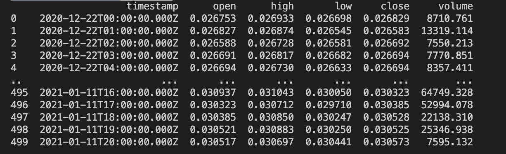
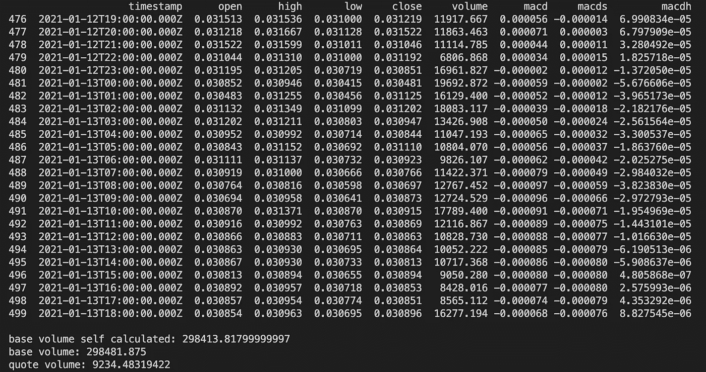
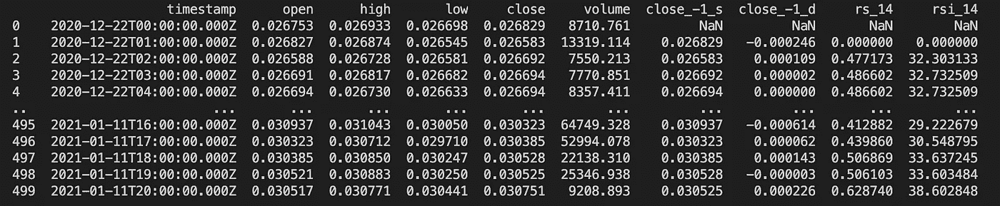
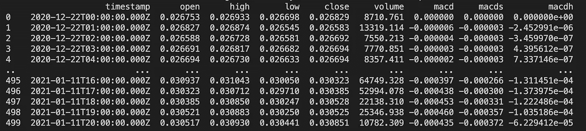
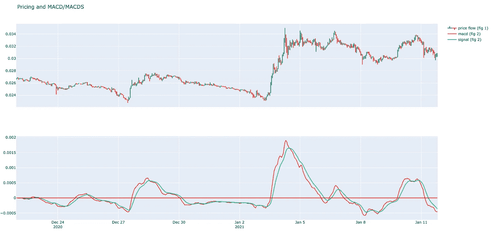
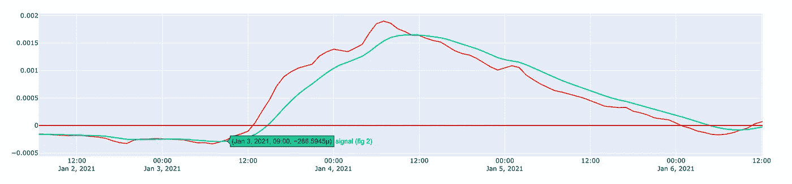
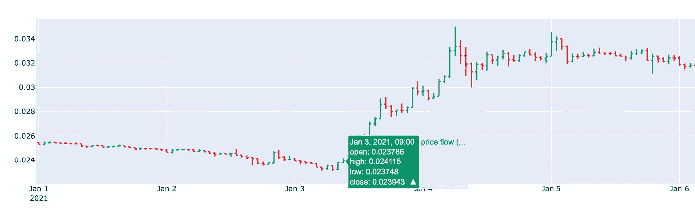

# 使用 CCXT 计算加密货币贸易指标

> 原文：<https://itnext.io/use-ccxt-to-calculate-cryptocurrency-trade-indicators-102a3ac1428e?source=collection_archive---------0----------------------->

*在写作的时候，比特币正在蓬勃发展。这是迄今为止最著名的加密货币。除了比特币，还有很多其他类型的加密货币，通常被称为替代币。经验丰富的交易者使用交易指标在比特币、替代币和其他公认的货币之间进行交易。在这篇文章中，我将介绍一些常用的指标，我将描述如何计算它们，并简要解释一个买/卖策略。*

许多贸易指标可以通过使用历史数据来计算。从交易所的某个硬币对(如 ETH/BTC)获得正确的数据非常重要。这里我们将使用 [CCXT](https://github.com/ccxt/ccxt) 。该库在由交易所提供的 API 之上提供了一个层。CCXT 支持[许多加密货币交易](https://github.com/ccxt/ccxt#supported-cryptocurrency-exchange-markets)并使它们之间的交互变得容易。在我的例子中，我将使用币安作为交换，使用 Python 与 CCXT 库进行交互。


在开始我的解释之前，我想强调的是，加密货币交易或创建一个交易机器人并没有那么明确。指标试图给出一个指示。它们并不代表绝对的真理。小心使用它，在使用它们之前先测试你的计算。在本文中，我将重点介绍如何计算这些指标。详细的解释通常由外部来源很好地解释。通过使用这个组合，你应该能够创造一个良好的交易策略！

我们开始吧！我已经在我的[币安](https://www.binance.com/en)账户中生成了 API 密匙。如前所述，如果您愿意，可以使用不同的交换。甚至可以使用不同的编程语言，如 JavaScript 或 PHP。下面我写了一些代码来导入 CCXT 库并配置我的 exchange。

打印`coin_pairs`变量的内容将显示交易所支持的所有可能的硬币对(或交易对)。当这些对使用不同的“基础”硬币时，比较它们可能相当困难(例如，比较 XLM/联邦理工学院和 XRP/BTC 之间的价格比比较 XLM/BTC 和 XRP/BTC 要困难得多)。这就是为什么我会过滤硬币对，只使用 BTC 作为基础硬币的原因。

现在我们有了可用硬币对的完整列表。我们的策略是遍历这个列表，并为每个硬币对获取必要的历史数据。接下来，我们可以计算交易指标，并创建买入/卖出信号。

[CCXT 为我们提供了一种简单的方法来检索 OHLC(V)数据](https://github.com/ccxt/ccxt/wiki/Manual#ohlcv-candlestick-charts)。 *OHLC(V)* 是加密货币交易数据的汇总形式，代表开盘、盘高、盘低、收盘和成交量。它将作为我们的历史资料。要获取这些数据，我们需要一个已配置的 exchange 连接和一个时间范围(1m、5m、1h、1d、…)。时间范围定义了测量的持续时间。如果你定义一个 5m 的时间框架，你将得到某个硬币对在 5 分钟间隔内的开盘价(O)，最高价(H)，最低价(L)和收盘价(C)。默认情况下，您将有 500 个指标(如果可用)。当您想要更多或更少的度量时，您可以使用一个可选参数来定义“a since”。(=从某个时间点开始的所有可用指标)。

在上面的代码中，我们将获取每对硬币的 OHLCV 数据。我们使用 1 小时的时间框架。我们还将通过 [stockstats](https://pypi.org/project/stockstats/) *将 [*熊猫*](https://pypi.org/project/pandas/) 数据帧转换为 *stockstats* 数据帧。* Stockstats 是 *pandas* 数据帧的包装器，提供计算许多不同股票市场指标的能力。



Stockstats 数据帧的输出

## 24 小时交易量

交易量是指某一天买卖双方交换的某个币对的总数。观察一段时间内的成交量模式有助于了解特定股票和整个市场涨跌背后的力量或信念。

计算 24 小时交易量的正确方法取决于你如何配置你的时间间隔。如果时间间隔为一天，您可以只获取数据帧的最后一项。如果使用 1 小时的时间间隔，则必须对最近 24 次测量进行求和。(参见示例)。这将涵盖 24 小时的数据。一种更精确、更简单的方法是使用滚动条。



这个计算运行了将近 18.58 小时，因此它包含了将近 24 小时的数据。

你可以用交易量来确认趋势，或者识别看涨或看跌的 T21 信号。这里有更详细的解释。

## RSI

相对强弱指数(RSI)衡量最近价格变化的幅度，以评估股票价格的超买或超卖情况。

RSI 的传统解释和用法表明，70 或以上的值表明一枚硬币正在超买。RSI 读数为 30 或以下表明超卖或低估。

```
# Calculate RSI                       
stock_data['rsi_14']                     
print(stock_data)

# Get most recent RSI value of our data frame
# In our case this represents the RSI of the last 1h                  last_rsi = stock_data['rsi_14'].iloc[-1]                       print(last_rsi)# output (see data below):
39
```



RSI 被添加到股票数据中。目前的 RSI 是 39。这不低于 30(买入信号)，也不高于 70(卖出信号)。目前，这个标志告诉我们要“ [hodl](https://en.wikipedia.org/wiki/Hodl) ”。在 RSI 低于 30 的几个小时前。这可能是买入的好时机。这种解释实际上过于短视。你必须考虑其他几件事。他们在[这里](https://www.investopedia.com/terms/r/rsi.asp)有更详细的解释。

## MACDS 麦当劳

移动平均线收敛背离(MACD)是一个交易指标，它显示了一个硬币的两个移动平均线(T4)和价格之间的关系。MACD 的计算方法是从 12 期均线中减去 26 期指数移动平均线。我不想太关注技术方面，尽管当你想在交易策略中使用它时，详细理解它是非常重要的。

```
# Calculate macd
stock_data['macd']
print(stock_data)
```



如果没有图纸，这些值很难解释。我用[巧妙的](https://pypi.org/project/plotly/)创建了一个显示 MACD 行为的图表。在上面的图表中，你可以看到联邦理工学院/BTC 的价格。在下图中，你可以看到 MACD 和 MACD(信号)线。



交易员使用 MACD 来识别股票价格趋势的方向或严重程度的变化。在[这里](https://www.investopedia.com/terms/m/macd.asp)解释的很好。

一个非常基本的要点如下:当 MACD 越过信号线上方(买入)或下方(卖出)时，它触发技术信号。

下面我们可以看到 MACD(红色)线在 1 月 3 日上午 9 点向上穿过信号(绿色)线。这可能意味着积极的价格演变。



MACD 向上穿越信号



ETH/BTC 的价格开始上涨

这些“交叉”可以解释为买入或卖出信号。在这里你可以使用下面的代码。

```
294  2021-01-03T06:00:00.000Z     HOLD
295  2021-01-03T07:00:00.000Z     HOLD
296  2021-01-03T08:00:00.000Z     HOLD
297  2021-01-03T09:00:00.000Z      BUY
298  2021-01-03T10:00:00.000Z     HOLD
299  2021-01-03T11:00:00.000Z     HOLD
...
```

就像之前的指标一样，它并不像描述的那样清晰。还有很多其他的事情要记住！再次 [Investopedia](https://www.investopedia.com/terms/m/macd.asp) 进行救援，关注重要细节。

## 结论

我希望我的计算和基本解释可以帮助你创建一个良好的交易策略，或者在你开发加密货币机器人的过程中。我建议结合不同的指标，如 RSI 和 MACD。还要检查你的交易所是否支持“测试网”,这样你就可以测试你的机器人，而不用进行真正的买卖。这样你就可以分析你的数据，调整你的机器人！我希望你喜欢它！

[](https://www.buymeacoffee.com/dZb8fLN)

如果你真的喜欢它！