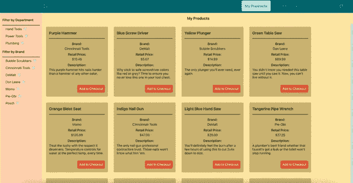
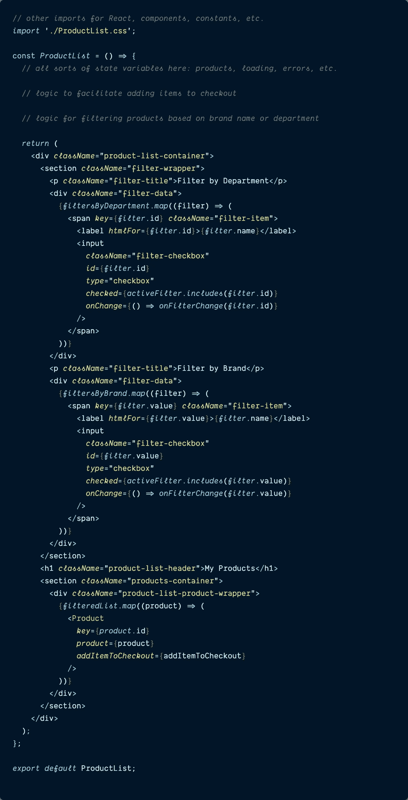
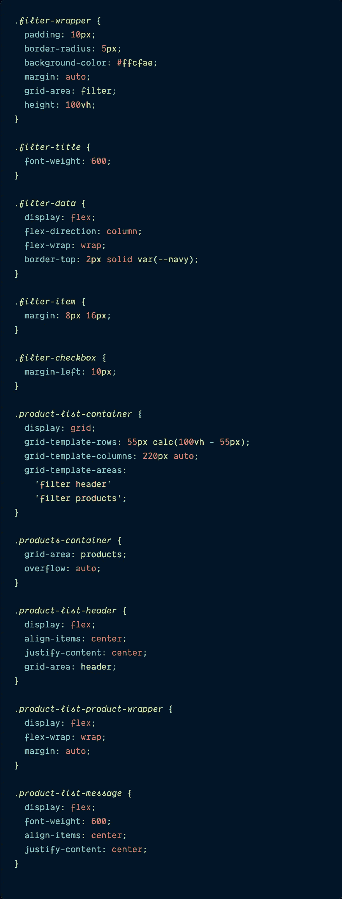
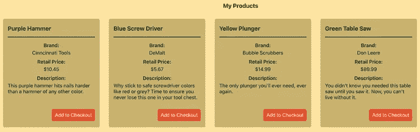
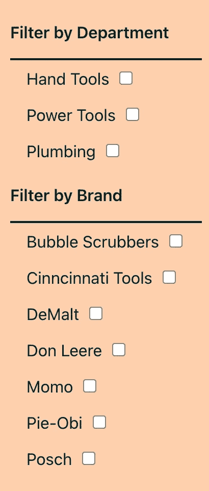
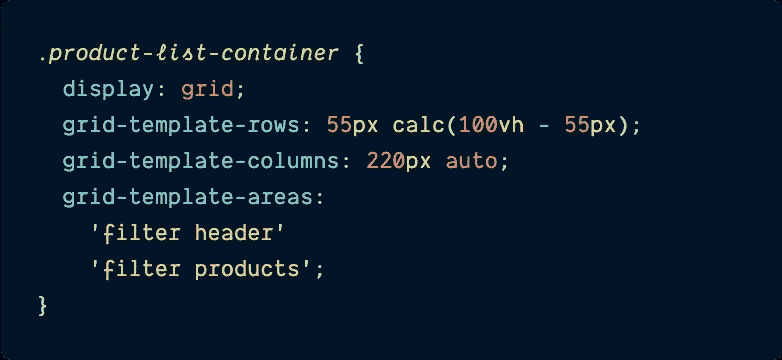
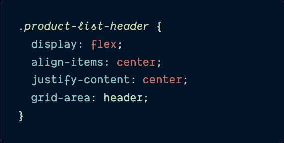
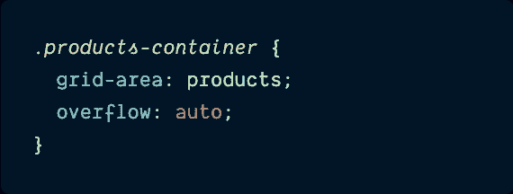
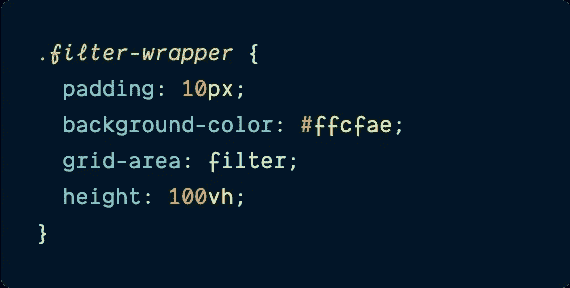

# 使用 CSS 网格制作一个主体可滚动的固定侧边栏

> 原文：<https://itnext.io/use-css-grid-to-make-a-fixed-sidebar-with-scrollable-main-body-e0d04cf099b2?source=collection_archive---------1----------------------->

## 忘记“位置:绝对”和“位置:固定”，取而代之的是 CSS 网格。

# 介绍

去年，我撰写了一个关于[现代化企业反应应用](https://www.newline.co/courses/newline-guide-to-modernizing-an-enterprise-react-app)的 web 开发课程。这是一项艰巨的任务，但我很自豪地发布了一份全面的指南，向开发人员展示了构建和维护一个大规模、长期运行的 React 应用程序需要做些什么:工具、测试、重构、设计系统等等。

对于本课程，我构建了一个 React 项目，类似于您在加入现有企业公司时可能会发现的项目:这是一个内部应用程序，产品经理使用它来管理工具和其他家庭装修项目的分类，并选择哪些应该运送到商店进行销售。我把它命名为“硬件处理器”。

该项目开始时使用的是 React 的一个过时版本，没有用于简化设置的工具，没有自动化测试，没有 React 挂钩，没有状态管理，没有组件库，等等。随着课程在每个模块中的进展，我关注了项目的一个方面，并展示了如何将项目更新到当今的高质量软件标准:例如，为单元测试添加 React 测试库和 Jest，或者重构基于类的 React 组件以使用钩子。

在构建示例项目时，我遇到的一件有趣的事情是，我想要一个显示所有可用产品的产品页面，而且还要有一个带有过滤选项的固定侧栏，以便用户可以按特定部门或特定品牌过滤产品。现在你可能认为我会使用一些 CSS 比如`position: fixed`或者`position: absolute`来保持这个侧边栏，并且从 DOM 的[正常流程中移除侧边栏，但是我不需要这样做。相反，我所需要的只是一些简单的 **CSS 网格**属性。](https://developer.mozilla.org/en-US/docs/Web/CSS/CSS_Flow_Layout/In_Flow_and_Out_of_Flow#taking_an_item_out_of_flow)

> *如果你不熟悉 CSS Grid，这是 CSS 的一个相对较新的补充，它擅长将页面划分为主要区域，并使作者能够将元素对齐到列和行。*
> 
> *我强烈推荐查看和* [***CSS-Tricks“网格完全指南”***](https://css-tricks.com/snippets/css/complete-guide-grid/) *，了解更多 CSS 网格信息。*

**今天，我将向您展示如何在 CSS Grid 的帮助下，在应用程序中构建自己的固定侧边栏，同时仍然允许主体内容自由滚动。**

下面是最终页面的视频:请注意，当产品卡片在主内容空间向下滚动时，页面标题和左侧的过滤器保持不变。

# 设置`ProductList`组件的 HTML(或 JSX)

在我们开始将 CSS 网格布局应用到我们的页面之前，我们实际上必须*编写*一个充满 HTML 元素的页面来将网格*应用到*。

我的项目是用 React 框架构建的，所以我要遍历的示例代码通常会包含 React 钩子、状态、函数和 JSX，但是对于这篇博文，除了 JSX 之外的所有内容都是不必要的，所以我把它删掉了。

> 如果你愿意的话，把剩下的 JSX 翻译成 HTML 或者其他 JS 支持的框架应该是相对简单的。

这里是实际的`ProductList`组件的压缩版本，请注意我已经删除了很多 React 特有的代码，比如错误处理消息、加载组件等等。来关注我们的 CSS 将要应用到的 HTML。

`**ProductList.js**`

我去掉了许多不必要的干扰，但是在这个组件中仍然发生了很多事情来呈现所有产品的列表和两个不同的过滤选项，所以让我们来讨论一下这个代码片段中发生了什么。

第一个`section`标签包装了我们的各种过滤器:

*   用户的一个过滤选项是按部门过滤产品，因此基于数组的状态变量名为`filtersByDepartment`，
*   另一个过滤选项是按品牌名称过滤产品:`filtersByBrand`。

这些数据数组中的每一个都会产生一组复选框，用户可以通过检查来缩小屏幕上同时显示的产品列表。

这将我们带到 JSX 的最后一个`section`,其中呈现了`filteredList`变量——该变量是符合所选过滤标准的所有产品的列表。

还要注意附加到这些元素上的类:`product-list-container`、`filter-wrapper`、`product-container`——当我们编写 CSS 时，它们将在下一节中发挥作用。

> *我省略了这个组件中的过滤逻辑，因为它不是这篇文章的核心。*

这就是这个组件的情况。

# 将 CSS 网格添加到我们的 HTML

随着我们的 JSX(或 HTML)的建立，我们可以得到这篇博文的 CSS 部分。这是包含在我们的`ProductList.css`文件中的 CSS 的全部——有一些东西是从其他全局 CSS 继承来的——比如`background-color`或`font-size`,但是总的来说，这是你需要的所有东西来实现想要的效果。

`**ProductList.css**`

当你浏览 CSS 时，你会注意到这里有两组不同的类:

*   那些总部在 T4 的公司
*   还有基于`filter`的。

在 JSX 中，每组类负责什么样式应该是不言自明的；除了样式化整个页面的`product-list-container`(并布置我们的整体网格)之外，`product`类用于页面上显示的产品卡片。

产品列表页面上显示的页面标题和产品卡示例

和`filter`类用于左手边的过滤器。

用于过滤页面上显示的产品的过滤器

现在让我们来谈谈代码片段中的一些单独的 CSS 类。

`**product-list-container**`

文件开头的`product-list-container` CSS 是我们在这里需要关注的第一件事，因为它是 CSS 网格定义和布局的地方。

*   `**display: grid**`:就像使用 CSS Flexbox 一样，我们必须做的第一件事是让 CSS 知道我们打算使用 Grid 而不是`display: flex`或`display: block`，就是将`display`属性设置为`grid`
*   `**grid-template-rows: 55px calc(100vh - 55px)**`:接下来，我们定义希望网格包含的行。
*   如果你看一下我的页面的布局，它总是在导航条的下面，有一个标题，写着“我的产品”,然后是产品卡片的正文，所以在我们的例子中，只需要两行:一行是标题，另一行是产品列表。
*   查看代码，我使用 CSS `[**calc**](https://developer.mozilla.org/en-US/docs/Web/CSS/calc)`函数从[视窗](https://css-tricks.com/fun-viewport-units/) : `100vh`的整体高度中减去`55px`，将页面标题`55px`给了房间，然后将视窗的剩余部分给了卡片。
*   `**grid-template-columns: 220px auto**`:和定义行一样，CSS Grid 也允许我们定义列，因为这个页面有一个侧栏和一个主要内容部分，所以两列就足够了。侧边栏部分将为`220px`宽，其余空间将被产品占据，因此`auto`在这里就足够了。
*   最后一行很有趣。虽然有多种方式来布置 CSS 网格，但最方便的功能之一是能够使用，它允许您命名网格区域，然后根据这些名称来布置它们。
*   通常情况下,`grid-row`和`grid-column`足以将东西放在它们在网格上应该在的地方，但是在这种情况下,`grid-template-areas`使得在页面上完全按照它应该在的位置来布局变得非常容易。

从代码中可以看出，名为`filter`的网格元素将占据**两个网格行**，以及**第一个网格列**(宽度为`220px`)。

网格元素`header`将只占据网格的**第一行**(`55px`高行)，以及**第二列**，并且网格元素`products`将占据网格的**第二行**和**第二列**(基本上所有剩余空间)。

现在 CSS 网格已经布置好了，它的列和行也定义好了，剩下的就是命名类以匹配定义的网格元素。

`**product-list-header**`

我们将继续研究 CSS，我认为这是最简单的，在`product-list-container`之后我们将关注的第一个类是`product-list-header`。这个名字应该给你一个这个类的用途的提示:它包装了页面的“我的产品”标题。

除了一个小小的 CSS Flexbox 魔术来在页面上的空间内水平和垂直对齐“我的产品”页面标题之外，它还被分配了一个`[**grid area**](https://developer.mozilla.org/en-US/docs/Web/CSS/grid-area)`。

`**products-container**`

*   `**grid-area: header**`:`grid-area`是一个属性，它告诉一个元素它应该在父网格容器中的什么位置，所以通过给这个元素命名的网格区域`header`，它知道它应该适合在`product-list-container`类的`grid-template-area`中定义的`header`空间。

我们在 CSS 文件中遇到的下一个类是`products-container`类。这个元素只需要两个 CSS 属性:

*   `**grid-area: products**`:我们再次将这个元素的`grid-area`命名为`products`，告诉它应该占据定义为`products`的网格中的所有空间。
*   `**overflow: auto**`:我们还需要添加`overflow: auto`的属性，这样产品列表将独立于页面上的其他元素滚动:`header`和`sidebar`。

> ***溢出:自动；*** *是我们固定侧边栏保持固定的关键成分。*
> 
> 如果没有它，如果有太多的产品不能一次显示在屏幕上，这些产品仍然会换行并占据所有它们需要的空间，但是整个网格会滚动显示它们(包括滚动到超出侧边栏占据的空间)。不太好。
> 
> *只是别忘了把这个属性加到* `*products-container*` *里。*

`**filter-wrapper**`

然后，我们必须跳过几个现有的类来组织产品，使它们在页面上整齐地排列，而不管商品的数量，直到我们到达`filter-wrapper`类。

有一些标准的`padding`和`background-color` CSS 属性在起作用，但是需要重点关注的两个属性是:

*   我们最后的`grid-area`称号到了。这个类获得了`filter`属性，所以它知道填充屏幕左侧的两个网格行。
*   `**height: 100vh**`:视口高度(`vh`)单位为该元素制作另一个外观。将过滤器元素的高度设置为`100vh`可以确保无论有多少实际的过滤器可用，或者用户将产品列表向下滚动多远，它都将一直向下到页面的底部(看起来像一个真正的侧边栏)。

在这个类之后，还有几个额外的类，用于将所有的过滤器复选框排列成一个漂亮的垂直行，并在它们之间留有适当的间距。

同样，对于这篇文章来说，没有上面强调的四个类重要。

就是这样:一个固定的侧边栏，页面上的其他元素可以自由滚动。

# 结论

为参加我的 React 应用程序现代化课程的用户构建一个示例应用程序帮助我学习了一些很酷的新 web 开发技术，尤其是如何使用 CSS Grid 构建一个带有静态侧栏和滚动中心部分的页面。

虽然本教程使用 CSS Grid 构建了一个固定的侧边栏，但它可以应用于许多不同的情况，需要类似的东西:一篇博客文章的目录，一组商店的详细信息以及它们的位置地图，当用户向列表中添加更多内容时，食品已经在购物车中——可能性还在继续。

感谢阅读。我希望您喜欢看到仅仅几个 CSS Grid 命令就可以消除使用 CSS(如`position: fixed`)中断 DOM 流的需要，并且仍然提供细粒度的控制。掌握 CSS 网格需要一点实践，但是一旦你做到了，我保证你不会想回去。我无法想象今天做 web 开发，没有 CSS Flexbox 和 CSS Grid 唾手可得。

如果你想确保你不会错过我写的一篇文章，在这里注册我的时事通讯:[https://paigeniedringhaus.substack.com](https://paigeniedringhaus.substack.com)

> *如果你喜欢这篇文章，你可能也有兴趣看看我的全部课程* [***【企业 React App 现代化新指南】***](https://www.newline.co/courses/newline-guide-to-modernizing-an-enterprise-react-app) *。*

在 10 个模块和 54 课中，我涵盖了我在家得宝构建应用程序时学到的所有东西。我深入构建和维护大型任务关键型 React 应用程序——因为在像这样的大公司，它不仅仅是让代码工作。

从工具和重构，到测试和设计系统库，这里有大量的材料和实践，可以帮助任何 React 开发人员构建符合当今高标准的软件。我希望你能检查一下。

# 更多参考和资源

*   [CSS 网格](https://developer.mozilla.org/en-US/docs/Web/CSS/CSS_Grid_Layout) Mozilla 文档
*   CSS-Tricks: [网格完全指南](https://css-tricks.com/snippets/css/complete-guide-grid/)
*   [现代化企业 React 应用程序的新指南](https://www.newline.co/courses/newline-guide-to-modernizing-an-enterprise-react-app)课程
*   [CSS Flexbox](https://developer.mozilla.org/en-US/docs/Web/CSS/CSS_Flexible_Box_Layout/Basic_Concepts_of_Flexbox) Mozilla docs
*   CSS-Tricks:[Flexbox 完全指南](https://css-tricks.com/snippets/css/a-guide-to-flexbox/)

*原载于【https://www.paigeniedringhaus.com】**。***