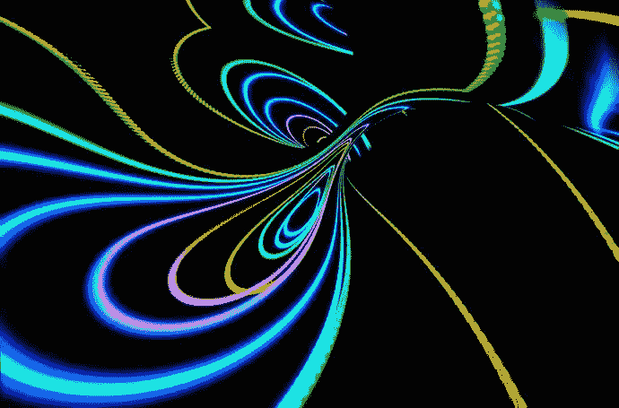
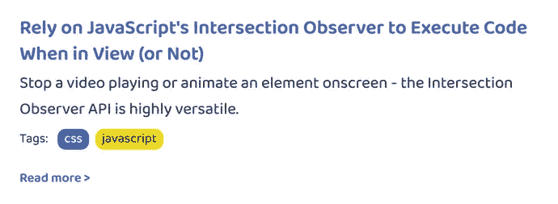
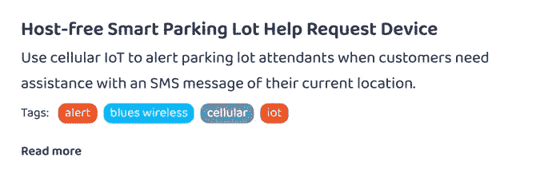

# 使用 CSS 通过与父元素交互来显示 DOM 中的子元素

> 原文：<https://itnext.io/use-css-to-reveal-a-child-element-in-the-dom-by-interacting-with-the-parent-e93f54132dc4?source=collection_archive---------6----------------------->

# 当您想要触发嵌套组件的更改时，只需将:hover 向上移动即可。



# 介绍

建立我自己的个人网站很有趣，因为我要花时间在小细节和微妙的地方，给它一些额外的东西——我知道当我在其他网站上看到它们时，我总是很感激。我想补充的一个细节是，当用户将鼠标悬停在我的每篇博文的卡片上的“阅读更多”链接旁边时，会出现一个小箭头。



看到阅读更多旁边的这个小箭头了吗？只有当用户将鼠标放在卡片上时，它才会出现。

乍一看，对于选择器来说，这听起来是一件相对简单的事情，但我实际上希望发生的是，当用户将鼠标悬停在我卡片的*任何*部分时，箭头会出现——而不仅仅是卡片左下角的“阅读更多”链接。我真正想要的是让更大的*父容器*触发*子元素*中的 CSS 变化。事实证明，要让这一点发挥作用，要弄清楚如何做到这一点有点困难。但是我坚持下来了，最后，我有了一个小箭头，它的出现和消失取决于用户的鼠标。这是一个低调的附加物，我喜欢它——就像复活节彩蛋一样。

**本文将向您展示如何使用用户在 DOM 中的父元素上进行的交互(比如悬停在它上面)来通过 CSS 修改子元素。(我可以看到很多情况下，这样的东西会派上用场。)**

下面是一个视频，展示了无论用户将鼠标放在卡片上的什么地方，卡片上“阅读更多”文本旁边的箭头都是如何出现的:标题、正文、标签——卡片上的任何地方都会出现箭头，而不仅仅是当用户将鼠标放在链接本身上时。

# 制作博客帖子卡的 HTML(或 JSX)



在我们开始这篇文章的 CSS 部分之前，我们首先需要建立一个博客帖子卡片的 HTML 的概要。

我的网站是使用 [Gatsby 框架](https://www.gatsbyjs.com/)用 React 构建的。在我的代码示例中，你会看到少量的 React 和 JSX，而不是传统的 HTML，但 CSS 确实是本文大部分内容的重点，所以不要太担心它。

> ***注意:*** *我已经省略了大部分 React 特有的代码，比如钩子、状态、函数等等。为了更好地集中本文的范围，但是如果您想查看完整的代码，您可以单击任何代码示例的标题来查看我在*[*GitHub*](https://github.com/paigen11/paigeniedringhaus.com/tree/master)*中的完整回购文件。*

下面是对`LatestPosts`组件的简化，它获取我的站点上所有可用的博客文章，并在卡片列表中显示最近的四篇文章。

`[**LatestPosts.js**](https://github.com/paigen11/paigeniedringhaus.com/blob/master/src/components/LatestPosts/LatestPosts.js)`

```
// other imports for React, components, constants, etc.
import './LatestPosts.scss';

const LatestPosts = () => {
  // state variables here

  // logic to fetch all blog posts, take the most recent 4 posts and format the data to display

  return (
    <div className="latest-posts-wrapper">
      {posts.length
        ? posts.map((post, index) => (
            <div className="post" key={index}>
                <Link
                  className="post-link"
                  to={`/blog${post.path}`}
                  key={post.title}
                >
                  <p className="post-title">{post.title}</p>
                  <p className="post-sub-title">{post.subTitle}</p>
                  <PostTags tags={post.tags} />
                  <p className="read-more">
                    Read more <span className="arrow">&gt;</span>
                  </p>
                </Link>
            </div>
          ))
        : null}
      <h2>
        <Link to="/blog">View all articles &gt;</Link>
      </h2>
    </div>
  )
};

export default LatestPosts;
```

在这个组件代码中，只有一个`<div>`(所有 React 组件都需要)包含了列表中显示的所有帖子:它是带有`latest-posts-wrapper`类的`<div>`。

然后，用`.map()`迭代`posts`列表，每个单独的帖子被呈现为 DOM 中的一个元素，看起来像一张卡片。每张卡片都有一个文章、博客标题、副标题、标签和鼓励用户点击的文本`Read more`的链接。

注意,`<Link>`元素包装了博客文章的大部分内容——这将很快成为关键。

在最后一个带有`read-more`类的`<p>`标签内部是一个包围`&gt;`的`<span>`标签——这是大于号(> ) 的 [HTML，我将它用作右箭头符号。](https://www.compart.com/en/unicode/U+003E)

最后，在组件的底部还有另一个 header 标签，`<h2>`，邀请用户访问带有[所有博客文章](https://www.paigeniedringhaus.com/blog)的站点页面。

好了，现在 HTML 的基础已经打好了，让我们继续处理 CSS，让这些箭头根据需要出现和消失。

# 将 CSS 添加到组件中

现在有更多的 SCSS 与`<LatestPosts>`组件相关联，但是为了清楚起见，我省略了与博客无关的部分。如果你想看完整版本的代码，你可以点击文件名，在 GitHub 中查看。

> ***注意:*** *下面的代码实际上是*[*SCSS*](https://sass-lang.com/)*而不是纯粹的 CSS，因为我非常欣赏它提供的额外功能，比如类嵌套，但是如果你需要的话，翻译它应该很简单。*

好了，这里是 CSS:现在让我们来谈谈发生了什么。

`[**LatestPosts.scss**](https://github.com/paigen11/paigeniedringhaus.com/blob/master/src/components/LatestPosts/LatestPosts.scss)`

```
.latest-posts-wrapper {
  display: flex;
  flex-direction: column;

  .post {
    margin: 10px 20px;
    padding: 20px 30px;
    background-color: white;
    box-shadow: rgba(0, 0, 0, 0.1) 0px 1px 3px 0px;
    border-radius: 5px;

    .post-link {
      // post-related css

      .arrow {
        opacity: 0;
      }
    }

    .post-link:hover {
      // more post-related css

      .arrow {
        opacity: 1;
      }
    }
  }
}
```

当你看这段代码时，要特别注意类`.post-link`和`.arrow`——它们是这里的关键。

`.post-link`是包围每张卡片内所有内容的类。`arrow`是与大过阿罗同在的阶级。

为了在用户悬停在卡片上之前隐藏箭头，我们将在`post-link`类内将`arrow`类设置为`opacity: 0;`。尽管它仍然存在于 HTML 中，但在屏幕上是看不到的。

然后，当用户将鼠标悬停在卡片上时，我们实际上调用了`post-link`类上的 CSS 伪类`:hover`，并将`arrow`类的不透明度切换为`opacity: 1;`，这使得鼠标一进入卡片内的任何地方，箭头就会显示出来。

我们没有将`:hover`添加到`read-more`类中，只有当用户将鼠标放在“阅读更多”链接上时才会显示箭头，而是将`:hover`添加到 card 元素中更高的位置，这使得箭头几乎出现在用户鼠标在卡片上的任何地方。瞧啊。

这就是全部:简单地将围绕子元素的`:hover`伪类在更大的父组件中向上移动就可以实现。

再一次，这是成品的样子:将鼠标悬停在卡片上箭头出现的任何地方，鼠标离开，箭头再次消失。

# 结论

作为一名网站开发人员，最酷的事情之一就是把东西带到网上，尽管我不是一名设计师，但当我建立自己的网站时，展示我的设计肌肉，并添加各种我喜欢的小细节，这真的很有趣。

这里那里的渐变，微妙的动画，诸如此类的东西:没有什么太戏剧化的东西让你介意，但是当我在其他网站上看到它时，我总是很欣赏这些小东西。

不久前，我想补充的一点是，当用户将鼠标悬停在我的一张博客卡片上时，他们会看到“阅读更多”提示旁边弹出一个小箭头。但是我想让箭头出现在鼠标可能悬停在卡片上的任何地方——而不仅仅是当他们看到卡片底部的“阅读更多”链接时。

通过在卡片的一个类上使用`:hover`伪类来包装卡片的所有内容(而不仅仅是“阅读更多”链接)，我能够实现这种效果，而且一点也不费力。很可爱。

过几周再来看看——我会写更多关于 JavaScript、React、IoT 或其他与 web 开发相关的东西。

如果你想确保你不会错过我写的一篇文章，在这里注册我的时事通讯:[https://paigeniedringhaus.substack.com](https://paigeniedringhaus.substack.com)

感谢阅读。我希望这个通过与父元素或祖父元素交互来影响子元素的 CSS 的技巧对您和我一样有用。

# 参考资料和更多资源

- [个人站点，GitHub repo](https://github.com/paigen11/paigeniedringhaus.com/tree/master)
- [MDN Docs，CSS hover 伪类](https://developer.mozilla.org/en-US/docs/Web/CSS/:hover)

*最初发表于*[*https://www.paigeniedringhaus.com*](https://www.paigeniedringhaus.com/blog/use-css-to-reveal-a-child-element-in-the-dom-by-interacting-with-the-parent)*。*