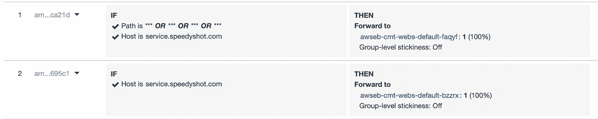

# 将 EC2 Spot 实例用于生产 Web 服务器

> 原文：<https://itnext.io/use-ec2-spot-instances-for-production-web-servers-1e40e774652b?source=collection_archive---------4----------------------->

## 下面是如何在保持可靠性的同时使用 AWS Spot 实例。

托马斯·詹森在 [Unsplash](https://unsplash.com?utm_source=medium&utm_medium=referral) 上的照片

如果您熟悉 EC2 Spot 实例，这个标题可能会显得非常矛盾。然而，**却是真的**。您**可以**使用 spot 实例进行生产**，同时保持稳定的 web 服务**！是的，我说的是 web 服务器，比如 fastify、express、jetty 等等。

这正是我在上周发布的最新 SaaS[SpeedyShot.com](https://speedyshot.com/?ref=md)中所做的——一个 PDF 生成、网页截图和抓取服务。大部分服务运行在 EC2 spot 实例上——对用户的影响非常小。

相反，在 spot 实例上运行服务允许您用更少的钱运行更多的实例，实际上增强了用户体验。

我将在本文中解释的技巧特别适用于新的 web 服务，但也可以适用于现有的服务。

# 什么是 EC2 Spot 实例？

如果您可能不知道什么是 spot 实例，这里有一个快速复习。

EC2 实例可以通过不同的方式计费。通常的方法是拥有按需实例。一旦您请求，这些实例将随时可供您使用。

定点实例的工作方式不同。您可以随时请求 spot 实例，但是 AWS 也可以随时中断它，几乎没有时间处理中断。计费价格取决于 AWS 当时拥有的免费资源数量。使用 spot 实例通常可以节省大约 70%的成本。

例如，在撰写本文时，以下是一些现货与按需价格:

**c3.large** :点播:$ 0.12；现货:0.03 美元；每小时。
**t4g.micro** :点播:$ 0.009；现货:0.002 美元；每小时。
**t4g.large** :点播:$ 0.07；现货:0.02 美元；每小时。

你可以在这个 AWS 页面上找到[完整的现货定价。](https://aws.amazon.com/ec2/spot/pricing/)

# 但是 Spot 实例不稳定？

对于 spot 实例有一个警告，因为 AWS 可以随时中断您的实例，这也意味着任何正在进行的处理都可能丢失。无论是处理新用户注册、发送电子邮件还是处理付款。这是不对的！

有趣的部分来了，在生产中仍然能够使用 spot 实例的技巧。

# 服务路由架构

现在是时候将 web 服务的路由组织成两类了。

*   关键任务
*   可重试次数

路线**是关键任务**还是**可重试**？关键任务路线，处理中的每一步都很重要，不能丢失，不应该在现场实例中运行**。例如，购买、注册等等。**

有趣的部分是**可重试的部分**。如果端点以相对罕见的速率失败是正常的，并且可以重试，这意味着您可以利用 spot 实例。

最坏的情况，很少，spot 实例被 AWS 中断，一些请求失败。这些请求不是关键任务，可以重试。如果这对您的用例来说没问题，那么您可以从 spot 实例中获益。

一旦您将您的端点分成这两类，您就应该在路由中找到一个模式。

例如，你可以说`/api/system`和`/api/user`总是关键任务，而其他的是可重试的。

如果您构建一个新的 web 服务，您甚至可以根据它们是否可重试来确定路由结构。例如，`/api/core/*`用于关键任务端点，而`/api/general/*`用于可重试端点。

现在，只需要设置 spot 实例和按需(或储蓄计划)实例，然后将请求路由到正确的实例。

# 设置实例

您必须设置:

*   按需(或节约计划)实例，将处理关键任务请求
*   Spot 实例，将处理可重试的请求

两者都应该在独立的自动缩放组中结束，这样您就可以精确地控制每个组需要多少个实例。他们都应该运行适当的代码库。

如果您的服务侧重于可重试的端点，那么您很幸运，因为您可以将大部分成本集中在更便宜的 spot 实例上。

# 利用您的负载平衡器

既然我们已经划分了路由，并且设置了实例，我们需要将正确的请求路由到正确的实例，无论是现场还是按需。

这可以使用应用程序负载平衡器来完成。打开负载平衡器的侦听器规则，并按如下方式更新它们。

负载平衡器设置将路由分割到 spots 或按需实例。

您将能够设置`Path`到您的可重试端点或关键任务端点。然后，您可以链接这些条件，将请求转发到正确的实例目标组(无论是 spots 还是按需实例)。一个重要的注意事项是，每个侦听器条件只能创建 5 个路径规则，因此在创建路由结构时考虑这一点很重要。

此时，您应该触发一些负载，并检查您的监控工具以确保您在正确的实例上，并且自动伸缩工作正常。

您还应该运行一些负载测试，并找出多个较小的实例是否比较少的较大实例工作得更好。

# 摘要

Web 服务的端点可以分为两类:任务关键型和可重试型。

如果您的服务预计在可重试的端点上会有高 CPU 使用率或高负载，请考虑对这些端点使用 spot 实例。

您可以设置负载平衡器，根据端点路径将流量路由到按需实例或现场实例。

这样，根据您的具体需求，可以更容易地负担许多小实例或几个大实例。

Spot 实例可以被中断，但中断似乎非常罕见。

这是我们在[https://speedyshot.com](https://speedyshot.com)的设置，它允许我们以相对较低的成本提供许多实例。我们还将现货实例的最大成本设置为按需价格，这样，如果现货价格突然改变，我们就可以切换到按需实例。