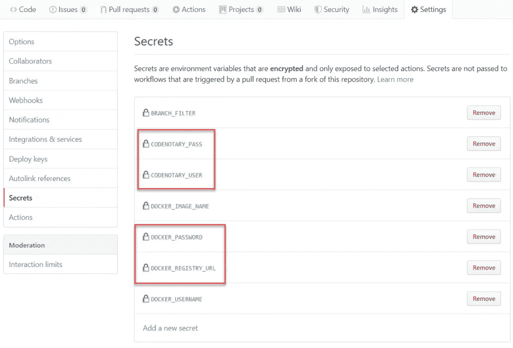
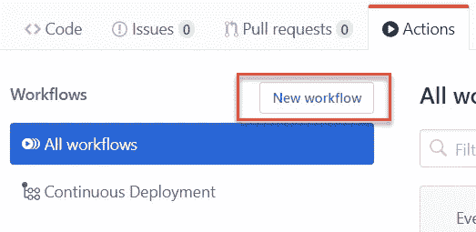
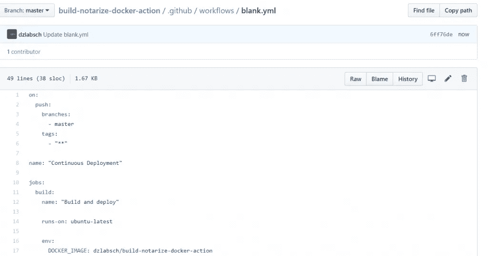
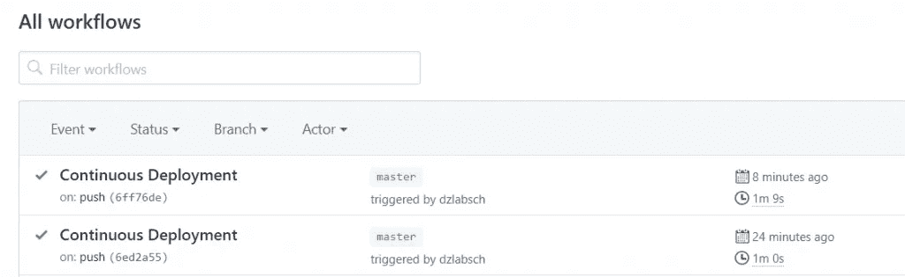
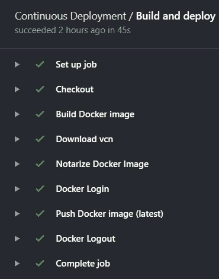
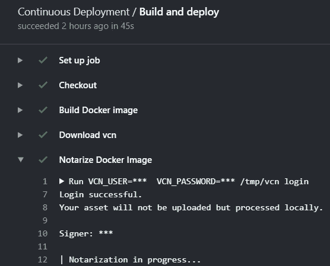

# 对已验证的构建使用 GitHub 操作

> 原文：<https://itnext.io/use-github-actions-for-validated-builds-31b3289b46cc?source=collection_archive---------5----------------------->

[GitHub 动作](https://github.com/features/actions)为 GitOps 管道提供了一种非常简单的方式，因为你不需要额外的 CI/CD 工具。您可以简单地创建或使用现有的 GitHub actions，并将其配置为在特定分支更新时运行。

您可以确保每个构建(即容器映像)都能以最安全的方式得到验证，code 公证人公证是强制性的。

让我们通过简单的步骤来集成 code 公证人:

# 创建 GitHub 秘密

你可以从在你的资源库中添加 [Dockerhub](https://hub.docker.com/) 和[code 公证人](https://www.codenotary.io)的 GitHub 秘密开始。



如果您还没有免费的 code 公证员帐户来设置公证流程，请从这个帐户开始:

# 创建您的工作流程

GitHub 动作是使用工作流定义的，工作流可以作为文件创建在您的库中，位于**下。github/workflows** 或使用 UI 和操作菜单。



# 工作流程

每当检测到主分支中的新提交时，将触发以下工作流，构建容器映像，公证该映像并将其推送到[Dockerhub.com](https://hub.docker.com/)。

请确保用您的帐户存储库替换容器映像路径。



```
# Define when the Actions should be triggered
on:
  push:
    branches:
      - master
    tags:
      - "**"
# Name of the Workflow
name: "Continuous Deployment"

# Different Jobs
jobs:
  build:
    name: "Build and deploy"
    runs-on: ubuntu-latest # Define the build docker image

    env:
      DOCKER_IMAGE: dzlabsch/build-notarize-docker-action # define Docker Repo

    steps:
# Checkout the Git repo
      - name: "Checkout"
        uses: actions/checkout@v1.0.0  

# Build the container image as latest
      - name: "Build Docker image"
        run: $(which docker) build --tag ${DOCKER_IMAGE}:latest .

# Download and verify CodeNotary vcn
      - name: "Download vcn"
        run: |
             curl -L -o /tmp/vcn https://github.com/vchain-us/vcn/releases/download/v0.7.3/vcn-v0.7.3-linux-amd64-static
             CHECKSUM=$(sha256sum /tmp/vcn | cut -d " " -f 1)
             echo $CHECKSUM
             curl -s https://api.codenotary.io/authenticate/$CHECKSUM?org=vchain.us | grep -q :0
             chmod +x /tmp/vcn

# Notarize the container image using your GitHub secrets
      - name: "Notarize Docker Image"
        run: |
             VCN_USER=${{ secrets.CODENOTARY_USER }}  VCN_PASSWORD=${{ secrets.CODENOTARY_PASS }} /tmp/vcn login
             VCN_NOTARIZATION_PASSWORD=${{ secrets.CODENOTARY_PASS }} /tmp/vcn n -p --attr GitHub="${GITHUB_SHA:0:7}" docker://${DOCKER_IMAGE}:latest 

# Log into Dockerhub or your container registry
      - name: "Docker Login"
        if: "'refs/heads/master' == github.ref || startsWith(github.ref, 'refs/tags/')"
        run: echo ${{ secrets.DOCKER_PASSWORD }} | $(which docker) login --password-stdin --username ${{ secrets.DOCKER_USERNAME }}

# Push the container image to the container repository
      - name: "Push Docker image (latest)"
        if: "'refs/heads/master' == github.ref || startsWith(github.ref, 'refs/tags/')"
        run: $(which docker) push ${DOCKER_IMAGE}:latest

# Logout Docker registry
      - name: "Docker Logout"
        if: "'refs/heads/master' == github.ref || startsWith(github.ref, 'refs/tags/')"
        run: $(which docker) logout
```

# 检查工作流程

当您将下一个变更提交到主分支时，GitHub 动作工作流应该会被自动触发。



当您单击工作流程的标题时，您还可以查看不同步骤的详细信息。



您可以打开每个工作单来查看详细信息:



# 验证容器图像

下载并使用该经过公证的容器图像的每个人都可以使用[code 公证人 vcn](https://github.com/vchain-us/vcn)(***vcn authenticated docker://image***)来检查其真实性。

它也可以很容易地集成到您的部署过程中。

*原载于 2019 年 11 月 25 日*[*https://www . code 公证人. io*](https://www.codenotary.io/use-github-actions-for-validated-builds/) *。*