# 使用 Helm 在 Kubernetes 中安装 OpenVPN 以访问 pods 和服务

> 原文：<https://itnext.io/use-helm-to-deploy-openvpn-in-kubernetes-to-access-pods-and-services-217dec344f13?source=collection_archive---------0----------------------->

在开发过程中，访问 Kubernetes 集群中的应用程序(pods)而不创建外部(公共)端点是很有用的。这可以通过使用 OpenVPN 来实现。我们将使用 Kubernetes 包管理器 Helm 在我们的 Kubernetes 环境中安装 OpenVPN。

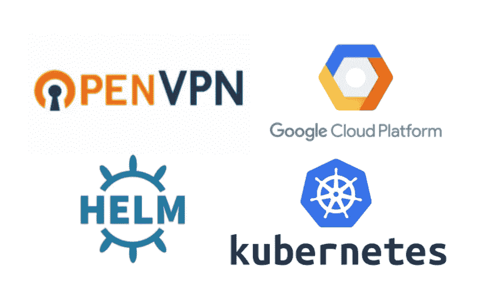

*本教程在* [*Google Cloud 上执行，Google Cloud 提供 300 美元免费积分*](https://cloud.google.com/free/) *以开始使用任何 GCP 产品。*

# 先决条件

*   [安装 kubectl](https://kubernetes.io/docs/tasks/tools/install-kubectl/#install-kubectl)
*   [安装舵](https://github.com/kubernetes/helm/blob/master/docs/install.md)
*   [安装 gcloud SDK](https://cloud.google.com/sdk/downloads) (如果你用的是谷歌云)
*   创建一个谷歌云帐户(如果你正在使用谷歌云)
*   控制台中的链接计费帐户(如果您使用谷歌云免费层)

# **设置 Kubernetes**

我将解释如何在 GCP 建立 Kubernetes。如果您已经有一个完整的 Kubernetes 集群，您可以跳过这些步骤。

官方 Google Cloud 文档[解释了如何创建一个比我下面解释的更高级的集群，但是这已经超出了范围。](https://cloud.google.com/sdk/gcloud/reference/container/clusters/create)

```
# Configure your cli to connect with your Google Cloud account
$ gcloud init# List project
$ gcloud projects list
PROJECT_ID          NAME                PROJECT_NUMBER
openvpn-kubernetes  openvpn-kubernetes  xxx# Create a basic cluster inside your project and desired region
$ gcloud container clusters create cluster-1 --zone europe-west1-b --project openvpn-kubernetes
```

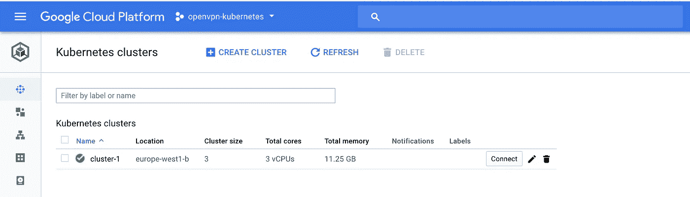

等待几分钟，直到集群启动并运行！然后点击“Connect”获取配置 [kubectl](http://kubernetes.io/docs/user-guide/kubectl-overview/) CLI 访问所必需的命令。

```
$ gcloud container clusters get-credentials cluster-1 --zone europe-west1-b --project openvpn-kubernetes
```

现在我们已经可以检查 IP 范围了。你可能会看到不同的价值观。

```
$ gcloud container clusters describe cluster-1 --zone europe-west1-b
```

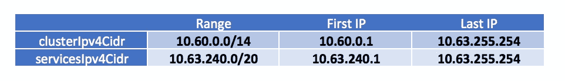

让我们牢记这些价值观。
现在我们将配置 Kubernetes 仪表板访问。

# 配置 Kubernetes 仪表板访问

我们将创建一个 ServiceAccount 作为访问仪表板的变通方法。
这个在[这个博客](https://blog.heptio.com/on-securing-the-kubernetes-dashboard-16b09b1b7aca)里有很详细的解释。这是对 ServiceAccount 机制的轻微滥用。

```
# Create ServiceAccount
$ kubectl create serviceaccount my-dashboard-sa# Create role binding
$ kubectl create clusterrolebinding my-dashboard-sa \
  --clusterrole=cluster-admin \
  --serviceaccount=default:my-dashboard-sa# Get the secret
$ kubectl get secrets# Describe the my-dashboard-sa-token-xxx
# Copy the token
$ kubectl describe secret my-dashboard-sa-token-xxx# Open the kubectl proxy to visit the dashboard
$ kubectl proxy
```

现在我们可以访问[http://127 . 0 . 0 . 1:8001/ui](http://127.0.0.1:8001/ui)上的仪表盘。
粘贴您之前复制的令牌:

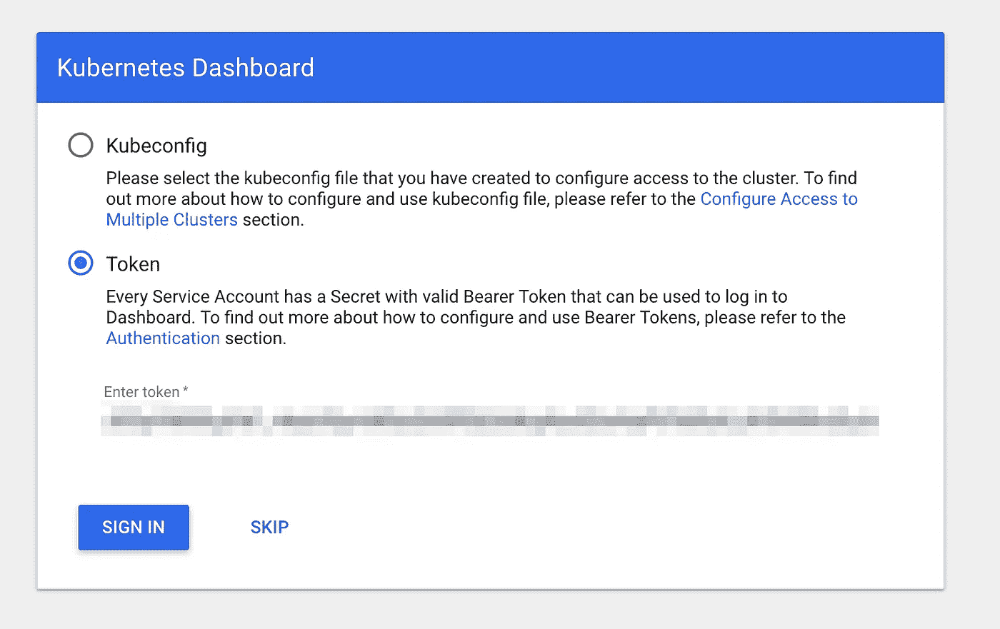

访问 Kubernetes 仪表板:

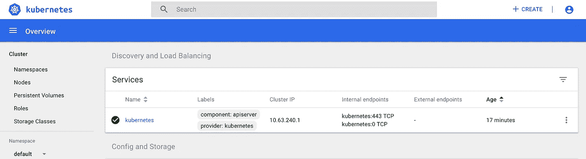

# 部署一个基本的示例应用程序

我们将在名为“sample-app”的名称空间中部署一个非常基本的示例应用程序。该部署将包含 2 个运行 web 服务器(Nginx)的 pod。我们将在上面创建一个服务，它将作为 pod 上面的负载平衡器。当服务是不朽的并且服务 IP 永远不会改变时，pod 可以下降和上升，这可以导致不同的 pod IP。

有三种重要的服务类型:

*   `ClusterIP`:在**集群内部 IP** 上公开服务。选择该值将使服务只能从集群内部访问。这是默认的`ServiceType`。
*   `NodePort`:在一个静态端口(T3)公开每个节点 IP 上的服务。一个`NodePort`服务将路由到的`ClusterIP`服务被自动创建。通过请求`<NodeIP>:<NodePort>`，您将能够从集群外部联系`NodePort`服务**。**
*   `LoadBalancer`:使用云提供商的负载均衡器对外公开服务**。**

**我们不想公开我们的服务。我们将创建一个类型为`ClusterIP`的服务。`ClusterIP`将在`servicesIpv4Cidr`的范围内。**

```
# Create namespace for sample app
$ kubectl create ns sample-app# Create a deployment object and an associated ReplicaSet object. 
# The ReplicaSet has 2 pods.
$ kubectl run my-nginx --image=nginx --replicas=2 --port=80 --namespace=sample-app# Create a Service object of type ClusterIP that exposes the deployment:
$ kubectl expose deployment my-nginx --namespace=sample-app --type=ClusterIP
```

**通过检查仪表板进行验证:**

**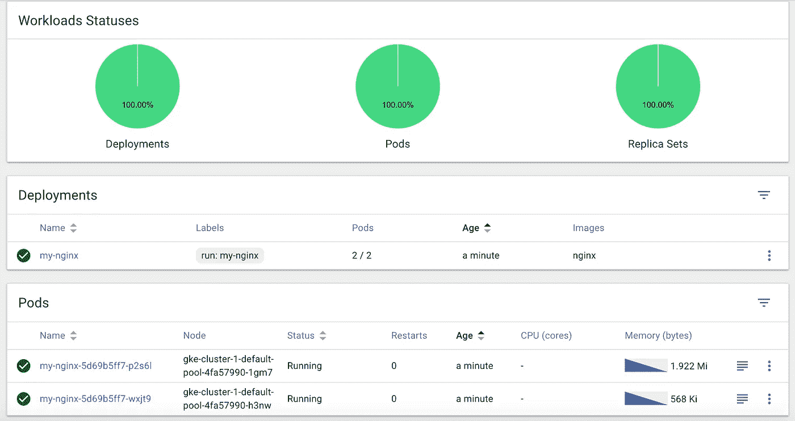**

**两个吊舱正在运行**

**检查服务。没有外部端点(公共 IP ),它是在预期范围内创建的。**

**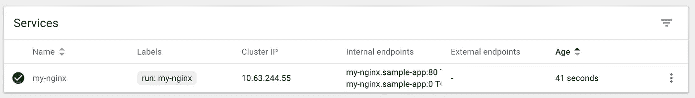**

**该服务仅在集群内部可用。**

**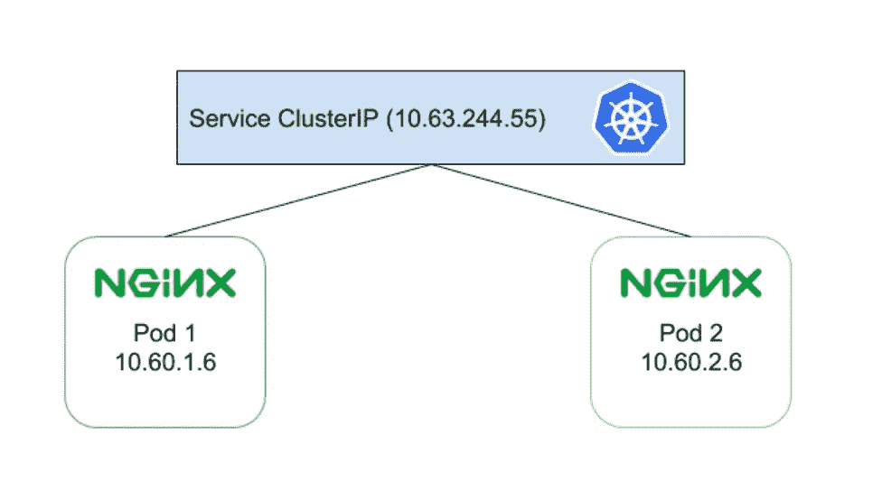**

**此方案总结了设置(忽略 kube-proxy)**

**我们如何在不定义外部端点(公共 IP)的情况下访问我们的 pod？这里我们将使用 OpenVPN。我们将使用 Helm 在我们的集群中安装 OpenVPN 并与之连接。它将通过 VPN 将所有网络流量路由到 kubernetes pods 和服务。这将使我们能够在浏览器中访问 Nginx 服务的`ClusterIP`!**

# **准备持久存储**

**我们将为我们的 OpenVPN pod 准备持久存储，因为我们不想在 pod 再次缩小和放大时丢失数据。每次部署都会生成新证书。如果启用了持久性，证书数据将在 pod 重新启动后保持不变。否则，每次部署或 pod 重启后，都需要新的客户端证书。**

**我会在谷歌云平台准备存储。
打开一个新的终端:**

```
# Create disk
$ gcloud compute disks create --size 1GB openvpn-disk --zone europe-west1-b
```

**创建我们的 Kubernetes 名称空间，我们将在其中部署 OpenVPN pod。**

```
# Create namespace
$ kubectl create ns openvpn
```

**为持久卷声明编写一个模板:`openvpn-pv-claim.yaml`。
这将认领谷歌云存储。这个索赔叫做`openvpn-data-claim`。**

**创建索赔:**

```
# Create disk
$ kubectl create -f openvpn-pv-claim.yaml
```

**我们可以在仪表板上验证。不要忘记选择正确的名称空间。**

**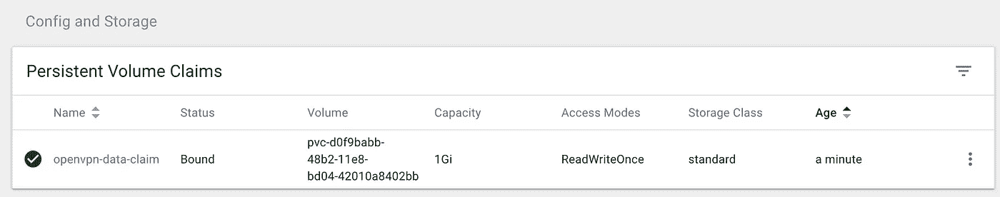**

# **配置 Helm 并安装 OpenVPN**

**Helm 是 Kubernetes 的包装经理。它由两部分组成:客户端( *helm* )和服务器( *tiller* ) Tiller 运行在您的 Kubernetes 集群中。**

```
# Create ServiceAccount
$ kubectl create serviceaccount --namespace kube-system tiller# add cluster role cluster-admin to ServiceAccount
$ kubectl create clusterrolebinding tiller-cluster-rule --clusterrole=cluster-admin --serviceaccount=kube-system:tiller# Install tiller in Kubernetes
$ helm init --service-account tiller
```

**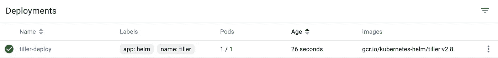**

**现在我们将使用[舵图来安装 OpenVPN](https://github.com/kubernetes/charts/tree/master/stable/openvpn) 。这里我们需要写一个包含我们配置的`values.yaml`。它基于来自 [GitHub 库](https://github.com/kubernetes/charts/blob/master/stable/openvpn/values.yaml)的`values.yaml`。**

```
$ mkdir helm-openvpn/
$ cd helm-openvpn/
$ vi values.yaml
```

**添加以下值。定义你的`OVPN_K8S_POD_NETWORK`:**

**开始安装舵。我们将指向我们的`values.yaml`并参考图表`stable/openvpn`。**

```
$ helm install --name openvpn -f values.yaml stable/openvpn --namespace openvpn
```

**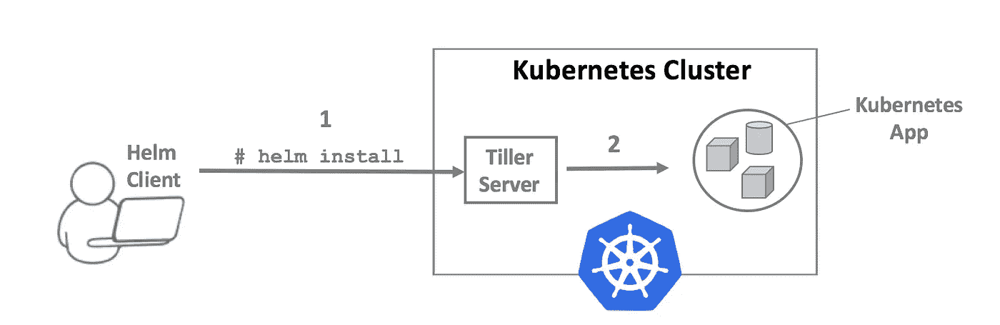**

**这可能需要一些时间，因为在部署过程中需要提取 Docker 映像。**

**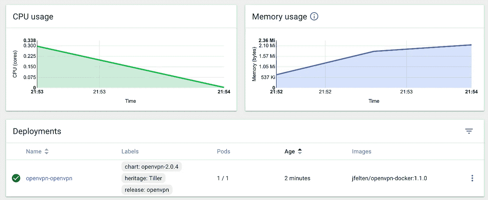**

**访问仪表板以检查 OpenVPN pod 是否已启动并正在运行:**

**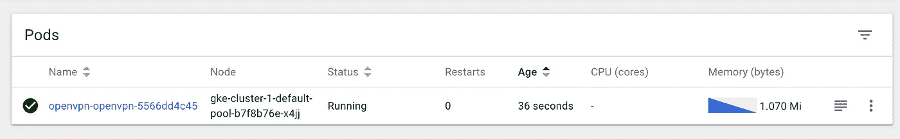**

**在`helm install`之后，会弹出一些命令。需要执行这些命令来创建 OpenVPN 证书。通过打印环境变量的内容进行验证。**

```
# execute each line separately
# Get pod name
$ POD_NAME=$(kubectl get pods --namespace openvpn -l type=openvpn -o jsonpath='{ .items[0].metadata.name }')
$ echo $POD_NAME# Get Service name
$ SERVICE_NAME=$(kubectl get svc --namespace openvpn -l type=openvpn  -o jsonpath='{ .items[0].metadata.name }')
$ echo $SERVICE_NAME# Get Service IP (this can take a while, wait till deployment is finished)
$ SERVICE_IP=$(kubectl get svc --namespace openvpn $SERVICE_NAME -o go-template='{{ range $k, $v := (index .status.loadBalancer.ingress 0)}}{{ $v }}{{end}}')
$ echo $SERVICE_IP# Define key name (different for each key!)
$ KEY_NAME=kubeVPN
$ echo $KEY_NAME
```

**如果变量的输出包含正确的值，您可以开始创建`kubeVPN.ovpn`。**

```
$ kubectl --namespace openvpn exec -it $POD_NAME /etc/openvpn/setup/newClientCert.sh $KEY_NAME $SERVICE_IP
$ kubectl --namespace openvpn exec -it $POD_NAME cat /etc/openvpn/certs/pki/$KEY_NAME.ovpn > $KEY_NAME.ovpn
```

**一个`kubeVPN.ovpn`文件被创建！**

**该文件也存储在 OpenVPN pod 中。这个吊舱是持久的，所以不应该害怕失去`kubeVPN.ovpn`。
在安装和配置我们的 VPN 客户端之前，我们将停止`kubectl proxy`命令。成功连接 VPN 以访问您的仪表板后，再次执行该操作。**

# **配置 VPN 客户端**

**现在我们需要安装一个 VPN 客户端。Windows 用户可以安装 [OpenVPN 客户端](https://openvpn.net/index.php/open-source/downloads.html)。对于 OSX 用户来说，Tunnelblick 是一个不错的选择。拖动。tunne 中的 ovpn 文件单击并单击连接:**

**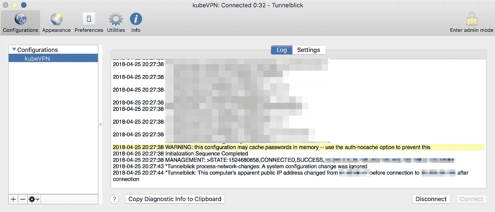**

**现在我们连在一起了。让我们检查一下`ifconfig`的输出。**

****

**在`helm install`期间，我收到了一个在`values.yaml`内定义的范围内的 IP。**

**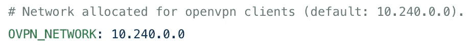**

**让我们回到我们在示例应用程序中创建的 Nginx 服务:**

****

**复制`ClusterIP`并粘贴到你的浏览器中。现在，您在两个 pod 之间实现了“负载平衡”。**

**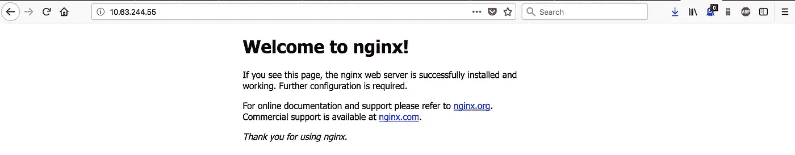**

**您也可以不使用服务，而是通过连接到 pod IP 来访问您的 pod。**

**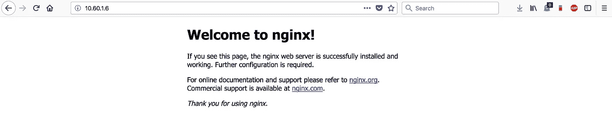**

# **结论**

**有用！我们可以在浏览器中访问类型为`ClusterIP`的服务。
记住关于这类服务的解释:*“选择这个值* `*(ClusterIP)*` *使得服务只能从集群内部到达”。***

**通过使用 OpenVPN，我们能够在浏览器中访问服务，而无需使用外部端点！我们甚至可以忽略服务，直接访问我们的 pod。当您从 VPN 断开连接时，将无法再访问服务或 pods。**

**希望你喜欢它！**

**[](https://www.buymeacoffee.com/dZb8fLN)

如果真的对你有帮助…:)**