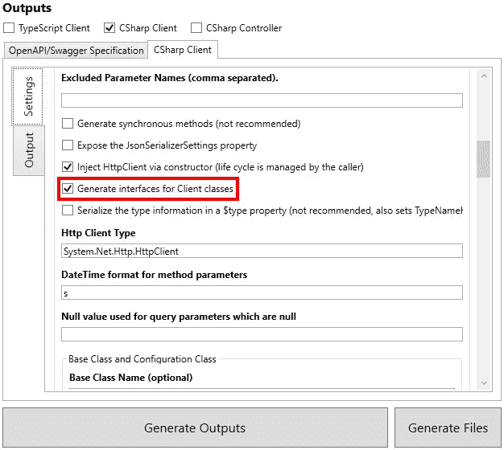

# 在 ASP.NET 核心 3 中使用 HTTP 客户端工厂和 NSwag 生成的类

> 原文：<https://itnext.io/use-http-client-factory-with-nswag-generated-classes-in-asp-net-core-3-c1dd66ee004c?source=collection_archive---------1----------------------->

在上周的帖子中，[使用 NSwag 为 ASP.NET 核心 3](https://elanderson.net/2019/11/using-nswag-to-generate-c-client-classes-for-asp-net-core-3/) 生成 C#客户端类，我们留下了一个可用的客户端，但我们错过了使用 ASP.NET 核心提供的一些功能，如 [HTTP 客户端工厂](https://docs.microsoft.com/en-us/aspnet/core/fundamentals/http-requests?view=aspnetcore-3.0)和利用[依赖注入](https://docs.microsoft.com/en-us/aspnet/core/fundamentals/dependency-injection)。

## 对 NSwag 客户端生成的更改

这篇文章仅仅指出了帮助利用上述 ASP.NET 核心特性所需的区别，并不是使用 NSwag 的完整演练。如果你需要这篇文章内容的参考，请确保阅读上周的文章。

上周的文章中需要做的一个改变是检查**为客户端类**生成接口。



通过以上检查，可以重新生成客户端类，并更新消费应用程序中的文件。

## 使用 HTTP 客户端工厂和依赖注入

在消费应用程序中，我们需要在 **Startup** 类的 **ConfigureServices** 函数中添加以下内容，以便专门为我们的 Contacts API 添加一个 HTTP 客户端，并通过依赖注入系统使其可用。

```
services.AddHttpClient<IContactsClient, ContactsClient>(client => 
           client.BaseAddress = new Uri("https://localhost:5001"));
```

对于生产应用程序，我建议使用配置系统来存储 API 的 URL，而不是像上面那样硬编码。

例如用法，我使用的是**索引模型**。首先，添加一个类级别的字段来保存我们的 API 客户端，并通过构造函数注入客户端。

```
private readonly IContactsClient _contactsClient;

public IndexModel(ILogger<IndexModel> logger, IContactsClient contactsClient)
{
    _logger = logger;
    _contactsClient = contactsClient;
}
```

现在我们有了一个类级别的 contacts 客户端，我们可以使用它从我们的 API 获取数据。以下示例使用客户端从 API 获取所有联系人，并将它们存储在一个变量中。

```
public async Task OnGet()
{
    var contacts = await _contactsClient.GetContactsAsync();
}
```

## 包扎

我强烈推荐使用这种风格的客户端，而不是直接使用 HTTP 客户端。如果您做一些搜索，您会发现管理 HTTP 客户端的生命周期。NET 之前，HTTP 客户端工厂是一个很容易搞砸的东西。

以下发布的内容用作参考:

[使用 NSwag 生成用于 HttpClientFactory 的类型化客户端](https://stu.dev/generating-typed-client-for-httpclientfactory-with-nswag/)
[如何将生成的 HttpClient 添加到 ASP.NET 核心依赖注入](https://github.com/dmitry-pavlov/openapi-connected-service/blob/master/docs/How-to-Add-Generated-HttpClient-to-ASPNETCore-Dependency-Injection.MD)

*原载于* [*埃里克·安德森*](https://elanderson.net/2019/11/use-http-client-factory-with-nswag-generated-classes-in-asp-net-core-3/) *。*