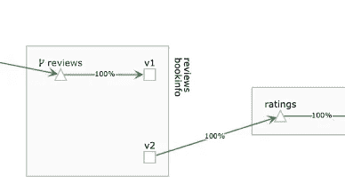
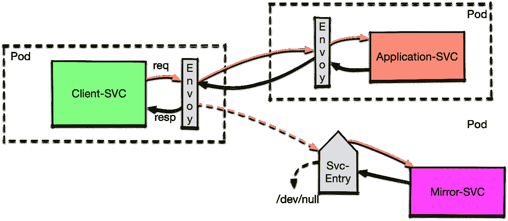

# 使用 Istio 流量镜像加快调试速度

> 原文：<https://itnext.io/use-istio-traffic-mirroring-for-quicker-debugging-a341d95d63f8?source=collection_archive---------3----------------------->

通常，当出现错误时，尤其是在生产环境中，需要调试应用程序来进行修复。不幸的是，造成问题的输入已经消失了。并且文件上的测试数据不会触发错误(否则它在交付之前就会被修复)。

同样地，如果一个人正在创建新的代码，他经常希望看到一个客户端可以提供什么值(老实说，我不止一次使用 WireShark 来查看发送了什么)。

Istio 的流量镜像功能会有所帮助，因为它允许应用程序接收由主版本处理的真实流量。相同的请求被复制，然后发送到镜像服务。不同之处在于，来自镜像服务的回复只是被丢弃(由 sidecar 中的特使代理丢弃)，而不是返回给调用者。您不需要修改镜像版本——Istio 会为您完成所有工作。


具有流量的镜像设置图

# 使用 Istio 规则设置

让我们从 DestinationRule 开始，看看这个设置的规则

```
**apiVersion**: networking.istio.io/v1alpha3
**kind**: DestinationRule
**metadata**:
  **name**: a-server-dr
**spec**:
  **host**: a-service
  **subsets**:
    - **name**: prod
      **labels**:
        **version**: "v0.1"
    - **name**: development
      **labels**:
        **version**: "devel"
```

此 DestinationRule 定义了两个子集。 *Prod* 为生产流量，另一个 *development* 为我们的调试目标。现在，我们可以使用以下 VirtualService 来定义镜像:

```
**apiVersion**: networking.istio.io/v1alpha3
**kind**: VirtualService
**metadata**:
  **name**: a-mirror
**spec**:
  **hosts**:
    - a-service
  **http**:
    - **route**:
        - **destination**:
            **host**: a-service
            **subset**: prod
      **mirror**:
        **host**: a-service
        **subset**: development
```

然后在 spec.http.route.destination 中定义默认目标，在 spec.http.mirror 中定义镜像目标。



Kiali 中的当前显示，其中评论流量将发送到 v1 并镜像到 v2

虽然在 [Kiali](https://www.kiali.io/) 中显示不完全正确，但您可以在上面的截图中看到，review 服务的流量将 100%传输到 v1，同时镜像到 v2(有人称这种镜像功能为“黑暗启动”，这里由一个不可见的连接表示；如果你想了解这个问题，可以看看 https://issues.jboss.org/browse/KIALI-2218 和 Istio 网站上相关的讨论和问题。很可能 Istio 1.2 将会看到遥测报告的变化，以迎合这一点——见[https://github.com/istio/istio/issues/11475](https://github.com/istio/istio/issues/11475)。

# 镜像到外部服务

通常，人们无法在同一个 Istio 集群中运行在线编辑器，而只能坐在笔记本电脑前打开 IDE。在这种情况下，我们有两种选择:

1.  部署一个本地代理，该代理被配置为与 Istio 底板对话，并将流量转发到本地进程。这与上面的场景非常相似
2.  使用一个 *ServiceEntry* 将来自 Istio 的流量转发给被调试的服务

让我们看看第二个选项:



带有 ServiceEntry(蓝色)的场景。

我们将从定义 ServiceEntry 开始:

```
**apiVersion**: networking.istio.io/v1alpha3
**kind**: ServiceEntry
**metadata**:
  **name**: external-a-service
**spec**:
  **hosts**:
  - a-service.ext *# this is an arbitrary string; only used in VS* **location**: MESH_EXTERNAL
  **ports**:
  - **number**: 9080
    **name**: http-ext
    **protocol**: HTTP
  **resolution**: STATIC
  **endpoints**:
  - **address**: 1.2.3.1 *# Change to IP of service under debug* **ports**:
      **http-ext**: 9080
```

spec.hosts 条目是一个任意的条目，您只是稍后在 VirtualService 中需要它。spec.location 表明服务在网格之外。有两种解析目标 IP 地址的可能性。我们选择“静态”并将 IP 放入 spec.entpoinds.address。参考 ServiceEntry 的 [Istio 文档以了解更多细节。现在有了这个条目，我们可以看看虚拟服务:](https://istio.io/docs/reference/config/istio.networking.v1alpha3/#ServiceEntry)

```
**apiVersion**: networking.istio.io/v1alpha3
**kind**: VirtualService
**metadata**:
  **name**: external-service-a
**spec**:
  **hosts**:
    - a-service
  **http**:
  - **route**:
    - **destination**:
        **host**: a-service
        **subset**: prod
      **weight**: 100
    **mirror**:
        **host**: a-service.ext
```

这看起来像上面一样，唯一真正的区别是，对于镜像目标，我们只提供主机，这是我们在上面的 ServiceEntry 中设置的。

在写这篇文章的时候，我还发现[一篇来自克里斯蒂安·波斯塔](https://blog.christianposta.com/microservices/traffic-shadowing-with-istio-reduce-the-risk-of-code-release/)的博客文章，用 Istio 版本 0.5 解释了这一点；这些示例不能 1:1 使用，因为 Istio 路由规则已经更改。