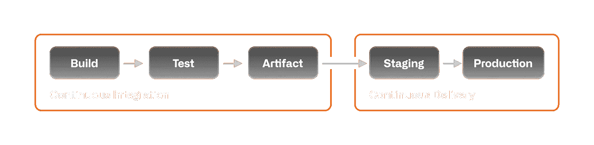
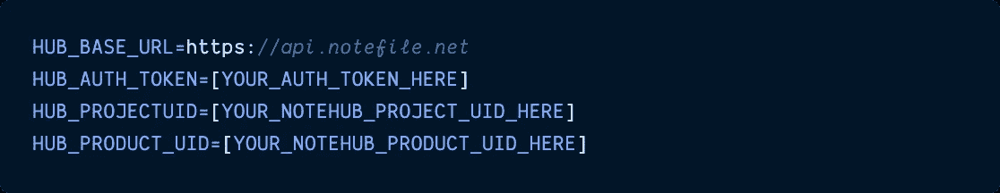
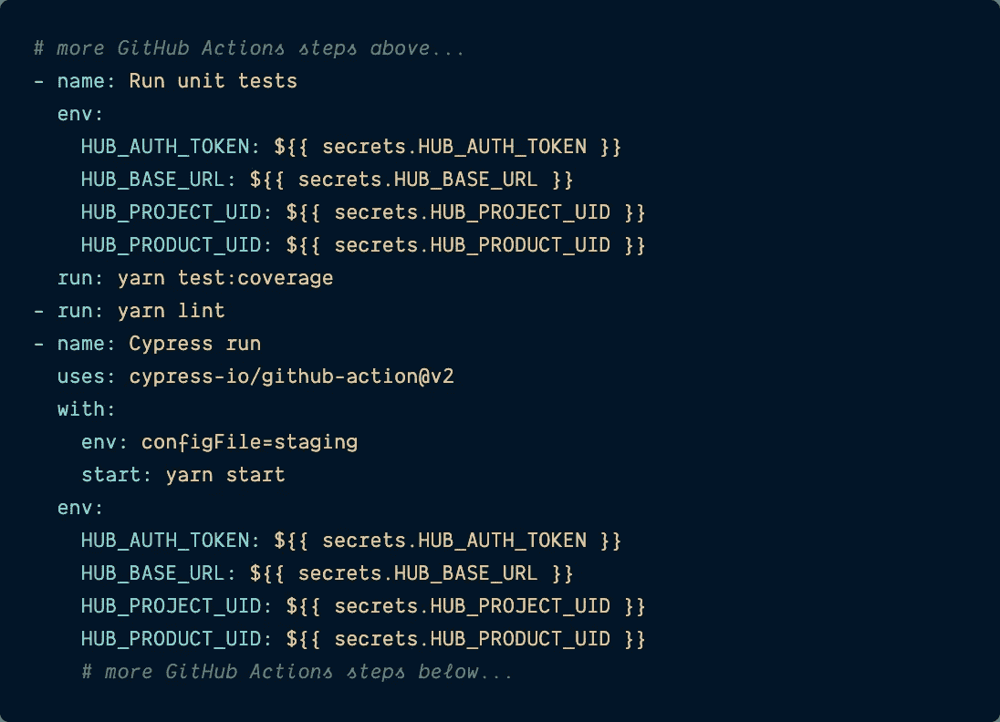
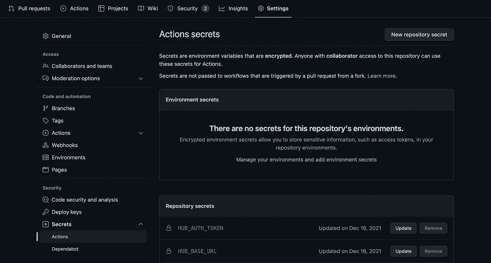
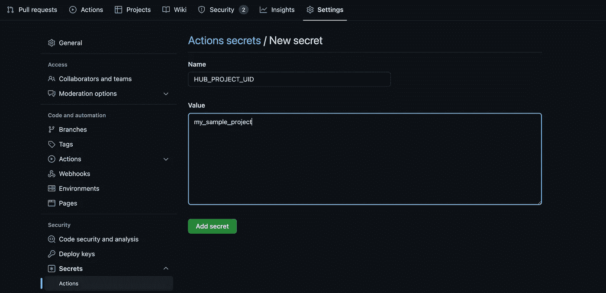
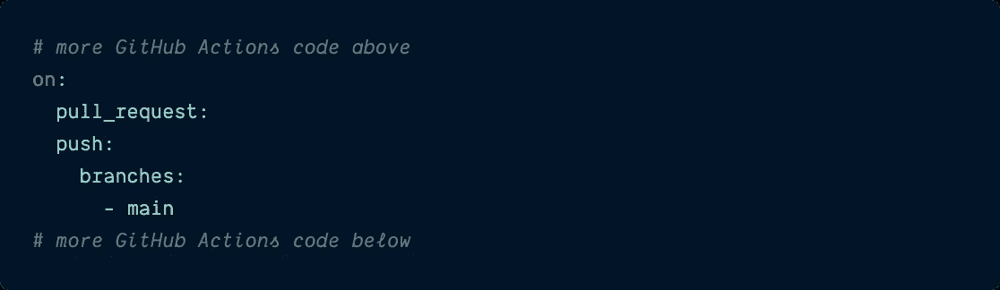
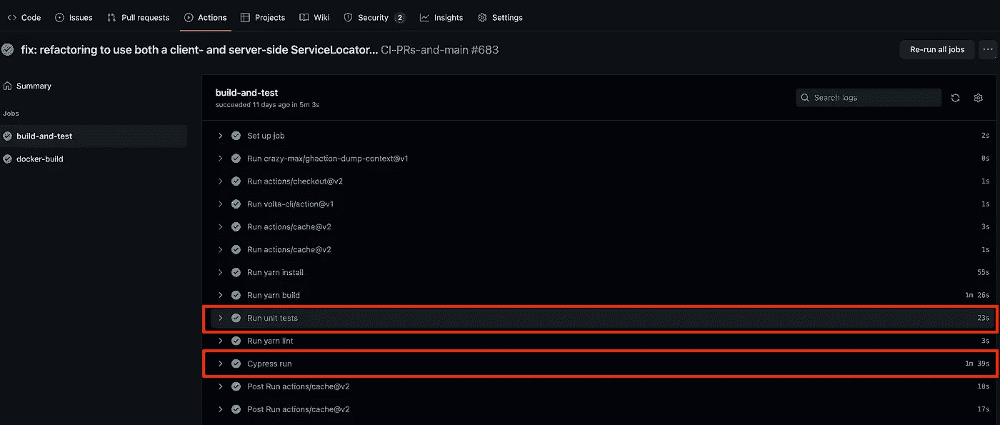

# 在 GitHub 操作中使用秘密环境变量

> 原文：<https://itnext.io/use-secret-environment-variables-in-github-actions-38367139bdaf?source=collection_archive---------2----------------------->

## 为 GitHub Actions CI/CD 工作流设置受保护的环境变量并不困难。


# 介绍

今年早些时候，我和我的开发团队正在构建一个新的开源 [**应用**](https://github.com/blues/sparrow-starter) ，以帮助我们的用户更快地使用我所在的物联网(IoT)公司销售的硬件。

> *我在一家名为*[***Blues Wireless***](https://blues.io/?&utm_source=medium.com&utm_medium=web&utm_campaign=sparrow-accelerator&utm_content=secret-env-vars-github-actions)*的物联网初创公司工作，该公司的使命是通过使用*[*note cards*](https://blues.io/products/notecard/?&utm_source=medium.com&utm_medium=web&utm_campaign=sparrow-accelerator&utm_content=secret-env-vars-github-actions)*——可以嵌入任何物联网项目的预付费蜂窝设备，将传感器数据传输到安全的云:*[*note hub*](https://notehub.io/?&utm_source=medium.com&utm_medium=web&utm_campaign=sparrow-accelerator&utm_content=secret-env-vars-github-actions)*——然后可以将数据转发到任何公共云*

这个想法是，一旦我们的用户设置了他们的新物联网设备，他们就可以使用我们的 starter repo，它已经被设计为接受并在图表和图形中显示某些传感器数据，然后在他们使用新的传感器或数据可视化进一步定制他们的设备时修改代码。

考虑到易于设置和部署，我们使用自包含的 [**Next.js 框架**](https://nextjs.org/) 构建了该应用，在上托管了该应用的演示示例，并使用[**GitHub Actions**](https://github.com/features/actions)来控制自动化 CI/CD 工作流(构建、测试、部署等)。).

我在使用 GitHub Actions 时遇到的一件棘手的事情是，如何添加敏感的环境变量，这些变量在本地用于运行应用程序及其集成和端到端测试，同时仍然保持它们的秘密(并且不受 GitHub 的源代码控制)。

在本文中，我将教您如何将“秘密”环境变量添加到 GitHub Actions 工作流中，这样需要动态、敏感变量的步骤(如自动化测试套件)就可以在 CI/CD 管道中成功运行，就像在本地开发环境中一样。

# 什么是 GitHub Actions？

让我们退后一分钟来讨论 GitHub 动作，以防您还没有使用它们的需求。

早在 2018 年，GitHub 发布了一个名为 [**的新功能，GitHub Actions**](https://resources.github.com/downloads/What-is-GitHub.Actions_.Benefits-and-examples.pdf) ，旨在让开发者能够跨问题、拉请求和其他事件自动化他们的工作流。

2019 年，它还向 GitHub Actions 引入了[完全持续集成/持续部署(CI/CD)](https://github.blog/2019-08-08-github-actions-now-supports-ci-cd/) 。

这些工具使得自动化开发人员如何在任何平台上构建、测试和部署项目变得更加容易，而不需要开发团队中的 devops 专家。与其他 CI/CD 工具相比，GH Actions 的优势之一是，如果一个 repo 已经在 GitHub 中(很可能是这样)，那么设置工作流以自动化的方式处理所有这些类型的任务(以及更多)是非常简单的。

> *如果你曾经使用过另一个 CI/CD 平台，如*[*Jenkins*](https://jenkins.io/)*，*[*circle CI*](https://circleci.com/)*，*[*team city*](https://www.jetbrains.com/teamcity/)*，或者其他一些工具，一旦你开始使用 GitHub Actions，你应该会有类似的感觉。*

下面是一个简单的 CI/CD 管道的示例图。



持续集成图由 [GitHub 资源提供:CI/CD](https://resources.github.com/ci-cd/)

深入 GH Actions 如何工作的所有细节已经超出了这篇博客的范围，但是希望我已经给了你足够好的入门知识来理解我们现在要讨论的内容。

# 在 Repo 中，为 GH 操作设置环境变量

开始为 GH 操作设置环境变量的地方是在 repo 本身内部。

## 确定要在 GitHub 中复制的本地环境变量

在我们特定的 [**回购**](https://github.com/blues/sparrow-starter) 中，我们有四个动态环境变量是 app(及其测试套件)需要运行的:`HUB_BASE_URL`、`HUB_AUTH_TOKEN`、`HUB_PROJECT_UID`和`HUB_PRODUCT_UID`，

所有这些变量都与在 [Notehub](https://notehub.io/?&utm_source=medium.com&utm_medium=web&utm_campaign=sparrow-accelerator&utm_content=secret-env-vars-github-actions) 中发现的独特项目值相关，Notehub 是一种云应用，物联网传感器数据通过 Notecard 交付。

*   `HUB_BASE_URL`是到达 Notehub API 获取数据的 URL。
*   `HUB_AUTH_TOKEN`是访问 Notehub 中的数据所需的授权令牌。
*   `HUB_PROJECT_UID`是发送传感器数据的 Notehub 中的项目 ID。
*   `HUB_PRODUCT_UID`是传感器设备的唯一 ID——因为一个项目可以有许多设备向其发送数据。

> *虽然并非所有这些环境变量都是“绝密”的，但因为只有四个，所以在回购中把它们组合在一起更有意义，而不是把它们分成位于代码库中不同位置的“公共”和“私有”变量。*

由于这是一个 Next.js 应用程序，我们在本地存储这些不应该签入源代码控制(即 GitHub)的敏感变量的方式是通过使用 [**。**](https://nextjs.org/docs/basic-features/environment-variables) `[**env**](https://nextjs.org/docs/basic-features/environment-variables)` [**文件**](https://nextjs.org/docs/basic-features/environment-variables) 。

对于应用程序，以下示例代码控制 Next.js 在本地启动时读取的环境变量。

`**.env.local**`



然后使用`process.env`语法在应用程序内部访问这些变量。例如，要获得应用程序运行代码中的`HUB_PROJECT_UID`值，只需在 JavaScript 文件中需要的地方编写`process.env.HUB_PROJECT_UID`即可。

好了，我们已经确定了我们的环境变量是动态的，也不应该签入 GitHub，让 GitHub Actions 知道它在运行 CI 工作流时也需要查找它们。

## 将环境变量添加到 GitHub 操作 YAML 文件中

为了让 GitHub 知道它有一个 GitHub 动作工作流要为一个 repo 运行，在 repo 的根目录下应该存在以下文件夹:`.github/workflows/`。

其中将包含一个 YAML 文件:我们的文件被命名为`[CI-PRs-and-main.yml](https://github.com/blues/sparrow-reference-web-app/blob/main/.github/workflows/CI-PRs-and-main.yml)`，但是你可以给它起任何你认为有意义的名字。

在 YAML 文件中，将列出各种步骤，对于需要这些秘密的步骤，我们将添加所需的环境变量，如下所示:

> ***注意:*** *如果你想在它的 repo 中看到完整的 GitHub Actions 文件，你可以点击下面的文件标题。*

`[**CI-PRs-and-main.yml**](https://github.com/blues/sparrow-reference-web-app/blob/main/.github/workflows/CI-PRs-and-main.yml)`



如果您注意到这个 YAML 文件中有两个`steps`需要敏感的环境变量:`Run unit tests`和`Cypress run`。

**声明** `**env**` **属性和每个需要的环境变量**

为了告诉 GH Actions 这些自定义环境变量应该存在，我们在需要这些变量的步骤中声明了`[**env**](https://docs.github.com/en/actions/learn-github-actions/environment-variables)` [**属性**](https://docs.github.com/en/actions/learn-github-actions/environment-variables) 。

然后缩进并列出每个需要的秘密变量(以及回购如何读取它们)。例如，由于我们的 repo 在本地读取秘密变量`HUB_AUTH_TOKEN`，因此用相同的名称命名在 GitHub 操作工作流中读取的`env`属性是有意义的。

```
env:
    HUB_AUTH_TOKEN:
```

**设置** `**${{ secrets.MY_SECRET }}**` **值**

在列出 GitHub 动作的环境变量名之后，使用语法`${{ secrets.NAME_OF_SECRET_IN_GITHUB }}`为存储在 GitHub 动作中的同名值赋值。

我将在下一节讨论如何远程设置这个值。

# 在 GitHub Repo 中设置那些敏感的环境变量

现在我们准备在 GitHub 中设置秘密变量。

## 访问回购的“设置”选项卡

在 GitHub 中找到需要变量的 repo，点击**设置**选项卡。

在**设置**中，向下进入侧边栏的**秘密**下拉菜单，点击它进入**行动**页面。该页面应该类似于下图。



在我的 **Actions Secrets** 页面中，已经存在一些存储库机密——这是我们将添加到 GH Actions 工作流中运行的内容。点击屏幕右上角的**新存储库密码**按钮。

## 设置新的环境机密

将出现一个新屏幕，向存储库添加新的机密。这里是 GitHub 操作 YAML 中定义的环境变量名将被复制和它们的值被定义的地方。

使用上面的示例变量，我们将在`Name`输入中定义一个名为`HUB_PROJECT_UID`的新变量作为秘密的名称，然后将实际项目的值(在本例中是在 Notehub 中定义的)添加到`Value`文本区域中。

> *这对应于 YAML 文件中的* `*${{ secrets.HUB_PROJECT_UID }}*` *值。*



再次检查密码名称和值是否正确后，点击**添加密码**按钮。一旦秘密被保存，它在 GitHub 中被加密，你将很难看到它的原始值是多少。

> ***注:*** *如果您确实意识到以后某个秘密不正确或需要更新，不必担心，可以通过单击主* ***动作秘密*** *页面上秘密名称旁边的* ***更新*** *按钮来更新秘密值。*
> 
> *你仍然看不到秘密的旧值是多少，但是有一条前进的道路来做出改变。*

太好了！GitHub Actions 文件知道为工作流的某些步骤注入什么环境变量，这些环境变量和它们的值已经在 repo 的 settings 选项卡中定义了，现在是时候进行测试了。

## 运行您的 GitHub 操作工作流，并观察它的通过

对于我们的 repo，GitHub Actions 工作流被设计为每当用户将代码推送到 pull 请求或`main`分支时运行，如下定义:

`[**CI-PRs-and-main.yml**](https://github.com/blues/sparrow-reference-web-app/blob/main/.github/workflows/CI-PRs-and-main.yml)`



如果您已经有一个失败的工作流，只需转到 repo 的**操作**选项卡，单击失败的工作流，然后单击主工作流屏幕上的**重新运行所有作业**按钮。

如果没有，请执行触发新工作流运行所需的任何操作。

无论哪种方式，当秘密环境变量集被成功读出时，这是您应该看到的最终结果。



请注意，在图中列出的工作流过程中的所有步骤中，需要敏感环境变量的两个步骤`Run Unit Tests`和`Cypress run`都成功通过了。

在这个过程中没有敏感信息或秘密泄露。

# 结论

随着几年前 GitHub Actions 的引入，GitHub 显著降低了开发团队利用持续集成/持续部署管道所带来的好处所需的复杂性和专业知识。不过，有一件事一直是个问题，那就是如何处理环境变量，这些变量由于其敏感的性质，应该对通用代码库保密——这正是应用程序(和自动化测试套件)运行所需要的那种保密。

GitHub 想出了一个办法来处理这个问题:在回购协议的设置中设置秘密，一旦设置好就加密。GitHub 可以简单地存储变量，并使用`${{ secrets.MY_SECRET_HERE }}`语法在任何必要的工作流程步骤中访问这些变量，而不是通过使用`.gitignore` JSON 文件、构建管道库或其他不直观、难以管理的系统来确保秘密的安全。好多了！

过几周再来看看——我会写更多关于 JavaScript、React、IoT 或其他与 web 开发相关的东西。

如果你想确保你不会错过我写的一篇文章，在这里注册我的时事通讯:[https://paigeniedringhaus.substack.com](https://paigeniedringhaus.substack.com)

感谢阅读。我希望这有助于您构建自己的需要敏感环境变量的 GitHub Actions 工作流:CI/CD 是当今构建高质量软件的最佳方式，GitHub 正在让每个人越来越容易实现这一点。

# 参考资料和更多资源

*   [GitHub 动作](https://resources.github.com/downloads/What-is-GitHub.Actions_.Benefits-and-examples.pdf)
*   [GitHub 的 CI/CD 资源](https://resources.github.com/ci-cd/)
*   完整 [GitHub 项目回购](https://github.com/blues/sparrow-starter)
*   蓝调无线[网站](https://blues.io/?&utm_source=medium.com&utm_medium=web&utm_campaign=sparrow-accelerator&utm_content=secret-env-vars-github-actions)
*   [Notehub](https://notehub.io/?&utm_source=medium.com&utm_medium=web&utm_campaign=sparrow-accelerator&utm_content=secret-env-vars-github-actions) 云