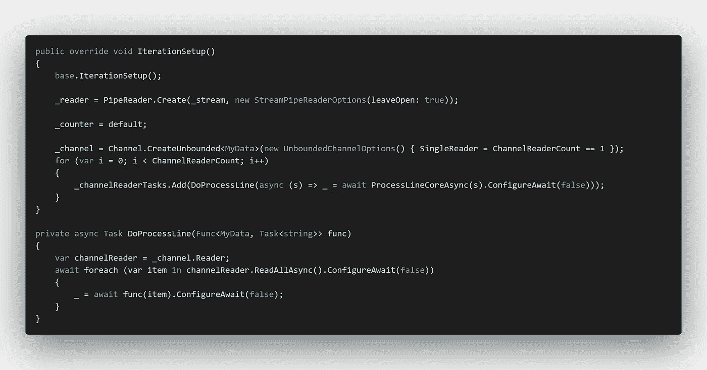
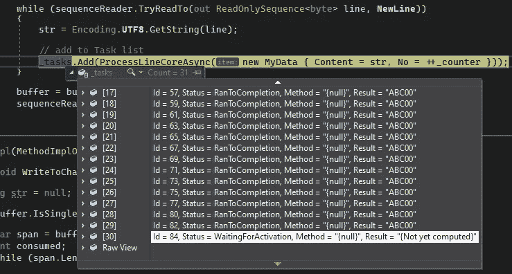
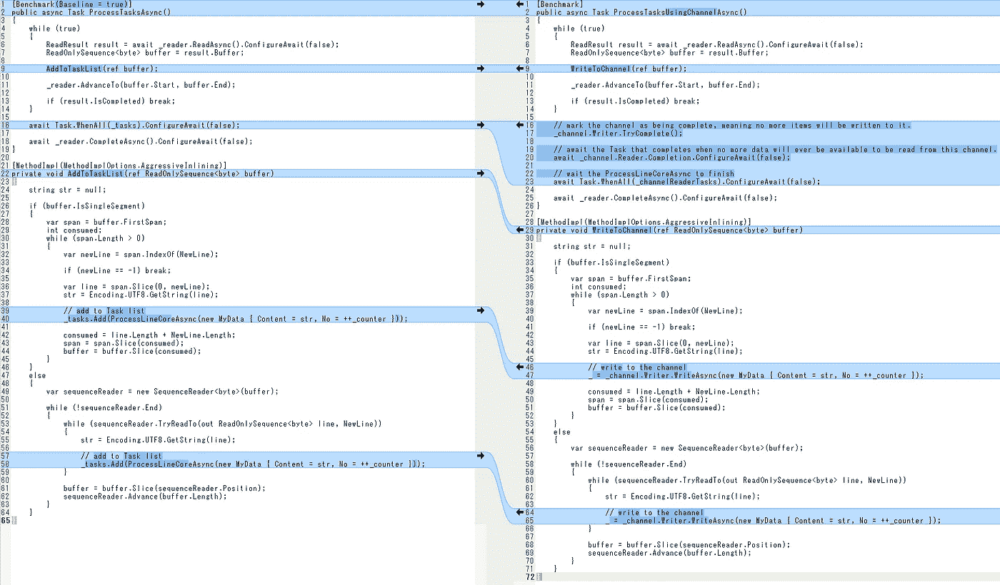
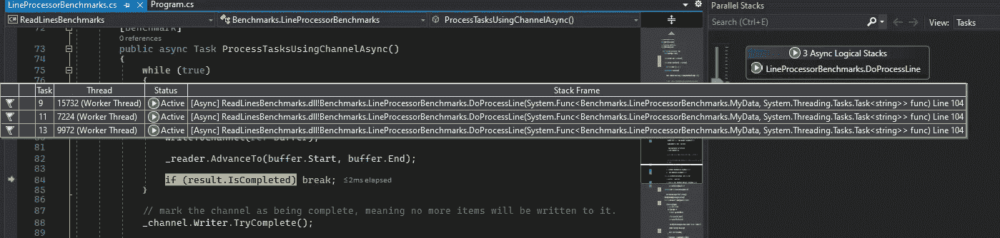
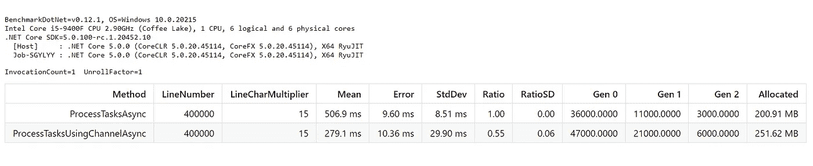

# 使用系统。管道和系统。线程化。引导 API 提高性能

> 原文：<https://itnext.io/use-system-io-pipelines-and-system-threading-channels-apis-to-boost-performance-832d7ab7c719?source=collection_archive---------0----------------------->

## 如何使用系统。管道和系统。线程化。引导 API 加速处理

这篇文章是我之前系列文章的延续: [**评估“ReadLine 使用系统”。IO.Pipelines“性能在 C#**](https://medium.com/@joni2nja/evaluating-readline-using-system-io-pipelines-performance-in-c-part-2-b9d22c95254b) 。

当我写那些帖子时，我需要处理一个巨大的文本文件(几十万行)，逐行读取、解析和转换，然后最终将它们保存为文本文件。是的，这将导致大量文件被创建！

我能够使用前一篇文章中描述的`System.IO.Pipelines`API 来加快读取时间。结果呢？处理时间快了 10 分钟！🚀

我本可以就此打住。但我没有。我回忆了一下街区里新来的小孩:`System.Threading.Channels`。参见 Stephen Toub 的精彩帖子[“系统介绍。Threading.Channels"](https://devblogs.microsoft.com/dotnet/an-introduction-to-system-threading-channels/) 了解更多信息。

 [## 系统介绍。线程.通道|。网络博客

### “生产者/消费者”问题无处不在，在我们生活的方方面面。一个线厨师在快餐店，切片…

devblogs.microsoft.com](https://devblogs.microsoft.com/dotnet/an-introduction-to-system-threading-channels/) 

把逐行读取想象成*生产者*，把行处理部分想象成*消费者*。这个想法是，使用`System.IO.Pipelines`尽可能快地生产并消耗它——并发地分散工作负载，*异步地*，而不像`BlockingCollection`那样阻塞。

> BlockingCollection 涉及阻塞；没有基于任务的 API 来异步执行工作。通道是关于异步的；没有同步阻塞的 API。

好了，说够了。给我看看代码！

# 基本实现

让我们从基础实现开始(即在使用`System.Threading.Channels`API 之前)；代码只是简单地将每个行处理方法添加到列表`Task`和列表`await`中。

*请注意，本文中的代码会因基准测试的目的而稍作调整；尽可能地删除不相关的部分。*

我们可以看到，随着我们处理该行，任务列表不断增长。

任务列表

# 频道撰稿人(制片人)

这是制片人的部分。

为了帮助快速发现变化，下面是不同之处:

基础实施与渠道实施

应该很容易发现不同之处。

# 频道阅读器(消费者)

最后是消费者部分。

这里我定义了 3 个通道阅读器，并将`SingleReader`设置为`false`(通过评估`ChannelReaderCount == 1`)。这样，我们将有 3 个消费者同时处理生产线。

这可以从 Visual Studio 并行堆栈窗口中观察到。

并行堆栈窗口

调整该值并进行测量，直到获得最佳性能。从小处开始，增加数值，直到你到达一个会给你带来较慢结果的点；这是你有太多活动`Task`资源的地方，可能有太多的上下文切换。

# 基准结果

好，让我们看看基准测试的结果。

**哇。几乎快了两倍！**🚀🚀🚀

以下是要点版本:

这是基准测试的结果。我的案子怎么办？嗯，我又节省了 10 分钟，所以总共快了大约 20 分钟！

# 源代码

你可以在我的 [GitHub 库](https://github.com/jo-ninja/ReadLinesBenchmarks)，分支: *pipelines-and-channels 中找到源代码。*

# 结论

如果您有包含成千上万行要处理的大型文本文件，可以考虑使用`System.IO.Pipelines`来读取和解析这些行，并将其与`System.Threading.Channels`API 结合起来，以并发、异步地分散工作负载。