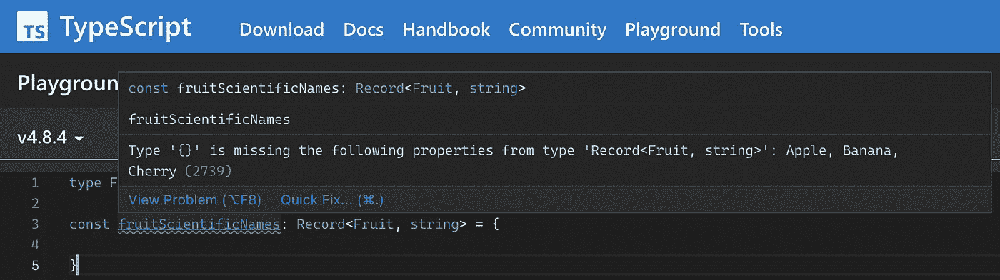
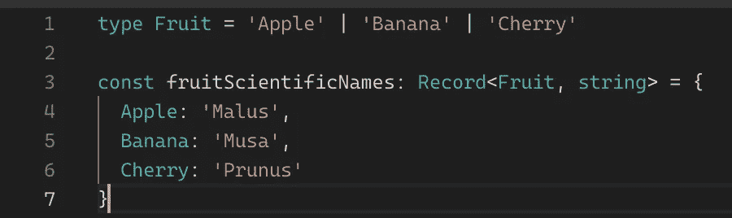
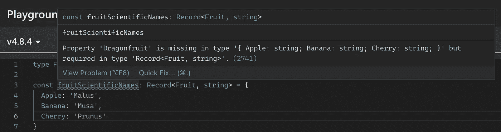
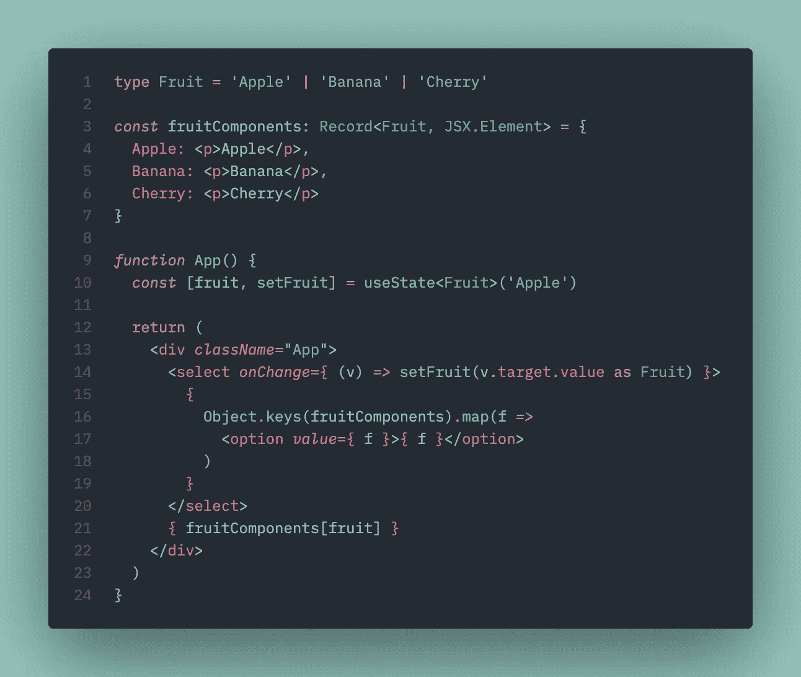
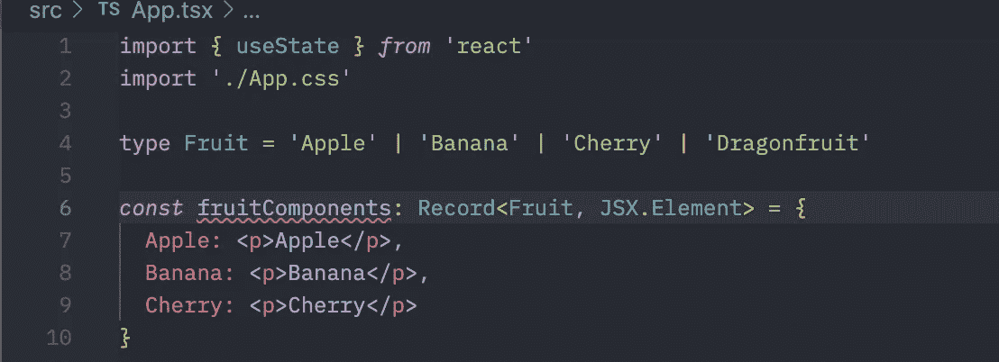

# 使用 TypeScript 记录类型以获得更好的代码

> 原文：<https://itnext.io/use-typescript-record-types-for-better-code-ce1768c6cb53?source=collection_archive---------0----------------------->

TypeScript `Record`是 TypeScript 中我最喜欢的实用程序类型之一，但我发现它不太受重视。

当充分利用它的潜力时，无论您是在后端还是前端使用 TypeScript，它都可以帮助团队编写更好、更少出错、更易维护的代码(尤其是当您同时在后端和前端使用 TypeScript 时！);我向你保证，你会在 5 分钟之内写出更好的代码。

[该实用程序类型的文档非常少](https://www.typescriptlang.org/docs/handbook/utility-types.html#recordkeys-type):

> 构造一个对象类型，其属性键为`Keys`，属性值为`Type`。该实用工具可用于将一种类型的属性映射到另一种类型。

而且并没有暴露出`Record`型的真正 ***超能力*** :强制执行穷尽式办案。

让我们通过一个简单的 React 示例来看看如何使用这个特性编写更好的代码。

# 了解记录类型

如果我们这样定义一个类型:

```
type Fruit = 'Apple' | 'Banana' | 'Cherry'
```

然后使用该类型作为`Record`的键:

```
const fruitScientificNames: **Record<Fruit, string>** = {}
```

我们会注意到 TypeScript 立即给我们一个警告:



TypeScript 希望记录中包含 union Fruit 中定义的每个值的条目。

为了解决这个问题，我们需要在`Record`中为每个`Fruit`添加一个条目:



现在我们的错误被清除了。

如果我们在`Fruit`中添加另一个条目:

```
type Fruit = 'Apple' | 'Banana' | 'Cherry' **|** '**Dragonfruit'**const fruitScientificNames: Record<Fruit, string> = {
  Apple: 'Malus',
  Banana: 'Musa',
  Cherry: 'Prunus'
}
```

我们再次得到一个错误，因为我们没有为“Dragonfruit”添加一个条目:



TypeScript 将要求我们在记录中添加一个 Dragonfruit 条目。

这本身就很有趣，但是我们如何利用`Record`类型的这一特性来编写更好、更易维护的代码呢？

# 对记录类型做更多事情

需要理解的另一件事是，我们并不局限于`Record`中的字符串；我们可以像函数一样保存值槽中的任何内容:

```
const fruitWriter: Record<Fruit, **() => void**> = {
  Apple: () => console.log('Apple'),
  Banana: () => console.log('Banana'),
  Cherry: () => console.log('Cherry')
}// Now we can invoke like this:
fruitWriter['Apple']()
```

`Record`现在将一个`Fruit`映射到一个没有参数也不返回值的函数。

但是我们不限于简单的函数，我们当然可以指定参数:

```
// Function to lowercase an input string.
**const lowerFn = (text: string) => text.toLocaleLowerCase()**const lowercaseFruitWriter: Record<
  Fruit,
  ( **fn: (text: string) => string** ) => void
> = {
  Apple: (**fn**) => console.log(**fn**('Apple')),
  Banana: (**fn**) => console.log(**fn**('Banana')),
  Cherry: (**fn**) => console.log(**fn**('Cherry'))
}// Prints 'apple'
lowercaseFruitWriter['Apple'](**lowerFn**)
```

和返回类型:

```
const lowerFn = (text: string) => text.toLocaleLowerCase()const lowercaseFruitWriter: Record<
  Fruit,
  ( fn: (text: string) => string ) => **string**
> = {
  Apple: (fn) => fn('Apple'),
  Banana: (fn) => fn('Banana'),
  Cherry: (fn) => fn('Cherry')
}**console.log**(lowercaseFruitWriter['Apple'](lowerFn))
```

有了它，我们现在可以做更多有趣的事情，比如构建和返回 React 组件，定义一系列验证器函数，或者执行一些特定于水果的操作。

# 不易出错的代码

在许多情况下，当构建 UI 或后端逻辑时，会出现代码必须基于鉴别器值执行某些操作的情况。

通常，这将通过`switch-case`或`if-elseif-else`来完成。

```
function fruitPrinter(fruit: Fruit) {
  switch (fruit) {
    case 'Apple':
      console.log('apple')
      break
    case 'Banana':
      console.log('banana')
      break
    default:
      console.log('')
  }
}
```

除了更加冗长之外，**这里真正的问题是，如果我们给** `Fruit` **添加另一个值，我们将不会被通知我们需要更新代码的所有位置，以处理这个新情况**。相反， ***在运行时*** ，代码会落入`default`块，呈现给用户一些不希望的行为。

如果每次添加新的`Fruit`时，编译器都会通知我们代码中所有需要更新的地方，这不是很好吗？

***有了*** `Record` ***，我们就能在编译时找到这些漏洞，写出更安全的代码。***

我们可以在 React 中利用这一点，而不是使用`switch-case`或`if-else`进行条件渲染:



这是一个非常简单的例子，说明我们如何使用记录来确保我们总是有水果的成分。注意我们**不需要**的东西:if-else 或 switch-case！


我们简单的应用程序和组件

但是真正的优势在于添加“Dragonfruit”会导致开发/构建时出错:



我们的记录缺少一个“火龙果”条目

即使是中等规模的代码库，这也会在正确处理新案例方面产生巨大的差异，因为引入新的选项会立即提醒我们必须在代码库中添加该选项的处理。

> `Record`式的真 ***超能力*** :强制执行穷尽式办案

考虑到我们的选项不是水果，而是`IdentityProvider` s 或`DatabaseType` s 或`ApiEndpoint` s。使用`Record`，我们可以很容易地确保无论何时添加新选项，前端和后端都可以在开发/构建时而不是运行时正确地处理新情况。

由于 TypeScript 执行了详尽的案例处理，我们不仅使应用程序更容易维护，我们还将代码流从*程序性的*转移到*结构性的*；换句话说， ***我们用结构来支配流程的控制*** *。*

如果你想看如何使用`Record`类型创建`Factory`设计模式的例子，可以看看我的另一篇文章: [**面向对象编程的结构化控制流**](https://medium.com/codex/structural-control-flow-with-object-oriented-programming-part-2-7d18526146de) **:**

```
// The Record holds a constructor; how cool is that?
const shippingStrategies: Record<
  ShippingMethod, {
  **new(weight: number, hasLiquid: boolean): ShippingStrategy**
}> = {
  USPS: UspsShippingStrategy,
  UPS: UpsShippingStrategy,
  FedEx: FedExShippingStrategy,
  DHL: DhlShippingStrategy
}
```

我希望这篇关于 TypeScript 的`Record`类型的短文能帮助您理解如何利用其隐藏的超强能力来编写更好、更易维护的代码！使用 TypeScript 的前端和后端团队都可以利用这个简单的构造来显著提高可维护性和正确性，同时还简化了代码，几乎没有额外的负担！

如果你喜欢这篇文章，可以看看我写的其他文章，给我一个关注，并在*Twitter**[***@ chrlschn***](https://twitter.com/chrlschn)**或**[***LinkedIn***](https://www.linkedin.com/in/charlescchen/)***。*** 同时查看我当前的项目[***turas . app***](https://turas.app)。***