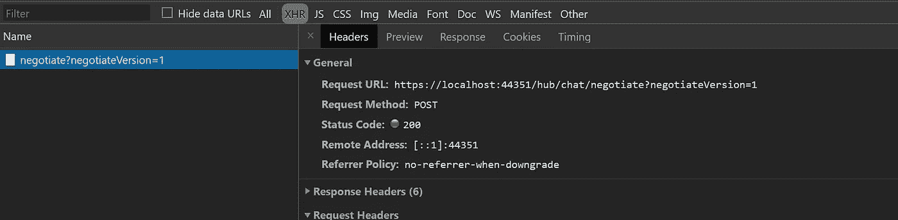
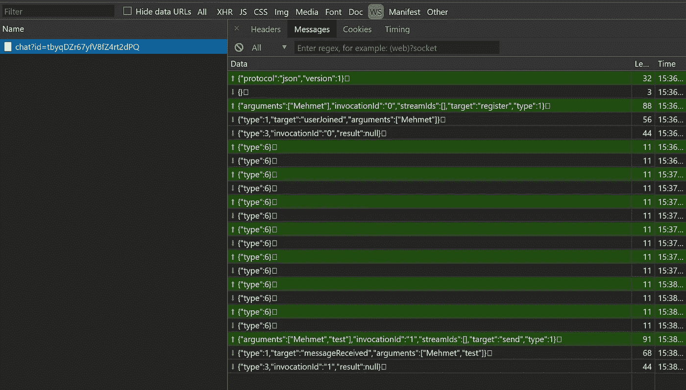
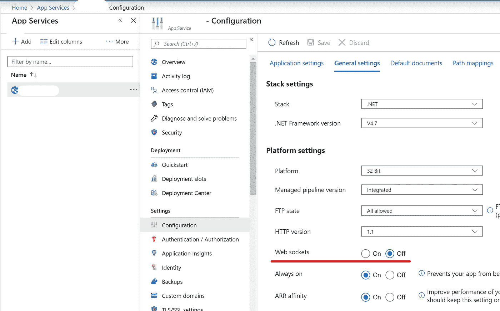

# 使用 WebSocket on。带信号的网芯和角形

> 原文：<https://itnext.io/use-websocket-on-net-core-angular-with-signalr-340ad5076e64?source=collection_archive---------0----------------------->

我们先来解释一下什么是 web socket 和 SignalR:

根据 Mozilla 的说法:

> [**web socket API**是一项先进的技术，可以在用户浏览器和服务器之间开启双向互动通信会话。](https://developer.mozilla.org/en-US/docs/Web/API/WebSockets_API)

而 **SignalR** 是一个用于消费 WebSocket in 的包装器。Net 应用程序。它真的让你的工作更容易通用。

通常，客户端向服务器发送请求并等待响应。但是如果您在服务器上的工作需要很长时间，您可能会得到一个超时异常。第一个解决方案是不时地轮询服务器来检查你的工作进度。这看起来是可以接受的，但是如果成千上万的用户每秒都在轮询你的服务器，你的服务器将开始膨胀，如果你使用云，你将在月底收到一份不错的账单。

说够了，让我们编码。

我将解释一个聊天应用程序的工作(作为一个传统)。因为需求非常明显，而且每个人都知道聊天应用程序是如何工作的:)

首先，使用 CLI 或 Visual Studio 创建一个带有 angular 模板的. Net 核心应用程序。

```
dotnet new angular --name websocket-demo
```

# 第一步:准备。网络核心

在`startup.cs`中，在方法`ConfigureServices`中添加以下代码

然后，用`Configure`的方法，把这几行:

`KeepAliveInterval`保存发送 ping 消息以保持连接活动的时间值。

请注意`Line:14`我们用 URL 注册我们的中心。

你可以把 **Hubs** 想象成 SignalR 中 WebSocket 的控制器。我们将创建一个名为`ChatHub`的中心，并将相关动作放入该文件中。

在`ChatHub.cs`中，你会看到三个异步方法。当 WebSocket 客户端调度名为的操作时，将调用这些操作。

`Clients` object 允许您访问所有连接的客户端并分派新的操作。

**—依赖注入**

为了能够从控制器或作业向客户机发送数据，您需要访问 hub 上下文。可以用`IHubContext<>`代替。

# **步骤 2:准备角度**

首先，使用 npm 安装`@microsoft/signalr`

```
npm install @microsoft/signalr
```

然后导航到您想要实现 web socket 的组件。在`ngOnInit`中，准备如下连接。

在`.withUrl`方法中，传递想要连接的集线器的路径。(注册时我们在 Startup.cs 中指定了那个路径。).

`this.connetion.on`方法允许我们订阅 WebSocket 事件，并用我们的代码处理有效负载。

现在我们已经配置了我们的客户端，但是还没有开始连接。要开始连接，请使用

```
this.connection.start();
```

你可以像`this.connection.start().then()`一样在`start`之后连锁事件。

启动连接后，您应该会看到一个对服务器进行协商的 HTTP 调用



然后，它应该升级到 web 套接字的连接。之后，在 ChromeDevTools 的 **WS** 标签中，你应该会看到 WebSocket 与有效负载的连接



# **第三步:发布**

**—服务器**

为了能够在生产环境中使用 WebSocket，您应该在服务器中启用 WebSocket 协议。按照以下说明在服务器上启用 WebSocket 协议:

1.  打开**服务器管理器**。
2.  在**管理**菜单下，点击**添加角色和功能**。
3.  选择**基于角色或基于功能的安装**，然后点击**下一步**。
4.  选择合适的服务器(默认选择您的本地服务器)，然后点击**下一步**。
5.  在**角色**树中展开 **Web 服务器(IIS)** ，然后展开 **Web 服务器**，再展开**应用开发**。
6.  选择 **WebSocket 协议**，然后点击**下一步**。
7.  如果不需要其他功能，点击下一个的**。**
8.  点击**安装**。
9.  安装完成后，点击**关闭**退出向导。

*来源:*[*https://docs . Microsoft . com/en-us/IIS/get-started/whats-new-in-IIS-8/IIS-80-web socket-protocol-support #分步说明*](https://docs.microsoft.com/en-us/iis/get-started/whats-new-in-iis-8/iis-80-websocket-protocol-support#step-by-step-instructions)

**—天蓝色**

浏览 Azure 控制台并打开您的应用程序仪表板。

转到**配置**部分。

切换到**通用设置**选项卡并启用 WebSockets



这就是实现 web 套接字所要做的全部工作。净核心和角使用信号。

然而，如果你认为你与客户端和服务器保持连接，如果你有这么多的用户，也许使用网络推送更好。你可以查看我的 [**其他**](/push-notification-with-angular-net-core-a2280d18eda1?source=friends_link&sk=c03f898f59ccb9562507d55d6f560f6c) 文章使用 Web Push 使用 FCM。