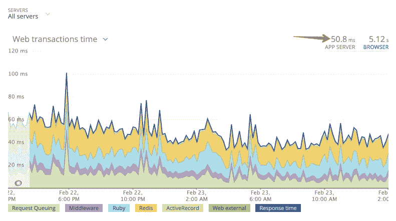
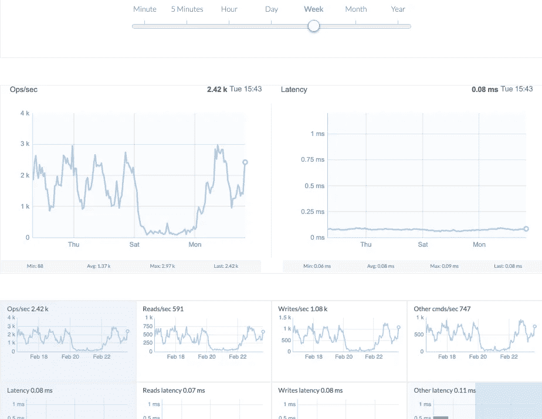
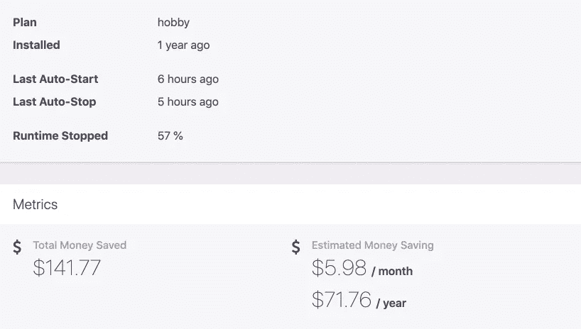
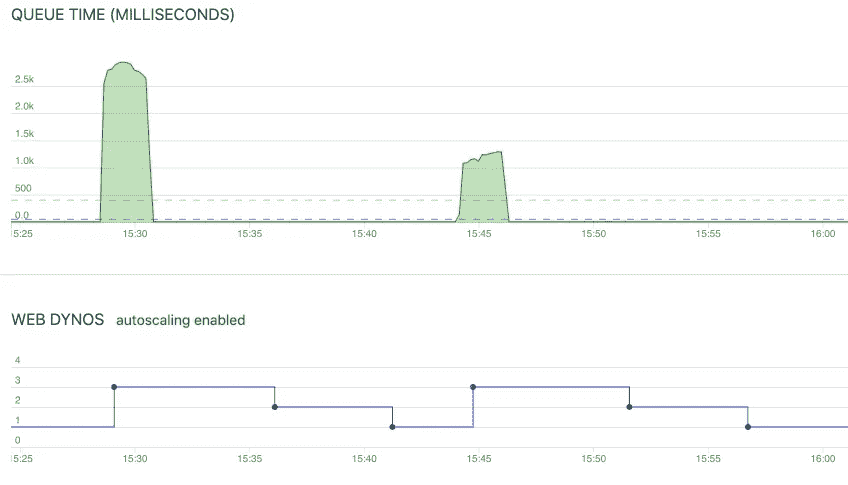

# 对 Ruby on Rails 项目有用的 Heroku 附加组件

> 原文：<https://itnext.io/useful-heroku-add-ons-for-ruby-on-rails-project-82fa6da5af3a?source=collection_archive---------4----------------------->

在 Heroku 和 Ruby on Rails 项目上工作了 8 年之后，我有了自己最喜欢的一套 Heroku 插件，可以很好地与 Rails 应用程序配合使用。您将了解到在 Ruby 开发人员的日常生活中非常有用的附加组件。


# Heroku 附件

这是我在 Heroku Marketplace 上最喜欢的 Heroku 插件列表，以及我为什么选择它们作为我在 Heroku 上托管的 Ruby on Rails 项目。

# Heroku 调度程序

Heroku Scheduler 可以每 10 分钟、每小时或每天运行计划任务。我用它来运行我预定的 rake 任务。例如，我每天运行一个 rake 任务，将过去 24 小时内注册的用户汇总发送到我的邮箱。

Heroku Scheduler 附加软件是免费的。唯一的限制是它的选项比 Unix 系统中的 cron 少。如果您需要每周一运行一个 rake 任务，那么您需要在 Heroku Scheduler 中将 rake 任务设置为每日任务，并在 rake 任务本身中检查一天，以便在需要时跳过它。

```
*# lib/tasks/schedule/notify_users_about_past_due_subscription.rake*
namespace :schedule **do**
  desc 'Send notification about past due subscriptions to users'
  task notify_users_about_past_due_subscription: :environment **do**
    **if** Time.**current**.**monday?**
      Billing**::**NotifyUsersAboutPastDueSubscriptionWorker.**perform_async**
    **else**
      Rails.**logger**.**info**("Skip schedule:notify_users_about_past_due_subscription task.")
    **end**
  **end**
**end**
```

# 新遗迹 APM

[New Relic](https://elements.heroku.com/addons/newrelic) add-on 做应用性能监控。这是我最喜欢的附件之一。它允许跟踪每个进程，如 puma/unicorn/sidekiq per dyno 及其性能。您可以看到哪些 Rails 控制器动作花费的时间最多。您可以看到吞吐量最高的 API 端点和耗时的端点。New Relic 多次帮助我调试我的应用程序中的瓶颈，多亏了它，我才能以平均 50 毫秒的响应时间制作[背包专业版 API](https://knapsackpro.com/?utm_source=docs_knapsackpro&utm_medium=blog_post&utm_campaign=best-heroku-add-ons-for-ruby-on-rails-project) 。谁说 Rails 应用一定要慢？:)



# 滚动条

Rollbar 允许在前端的 Ruby 代码和 JS 代码中进行异常跟踪。它有一个慷慨的免费计划，每月 5000 例外限制。

您可以很容易地忽略一些常见的 Rails 异常，以保持在自由计划限制内。

```
*# config/initializers/rollbar.rb*
Rollbar.**configure** **do** **|**config**|**
  config.**access_token** **=** ENV['ROLLBAR_ACCESS_TOKEN']

  **if** Rails.**env**.**test?** **||** Rails.**env**.**development?**
    config.**enabled** **=** **false**
  **end**

  *# Add exception class names to the exception_level_filters hash to*
  *# change the level that exception is reported at. Note that if an exception*
  *# has already been reported and logged the level will need to be changed*
  *# via the rollbar interface.*
  *# Valid levels: 'critical', 'error', 'warning', 'info', 'debug', 'ignore'*
  *# 'ignore' will cause the exception to not be reported at all.*
  config.**exception_level_filters**.**merge!**('ActionController::RoutingError' **=>** 'ignore')
  config.**exception_level_filters**.**merge!**('ActionController::InvalidAuthenticityToken' **=>** 'ignore')
  config.**exception_level_filters**.**merge!**('ActionController::BadRequest' **=>** 'ignore')
  config.**exception_level_filters**.**merge!**('ActiveRecord::RecordNotFound' **=>** 'ignore')
  config.**exception_level_filters**.**merge!**('Rack::Timeout::RequestTimeoutException' **=>** 'ignore')
  config.**exception_level_filters**.**merge!**('Rack::QueryParser::InvalidParameterError' **=>** 'ignore')
  config.**exception_level_filters**.**merge!**('ActionDispatch::Http::MimeNegotiation::InvalidType' **=>** 'ignore')

  config.**environment** **=** ENV['ROLLBAR_ENV'].**presence** **||** Rails.**env**
**end**
```

# 日志条目

[Logentries](https://elements.heroku.com/addons/logentries) —从 Heroku 标准输出中收集您的日志，以便您稍后可以浏览它们。如果您需要在日志中查找几天前发生的某个问题的信息，那么日志条目可能会有所帮助。

当然，您可以使用 [Heroku 命令行界面](https://devcenter.heroku.com/articles/heroku-cli)并在终端中运行`heroku logs -n 10000 --app my-heroku-app`命令来浏览最后 10，000 行的日志，但是这种方法有局限性。您不能在过去的日志中做那么多，也不能像在日志条目中那样容易地过滤日志。

在免费计划中，Logentries 有 5 GB 和 7 天的保留期。这对于小的 Rails 应用来说已经足够了。

我喜欢 Logentries 的一个很好的特性是保存查询的选项，稍后可以通过它快速浏览日志。您还可以显示基于日志的图表。也许您想知道 Sidekiq 中某个特定工人被调用的频率？你可以想象它。

# 雷迪斯云

如果你在 Ruby on Rails 应用中使用 Redis，那么 [Redis Cloud](https://elements.heroku.com/addons/rediscloud) 就是你的插件。它有一个免费计划，付费计划比其他附加服务更实惠。

Redis Cloud add-on 可以自动备份您的数据，并提供一个漂亮的 web UI 来预览实时 Redis 使用情况和数据库实例的历史使用情况。



我喜欢在我的 Rails 应用中使用 Redis Cloud + sidekiq gem。此外，如果您需要在内存中快速缓存一些数据，并在一段时间后使其过期，Redis 非常有用。

```
redis_connection **=** Redis.**new**(
  *# use REDISCLOUD_URL when app is running on Heroku,*
  *# or fallback to local Redis (useful for development)*
  url: ENV.**fetch**('REDISCLOUD_URL', 'redis://localhost:6379/0'),
  *# tune network timeouts to be a little more lenient when you are seeing occasional timeout*
  *# errors for Heroku Redis Cloud addon*
  *#* [*https://github.com/mperham/sidekiq/wiki/Using-Redis#life-in-the-cloud*](https://github.com/mperham/sidekiq/wiki/Using-Redis#life-in-the-cloud)
  timeout: 5
)

redis_connection.**setex**('my-key-name', 1.**hour**, 'this value will expire in 1 hour')
```

# Twilio SendGrid

SendGrid 是一个免费的插件，允许你从 Ruby on Rails 上发送电子邮件。你甚至可以把你的域名连接到它，这样你的用户就可以从你的域名收到电子邮件。

免费计划中每月有 12000 封免费邮件。

# Heroku 附件为您节省时间和金钱

这里有几个我最喜欢的附加组件，可以帮助你在项目中节省金钱和时间。

# 自动拨号

[AutoIdle](https://elements.heroku.com/addons/autoidle) 通过自动将你的 staging 和 review 应用程序置于 Heroku 睡眠状态，让你省钱。当应用程序没有流量时，我用它来关闭我的 web 和 staging 应用程序的 worker dyno。晚上和周末不用再为 Heroku 资源付费了。；)



# Rails 自动缩放

Rails Autoscale 是一个强大的插件，可以帮助你在 Heroku 上省钱。它将测量请求排队时间，并在此基础上为您的 web 进程添加或删除 dynos。如果你在白天有较高的流量，它会增加更多的动力。在夜间交通流量较低时，它会删除 dynos。



Rails Autoscale 还可以跟踪您的工作队列。例如，如果您在 Sidekiq 中安排了很多作业，那么 Rails Autoscale 会添加更多的 worker dynos 来更快地处理您的作业队列。当没有工作要处理时，它甚至可以关闭 worker dyno，这可以为您节省更多的钱。

# 背包专业版

[backpack Pro](https://elements.heroku.com/addons/knapsack-pro)是一个 Heroku 插件和 ruby gem，可以在 RSpec、Cucumber、Minitest 等中运行 Rails 测试，并自动在任何 CI 服务器上的并行机器之间分割测试。它与 Heroku CI、CircleCI、Buildkite、Travis CI 等配合使用。通过使用队列模式对测试进行[动态分割，以确保所有并行任务在相似的时间完成工作，这将帮助您节省时间。这样，您可以优化 CI 构建运行并节省最多时间。](https://docs.knapsackpro.com/2020/how-to-speed-up-ruby-and-javascript-tests-with-ci-parallelisation)

下面您可以看到一个测试最佳分布的示例，其中每台并行 CI 机器执行 10 分钟的测试，因此整个 CI 构建只持续 10 分钟，而不是在单个 CI 服务器上运行测试时的 40 分钟。


我一直在开发[背包 Pro 插件](https://elements.heroku.com/addons/knapsack-pro)，如果你尝试一下，我很乐意听到你的反馈。


*原载于 2021 年 2 月 25 日 https://docs.knapsackpro.com**[*。*](https://docs.knapsackpro.com/2021/best-heroku-add-ons-for-ruby-on-rails-project)*