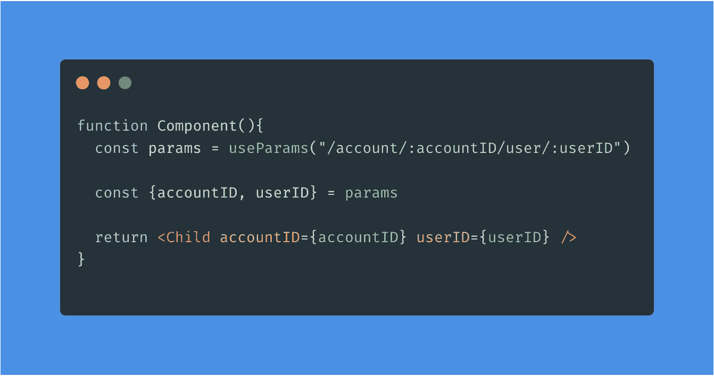

# useParams —在一行中从 URL 提取参数。

> 原文：<https://itnext.io/useparams-extract-parameters-from-the-url-in-one-line-e6d46bc170f1?source=collection_archive---------0----------------------->

问题很简单:您需要从浏览器的 URL 中提取一些参数。例如，用户的`id`。

这个问题有几种可能的解决方法。我要展示的这个允许你写:

下面是挂钩`useParams`可能采用的一种形式:

注意钩子`[useRouter](https://www.npmjs.com/package/use-react-router)`的用法。有了它，你就可以得到路线的属性。这里我们需要的是`location.pathname`，它是构成浏览器*的 URL 的路径名。*

在第 8 行和第 9 行，我们提取我们需要的参数，给`[matchPath](https://reacttraining.com/react-router/web/api/matchPath)`路径名和我们想要比较的模式— `(.*)?/account/:accountID/user/:userID`。

添加的`(.*)?`允许你从类似`/any-thing/you-want/here/account/:accountID/user/:userID`的 URL 中提取相同的参数。

变量`pattern`可以取`[path-to-regexp@^1.7.0](https://github.com/pillarjs/path-to-regexp/tree/v1.7.0)`理解的任何值。

如果浏览器的 URL 匹配示例的模式，我们将得到一个类似于`{match:{userID: '123456, accountID: 'ABC'}}`的对象。

通过返回键`match`的值，我们实现了我们的目标。

# 最终注释

挂钩`[useRouter](https://www.npmjs.com/package/use-react-router)`取决于您是否安装了版本 5.0.0 或更新版本的`[react-router](https://github.com/ReactTraining/react-router/blob/master/packages/react-router)`或`[react-router-dom](https://github.com/ReactTraining/react-router/blob/master/packages/react-router-dom)`。

参考[链接](https://reacttraining.com/react-router/web/guides/quick-start)以获得关于这些包的安装的更多细节。