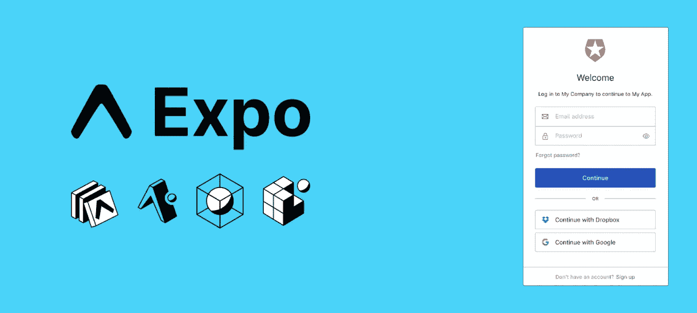
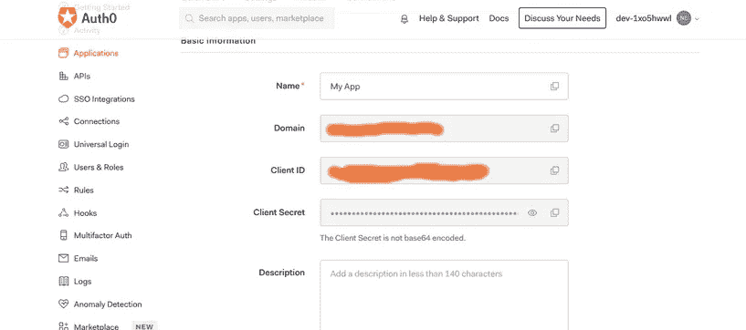

# 使用 Expo cli 进行用户认证

> 原文：<https://itnext.io/user-authentication-with-expo-cli-6ac853c272d4?source=collection_archive---------0----------------------->

## 如何将 Auth0 用于

## 使用 expo cli 和 Auth0 管理用户认证的指南。

Expo+Auth0 封面

## 介绍

在项目期间，很早就决定应用程序将使用 [Auth0](https://auth0.com/) 作为它的身份验证提供者。NextJS 被选择用于桌面应用和 Expo cli，以便快速引导两个 React 本地应用。

Expo 为开始开发项目的移动部分提供了一个快速简单的方法。当需要实现身份验证时，所有教程都与 React native 相关。你可以在这里阅读关于 [auth0 文档。这里的问题是博览会不完全像反应本地。](https://auth0.com/docs/quickstart/native/react-native/00-login)

NB: *我发现写作很难，谢天谢地我能在*[*jasper . ai*](https://jasper.ai?source=partner&fpr=thewebuiguy)*的帮助下写这篇文章，如果有人感兴趣，我有有限的* [*10，000 免费积分*](https://jasper.ai?source=partner&fpr=thewebuiguy) *邀请。*

## 为什么是世博会

Expo 是我们项目的理想选择，因为它使我们能够快速引导和部署 React 本机应用程序，而不必担心任何底层的本机 iOS 或 Android 代码。此外，由于我们的移动应用程序不需要广泛访问设备的功能，这使得 Expo 成为我们特定用例的完美解决方案。

## 为什么 Auth0

从这个项目开始，需要两件事。

1.  通过谷歌的社会认证。
2.  通过组织对用户进行分组。

Auth0 提供了一套开箱即用的综合工具，使设置变得轻而易举。我们所要做的就是从他们的一个例子中复制并粘贴桌面应用程序的大部分代码。然而，在移动应用程序上认证用户被证明更具挑战性。

## 让用户登录

一旦创建了 Auth0 项目，就需要将一些库与 Expo 集成，以便创建一个成功的基于 web 的认证流。主库是 [Expo-Auth-Session](https://docs.expo.dev/versions/latest/sdk/auth-session/) ，这使得过程更加简单。为了进行演示，这里有一个 Login.js 设置的示例。

在这个文件中，我们首先设置我们的 Auth0 凭据。您可以从 Auth0 中的应用仪表板获取这些信息。

[SmashingMagazing.png](https://cloud.netlifyusercontent.com/assets/344dbf88-fdf9-42bb-adb4-46f01eedd629/19c2d3c4-1084-4d4d-a349-4b764c150e50/8-authenticating-react-apps-auth0.png)

完成之后，您需要使用 Auth 会话库创建一个重定向 URI。这将为当前平台和环境创建一个 URL，通常使用 app.config.js 或 app.json 的 scheme 属性。

要使用它，需要有效的 AuthRequestConfig。这个钩子使用的主要方法是 promptAsync 方法。调用时，这将打开一个 web 浏览器视图，加载 Auth0 通用登录。

一旦完成 promptAsync，将从 useAuthRequest 挂钩填充响应值。这包含用户数据，应用程序可以存储这些数据以与受保护的功能进行交互。

## 如何注销

如果这是一个普通的 React Native 应用程序，您可以使用 [React Native Auth0](https://github.com/auth0/react-native-auth0) 库为您完成这项工作。不幸的是，世博会并不是这样的。在下面的代码示例中，您将看到如何使用 Expo-Auth-Session 和 Expo-Web-Browser 实现注销过程。

注销过程与登录非常相似。主要区别是

*   Auth0 的目标 url
*   使用 expo-web 浏览器打开窗口

我们需要使用 [Expo-Web-Browser](https://docs.expo.dev/versions/latest/sdk/webbrowser/) 打开一个新窗口，然后使用户的令牌无效。成功完成该过程后，用户应该被注销。

如果你喜欢这篇文章，并需要我使用的工具的帮助，你可以在这里注册[jasper . ai](https://jasper.ai?source=partner&fpr=thewebuiguy)并获得 10，000 免费积分，开始你的写作之旅。