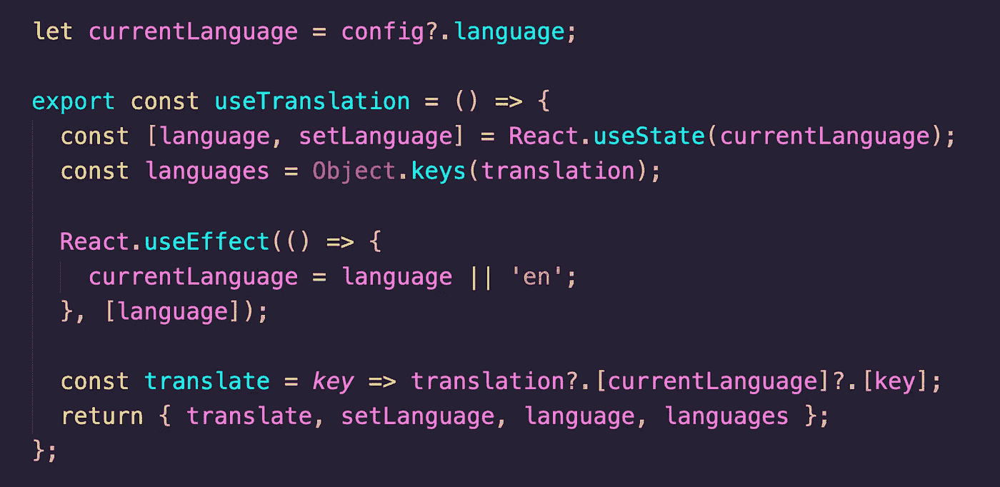

# 使用翻译反应挂钩

> 原文：<https://itnext.io/usetranslation-react-hook-6abcd96a80ee?source=collection_archive---------5----------------------->



这是一个列表字典的基本钩子。它可以用于其他目的，在这个例子中，我们用它来翻译。

## 1.定义字典

```
const dictionary = {
  **en**: { login: 'Login', register: 'Register' },
  **nl**: { login: 'Inloggen', register: 'Registreren' },
  **fr**: { login: 'Se connecter', register: 'Enregistrer' }
};
```

## 2.使用 useState 创建自定义挂钩

```
import translation from './dictionary';let currentLanguage = 'en';export const **useTranslation** = () => {
  const [language, setLanguage] = React.useState(currentLanguage);
  const languages = Object.keys(translation);React.useEffect(() => {
    currentLanguage = language || 'en';
  }, [language]);const translate = key => translation?.[language]?.[key];
  return { **translate**, **setLanguage**, **language**, **languages** };
};
```

我们使用了 **useEffect** 来保存 setLanguage state 设置的当前语言，只使用了一个 **let** 变量。

## 3.如何使用

```
// get current language - default is **en** for **English**
- **language**// get available dictionary languages
- **languages**// set another language based on available languages
- **setLanguage('nl')**// get dictionary language value based on key
- **translate('login')** will return **Login**
```

我喜欢这种方法的简单性，因为我们使用了基本的 React 钩子:**使用状态**和**使用效果**