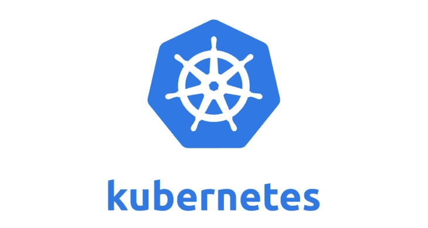
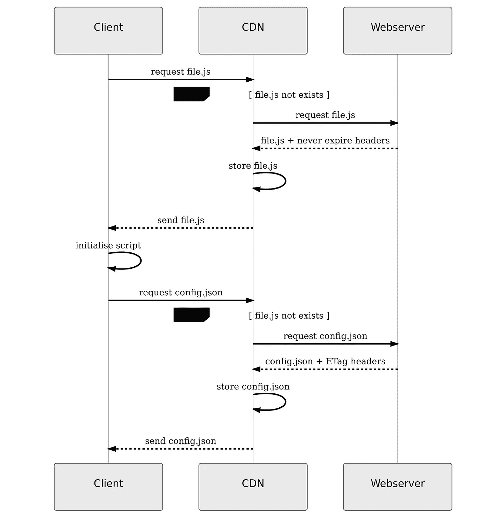

# 为 Kubernetes 服务的静态资产使用 CDN

> 原文：<https://itnext.io/using-a-cdn-for-your-static-assets-served-by-kubernetes-2445e1ff75f?source=collection_archive---------1----------------------->



[Missena](https://missena.com/) 经营并建立对话广告。我们现在已经投入生产几个月了，我们每月处理大约 1 亿个请求。只是一个开始。快速和可扩展是我们产品的精髓。我们使用由服务 REST 和 GraphQL APIs 的 [Elm](https://elm-lang.org/) 前端和 [Go](https://golang.org/) 后端组成的堆栈。

# TL；博士；医生

使用 Kubernetes 服务而不是静态文件(例如 s3 上托管的文件),使我们能够跨环境共享文件，优化我们的构建和部署时间，并在配置发生变化时轻松快速地更新我们的 Kubernetes 应用，而不必经历整个 CI/CD 流程。

# 当今的 Javascript 应用

生成 javascript 应用程序需要时间。这是因为测试的数量，有时是因为代码，也因为环境之间的差异。这涉及到许多转换、编译、精简、优化……许多语言已经被转换成 javascript: Typescript、Elm、reason ml……像 React 这样的库依赖于像 JSX 这样的抽象，它们必须被转换成 JavaScript；诸如 babeljs 这样的编译器库转换代码以优化它并支持旧的浏览器；缩小器、混淆器……每一个转变都需要时间。

# 库伯内特斯

在 Missena，我们经常使用 Docker 和 Kubernetes。它帮助我们轻松扩展我们的服务，并处理我们不同的环境:开发、试运行、生产——你能想到的……我们的 web 服务器和管道基于 Kubernetes 中运行的 docker 映像。我们喜欢这个工作流程。我们甚至为 Kubernetes 的工作重写了一些 AWS lambda 函数，因为简化部署模型对我们来说更简单。我们发现它很容易监控和调试。我们测试和制造容器。完成后，我们将它们部署到适当的环境中。

我们的前端过去有不同的管理工作流程。我们曾经生成一组专用于每个环境的静态文件，并将它们部署到 s3。我们希望在任何地方运行相同的代码，并且不希望我们的测试和部署管道依赖于相关的环境变量。然而，我们需要我们的应用程序根据环境访问不同的端点地址，比如`my.api.dev`或`my.api.com`。

我们一直在努力优化测试和构建时间。为了改进它们，我们必须将配置与代码分开。我的意思是，什么依赖于环境，必须从[代码库](https://www.12factor.net/codebase)中分离出来。请记住:我们希望像管理后端一样管理前端，这样我们就可以共享相同的工作流程。那样的话，我们可以将同样的人工制品部署到不同的环境中，并简单地调整其配置使其工作。

它*仅仅*意味着将[的](https://www.12factor.net/)[规则三](https://www.12factor.net/config)的十二因素应用方法应用到我们的单页面应用程序中，我们将该方法用于我们的后端服务

> *一个应用程序的/config/ is* [*在环境之间变化*](https://www.12factor.net/config) *的一切:登台、生产、开发、测试……下一节解释我们如何解决这个问题。*

# 概念和生产

快速浏览一下我们的堆栈，现在是这样的:

`Client` → `CDN` → `Webserver` → `Static assets`

*   `Client`提出请求，
*   `CDN`让我们能够轻松扩展和加速页面交付，
*   `Webserver`了解我们的缓存策略，
*   `Static assets`是生成的代码。

`Webserver`和`Static assets`都包含在我们的 docker 图像中。我们的配置不是。此外，我们从不更新静态文件，因为我们不想改变基于文件内容的静态资产修订，以便进行长时间缓存。这就是为什么我们在文件名中包含一个内容散列键并重写它们；例如，`missena.js`保存为`missena.d41d8cd98f.js`。

我们的工作解决方案如下所示:



我们使用 AWS Cloudfront 作为 CDN，使用 [nginx](https://www.nginx.com/) 或者更具体地说 [OpenResty](https://openresty.org/en/) ，因为它的 [Lua](https://www.lua.org/) 功能可以作为我们的网络服务器。

在 [Kubernetes](https://kubernetes.io/) 的帮助下管理部署和交付。正如我之前所说的，我们希望我们的静态资产在不同的环境中是相同的。为了管理它，我们用 OpenResty 创建了一个 Lua 脚本，生成一个依赖于环境的`config.json`文件。其内容取决于配置设置。该文件由`/config.json`路由提供服务，相关的缓存算法基于 [ETag](https://en.wikipedia.org/wiki/HTTP_ETag) 。因此，缓存依赖于文件的内容，并集成到 CDN 中。

为了工作，前端使用如下所示的脚本调用配置文件:

```
fetch("/config.json")
  .then(res => res.json())
  .then(config => { /* initialise elm application with config */ })
  .catch(err => { /* do something with error */ });
```

# 结论

在设计这个工作流程时，我们学到了很多东西，也发现了这种工作方式的很多优势。我们已经能够以同样的方式管理我们所有的应用程序；后端和前端，我们已经优化了我们的构建和部署时间。

如果你喜欢讨论或分享你自己的设计，欢迎留下评论或联系我们。

在 [@jney](https://twitter.com/jney) 关注我。

感谢 [Gregory Guillou](https://twitter.com/gregoryguillou) 和 [Cédric Soulas](https://twitter.com/CedricSoulas) 对本文的贡献。