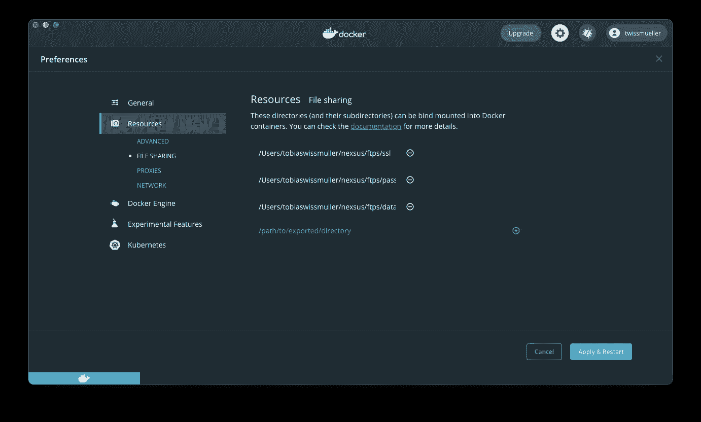
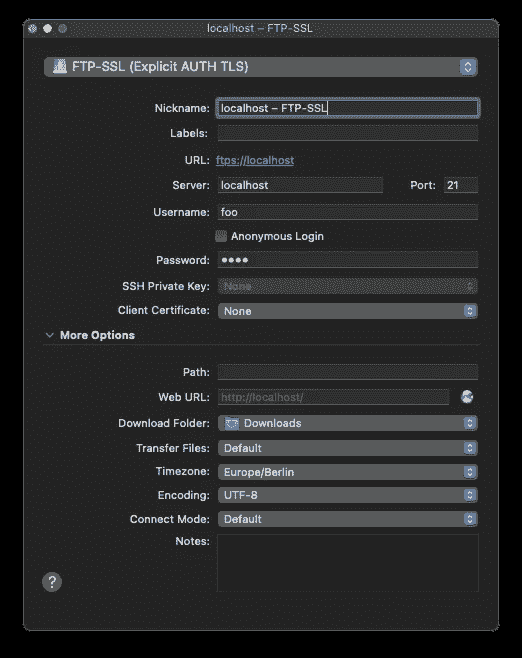
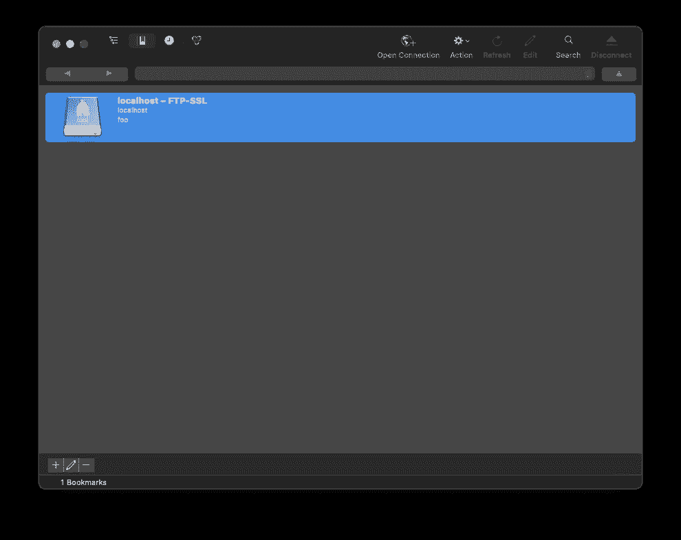
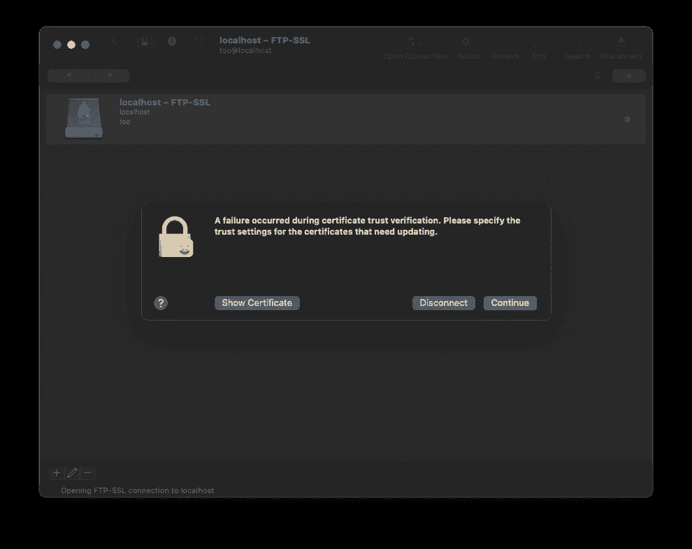
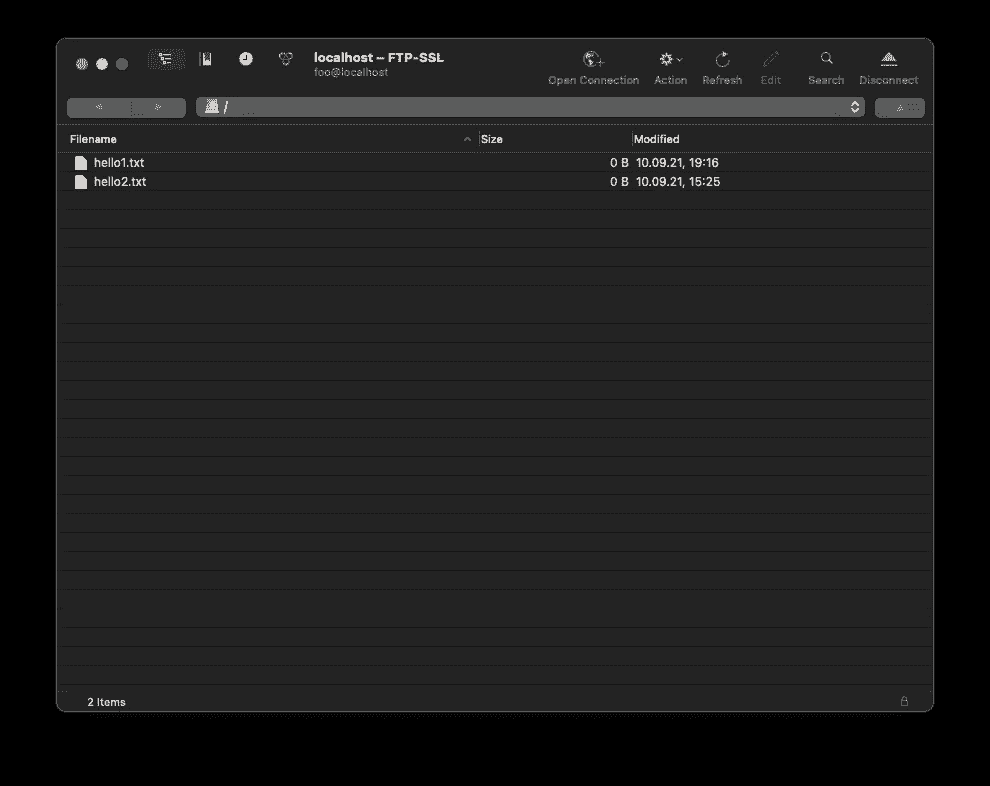
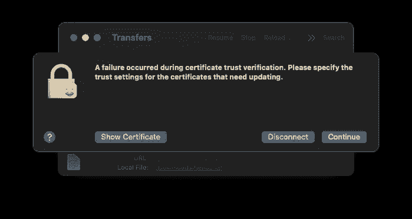
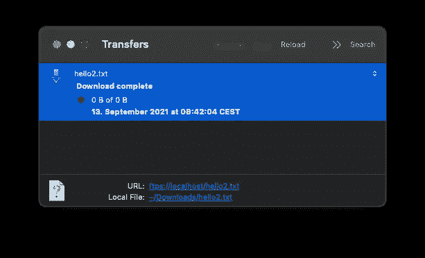

# 使用本地 FTPS 服务器进行测试

> 原文：<https://itnext.io/using-a-local-ftps-server-for-testing-6f2d77873bab?source=collection_archive---------1----------------------->

## 关于如何在本地 Docker 实例上设置 FTPS 服务器的快速教程。


照片由[克里斯蒂娜@ wocintechchat.com](https://unsplash.com/@wocintechchat?utm_source=medium&utm_medium=referral)在 [Unsplash](https://unsplash.com?utm_source=medium&utm_medium=referral) 上拍摄

*   "嘿，等一下，你已经写过这个了，对吗？"

很接近，但不完全是。上次我写过[关于使用 **S** FTP](https://twissmueller.medium.com/using-a-local-sftp-server-for-testing-659daaa0290a) 。这个时间大约是 FPT **S** 。

*   “那么，有什么区别”

简单地说，FTPS 与 FTP 相同，只是多了一个 TLS 层。而 SFTP 是基于 SSH 的独立协议。

本文不再深入解释其中的区别。有很多其他人已经在这方面做得很好了。

让我们开始吧。

需要三个目录:

*   `/Users/youruser/ftps/data`:所有上传和下载文件的数据所在的目录。
*   `/Users/youruser/ftps/passwd`:保存服务器密码文件的目录。
*   `/Users/youruser/ftps/ssl`:所有 TLS 特定文件所在的目录。

最后两个并不是真正需要的，但是当它们被使用时，事情会变得更快。

如果 TLS 证书不存在，将自动创建它们。通过将证书目录映射到主机上的目录，当新的容器实例出现时，不会再次生成证书。

当然，您也可以将自己的证书放在该目录中。

但是要确保 Docker 拥有映射和写入这些目录特权。我使用的是 Mac 版 Docker 桌面，可以在设置中添加目录。



Docker 设置

这次我已经将整个配置放在了一个方便的`docker-compose.yml`:

```
version: '3'

services:
  ftps:
    image: stilliard/pure-ftpd
    container_name: ftps
    ports:
      - "21:21"
      - "30000-30009:30000-30009"
    volumes:
      - "/Users/youruser/ftps/data:/home/foo/"
      - "/Users/youruser/ftps/passwd:/etc/pure-ftpd/passwd"
      - "/Users/youruser/ftps/ssl:/etc/ssl/private/"
    environment:
      PUBLICHOST: "0.0.0.0"
      FTP_USER_NAME: foo
      FTP_USER_PASS: pass
      FTP_USER_HOME: /home/foo
      ADDED_FLAGS: "--tls=2"
      TLS_CN: "localhost"
      TLS_ORG: "YourOrg"
      TLS_C: "DE"
```

像往常一样，我们用`docker-compose up -d`提出这个问题，然后用`docker-compose logs -f`检查日志，看是否一切正常。

为了测试，我使用了 [Cyberduck](https://cyberduck.io) 。

启动 CyberDuck 后，必须创建一个新的连接。



新连接

现在，我们准备好连接了。



准备连接

连接后，会出现一条消息，指出证书信任验证失败。这很好，因为出于测试目的，证书是由我们而不是官方机构生成的。



证书信任验证

在测试之前，我已经在`/Users/youruser/ftps/data`-目录下创建了两个文件，我们现在可以在连接后看到。



连接的

双击就可以下载文件。同样，出现了关于证书信任验证的消息，这很好。



证书信任验证

文件下载完成后，会出现另一条消息来结束这篇文章。



下载完成

感谢阅读。希望有帮助！

如果你喜欢这篇文章，请给我买杯咖啡。

## 资源

*   [docker-pure-ftpd](https://github.com/stilliard/docker-pure-ftpd)
*   [赛博鸭](https://cyberduck.io)