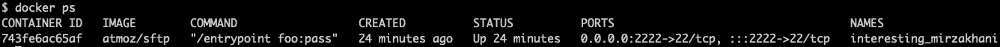

# 使用本地 SFTP 服务器进行测试

> 原文：<https://itnext.io/using-a-local-sftp-server-for-testing-659daaa0290a?source=collection_archive---------1----------------------->

关于如何在本地 Docker 实例上设置 SFTP 服务器的快速教程。


由[维克多·塔拉舒克](https://unsplash.com/@viktortalashuk?utm_source=medium&utm_medium=referral)在 [Unsplash](https://unsplash.com?utm_source=medium&utm_medium=referral) 上拍摄的照片

更新 2021–09–13:如果你正在寻找相同的教程，但不是针对 FTPS，你可以阅读[这篇文章。](https://twissmueller.medium.com/using-a-local-ftps-server-for-testing-6f2d77873bab)

您是否急需一台 SFTP 服务器来测试本地开发人员机器上的某些东西？

什么事？

给你…

## 设置

注意:我是在运行 Docker Desktop 的 Mac 上做的。

首先，需要一个测试文件，它将被上传到 SFTP 服务器上。

*   `/someotherdirectory/hello_sftp.txt`

然后，一个目录被用作 Docker 容器的卷挂载。

*   `/Users/youruser/sftp-in`

最后，我们需要另一个目录来下载之前上传的文件:

*   `/some-download-dir`

是时候提取 Docker 映像并运行它了:

```
$ docker run -v /Users/youruser/sftp-in:/home/foo/upload -p 2222:22 -d atmoz/sftp foo:pass
```



让我们连接到 SFTP 服务器:

```
$ sftp -oPort=2222 foo@localhost
foo@localhost's password:
Connected to localhost.
sftp>
```

现在，一切都在它的位置，我们可以上传一个文件。

## 上传文件到 SFTP 服务器

在`/someotherdirectory/hello_sftp.txt`测试文件在主机上就位后，我们现在可以上传它:

```
sftp> put /someotherdirectory/hello_sftp.txt /upload/hello_sftp.txt
Uploading /someotherdirectory/hello_sftp.txt to /upload/hello_sftp.txt
/someotherdirectory/hello_sftp.txt                                     100%    0     0.0KB/s   00:00
```

大概就是这样。文件已经从你的本地主机上传到 SFTP 服务器，而 SFTP 服务器的上传目录在你的主机上。

我们可以用三种方法来检查它是否有效。

在 SFTP 服务器上:

```
sftp> ls /upload
/upload/hello_sftp.txt
```

在主机上:

```
$ ls /Users/youruser/sftp-in
```

为了好玩，从 Docker 容器内部，首先打开一个外壳:

```
docker exec -ti 743fe6ac65af /bin/bash
```

从那里，我们列出文件:

```
root@743fe6ac65af:/# ls /home/foo/upload/
hello_sftp.txt
```

## 从 SFTP 服务器下载文件

当然，我们也可以反过来从 SFTP 服务器下载文件。

让我们检索之前上传的文件，并将其保存在另一个目录中。

```
sftp> get /upload/hello_sftp.txt /some-download-dir/hello_again.txt
Fetching /upload/hello_sftp.txt to /some-download-dir/hello_again.txt
```

我们可以在我们的主机上使用以下命令检查这一点:

```
$ ls /some-download-dir/
```

感谢阅读。希望有帮助！

如果你喜欢这篇文章，请给我买杯咖啡。

## 资源

*   [Docker Hub 上的 atmoz/sftp](https://hub.docker.com/r/atmoz/sftp)