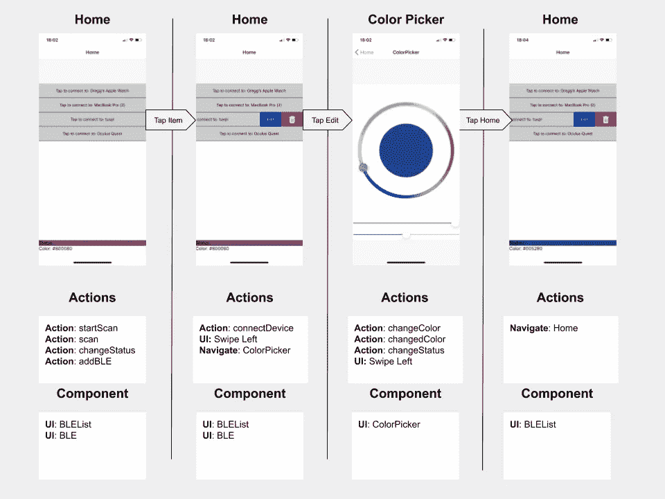

# 在 React 本地应用中使用 Redux 进行蓝牙通信

> 原文：<https://itnext.io/using-a-raspberry-pi-to-control-leds-part-iii-react-native-app-29ee3f4afb8c?source=collection_archive---------1----------------------->

本文重点介绍如何在 React Native 中构建一个移动应用程序，该应用程序将与支持蓝牙的控制器通信，重点是连接到可以改变 led 灯条颜色和亮度的 BLE 设备。本文重点介绍如何设置 Redux Store，使用 thunks 控制蓝牙设备管理器，以及控制应用程序的 UI 组件。我不打算集中讨论创建新的 React 本机应用程序、安装特定组件或设置特定设备的一步一步的过程，我提供的每个链接都涵盖了这些内容。您将学习如何通过蓝牙扫描、连接、发现、监听和发送命令到您的设备。为了演示这一点，我主要使用颜色选择器向蓝牙设备发送颜色。如果你对我在构建这个时使用的设备感兴趣，我有一篇关于使用树莓 Pi 作为 BLE LED 控制器的文章，它将与这个应用一起工作。

# **如何与 React Native 蓝牙**

在 react 原生应用中获得蓝牙的最简单方法是使用 Polidea 提供的库。因为它需要本机代码，所以我选择使用 react 本机 CLI 来构建 React 本机应用程序。该过程的第一步是创建一个应用程序，并将其加载到您的手机上。在这个过程中，有两个主要步骤，首先是根据您使用的是 iOS 还是 Android 来遵循“入门”步骤。它们概述如下:

[](https://facebook.github.io/react-native/docs/getting-started) [## 开始反应原生

### 该页面将帮助您安装和构建您的第一个 React 本机应用程序。如果您已经安装了 React Native，您…

facebook.github.io](https://facebook.github.io/react-native/docs/getting-started) 

第二步是让应用程序在您的设备上运行。为了测试该应用程序，你必须有一个实际的设备来连接，因为 iOS 和 Android 的模拟器已经禁用了蓝牙支持。虽然它比使用 Expo 启动更复杂，但是一旦您让它工作起来，开发和调试它就很容易了。

[](https://facebook.github.io/react-native/docs/running-on-device) [## 在设备上运行 React Native

### 在发布给用户之前，在实际设备上测试你的应用总是一个好主意。这份文件将…

facebook.github.io](https://facebook.github.io/react-native/docs/running-on-device) 

完成初始安装并在设备上运行应用程序后，下一步是设置 React 原生蓝牙低能耗库。这是对存储库中每个设备的详细描述:

[](https://github.com/Polidea/react-native-ble-plx#configuration--installation) [## Polidea/react-native-ble-plx

### 这是 React 原生蓝牙低能耗库，使用了引擎盖下的 RxBluetoothKit 和 RxAndroidBle。它支持…

github.com](https://github.com/Polidea/react-native-ble-plx#configuration--installation) 

现在，您可以开始安装应用程序的其余组件了。这个应用程序使用以下组件: [Redux](https://redux.js.org/) 用于状态管理和组件之间的通信， [Redux Thunk](https://github.com/reduxjs/redux-thunk) 用于控制蓝牙管理器和设备并与之交互，[本机 Base](https://nativebase.io/) 用于 UI 元素， [React 本机滑动列表视图](https://github.com/jemise111/react-native-swipe-list-view)用于显示 BLE 设备列表， [React 导航](https://reactnavigation.org/)用于管理我的应用程序屏幕， [React 本机颜色选择器](https://github.com/instea/react-native-color-picker)用于选择 led 的颜色。

基本流程是，在启动时，应用程序将开始扫描手机附近所有可连接的蓝牙设备，并创建一个列表供您选择。一旦您选择了您的设备，应用程序将尝试连接它，一旦成功，它将加载一个颜色选择器供您选择颜色。当你选择了一种颜色，应用程序将发送请求到你的 BLE 设备，这将改变你的 LED 灯条的颜色。



我使用 React 导航来控制应用程序的流程。在此基础上，我做了一些流程决策，比如在我的 thunks 中控制导航，但这需要将导航集成到 redux 中，由于不推荐，我选择通过带有滑动列表视图的 UI 来控制这些更改。具体来说，当设备成功侦听时，我希望导航到颜色选择器，但是将导航调度功能添加到我的操作中需要使用 [react 本机导航助手](https://github.com/react-navigation/redux-helpers)将导航添加到 redux 中，然而，对于这样一个小用例来说，这似乎违背了导航库的目的。

使用导航模块可以很容易地让应用程序切换 UI 组件。它从应用程序的根目录开始，在我的例子中是 App.js，在这里我为我的导航创建了一个 AppContainer 和 Stack Navigator。

```
import {createAppContainer} from 'react-navigation';
import {createStackNavigator} from 'react-navigation-stack';**//add your UI components to the stack (Home is the first screen)**const MainNavigator = createStackNavigator({
  Home: {screen: BLEList},
  ColorPicker: {screen:LEDColorPicker}
});**//create the App Container using your Stack Navigator**

let Navigation = createAppContainer(MainNavigator);const App: () => React$Node = () => {
  return (
    <>
      <Provider store={ store }>
        <Navigation /> **//Render the App Container**
      </Provider>
    </>
  );
};
```

导航模块的工作方式非常像 Redux，并且将在您的组件道具中可用。如果您希望在子组件中使用导航模块，您将需要使用 withNavigation 特性，我将在 UI 组件一节中概述该特性。

# **Redux 设置**

应用程序的状态保存在 Redux 中，初始状态如下:

```
const INITIAL_STATE = {
  BLEList: [], //An Array of Discovered Devices
  color: '#800080', //the Current Color of the LED strip
  connectedDevice: {}, // the current connected BLE device
  status: 'disconnected' // the status of the BLE connection
};
```

减速器非常简单，唯一需要注意的是，我只添加了可连接且有名称的设备。这将有助于保持设备列表的可管理性，因为你会发现(没有双关语)你身边有很多 ble 设备！

```
const BLEReducer = (state =INITIAL_STATE, action) => {
  switch (action.type) {
    case 'ADD_BLE':
      if(state.BLEList.some(device => device.id === action.device.id) || !action.device.isConnectable || action.device.name === null){
        return state;
      } else {
        const newBLE = [
              ...state.BLEList,
              action.device
            ]
         return {
           BLEList: newBLE,
           color: state.color,
           connectedDevice: state.connectedDevice,
           status: action.status
          };
      }
    case 'CHANGED_COLOR':
      return {
        BLEList: state.BLEList,
        color: action.newColor,
        connectedDevice: state.connectedDevice,
        status: action.status
      };
    case 'CONNECTED_DEVICE':
      console.log("Reducer connected device", action);
      return {
        BLEList: state.BLEList,
        color: state.color,
        connectedDevice: action.connectedDevice,
        status: action.status
       };
    case 'CHANGE_STATUS':
      console.log("change status:", action.status)
      return {
        BLEList: state.BLEList,
        color: state.color,
        connectedDevice: action.connectedDevice,
        status: action.status}
    default:
      return state;
  }
};
```

# Redux Thunk

我想要一个不包含在组件或助手类中的全局蓝牙管理器对象，所以我使用 Redux Thunk 来管理它。在我的 App.js 中，我添加了以下内容:

```
import { Provider } from 'react-redux';
import { createStore,applyMiddleware } from 'redux';
import rootReducer from './reducers/index';
import thunk from 'redux-thunk';

import { 
  BleManager,
  BleError 
} from 'react-native-ble-plx';...const DeviceManager = new BleManager();

const store = createStore(rootReducer, applyMiddleware(thunk.withExtraArgument(DeviceManager)));
```

通过在应用程序的根目录下创建 BleManager，我能够使用“withExtraArgument”选项将对象传递到我的 Thunk 函数中。这将允许我将 DeviceManager 作为一个参数与 dispatch 和 getState 一起访问。所有未来的管理和与 BLE 设备管理器的通信将通过 Thunk 进行。我创建了四个不同的 Thunk 函数:startScan、Scan、connectDevice 和 updateColor。

**startScan** 用于使 ble 管理器扫描所有可用的 BLE 设备。它的主要功能是等待设备管理器处于“通电”状态，然后它将调度扫描功能。

```
export const startScan = () => {
    return (dispatch, getState, DeviceManager) => {
        const subscription = DeviceManager.onStateChange((state) => {
            if (state === 'PoweredOn') {
                dispatch(scan());
                subscription.remove();
            }
        }, true);
      };
}
```

**一旦设备处于“通电”状态，就使用扫描**，设备管理器准备寻找设备。该函数调用 BLE 库中的 startDeviceScan 函数，然后调度设置当前状态的 **changeStatus** 动作，以及当发现设备时的 **addBLE** 动作。

```
export const scan = () => {
    return (dispatch, getState, DeviceManager) => {
        DeviceManager.startDeviceScan(null, null, (error, device) => {
           dispatch(changeStatus("Scanning"));
          if (error) {
            console.log(error);
          }
          if(device !== null){
            dispatch(addBLE(device));
        }
        });
    }
}
```

**connectDevice** 当用户在主屏幕上选择应用程序中显示为列表的设备时，将调用该设备。该功能首先在 DeviceManager 上禁用扫描，然后执行连接功能，以及发现特征、设置通知，然后监听事件。在这一过程中，它调度状态更新，当最终连接并侦听时，它调度 **connectedDevice** 动作，该动作更新 Redux 存储。

```
export const connectDevice = (device) => {
    return (dispatch, getState, DeviceManager) => {
           dispatch(changeStatus("Connecting"));
           DeviceManager.stopDeviceScan()
            device.connect()
              .then((device) => {
                dispatch(changeStatus("Discovering"));
                let characteristics = device.discoverAllServicesAndCharacteristics()
                return characteristics;
              })
              .then((device) => {
                dispatch(changeStatus("Setting Notifications"));
                return device;
              })
              .then((device) => {
                dispatch(changeStatus("Listening"));
                dispatch(connectedDevice(device))
                return device;
              }, (error) => {
                console.log(this._logError("SCAN", error));
                //return null;
              })
    }
}
```

**updateColor** 在用户编辑颜色选择器并从味觉中选择新颜色时使用。这个函数要求我们使用 **getState** 参数，这样我们就可以从 Redux 存储中找到 **connectedDevice** 。它还使用一个库将十六进制字符串转换成 base64 字符串，该字符串将通过蓝牙发送。同样，任何状态更改都将通过 **changeStatus** 动作进行调度。完成后，它会调度 **changedColor** 动作来更新 Redux 存储。

```
export const updateColor = (newcolor) => {
    return (dispatch, getState, DeviceManager) => {
        const state = getState();
        try {
            let base64 = Base64.btoa(unescape(encodeURIComponent(newcolor)));
            let LEDResponse = state.BLEs.connectedDevice.writeCharacteristicWithResponseForService("00010000-89BD-43C8-9231-40F6E305F96D", "00010001-89BD-43C8-9231-40F6E305F96D", base64 )
            dispatch(changeStatus("Changing Color"));
            dispatch(changedColor(newcolor));
            return true;
          } catch(error){
            console.log("update Error:", error)
            return false;
          }
    }
}
```

其余的动作如下所述，相应的减速器如上所述。

```
export const addBLE = (device) => ({
    type: "ADD_BLE",
    device
})

export const changedColor = (color) => ({
    type: "CHANGED_COLOR",
    newColor: color
})

export const connectedDevice = (device) => ({
    type: "CONNECTED_DEVICE",
    connectedDevice: device
});

export const changeStatus = (status) => ({
    type: "CHANGE_STATUS",
    status: status
});
```

# UI 组件

应用程序中只使用了三个组件，其中只有两个是导航模块使用的主屏幕。这些是 BLEList、ColorPicker 和 BLE。状态由 Redux 管理，蓝牙由 thunks 管理，这些组件纯粹用于用户交互和查看数据。

BLEList 是主屏幕，在应用程序启动时显示。它的目的是控制设备管理器，并在 SwipeListView 组件中列出它找到的任何 BLE 设备。SwipeListView 组件需要大量的代码，所以我将在这里突出显示该组件的特定方面，您可以去存储库查看全部内容。该组件对容器、页眉、内容和页脚使用本机基础。因为 Native Base 已经移除了对可滑动列表的支持，所以我使用他们推荐的 react 原生滑动列表视图的解决方案，该解决方案基于 react 原生平面列表。该组件使用 redux BLEList 作为 SwipeListView 中的数据属性，这就是我使用 redux 中的 BLEList 的地方。这些在下面的函数中定义

```
function mapStateToProps(state){
  return{
    BLEList : state.BLEs['BLEList']
  };
}

const mapDispatchToProps = dispatch => ({
  connectDevice: device => dispatch(connectDevice(device)),
  startScan: () => dispatch(startScan())
})export default connect(mapStateToProps,mapDispatchToProps)(BLEList);
```

在构造函数中，我调用了 startScan 操作

```
constructor(props){
    super(props);
    **this.props.startScan();**
    ...
  }
```

当点击一个项目时，我用 handleClick 函数调用 connectDevice 操作

```
handleClick = (device) => {
    **this.props.connectDevice(device);**
}
```

该函数附加到 SwipeListView 的 renderItem prop 中的 TouchableHighlight 元素，该元素遍历 Redux stores BLEList

```
data={**this.props.BLEList**}
renderItem={data => (
                <TouchableHighlight
                    onPress={() => **this.handleClick(data.item)**}
                    style={styles.rowFront}
                    underlayColor={'#AAA'}
                >
                    <View>
                        <Text>
                            Tap to connect to: {data.item.name}
                        </Text>
                    </View>
                </TouchableHighlight>
            )}
```

**BLE** 是一个容器，用来显示 BLE 设备管理器的状态，比如设备管理器状态，当前连接的设备，以及设备的当前颜色。需要注意的一点是，这个组件嵌套在 BLEList 组件的页脚中，所以我使用 withNavigation 模块来启用子组件中的导航属性。

```
import React from 'react';
import { connect } from 'react-redux';
import { Container, Text} from 'native-base';
**import { withNavigation } from 'react-navigation';**
import { SegmentedControlIOSComponent } from 'react-native';

class BLE extends React.Component {
    constructor(props) {
        super(props);
    };

    render() {
        return ( 
            <Container>
                <Text style={{backgroundColor: **this.props.color**}}>
                    Status: {**this.props.status**} 
                </Text>
                <Text>Color: {**this.props.color**}</Text>
                {this.props.connectedDevice && <Text>Device: {**this.props.connectedDevice.name**}</Text>}
            </Container>
        );
    }
}

function mapStateToProps(state){
  return{
    BLEList : state.BLEs.BLEList,
    color:state.BLEs.color,
    connectedDevice: state.BLEs.connectedDevice,
    status: state.BLEs.status
  };
}

const mapDispatchToProps = dispatch => ({
  addBLE: device => dispatch(addBLE(device))
})

export default connect(mapStateToProps,mapDispatchToProps,null,{ forwardRef: true })(**withNavigation(BLE)**);
```

**ColorPicker** 用于选择 led 的颜色。和 BLEList 一样，它使用了原生 Base 的容器、页眉和页脚，颜色选择器是 react 原生颜色选择器的标准颜色选择器。我不想在用户挂起颜色时不断更新 redux，所以我在这里使用一个状态对象来帮助设置颜色选择器的默认状态。该组件使用 Redux 中的颜色以及 updateColor 操作在设备上设置新颜色。颜色选择器使用 HSV 颜色，所以我使用 toHSV 和 fromHSV 中包含的函数将它们转换成十六进制表示字符串，然后再转换回来。

```
import React, { Component } from 'react';
import { Container, Header, Footer} from 'native-base';
import {connect} from 'react-redux';
import {updateColor} from './actions';
import { ColorPicker,toHsv,fromHsv } from 'react-native-color-picker'

class LEDColorPicker extends Component {
  constructor() {
    super()
    this.onColorChange = this.onColorChange.bind(this)
    this.state = {slider:0,color:toHsv('purple'),BLEcolor:toHsv('purple')}
  }

  componentDidMount(){
    this.setState({**color:toHsv(this.props.color)**});
  }

  onColorChange(color) {
    this.setState({"color": color })
    **this.props.updateColor(fromHsv(color));**
  }

  render() {           
    return (
      <Container>
        <Header />
        <ColorPicker
            color={**toHsv(this.state.color)**}
            onColorChange={**(colorval) => this.setState({color: colorval})**}
            onColorSelected={**this.onColorChange**}
            hideSliders={false}
            style={{flex: 1}}
          />
          <Footer>
        </Footer>
      </Container>
    );
  }
}

function mapStateToProps(state){
  return{
    color : state.BLEs.color
  };
}

const mapDispatchToProps = dispatch => ({
  updateColor: color => dispatch(updateColor(color))
})

export default connect(mapStateToProps,mapDispatchToProps)(LEDColorPicker);
```

# 最后的想法

现在，随着蓝牙在如此多的微控制器上的可用性，能够将您的手机用作设备控制器非常有意义，并打开了新的可能性之门，同时降低了设备功能的复杂性。使用 React Native 可以轻松构建跨平台的移动应用程序。困难的部分是创建全局蓝牙设备管理器，使用 redux 和 redux thunks 通过动作来控制它，允许您创建关注用户交互而不是管理复杂状态的轻量级组件。

# 参考

[](https://github.com/momolarson/ReactNativeLEDController) [## momo Larson/ReactNativeLEDController

### 此时您不能执行该操作。您已使用另一个标签页或窗口登录。您已在另一个选项卡中注销，或者…

github.com](https://github.com/momolarson/ReactNativeLEDController) 

# 关于我

[](https://www.linkedin.com/in/gregglarson/) [## Gregg Larson -员工工程师-外部| LinkedIn

### 查看 Gregg Larson 在世界上最大的职业社区 LinkedIn 上的个人资料。葛雷格在他们的……

www.linkedin.com](https://www.linkedin.com/in/gregglarson/)