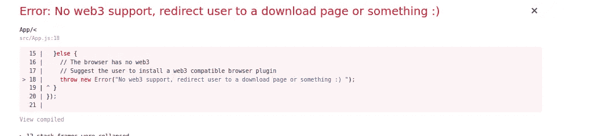
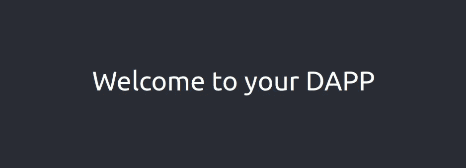
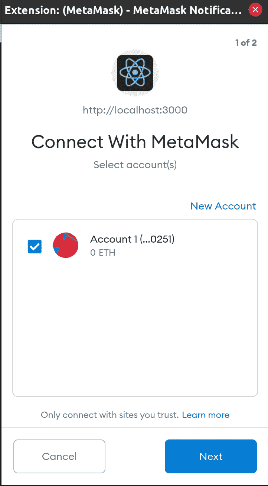
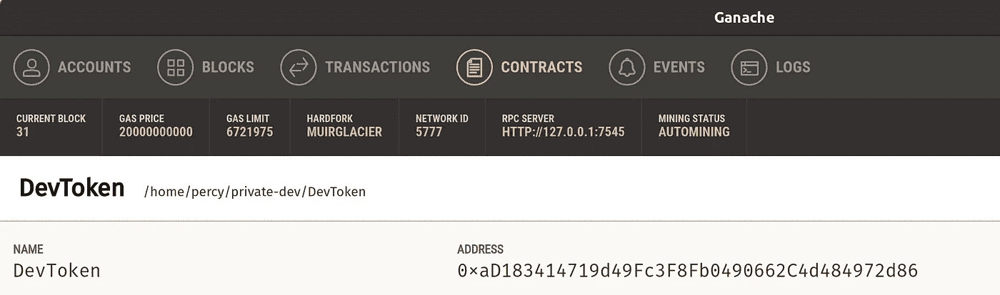
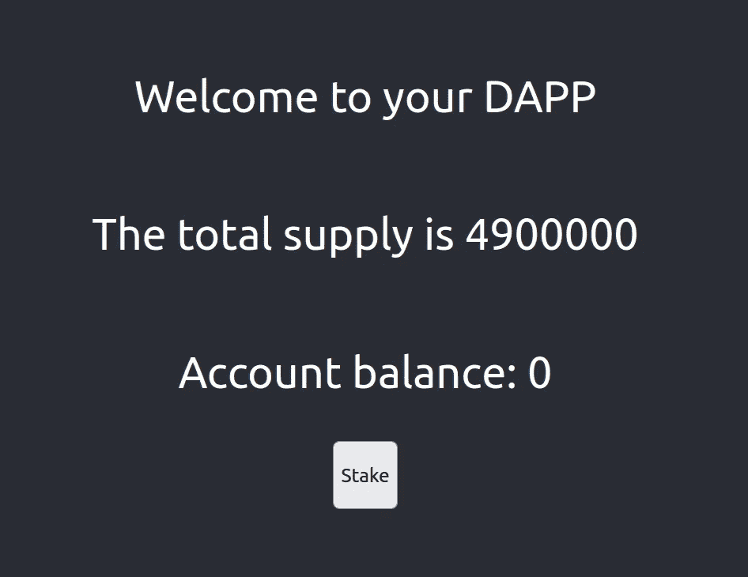
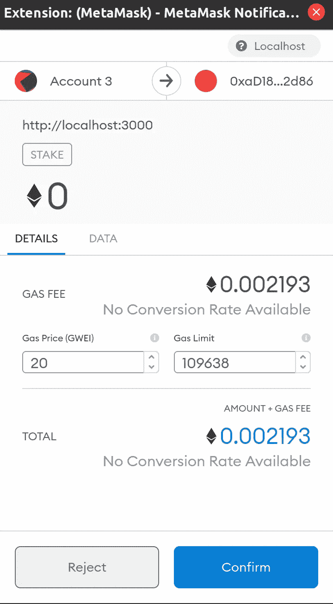
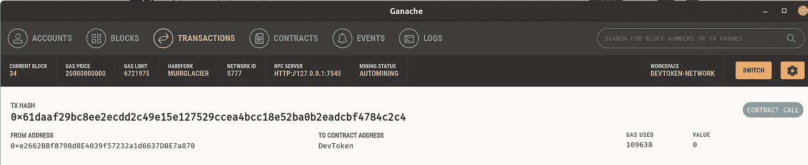
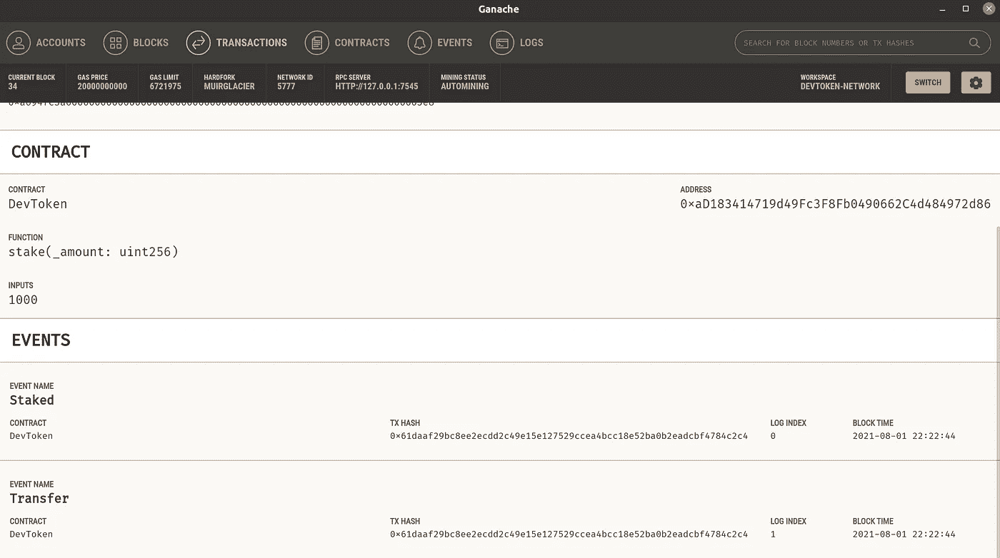

# 在 Web 应用程序中使用智能合约

> 原文：<https://itnext.io/using-a-smart-contract-in-an-web-application-78432ed68527?source=collection_archive---------2----------------------->


珀西·博尔默拍摄的图片

这是我们在 Solidity 中构建 BEP20 智能合约系列的第三部分。我们现在将开始在 web 应用程序中使用智能合约，并看看如何将合约推向生产。

1.  [**【在 Solidity 中用 BEP-20 契约构建一个去中心化的应用】**](https://medium.com/@percybolmer1/building-a-decentralized-application-with-bep-20-contract-in-solidity-d2c066447aa6) —这篇文章将帮助你理解 Solidity 的基础知识
2.  [**【在实体中创建可继承的赌注契约】**](https://medium.com/@percybolmer1/creating-a-inheritable-staking-contract-in-solidity-7804ae2d7a32) —第二篇文章，我们将介绍更高级的实体物品，并实现赌注和奖励
3.  **【在 Web 应用中使用智能合约】** —本系列的第三篇文章，我们将学习如何使用元掩码通过 Web 应用连接到区块链
4.  [**【将智能合约部署到币安松露智能连锁店】**](https://medium.com/@percybolmer1/deploying-smart-contracts-to-binance-smart-chain-with-truffle-c57a7d1eb6ed) —第四篇也是最后一篇文章，我们将学习如何将智能合约部署到真实网络中

你可以在这里找到上一篇文章[的完整代码。我们现在将更新并添加一个 web 应用程序，以便在网络上运行。](https://github.com/percybolmer/DevToken/tree/stakeable)

## 将智能合同迁移到网络

我们要做的第一件事就是把写好的智能合约迁移到网络上。我们将使用 Ganache 托管一个本地网络，您也可以使用真实的测试网络。迁移意味着将智能合约推送到网络上。这将花费汽油，因此将要求推送智能合同的客户具有适当的可用汽油量。

我们可以使用 truffle 迁移到开发、测试网，甚至 mainnet。请注意，mainnet 将花费真正的天然气(这意味着真正的钱)。

我们稍后将介绍 testnet 和 mainnet，现在，我们将依靠 Ganache 来托管网络。

如果你没看过前两篇文章，[第一篇](https://medium.com/@percybolmer1/building-a-defi-application-with-bep-20-and-solidity-d2c066447aa6)解释了如何安装 Ganache。确保你有 ganache 启动和运行，否则松露将失败。

迁移很容易，如果您位于代码库的根目录，可以通过运行以下命令来执行。

```
truffle migrate
```

输出应该显示你使用的账户，汽油费用，实际以太币费用，等等。


块菌迁移到加纳切部署网络

如果编译和迁移成功，您应该会看到一个名为 build 的新文件夹。这个文件夹将包含解释合同的 JSON 文件。这些文件在以后会很重要，因为 JavaScript 客户机使用它们来理解可用的函数。

## 构建 web 应用程序

在本文中，我们将使用 web3-eth npm 包来处理网络。

我将使用 react 工具 [create-react-app](https://reactjs.org/docs/create-a-new-react-app.html) 来生成我可以使用的模板应用程序。我将把我的应用程序命名为 dapp，因为它将是一个[分散式应用程序](https://ethereum.org/en/dapps/)。我们将关注这个应用程序的功能，而不是设计。设计取决于未来的你。

```
create-react-app dapp
```

我们还需要安装 eth3 依赖项，进入 dapp 应用程序并运行

```
npm install --save web3-eth
```

如果您是 React 新手，那么您可能希望在继续之前启动应用程序，看看它正在运行什么以及它看起来如何。运行 npm start 并访问 [localhost:3000](http://localhost:3000/) 。

```
npm start
```

## 连接到区块链网络

我们将在加载后开始将应用程序连接到区块链网络。

打开 **src/App.js** 。

首先，我们需要导入 Web3 并使用 Effect，这样我们就可以在应用程序加载时触发连接。如果你不熟悉 react， [useEffect](https://reactjs.org/docs/hooks-effect.html) 是一个在函数被调用时被触发的函数，可以把它想象成一个每当你的组件被加载时都应该运行的函数。

我们将检查所使用的浏览器是否支持 [web3](https://web3js.readthedocs.io/en/v1.4.0/) 。这是与区块链网络通信所必需的，因此也是我们的智能合约所必需的。

Defi —首先检查浏览器，使其支持 web3

重新加载网站，你应该会看到这个错误信息。



defi——当没有 web3 支持时，我们无法运行网站。在生产中，这将重定向到一个下载页面或什么的

让我们通过下载并安装对 web3 的支持来解决这个问题。我喜欢 [MetaMask](https://metamask.io/) ，它是一个浏览器插件，使用起来很友好。

安装 MetaMask 时，它将引导您完成安装过程。我不会涵盖所有的细节，但你应该选择“创建一个钱包”，并输入一个安全的密码。确保您**阅读了恢复短语**并**保存它**。

一旦你完成了设置，你的浏览器现在应该可以和以太坊区块链对话了。

重新访问 localhost:3000，您现在应该会看到一条欢迎消息。



DApp—访问网站时的当前闪屏

现在，我们还没有完全准备好。我们只检查了浏览器是否可以运行 web3。然而，有许多 web3 提供商，而不仅仅是 MetaMask。我们现在只支持元掩码，所以让我们检查一下提供者是否是元掩码。我们将自动触发这个触发器，但是你通常有一个按钮，或者几个按钮来支持许多提供者。

如果是，我们将获取在当前元掩码中找到的帐户。我们将使用 web3 打电话请求帐户。这将提示 MetaMask 插件弹出一个窗口，要求接受连接。

我们还将确保捕捉任何错误，以防用户拒绝或出错。在这个 DApp 中，我将简单地抛出一个错误，但它会向您展示如何抛出。

DApp —如何让用户在访问网站时连接到 MetaMask

访问该网站，MetaMask 会提示您允许该网站连接。



元掩码—允许连接权限

如果您按“取消”,您将看到一个错误，如果您接受，那么您将配置一个连接。现在我们只把账户打印到控制台上，但是我们将会改变这一点。

## 在元掩码中连接到正确的网络

既然我们已经连接到 MetaMask，那么是时候看看如何连接到应该使用的网络了。

让我们首先将本地主机网络作为网络添加到元掩码中。首先打开 MetaMask 并选择 networks 下拉菜单。
转到自定义 RPC 并输入以下值。如果你找不到，请查阅[官方文件](https://metamask.zendesk.com/hc/en-us/articles/360043227612-How-to-add-custom-Network-RPC-and-or-Block-Explorer)。

*   到 ganache 网络的 URL(在我的例子中，HTTP://127.0.0.1:7545)
*   链码(1337) —元掩码会告诉您它是否是其他东西

你可以在元掩码插件的顶部看到当前使用的网络。它应该显示您刚刚添加的网络的名称，这样它才是正确的。

网络也是我们发送请求的网络，但是我们也必须跟踪我们的帐户。您的 MetaMask 帐户上可以有多个帐户。现在我们正在使用 Ganache，您可以使用一个私钥导入保存所有以太坊的已创建帐户。

打开 Ganache 并转到帐户选项卡。在那里，您应该会在最右侧看到一个钥匙的图像。按下它显示帐户的私人密钥。复制私钥并返回元掩码插件。单击顶部的圆圈显示所有帐户，选择导入帐户，粘贴私钥，您应该有可用的 Ganache 测试帐户。

您现在只能看到以太坊，但是您可以添加我们正在开发的令牌，这样我们就可以看到该令牌的帐户余额。

如果您在 MetaMask 中选择了正确的帐户，请选择“Assets”选项卡，然后按下大的“Add Token”按钮。它将要求您粘贴迁移的合同地址，您可以从 Truffle migrate 的输出中找到该地址，或者在 Ganache 的“合同”选项卡中找到该地址。

## 在 JavaScript 中连接到智能合约

现在，我们需要为智能合约创建一个客户端，为此，我们需要智能合约的地址和部署合约时生成的 ABI。ABI 是描述以太坊区块链智能合约的标准方式。这是您在**构建文件夹**中为 DevToken 准备的 JSON 文件。我们使用 web3 中的 ABI 来了解哪些功能可用。

我将创建一个名为 getABI 的函数，它从 DevToken.json 获取数据。

```
cp build/DevToken.json dapp/public/
```

DApp-getABI 将从公共文件夹加载 ABI

接下来，我们需要智能合约的地址，这样我们就可以连接到它。运行 truffle migrate 时，智能契约的地址位于它的输出中。否则，您可以在 Ganache 的 Contracts 选项卡下找到该地址。



Ganache —显示已部署的合同及其信息

让我们创建一个简单的函数，将地址返回给我们。

DApp——这应该在生产中替换为从配置或环境中加载

如果我们将这些函数联系在一起，我们可以创建一个连接到智能合约的函数。我们导入的 web3 包可以使用 abi JSON 和地址作为输入，从 ABI 创建一个契约对象。

我们将使用一个反应状态来分配创建的契约对象。在应用程序功能的顶部添加状态创建。通常情况下，所有状态都在函数的顶部声明，还会添加一个 Set 函数。

DApp —添加了一个状态和一个状态设置器，我们可以使用它来分配智能合约

让我们将所有这些放入一个名为 connectToSelectedNetwork 的函数中，该函数将为我们连接和设置 devToken 状态。

DApp —连接到合同并设置状态。

您还需要在效果中添加对 connectToSelectedNetwork 的调用，以便在加载页面时执行。

这是我最后的效果片段。

DApp —将合同连接并分配给州的使用效果

## 从网页调用智能合同功能

我们终于有了合同，并把我们的账户与它挂钩。是时候开始调用调用了，看看我们能否利用区块链合约。

让我们从简单的开始，让我们抓住代币的总供应量和用户帐户余额和赌注摘要。因为我们想为来访用户显示一个配置文件。

首先，我们添加一个名为 accounts 的新状态，它将用于存储用户的帐户。

DApp—添加一个州，用于存储在 connectMetaMask 中检索到的帐户

我们将从修改 connectMetaMask 函数开始。在这个函数中，我们已经请求了用户帐户，我们只需要在继续之前保存它们。现在，让我们确保保存帐户，而不只是将它们打印到控制台。

DApp —修改 connectMetaMask 以在请求帐户后实际存储它们

在继续之前，我建议在执行完 **connectToSelectedNetwork** 调用后放置一个调试器。然后，您可以探索所创建的 devToken 契约，这有助于理解正在发生的一些事情。

在 devToken 对象中，我们可以看到所有可用的事件和方法。当应用程序增长并且您正在开发真实的东西时，这可能是有用的。

我们将以两种不同的方式调用函数，异步调用和回调调用。所有被调用的功能都将由智能契约执行，我们不知道结果何时返回。所以处决将全部返回[的承诺](https://developer.mozilla.org/en-US/docs/Web/JavaScript/Reference/Global_Objects/Promise)。我不会涉及细节，因为这是一个太广泛的话题，但基本上这是一种让我们在响应返回时调用函数的方法。Async 意味着我们可以使用 await 关键字来代替，使它更容易使用，但缺点是在它完成之前会阻塞其他执行。只有在函数 decleration 中使用关键字 Async 时，才能使用 Async，如下例所示。

DApp——等待总供给的召唤。

为了进行试验，我们将确保在 devToken 契约完全加载时调用 getUserProfile。为了实现这一点，我们将添加另一个 useEffect 并订阅一个名为 loaded 的新状态。每当加载的状态更新时，我们将重新加载用户信息。

添加一个先加载的新状态调用。同样，这应该放在文件的顶部

DApp —我们可以监听以触发用户更新的加载状态

让我们也创建一个 useEffect，它将把已加载的状态作为触发器。

DApp —使用一个监听加载状态变化效果

刷新并检查您的开发人员控制台，您应该看到打印的总供应量。

调用函数的第二种方法是进行调用并给出一个回调函数。每当检索到响应时，都会调用该函数。使用 call()方法实际上会返回一个承诺，因此我们可以使用与之前相同的模式来触发 response 方法。这样做的好处是不必在延迟期间阻塞所有其他执行。您将会看到我更喜欢这种模式的原因，它有更多的代码，但是当您稍后使用 testnet 时，您会注意到某些事务可能会花费一些时间。我将把 getUserProfile 改为使用回调。更改后，请确保刷新并查看它是否仍在打印耗材。

DApp—调用智能合约函数并使用回调而不是等待

我们希望呈现 totalSupply 令牌，因此让我们添加一个名为 total supply 的状态，并让 getUserProfile 设置供应量，而不是将其记录到控制台。我们还将更新 HTML 代码来呈现状态。

DApp —我们添加了一个新的总供给状态

将 getUserProfile 中的 console.log 更改为调用 totalSupply 的 setter。

DApp-更新了 GetuserInfo 以在状态中存储结果

让我们更新从 App 函数返回的内容，以便在标题中呈现供应。在一个功能性的 react 应用程序中，你可以在 html 中使用{}来引用状态。

DApp-呈现总供应状态

好了，现在我们知道如何调用一个函数来检索信息。在查看交易之前，我们还要添加当前帐户余额和可用的赌注。

从我们需要的两个新状态开始。

DApp——我们的用户资料中新增了两个州

接下来，我们将更新 HTML 来呈现新的状态。我们现在只将赌注打印到控制台日志中。我们还会花时间为将来的赌注添加一个按钮，它现在不会工作。

DApp —添加要呈现的用户帐户信息

现在，我们将更新 getUserProfile，以获取所有需要的数据。因为每个请求看起来基本上都一样，而且我是 **DRY 的忠实支持者，**我们将创建一个助手函数，它将请求作为参数执行。它还将接受应用于响应的回调，以及应该传递给区块链的最终参数。

DApp——使用一个叫做 call 的简单助手功能收集所有需要的用户数据

重新加载网站，并确保其正常工作。



DApp-当前用户配置文件。

## 触发合同上的交易记录

让我们尝试实现一个赌注按钮，我们不会做一个花哨的渲染或 UI，而是一个简单的按钮，当按下时，赌注 1000 个令牌。

现在，我们将实现 stake 函数，这将是一个硬编码的请求，用于在当前帐户上下注 1000 个令牌。

您会注意到，我们现在将使用另一种方式来调用智能合约，原因一开始可能不是非常清楚。但是每当我们触发一个不改变区块链、视图修改器等状态的函数时，我们应该使用**调用**。当我们触发新的事务并修改状态时，我们应该使用 **send。**这里可以阅读更深入的解释[。还有一点必须知道的是，每笔交易都要花汽油费。Web3 提供了一个很好的方法来估算燃气成本，我们可以在触发请求之前使用这个方法。](https://bitsofco.de/calling-smart-contract-functions-using-web3-js-call-vs-send/)

DApp——估算天然气成本，然后发送股份交易

重新加载网站并按下赌注按钮，如果你有 0 个代币，请确保从 ganache 导入一个帐户并切换到该帐户。当您按下 Stake 按钮时，您应该会从 MetaMask 获得一个弹出窗口，其中包含有关交易的信息以及一个拒绝或确认按钮。按确认并等待它完成。



DApp——meta mask 的股权交易

如果你想了解更多信息，你也可以在 Ganache 查看交易。转到 ganache 中的“transactions”窗口，找到您的交易，然后按它进入详细信息窗格。



Ganache —交易概述。

如果您进入事务的细节，您可以看到它是什么方法和它触发的事件。这很重要，因为它将引导我们进入下一个主题，记得我说过事件纯粹是为了登录的可靠性吗？这里有一个额外的好东西，我们可以订阅事件。让我们这样做，以便我们可以正确地更新帐户余额时，股权已被接受。



Ganache —事务细节向我们展示了事件

太好了，现在我们知道如何使用事务了。随意尝试添加一些其他交易，如津贴或帐户之间的简单转移。

## 订阅区块链的活动

让我们来看看如何订阅某些事件，以便收听并据此采取行动。

我们通过读取 ABI 创建的契约实际上包含了 Events 字段中的所有可用事件。因此，要订阅，我们只需接受该事件，并在一些可用的主题上注册听众。我们将加载用户概要文件。

从[文档](https://web3js.readthedocs.io/en/v1.2.11/web3-eth-subscribe.html)中可以找到 4 个主题

> `on("data")`返回`Object`:对每个传入的日志触发，将日志对象作为参数。
> 
> `on("changed")`返回`Object`:在从区块链移走的每根原木上触发。日志会有一个额外的属性`"removed: true"`。
> 
> `on("error")`返回`Object`:当订阅发生错误时触发。
> 
> `on("connected")`返回`String`:订阅成功连接后触发一次。返回订阅 id。

DApp —注册 Staked 事件的听众

倾听事件并不比这更难。不过要确保你的过滤是正确的。尝试压注一次，并在控制台上查看结果。

## 结论

第三篇到此结束。本系列还有一篇文章，你可以在我的[库](https://github.com/percybolmer/DevToken/tree/dapp)的 DApp 分支中找到完整的代码。

在这一部分中，我们讨论了以下主题

*   React 应用程序的设置
*   了解如何连接元掩码
*   如何调用和发送交易
*   收听某些事件

下一篇文章将介绍如何部署到币安测试网络和主网络。

我希望你喜欢它，如果有任何问题，请随时联系我们。