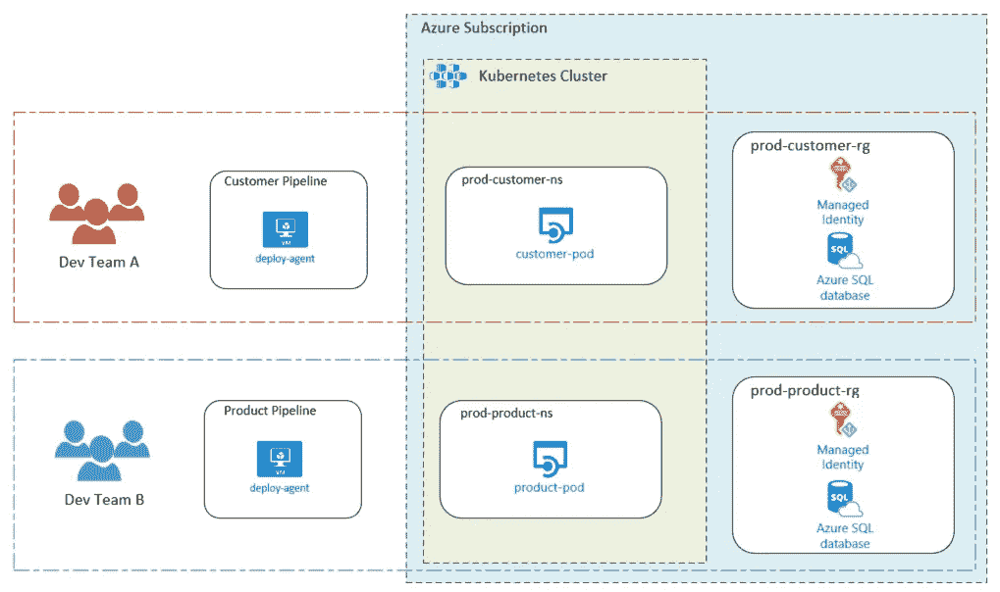
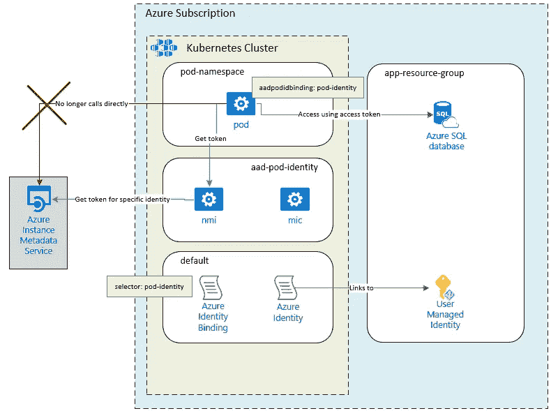
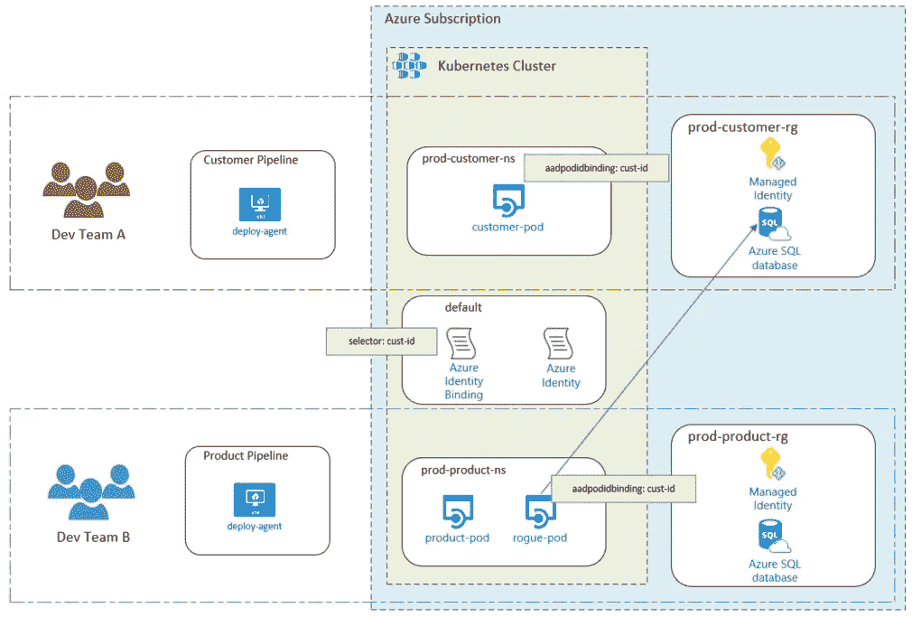
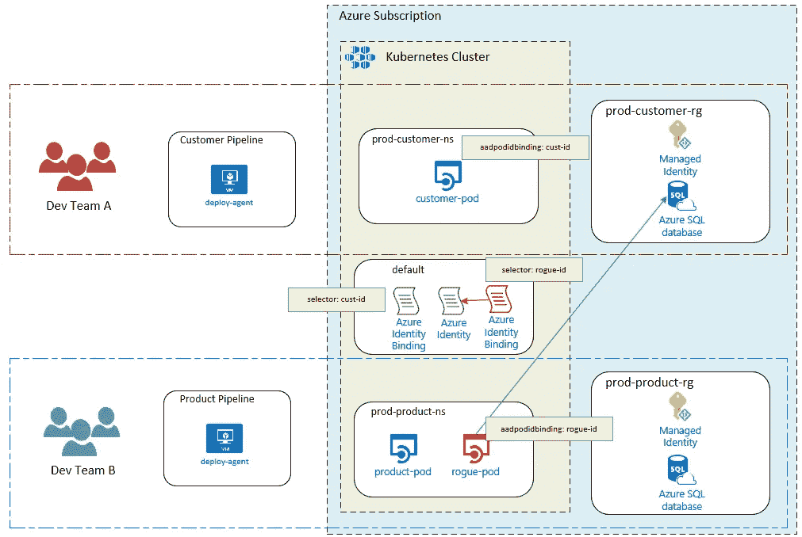
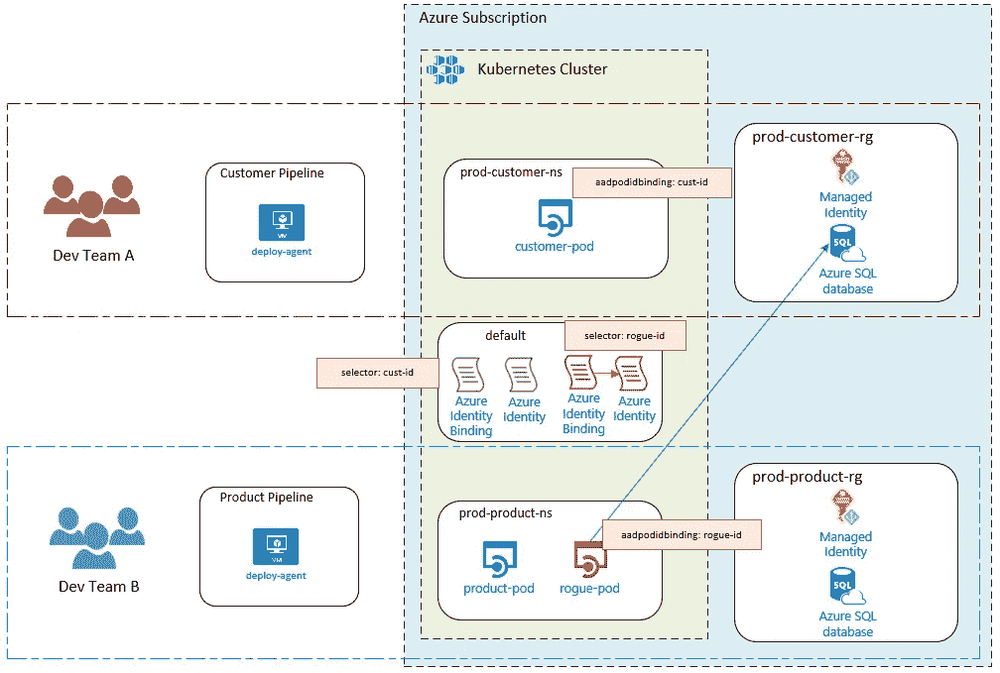
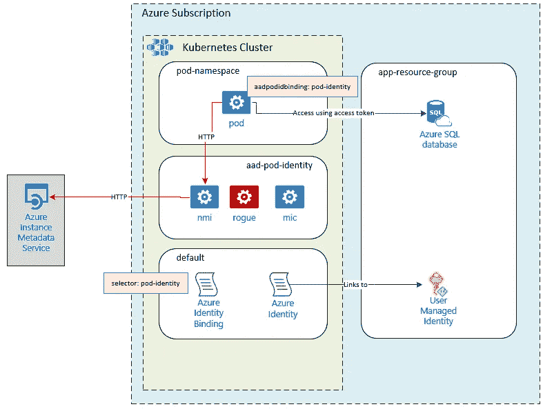
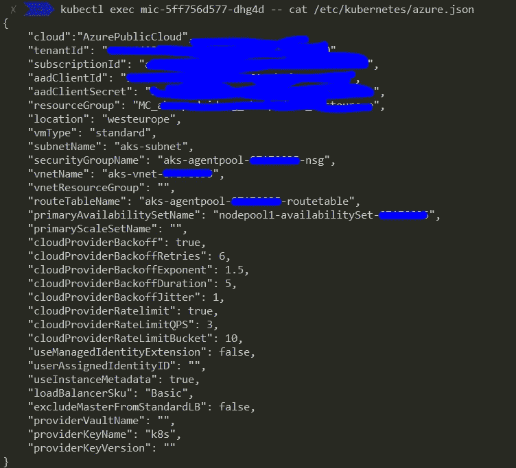
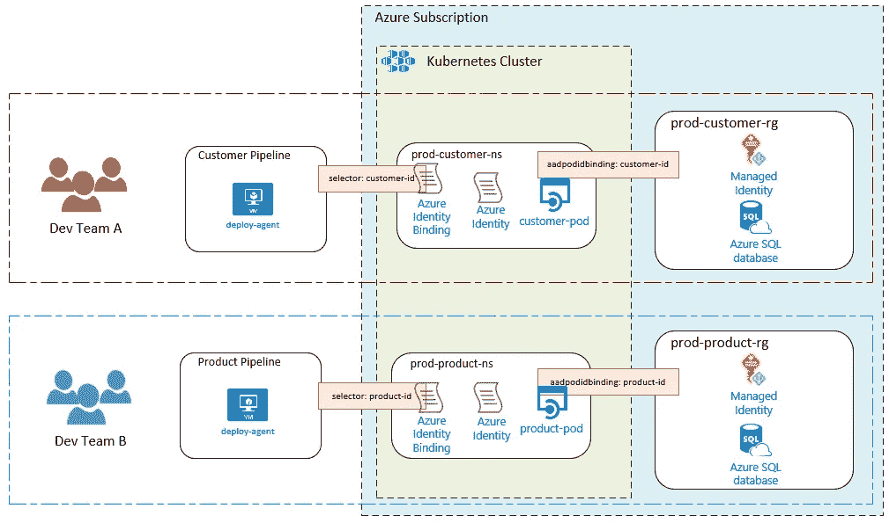

# 在您的 Azure Kubernetes 集群中使用 AAD Pod 标识—需要注意什么！

> 原文：<https://itnext.io/using-aad-pod-identity-in-your-azure-kubernetes-clusters-what-to-watch-out-for-73d5d73960f?source=collection_archive---------3----------------------->


尼克·吉奥在 [Unsplash](https://unsplash.com/search/photos/broken-container?utm_source=unsplash&utm_medium=referral&utm_content=creditCopyText) 上的照片

## 关于如何将 pods 连接到 azure 服务，同时又不影响安全的几点建议。

## TL；DR:对于某些类型的环境/工作负载，AAD Pod 身份的默认实施可能不够安全。如果您关心安全性，您将需要超越“kubectl apply -f…”。

Azure 一直在改进其产品，以支持上下文认证。这是由一个名为[托管身份](https://docs.microsoft.com/en-gb/azure/active-directory/managed-identities-azure-resources/overview)的功能提供支持的，简单来说，它允许您为 Azure 计算(即 AKS、虚拟机、应用服务等)分配一个身份。然后，该计算机内的应用程序可以请求访问令牌来访问其他 Azure 服务，如 Sql Azure 数据库或 KeyVault 实例。

不涉及太多细节，这是基于 Azure [实例元数据 API](https://docs.microsoft.com/en-us/azure/virtual-machines/windows/instance-metadata-service) 。一个 HTTP 端点，当在启用此功能的 Azure compute 内部调用时，它返回一个新的访问令牌。调用它的 URL 如下所示:

```
[http://169.254.169.254/metadata/identity/oauth2/token?api-version=2018-02-01&resource=https://management.azure.com/](http://169.254.169.254/metadata/identity/oauth2/token?api-version=2018-02-01&resource=https://management.azure.com/)
```

具体来说，在这种情况下，应用程序中的连接字符串不是数据库的“固定”用户名和密码，而是使用运行时生成的访问令牌。可以在[这里](https://docs.microsoft.com/en-us/azure/app-service/app-service-web-tutorial-connect-msi)找到一个来自官方文档的为应用服务和 Sql Azure 设置这个的例子。

这个想法非常有趣，并为您的应用程序提供了一些安全优势，例如:

*   **上下文安全:**对 azure 资源的访问基于只能从 azure 内的计算(AK、虚拟机、应用服务等)获取的访问令牌。因此，这将毫不费力地帮助你保持你的环境隔离。为了保持所有 SDLC 的一致性，您甚至可以使用他们的 [SDK](https://www.nuget.org/packages/Microsoft.Azure.Services.AppAuthentication) 在本地模拟这种行为。
*   **需要维护的秘密更少，即攻击面减少:**无需考虑连接字符串或 SAS 密钥的秘密轮换。每个令牌都是由实例元数据 API 根据需要自动生成的。
*   **访问令牌的自动轮换:**所提供的令牌的生存期(TTL)默认为 60 分钟。然后在过期后自动旋转。

去年，微软启动了一个开源项目，将这个概念引入 Kubernetes 集群，允许你将 Azure Managed Identity 绑定到一个正在运行的 Pod，它的名字是 [aad-pod-identity](https://github.com/Azure/aad-pod-identity) 。

为了使这里提出的安全问题更清楚，我们将考虑一个多工作负载集群，由至少两个不同的团队共享。他们中的每一个都负责自己的管道、名称空间(在集群中)和资源组(在 Azure 中)，所有这些都经过了正确的配置，并且考虑到了最少的特权。



绿色方框代表集群控制平面，而蓝色方框代表 Azure 控制平面。红色虚线矩形表示 A 团队应该可以访问的内容，而蓝色虚线矩形表示 b 团队。

上述方法背后的想法是深入实现安全性。确保在任何点受到损害时，它都保持在其附近区域内，并且不会接管整个集群或 Azure 资源。为了达到这个目标，有很多事情需要做，这超出了本文的范围。这里的目标是强调 AAD Pod 身份可能会使其更难实现。

# AAD Pod 身份识别是如何工作的？

在进一步讨论之前，首先了解它们是如何结合在一起的，这一点很重要。

一旦部署，aad-pod-identity 将为您的集群添加一些新功能:

## nomiddleinitial 无中名的姓名首字母缩写

节点管理身份是一个 daemonset，它从每个节点劫持(是的，这与中间人攻击几乎相同)对 Azure 的 Instance Metadata API 的所有调用，并通过调用 MIC 来处理这些调用。

## 最低抑菌浓度

托管身份控制器是一个 pod，它调用 Azure 的实例元数据 API，缓存本地令牌以及身份和 pod 之间的映射。

## AzureIdentity

一种新的客户资源类型，代表 Kubernetes 内部的 Azure 身份。

## AzureIdentityBinding

一种新的客户资源类型，使用标签将 Azure Identities 链接到群集中的 pod。

示例应用程序如下所示:



有几件事值得注意；

1.  AzureIdentity 和 Pod 之间的关联，通过标签实现。
2.  当前版本**要求**azure entity 和 AzureIdentityBinding 对象驻留在默认命名空间中。有[工作在进行中](https://github.com/Azure/aad-pod-identity/pull/140)允许它们被命名，然而，它还没有登陆。

# 需要注意的场景

以下是滥用该项目的默认设置可能导致横向移动和权限提升的场景。

其中一些考虑因素可能与您相关，也可能不相关。这在很大程度上取决于您的安全姿态和您的用例。例如，如果您的集群中只有一个应用程序，所有应用程序共享一个 Azure 身份，或者如果一般来说“最低特权”在您的优先级列表中不算高。:)

## 1)重用绑定选择器

通过对 customer-pod 中的 aadpodidbinding 标签重复使用相同的值，流氓 pod 将被链接到客户身份。现在，如果它从实例元数据 API 请求访问令牌，它将被授予一个令牌，允许它执行 Azure 中允许客户身份的任何操作:



在这种情况下，对默认命名空间具有读取权限并对群集中的任何其他位置具有创建 pod 权限的受损帐户将能够代表客户经理身份获取访问令牌。

更有可能发生这种情况的是，AzureIdentity 和它的绑定都在一个共享的名称空间中。这意味着多个团队/应用程序可以访问它，即使只是只读的。

## 2)创建新的 Azure 身份绑定

与上面的场景类似，可以创建一个新的 AzureIdentityBinding，链接到现有的客户 AzureIdentity。



此时，必须在默认命名空间中创建 AzureIdentityBinding 对象。一旦[名称空间得到支持](https://github.com/Azure/aad-pod-identity/pull/140)，如果注释 forceNamespaced 没有设置为 true，它也可以部署在其他名称空间中。

在这种情况下，尝试横向移动的受损帐户将需要对默认命名空间的 pod 读取和 AzureIdentity/Binding 写入访问，并在群集内的任何其他位置创建 pod 访问。

## 3)创建新的 AzureIdentity 和 AzureIdentityBinding

上面场景的另一个版本。但是，这次创建了 AzureIdentity 和 AzureIndentityBinding，指向 prod-customer-rg 资源组中的托管身份。



访问权限和威胁向量与前面的场景非常相似。

## 4)对 NMI 的窃听请求

NMI pod“拦截”对实例元数据 API 的所有请求，并在内部进行处理。但是，这些流量都不是使用安全通道(TLS)发送的。访问令牌总是以纯文本的形式传输。

具有 NET_ADMIN 功能的特权 pods 可以窃听在同一节点上安排的任何网络流量，这可以受益于在周围发送的纯文本敏感信息。在这种情况下，更糟糕的是端点地址是众所周知的。



请注意，如果群集配置为启用了托管身份，NMI 窗格将与 Azure 实例元数据对话。如果不是，它将改为与 Azure AD 沟通，在这种情况下，部分沟通将在 TLS 下进行(从 nmi 到 Azure AD)，部分不会(从请求 pod 到 nmi)。

这比以前的场景要复杂一点，尽管它只需要受影响的帐户拥有 create pod 访问权限。绝不能有任何东西阻止特权阶层的产生——这是默认行为。

请注意，部署流氓 pod 的名称空间并不重要。特权 pod 超越了这种隔离级别，将可以访问其预定节点内的所有流量。

## 5)获得 AKS 认证

目前，AKS 以纯文本方式存储用于集群与 Azure API 对话的 SPN(服务主体名称)凭据。该文件在每个节点中都可以使用。这是一个众所周知的问题，我不久前在博客中提到过。



MIC pod 会将该文件安装到自身中，因此，对 MIC 具有执行访问权限的任何用户(或服务帐户)都可以通过一行代码访问该文件:

```
kubectl exec MIC-NAME -- cat /etc/kubernetes/azure.json
```

请注意，aad-pod-identity 上提供的现有模板将其所有组件放在默认命名空间中。

这里的威胁向量是在默认命名空间中具有 pod execute 访问权限的任何用户或服务帐户，它们将能够权限升级，至少能够访问集群中的所有 Azure 资源。例如，它可以操作节点虚拟机、负载平衡器、网络安全组(NSG)等。

这也可能是 AKS-Engine 上的一个问题，如果它是用 useManagedIdentity = false 设置的。

# 推荐

这里的总体问题是集群控制平面和 Azure 控制平面之间的横向移动有多容易，毕竟，对于非管理员用户来说，上述场景都不需要集群管理员权限。

以下建议涵盖了上述实施 AAD Pod 身份的场景。但它也专注于改善集群内的隔离。是这样的:

*   不要将敏感资源存储在跨应用程序共享的 Kubernetes 命名空间中。如果是这样，请确保您具有精细的权限，以确保角色只能访问他们真正需要的内容。
*   严格控制集群的 RBAC。密切监控角色和角色绑定(及其集群级对应部分)的变化。
*   使用 pod security 策略来限制特权 pod 的创建。
*   密切监控特权吊舱的可疑行为。
*   锁定 AzureIdentity 和 AzureIdentity 将对象绑定到其应用程序命名空间。此外，一旦该功能可用，将 forceNamespaced 设置为 true。让它看起来像这样:



# 经过思考…

大约二十年前，在微软的安全文献中发现[引用](https://docs.microsoft.com/en-us/previous-versions/ms995349(v=msdn.10))到 **SD3+C** 是很常见的。这个概念是:设计安全、默认安全、部署安全和通信安全的简称。基本概念意味着对软件开发中的安全性有一个更全面的看法。

这一概念在当时和现在都是有效的，尤其是当安全性在您的优先级列表中处于较高位置时。然而，很明显，在相当多的开源项目(包括 Kubernetes)中，默认安全并不是“首要考虑的”，这需要最终用户提供更多的专业知识来安全地实现它们。