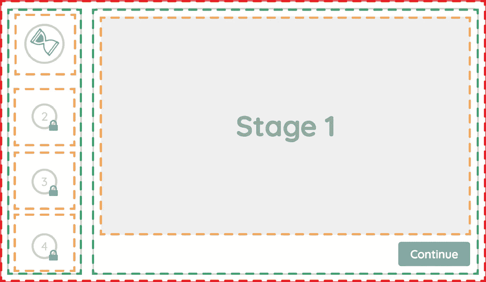
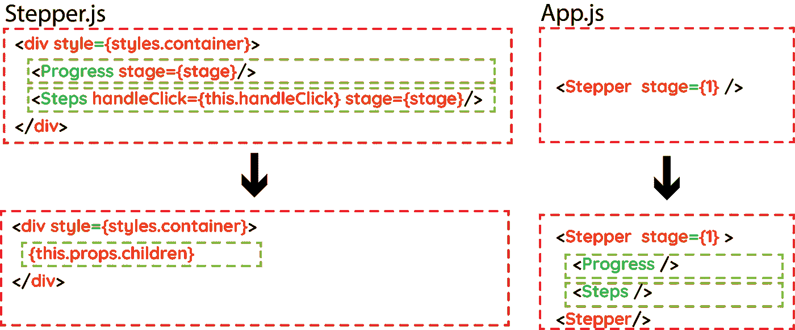

# 如何掌握高级 React 设计模式——复合组件

> 原文：<https://itnext.io/using-advanced-design-patterns-to-create-flexible-and-reusable-react-components-part-1-dd495fa1823?source=collection_archive---------0----------------------->

为了庆祝 React 16.3 的正式发布，我决定分享一些我最近使用的技术，这些技术彻底改变了我创建 React 组件的方法。使用这些技术，我能够设计出完全可重用的组件，并且能够在许多不同的环境中灵活地使用这些组件。

[点击这里查看本系列的第 2 部分:上下文 API](/using-advanced-design-patterns-to-create-flexible-and-reusable-react-components-part-2-react-3c5662b997ab)

[点击这里查看本系列第三部分:渲染道具](/using-advanced-design-patterns-to-create-flexible-and-reusable-react-components-part-3-render-d7517dfe72bc)

上面的沙箱代表了一个整洁的 stepper 组件的初始代码，我将用它来展示其中的一些技术。就目前的情况来看，这个组件工作得非常好，并且完全按照设计来做，但是没有灵活性。

步进组件需要一个道具，即开始阶段。

正如你所看到的，“踏步机”组件的灵活性止于舞台道具；我们只能把舞台换到它开始的地方。

如果我需要将进度块放在右边怎么办？

如果我需要一个有额外阶段的类似踏步机呢？

如果我需要更改阶段的内容，该怎么办？

如果我想改变阶段的顺序呢？

按照现在的情况，我能实现这些改变的唯一方法是完全重写组件。以同样的方式重写会产生类似的结果。但是，如果将来还需要更多的修改，那么就需要重新编写组件。因此，让我们尝试一种不同的方法，重新连接组件，使其具有灵活性和可重用性，以便在任何未来的配置中使用。

在本系列的第一部分中，我们将讨论一种叫做“复合组件”的设计模式

# 使用复合组件设计模式

首先，让我们看看“步进器”组件。

“Stepper”组件基本上是一个组件，它包含一个存储当前 stage 的 state 对象、一个增加 stage 属性值的方法和一个返回包含两个子组件的 div 的 render 方法。

目前，我们明确地将“进度”和“步骤”组件直接放在“步进器”组件中。为了减少这种静态方法，我们可以使用 props 对象来动态注入子组件。

使用这种替代方法，我们可以使用 Stepper.js 文件中的 props.children 对象，并将“Progress”和“Steps”组件放在“Stepper”组件中。

仅仅这个简单的改变就能给我们带来立竿见影的效果。我们现在可以选择先渲染树中的哪个组件；我们可以选择进度块在左侧还是右侧。

然而，这种方法有一个主要问题。“进度”和“步骤”组件不再能够访问“舞台”和“handleClick”道具。为了让每个子组件得到它们需要的道具，我们需要手动遍历每个子组件，并将道具注入其中。我们可以使用 react API 提供的许多助手方法来实现这一点。两个选项包括:- Children.map()和 cloneElement()。

Children.map()类似于 Array.map()方法。之所以需要它，是因为 children.props 有一个不透明的数据结构，使得 Array.map()方法不适合这个用例。

顾名思义，cloneElement 克隆传递给它的子组件。最关键的是，它还附带了注入额外道具的额外能力。嘣！

现在，我们可以将“进度”和“阶段”作为孩子添加到“步进器”组件中，一切都和以前一样。这一次我们可以决定每个组件的位置，或者如果我们想真正疯狂，我们可以在两侧都有一个进度块。

# 静态属性

另一个提高可读性和易用性的酷技术是使用类的静态属性。这允许我们直接在类上调用方法。

这到底是什么意思？让我们看一看…

首先，我们需要在 Stepper 组件中创建静态方法，并将它们分配给“Progress”和“Steps”组件:

所以现在，我们可以直接从 Stepper 组件调用它们，而不是在许多地方导入 Progress 和 Steps 组件:

我们已经开始生成一个简单的、可读的、有点灵活的 API。为什么不对“进度”组件使用一些相同的技术呢？让我们来看看它…

你可能会注意到，它的刚性非常类似于我们之前看到的步进组件。让我们用更动态的 children.props 对象替换 4 个 Stage 组件，遍历添加所需道具的子对象，然后添加一个静态方法，这样就可以直接从 Stepper 类调用它。

完成后，我们可以根据需要在任意位置动态添加任意数量的舞台组件:

我们可以用 Steps 组件做同样的事情，尽管这个有点棘手，因为每个孩子都需要包装在一个 [React 的转换组](https://reactcommunity.org/react-transition-group/)转换组件中。需要应用相同的循环技术，但是只有当 stage prop 与组件的 num prop 匹配时，组件才可见。如果有匹配，它被包装在一个转换组件中(ReactTransitionGroup 文档解释了这样做的目的)并呈现在屏幕上。

通过在 Stepper.js 组件上添加相关的静态方法，我们可以按照我们想要的任何顺序添加任意数量的 Step 组件。

我们创造了一种更加灵活和可重用的组件。我们现在可以选择有多少个阶段，每个阶段将进入什么文本，每个阶段的顺序，以及我们希望进度条在左边还是右边。

尽管如此，我们在灵活性方面仍然受到限制！如果我们想在 Steps 块的上方添加一个标题块会怎么样？

这将破坏我们作为“步进器”的应用程序。“Steps”组件不再是“Stepper”组件的直接子组件，并且不能访问舞台道具。

这就是为什么 React 16.3 的发布是一件大事！到目前为止，React 的上下文 API 还处于试验阶段，但现在它已经正式发布了！

在本系列的第 2 部分中，我将讨论我们如何实现 context API，以便能够在树中的任何位置传递 props，而不管 Stepper 在哪里。步骤”组件的位置，它将始终能够访问舞台道具。

[点击此处查看本系列第二部分](https://medium.com/@shaundavidhutch/using-advanced-design-patterns-to-create-flexible-and-reusable-react-components-part-2-react-3c5662b997ab) [:上下文 API](http://Click here to view part 2 in this series)