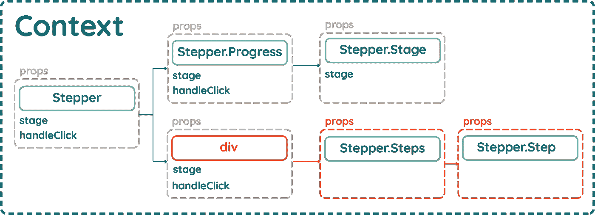
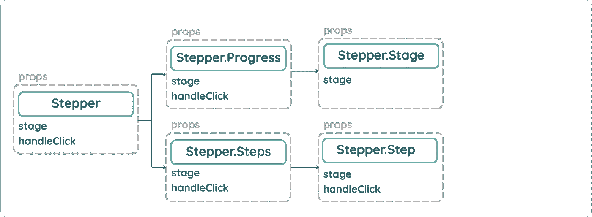
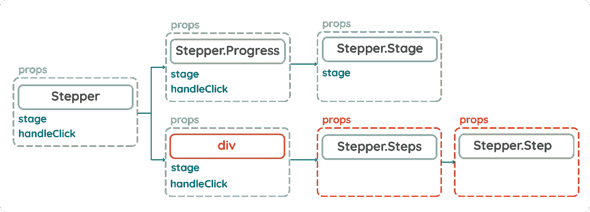
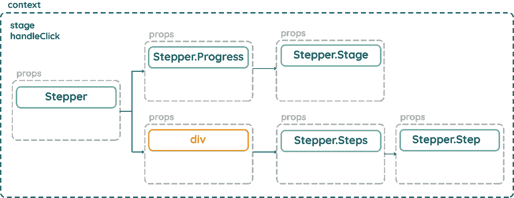

# 如何掌握高级 React 设计模式—上下文 API

> 原文：<https://itnext.io/using-advanced-design-patterns-to-create-flexible-and-reusable-react-components-part-2-react-3c5662b997ab?source=collection_archive---------0----------------------->



[单击此处查看本系列的第 1 部分:复合组件](/using-advanced-design-patterns-to-create-flexible-and-reusable-react-components-part-1-dd495fa1823)

[点击这里查看本系列第三部分:渲染道具](/using-advanced-design-patterns-to-create-flexible-and-reusable-react-components-part-3-render-d7517dfe72bc)

在本系列的最后一部分中，我们讨论了如何使用复合组件和静态类方法来生成可重用和灵活的组件。使用我们创建的 API，我们能够以一种非常声明性的方式动态地重新创建组件的不同变体。

我们可以轻松地添加任意多的步骤，并且我们可以决定进度面板是放在左边还是右边。

步进器组件的简单实现

我们之所以能够做到这一点，是因为我们使用了一些 React API 辅助函数来将所需的道具传递给树中的每个孩子；需要它们的组件可以访问“stage”和“handleClick”道具。



但是这种技术有一个主要的缺陷。道具只能传给他们的直系子孙。这使得 API 变得非常僵化，成为“步进器”。“Steps”组件必须是“Stepper”组件的直接子组件，否则它会中断。这在灵活性方面有着巨大的影响。

如果我们想疯狂一点，用一点 flexbox 的魔力来添加一个标题呢？



通过添加一个简单的 div，我们完全打破了组件。踏步机。“Steps”组件不再是“Stepper”组件的直接子组件，因此无法接收其道具。当我们需要时，灵活地添加小的调整不是很好吗？

救援的背景！！

# 反应上下文 API

React Context 已经存在一段时间了，但 React 的工程师们明确表示，它是实验性的，可能会在不久的将来崩溃。好消息是，从 React 16.3 开始，这已经很稳定了，可以在 React 应用程序中使用。

那么我们一直听到的这个背景是什么呢？

我找不到比 React 官方文档中更清晰的定义了:

> 上下文提供了一种通过组件树传递数据的方式，而不必在每一层手动向下传递属性。

这正是我们需要解决的问题！使用上下文，我们不再需要通过循环和克隆每个孩子来传递所需的道具。设计上下文是为了让我们可以共享“全局”状态，这种状态可以在 React 树中的任何地方共享。



通过使用上下文，我们的所有组件都可以访问“舞台”和“handleClick”道具。

因此，让我来引导您了解上下文 API，以及启动和运行它需要采取的步骤。

# 1:创建新的上下文

React 现在附带了一个名为“createContext”的方法。我们需要做的就是简单地调用这个方法，并把它赋给一个变量。

我们创建的新上下文为我们提供了对提供者和消费者对的访问。信不信由你，提供者为我们提供了在整个 React 树中共享状态变化的能力。消费者允许我们在树的任何地方订阅这些状态变化。

# 2.创建上下文提供程序

我们刚刚创建的上下文有一个名为“Provider”的静态类方法，它创建一个 React 组件。该组件接受值属性。这是非常重要的，因为正是这个属性将代表我们的全局状态，我们需要将它传递给树中更下面的组件。在我们的例子中，我们想要在全球范围内共享的只是“stage”道具和“handleClick”方法。

通过使用我们在本系列第一部分中使用的 props.children 技术，我们可以动态地向提供者公开任何子组件，不管它在树中有多深。

# 3.围绕我们的步进组件包装我们的提供商

通过简单地将“StepperProvider”组件包装在我们最初的“Stepper”组件周围，树中任何进一步向下的子组件现在都暴露在我们的上下文中。

按照现在的情况，我们的步进器代码看起来几乎是相同的，但是通过简单地将它包装在 StepperProvider 组件中，我们所有的子组件都可以访问“stage”和“handleClick ”,而无需手动深入到每个组件。

# 4.重构我们的组件

最初，我们的状态是由 Stepper 组件管理的，我们克隆了每个子元素来接收所需的道具。

几乎所有这些代码都不再需要了。我们不再需要创造状态，也不再需要传承任何道具。我们可以完全去掉这些代码，但是这是一个声明我们的静态方法来创建一个干净的、可读的 API 的好地方。

# 5.使用使用者订阅状态更改

我会用踏步机。步骤组件来演示如何连接消费者组件。前情提要踏步机。步骤组件要求其父组件直接向下传递舞台道具，以使其正常工作:

随着我们的应用程序与上下文联系起来，我们不再需要它作为一个道具。我们可以使用消费者来订阅它:

```
<Consumer>
  {value => /* render something based on the context value */}
</Consumer>
```

消费者需要一个函数作为孩子，并为这个函数提供我们的全局上下文值。当函数完成时，它返回一个 react 节点。

这到底是什么意思？

一开始这有点让人摸不着头脑，但是让我们来看看“消费”步骤组件。

我们没有将“Step”标记作为子标记直接添加给消费者，而是添加了一个函数。这个函数提供了我们之前从提供者那里创建的值，然后我们可以使用 ES6 析构来完成舞台道具。“步骤”组件现在可以像以前一样访问舞台道具，但这次它是从上下文中提取的。从这里我们可以随心所欲地处理它；在这种情况下，我们使用它来确定返回什么样的 React 节点。

这里使用的技术可能看起来有点奇怪。它叫做*渲染道具*，[官方 react 文档在这里解释](https://reactjs.org/docs/render-props.html)。这是一项非常强大的技术，我将在本系列的第 3 部分中讨论。

# 6.对所有需要道具或传递道具的组件重复第 4 和第 5 步

我不会在这里一步一步地详细介绍，而是重复第 4 和第 5 步。台阶踏步机。进度和步进器。阶段组件您应该最终拥有与之前完全相同的组件外观和功能。

我们的组件现在都不依赖于成为其他组件的直接后代。嘣！我们现在有了更加灵活的代码，应该可以添加我们之前无法添加的标题了！

踏步机。台阶和踏步机。Step 不再直接从他们的父母那里拉“舞台”道具。他们从上下文中订阅它，所以额外的 div 不会阻止道具沿树向下传递。应用程序仍然有效！


这给了我们极大的灵活性。我们可以重用我们的组件来动态地创建步进组件的复杂变体，而不用担心我们的应用程序会崩溃

尽管我们可以在应用程序的任何地方使用这个组件，但它仍然不是真正可重用的。为了让它工作，我们仍然需要上下文的样板。

在本系列的下一部分中，我将讨论如何使用 render props 来实现相同的目标，而不必依赖于连接上下文来共享应用程序中组件之间的状态。