# 如何掌握高级 React 设计模式——渲染道具

> 原文：<https://itnext.io/using-advanced-design-patterns-to-create-flexible-and-reusable-react-components-part-3-render-d7517dfe72bc?source=collection_archive---------2----------------------->

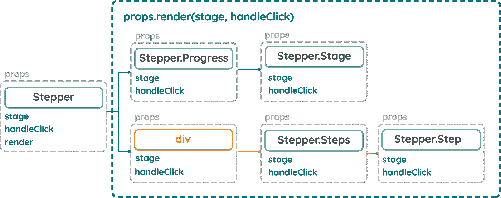

在本系列的第 1 部分中，我们讨论了如何使用复合组件和静态类属性来生成可读和可重用的 Stepper 组件。我们看到这种设计模式有一些限制，因为它不是很灵活；组件需要是父组件的直接子组件，否则它会断开。

[点击此处查看本系列的第 1 部分:复合组件](/using-advanced-design-patterns-to-create-flexible-and-reusable-react-components-part-1-dd495fa1823)

在第 2 部分中，我们使用了新的上下文 API 为第 1 部分的局限性提供了一个优雅且易读的解决方案。这种设计模式的问题是，它需要一些初始设置才能工作，我们的组件不能放入另一个应用程序中，并且在没有初始样板代码的情况下独立工作。

[点击这里查看本系列的第 2 部分:上下文 API](/using-advanced-design-patterns-to-create-flexible-and-reusable-react-components-part-2-react-3c5662b997ab)

在这一部分中，我们将讨论一种设计模式，它可以解决到目前为止我们已经确定的所有问题。它叫做:渲染道具。

这种设计模式一开始可能有点让人摸不着头脑(还记得我们在第 2 部分中放在上下文消费者内部的函数吗？)为了真正掌握它到底是如何工作的，我们需要深入了解顶级 React API，以及我们编写的 JSX 代码是如何转换成 javascript 的。因此，让我们用一个非常简单的例子，并通过引擎盖下发生了什么。

# JSX

JSX 是由脸书的工程师设计的 JavaScript 的语法扩展。我们用它和 React 来描述 UI 应该是什么样子(有点像模板语言)，但是它具有 JavaScript 的全部功能。无论何时你在 JSX 写任何组件，Babel 都会把它编译成一个`React.createElement()`调用。

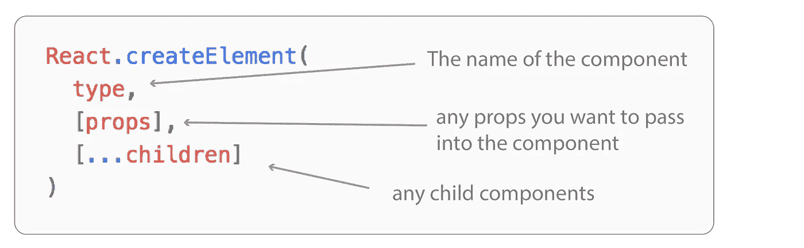

让我们看一个非常简单的例子:

上面的两个例子产生了相同的结果，父组件被简单地转换成一个`React.createElement()`调用，类型是我们的‘父’组件，没有道具，也没有子组件。

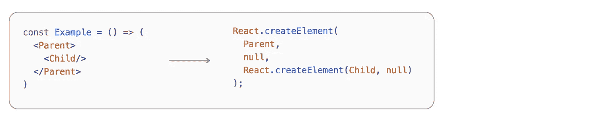

当我们添加一个子组件时，注意它本身是如何被转换成一个`React.createElement()`调用的，正是这种格式创建了我们的 React 组件树。

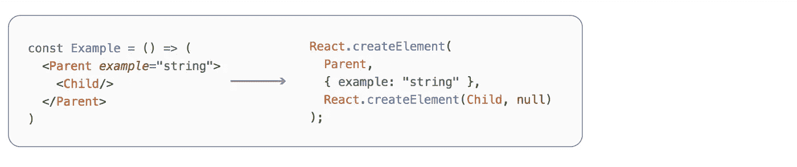

这里需要理解的关键点是，Babel 编译任何作为单个 props javascript 对象添加的 props；因为它是纯 javascript，所以我们可以传递任何我们想要的东西，比如函数。

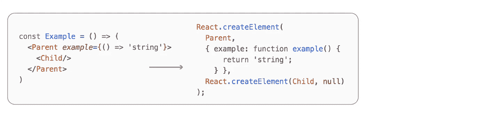

在上面的例子中，我们没有传递“字符串”，而是传递了一个返回“字符串”的函数。所以，当这个函数被调用时，我们可以得到完全相同的结果。

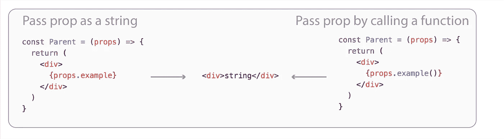

那么上面的例子到底是怎么回事呢？在最初的例子中，我们只是传递字符串，把它放在一个“div”中，然后它就被呈现了。然而，在下一个示例中，我们将它作为一个函数传递，并将其放在一个“div”中，但这次调用该函数可以实现完全相同的结果。

# 渲染道具

为什么这很重要？传统上，我们用**渲染子组件**，我们把它们放在父组件里面。

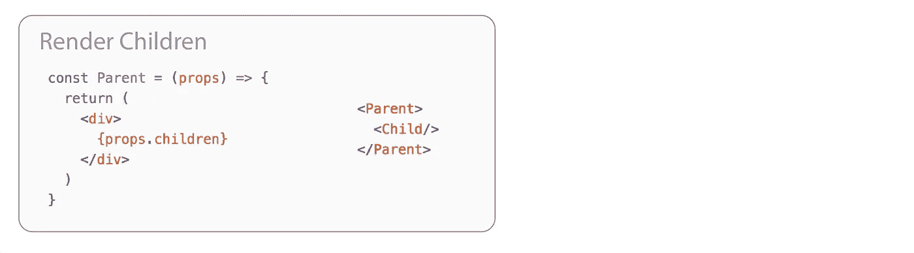

这是需要理解的关键，不是设计我们的组件来渲染一个孩子，而是没有任何东西阻止我们用**来渲染道具**，同时实现完全相同的结果:

所以，在这个设计模式中，我们**渲染道具**而不是孩子。我们还可以更进一步。我们还能用函数做什么？我们可以在调用参数时传递它们:

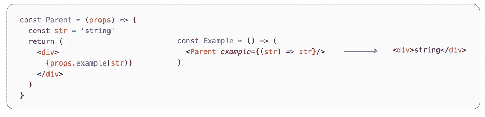

让我们花点时间来消化一下刚刚发生的事情。我们已经像以前一样传入了一个函数，但它不是总是返回“字符串”,而是在被调用时返回我们传入的参数！

等等，这不是我们在第 1 部分中遇到的问题吗？为了解决这个问题，我们必须克隆元素，遍历每个元素，然后传递任何需要的道具。

使用这种设计模式，我们能够将道具传递给子组件，嘭！

我们可以给这些道具起任何我们想要的名字。因此，我们不用“示例”，而是用更合适的词:

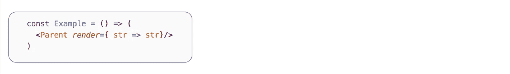

如果你以前用过 react 路由器，这可能看起来很熟悉。当你需要传递道具到一条路线时，你需要使用一个渲染函数。

这是**渲染道具。我们可以调用“render”并传入我们想要的任何参数，而不是直接呈现组件。**

让我们回到 stepper 组件，看看如何利用这种设计模式(我已经删除了所有的上下文样板文件，并将状态添加回 Stepper 组件)。

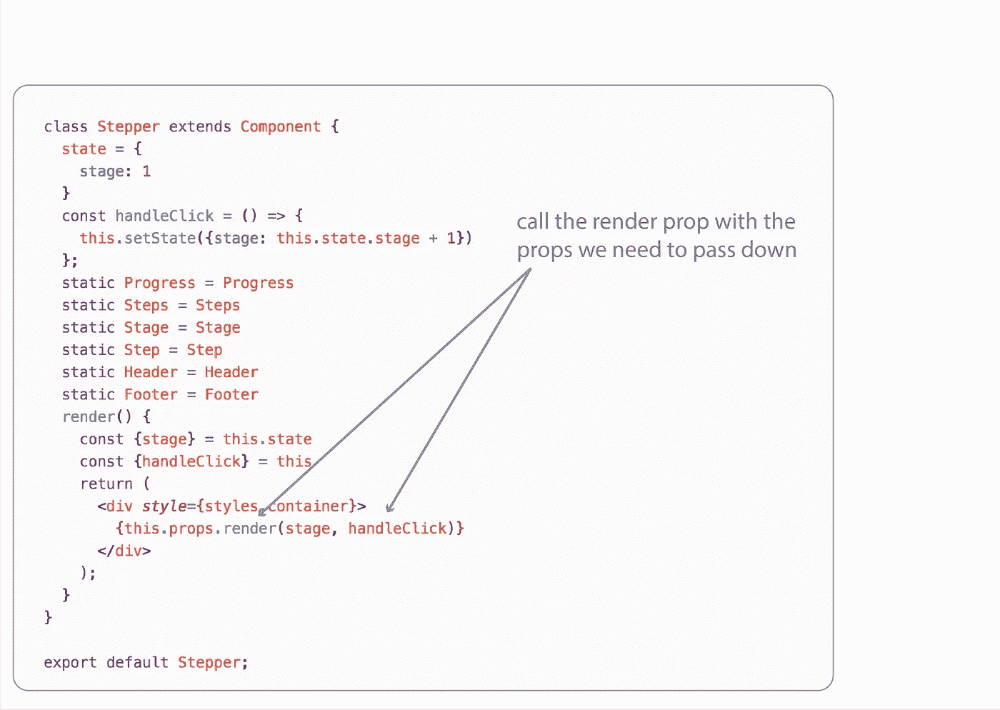

这次我们没有添加`{this.props.children}`，而是添加了`{this.props.render(stage,HandleClick)}`。我们不再需要向 stepper 组件添加任何子组件，我们需要做的只是在 render prop 中返回相同的标记。

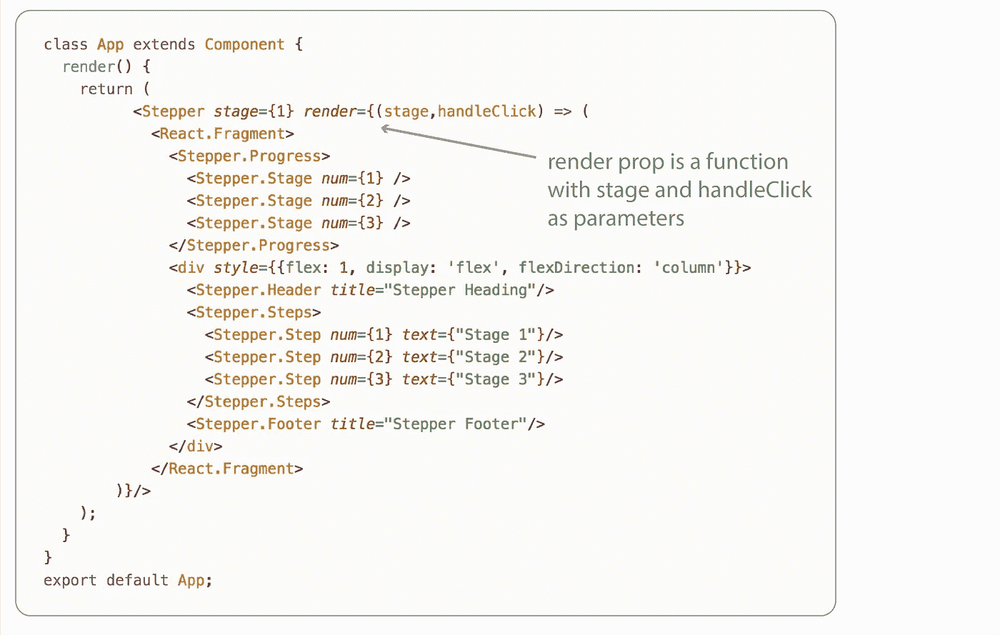

这实现了什么？现在，树中的每个组件都可以访问所有的道具。它本质上为我们提供了与上下文 API 相同的道具，我们不必手动将道具传递给每个孩子，并且我们可以灵活地移动东西。对组件设计的简单调整解决了我们之前提到的所有问题。

不过，使用这种设计模式有一个小小的折衷。代码比以前可读性稍差。还记得我们在本系列前面看到的那个奇怪的函数吗，我们需要在 Context.consumer 组件中添加一个函数。

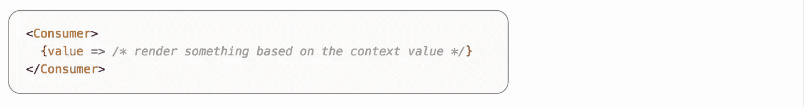

对我来说，这看起来可读性很强；让我们想想这是怎么回事。我们没有添加渲染函数，而是简单地添加了一个相同的子函数。

让我们用之前使用的示例组件来尝试这样做:

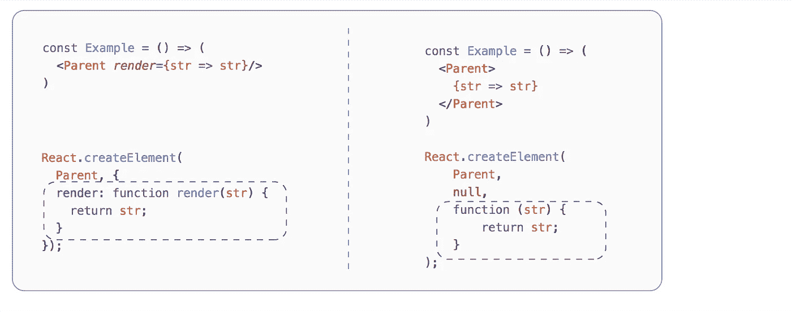

在左手边，我们像以前一样给渲染道具添加函数。当这个由 Babel 编译时，函数被添加到第二个参数中:props。在右边，我们把它作为一个孩子添加，当它被编译时，它被添加到第三个参数:孩子。

创建组件时，我们如何访问子组件？

*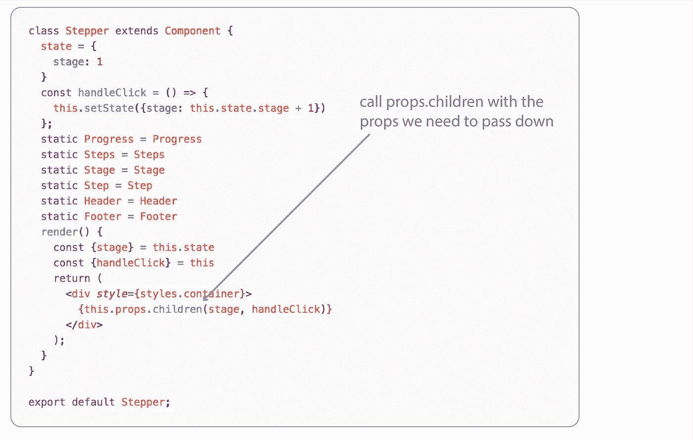*

*与调用 render prop 的方式类似，因为 child 是一个函数，所以我们可以调用 props.children 来代替，并传入我们所需的参数，为我们提供与以前相同的结果，并增强了可读性。*

*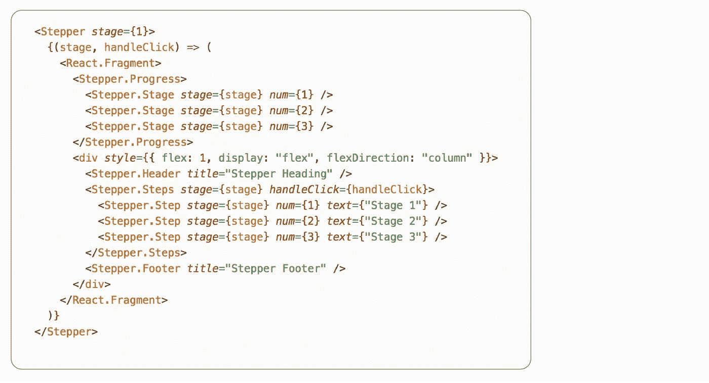*

*现在你知道了，我们设计了一个高度灵活且可读性极强的组件。用户可以自主地重新排列子组件，而不用担心它是否可以访问他们需要的道具。最终，它是可重用的。我们可以将它直接放在任何其他应用程序中，无需任何预先设置，它将完美地工作。*