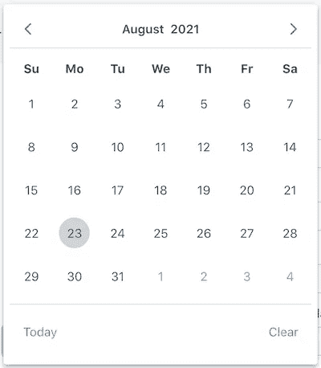
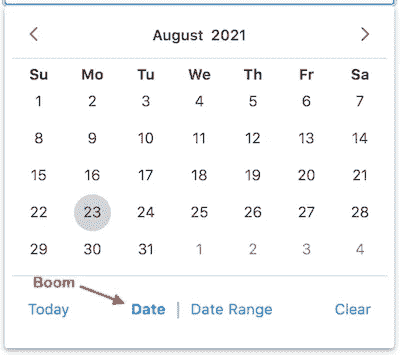
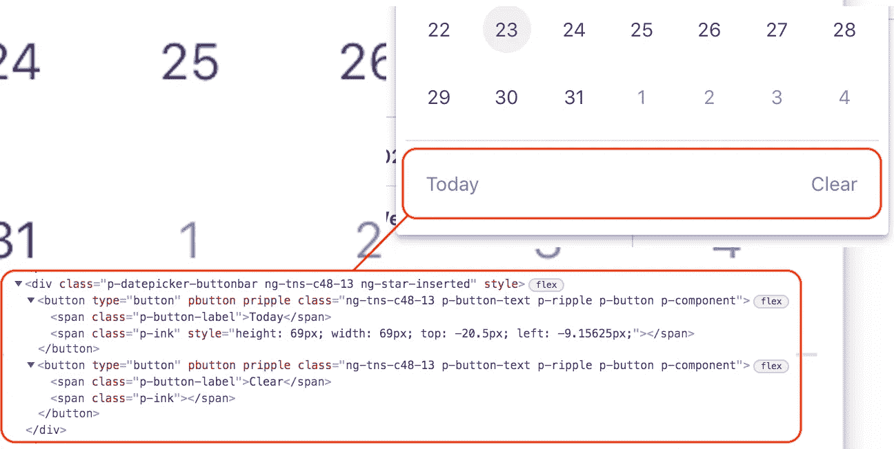
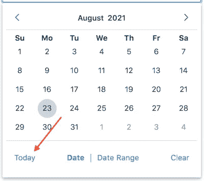
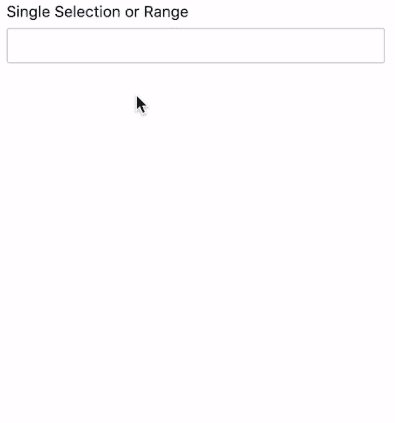

# 使用角度指令扩展第三方组件

> 原文：<https://itnext.io/using-an-angular-directive-to-extend-a-third-party-component-39f0f46a4e0?source=collection_archive---------4----------------------->

## 我增加了模式切换到一个原始日历！🤘


图片来源:[千万亿像素](https://petapixel.com/2016/02/25/dogs-trained-studio-photographers/)

# 挑战

我最近有一个需求，需要在页面上添加一个日期选择器，允许用户选择单个日期或日期范围。

在我们的应用程序中，我们已经使用了 [PrimeNG Calendar](https://www.primefaces.org/primeng/showcase/#/calendar) 组件，该组件具有一个`selectionMode`属性，用于配置 datepicker 以接受单个日期、多个日期或一个日期范围。

遗憾的是，该组件没有提供一种内置的方式来切换模式。

是时候发挥创造力了！🤔

# 目标

日历组件如下所示:



我认为页脚按钮栏是放置模式开关的完美地方。所以我的目标变成了这样:



# 方法

因为我需要操作 DOM，所以一个[指令](https://angular.io/api/core/Directive)似乎是这项工作的合适工具。

这是我开始使用的模板:

下一个决定:如何以及在哪里定义我将插入到日历中的自定义日期和日期范围按钮？

## 选项

我想到了两个选择:

1.  在模板中将它们定义为 HTML，并让指令从那里引用它们
2.  使用[渲染器](https://angular.io/api/core/Renderer2)在指令类中以编程方式创建它们

使用选项#1，为按钮构建标记会更干净、更容易(至少在我看来——当使用标记时，我通常更喜欢在。html 文件)。

但是对于选项#2，该指令将更加独立，您可以将它附加到整个应用程序的多个模板中的`p-calendar`实例，而不需要在每个模板中添加额外的按钮标记来支持它。

## 第一次切割:选项 1

对于我的第一次切割，我选择了选项#1，这也是本文将要介绍的内容。

我选择了那个选项，因为在我的情况下，我们有自己的自定义 Angular wrapper 组件围绕着`p-calendar`，并且那个自定义组件是在整个应用程序中被实例化的，而不是`p-calendar`，所以我可以只在那个自定义组件的模板中定义按钮标记，而不必再做一次。

然而，我后来也实现了选项#2，只是为了启发自己，看看它是如何比较的。两个实现的链接(以及我后来想到的使用组件和 CDK 门户的第三个实现！)都在文末。

# 实施

下面是自定义包装组件模板中定义的按钮标记的样子，就在`p-calendar`旁边:

在第 4 行，我将指令`calendarModeToggle`附加到`p-calendar`上，并向其中传递了对按钮包装元素`modeToggle`的引用。

我将按钮包装在一个`div`中，其中包含一个用于必要样式的`style`标签，将标记和样式放在一个地方。

我将那个包装器`div`放在一个 HTML `[template](https://developer.mozilla.org/en-US/docs/Web/HTML/Element/template)`标签中，这样它就可以通过一个[模板引用变量](https://angular.io/guide/template-reference-variables)被指令访问，但不会呈现在页面上。

最后，我将模板引用变量`#modeToggle`附加到包装器`div`上，这样我就可以将引用传递到指令中。

# 指令设置

下面是指令类的样子，将包装器`div`作为输入:

如果您不熟悉这种模式…如果您的指令使用属性选择器，并且您为该指令创建了一个与选择器同名的`@Input()`(在本例中为`calendarModeToggle`)，您可以将该指令附加到一个元素*上，然后*在一个方便的步骤中向其传递一些东西，就像我们在`p-calendar`上所做的那样:

```
[calendarModeToggle]="modeToggle"
```

# 插入自定义按钮

既然指令已经控制了`div.toggle-wrapper`，下一步就是让它将这些按钮插入到日历的按钮栏中。

这就是 DOM 操纵发挥作用的地方！

日历组件的按钮栏如下所示:



为了在今天和清除按钮之间插入我的切换按钮，我转向 Angular 的[渲染器 2](https://angular.io/api/core/Renderer2) 。

## 收听日期选择器节目

由于日历的 datepicker 并不总是显示——仅当控件被选中时——指令需要挂钩到日历的`onShow`事件，并在每次显示 datepicker 时插入自定义按钮。

为此，我们将日历实例注入到指令的构造函数中，并订阅它的`onShow`事件:

当显示 datepicker 时，我们调用指令的`addToggleButtonToButtonBar()`方法，如下所示:

注意，该方法首先检查`this.buttons`是否已经存在。

这是因为，即使在单击日历和选择日期时，日历组件的 datepicker 部分被插入或从 DOM 中删除，日历组件本身仍然存在，因此我们的指令也是如此——该指令不会在每次显示 datepicker 时重新实例化。

因此，我们只需要*定义*按钮*一次*，但是每次显示日期选择器时，我们都需要*将它们重新插入到按钮栏*中。**

# 赋予按钮权力

接下来，我需要连接按钮点击，这样他们就可以改变日历选择模式。

为此，我使用了 Render2 的`[listen](https://angular.io/api/core/Renderer2#listen)`方法:

`listen`方法返回一个“unlisten”函数来释放处理程序。我将那些“未被监听”的函数存储在一个名为`stopListening`的数组中，这样当指令被销毁时我就可以调用它们，以免导致内存泄漏。👼

点击监听器调用指示方法`setMode`，传入选中的模式和对点击按钮的引用。`setMode`方法看起来像这样:

我们显式地将日历的`selectionMode`设置为选中模式，然后向选中的按钮添加一个 CSS 类，这样我们就可以高亮显示它。

对于按钮点击，可选的第三个参数`clearSelection`被设置为`true`，以便当我们改变模式时，我们清除任何当前的日期选择。(您很快就会明白为什么这是一个默认为`false`的可选标志。)

# 棘手的考虑

在实现过程中出现了几个棘手的场景:

*   如果你已经导航到不同的月份或年份，改变模式会触发用户不友好的跳转到当前月份，要求你重新导航回到你所在的位置
*   在日期范围模式下单击“今天”按钮无法正常工作，因为它是单个日期

## 不友好地跳转到当前月份

当改变模式时，指令触发当前日期选择的清除。这种清除又会导致日历组件触发跳转到当前月份，这是不可取的。所以我需要解决这个问题。

该指令的`clearDateSelection`方法在模式改变时被调用，如下所示:

它只是使用日历组件的`writeValue`方法，传递给它`null`来清除任何选择的值。

那是简单的部分！

棘手的部分来了，当我注意到，如果我已经改变到一个不同的月份，然后*改变模式，我会自动回到当前月份。不是很友好的用户体验。*

所以我不得不钻研日历的源代码来找出如何防止这种情况。

## 撤消跳转到当前月份

事实证明，没有办法在不修改源代码的情况下*阻止*它，但是有一种方法可以使用日历的`createMonths`方法立即*撤销*它，该方法设置当前显示的月/年。

所以现在，在清除选择的日期之前，我将当前选择的月份和年份存储在本地变量中。我从日历的`currentMonth`和`currentYear`属性中得到这些。

然后，在清除之后，我会查看这些日历属性是否发生了变化。如果有，我就调用日历的`createMonths`方法，恢复之前选择的月份和年份，完全不影响用户。💪 🤓

## 点击今天按钮

需要处理的最后一件棘手的事情是单击 Today 按钮。



如果在日历处于日期范围模式时单击了“今天”按钮，我们需要切换到日期模式。

方便的是，日历组件公开了一个我们可以订阅的`onTodayClick`事件。我在`ngOnInit`中补充说:

下面是`handleTodayClick`方法的样子:

当日历处于“范围”模式时，它的`value`属性是一个数组而不是单个值。第一个和最后一个选定的日期成为数组中的第一个和第二个元素。

当在“范围”模式下单击“今天”按钮时，今天的日期成为数组中的第一个元素。

因此，在第 6 行，我们重新分配了日历的`value`属性，将其设置为该日期，因此将其从一个数组更改为一个日期值。如果日历已经处于“单一”模式，我们就会处于这种状态。

然后我们隐藏覆盖/日期选择器，这将触发一个淡出动画。

然后，经过一小段时间的延迟(原因见下文)，我们使用指令的`setMode`方法将模式设置为“single ”,但没有可选的第三个`clearSelection`参数，因为我们只是设置了日历的`value`属性，我们不想清除它。

最后，我们调用日历的`writeValue`方法，向其传递我们刚刚设置的`value`属性，即今天的日期。

## 为什么耽搁了？

我加上这个小小的延迟纯粹是为了美观。

它工作得很好，没有延迟，但是，点击今天，你会立即看到选择高亮从日期范围跳到日期，这让我感到有点奇怪和不和谐。通过添加小的延迟来考虑覆盖淡入淡出动画时间，高亮跳跃变得非常微妙，甚至不明显。

# 最终产品

结果是这样的:



为了防止切换按钮水平移动，当选择被改变并且被选择的按钮被加粗时，我不得不玩他们的`letter-spacing`。

在样式中，我为非粗体和粗体按钮设置了`letter-spacing`,这样它们的总宽度就相同了:

如果没有这些，它看起来就会像这样，这有点滑稽，也不专业:


# 链接

以下是这一增强的三种不同实现的链接。

## 1.带有模板中定义的按钮的指令

*   [工作栈利兹](https://stackblitz.com/edit/primeng-calendar-demo-with-selectionmode-toggle-directiv-ytrnb6?file=src%2Fapp%2Fcalendar-mode-toggle.directive.ts)
*   [GitHub 回购](https://github.com/mikejacobson/primeng-calendar-mode-toggle-directive)

## 2.指令，带有以编程方式定义的按钮

*   [工作堆栈宽度](https://stackblitz.com/edit/primeng-calendar-demo-with-selectionmode-toggle-directive?file=src%2Fapp%2Fcalendar-mode-toggle.directive.ts)
*   [GitHub 回购](https://github.com/mikejacobson/primeng-calendar-mode-toggle-directive-using-renderer)

## 3.使用 CDK 门户将按钮导入日历的组件

*   [工作堆栈宽度](https://stackblitz.com/edit/primeng-calendar-with-selectionmode-toggle-using-cdk-portal?file=src%2Fapp%2Fcalendar-mode-toggle-buttons.component.ts)
*   [GitHub 回购](https://github.com/mikejacobson/primeng-calendar-mode-toggle-component-using-cdk-portal)

CDK 门户实现的 repo 是一个真正可运行的 Angular 应用程序，而另外两个只是存储和共享代码的地方。

# 最后的想法和警告

我意识到这种增强的一部分依赖于第三方组件的内部实现细节，这些细节在未来可能只需要一个小的或补丁版本的变动就能改变。

不过，在我的例子中，这是一个本质上的内部工具，依赖版本受到严格控制，升级经过全面测试。所以我不担心 PrimeNG 可能改变他们的内部实现，在我们没有注意到的情况下破坏它，并且在它进入生产之前有机会修复它。

但是，在您自己的项目中使用这种方法之前，请记住这一点！

感谢阅读！😺