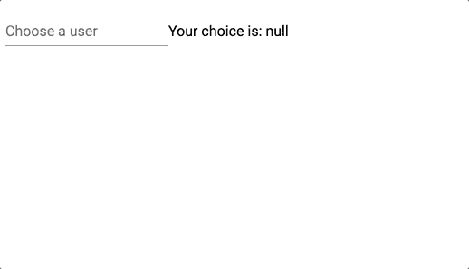

# 使用带异步数据的角度 6 材料自动完成

> 原文：<https://itnext.io/using-angular-6-material-auto-complete-with-async-data-6d89501c4b79?source=collection_archive---------1----------------------->

一个简洁的 UX 模式是使用一个自动完成组件来帮助*选择已知的选项。
假设我想从存储在服务器中的注册用户列表中选择一个用户，或者..随便输入一个名字就行了。*

# 我们想要达到的目标

我们将使用 Angular 6 和 Angular Material 来得到这个:



# 第 1 部分—从服务器获取选项

首先让我描述一下我们正在处理的服务器的响应:

```
{
  total: 5
  results: [
    User(id: 1, name: "Windstorm"),
    ...
  ]
}
```

澄清这一点后，让我们继续讨论如何填充自动完成:

我们正在创建一个反应式表单，这样我们就可以在输入发生变化后接收到一个可观察的结果。
接下来，我们将从`valueChanges`获得的可观察值存储在`filteredUsers`中，但前提是我们还对其应用了我们拥有的`search`方法(只是一个常规的数据获取服务)，并将其展平，以便管道中的下一个值将是来自服务器的响应。
我们也使用`debounceTime`,因为我们不想为输入中每个改变的字母向服务器发出请求。

**注:**我们还没有订阅可观测的。为此我们将使用一个`async`管

下面是放置自动完成选项的 html:

`async`管道现在将为我们订阅`filteredUsers`，然后我们才访问保存我们选项的`results`值。

这里是[演示](https://stackblitz.com/edit/angular-material-autocomplete-async1)

# 第 2 部分—在检索选项时添加微调器

我们只需要添加一个`mat-option`在加载时显示。
此外——我们使用`tap`和`finalize`管道来决定何时显示和隐藏`isLoading`

**注意:**`finalize`必须用于`search`方法，因为底层`httpClient`在 1 次发射后完成订阅，而`valueChanges`永不结束，所以不会命中`finalize`

这里是[演示](https://stackblitz.com/edit/angular-material-autocomplete-async2)

就这样。干杯:)