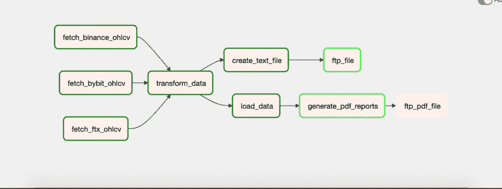
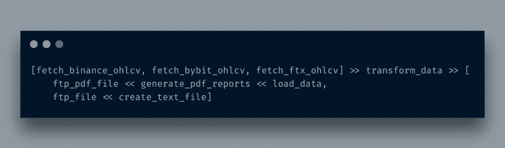
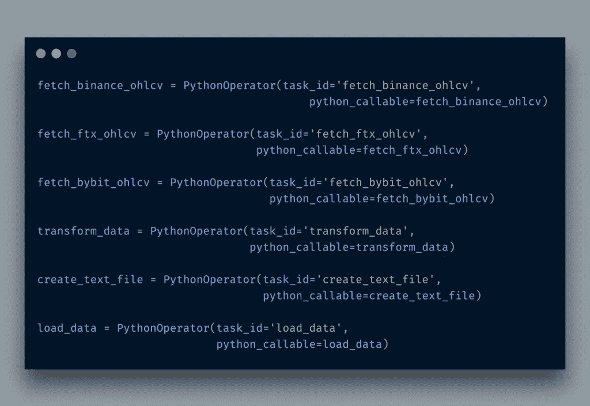
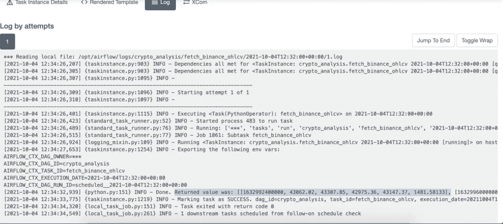
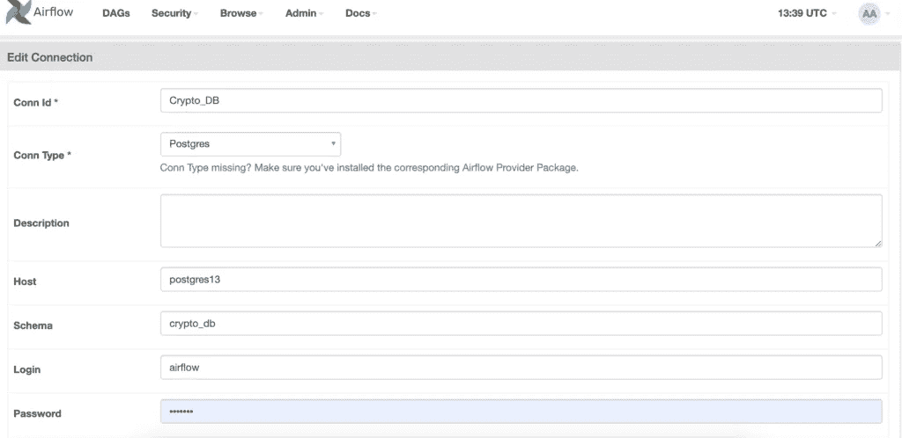
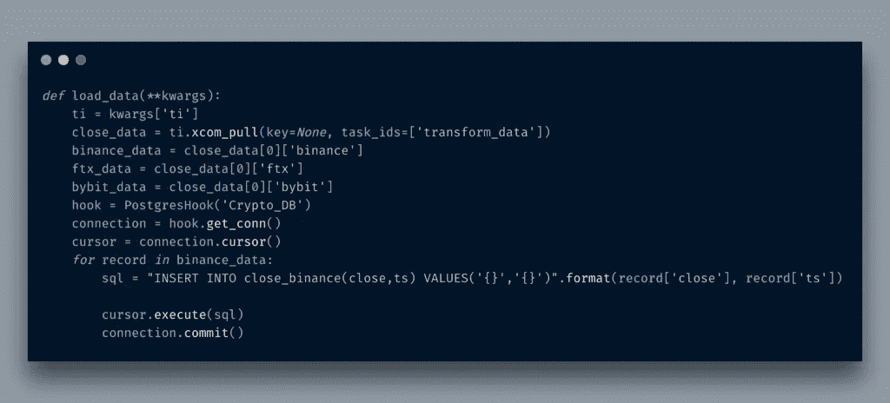
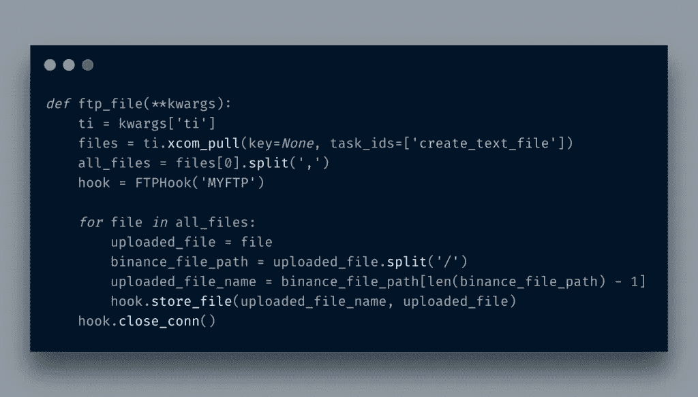
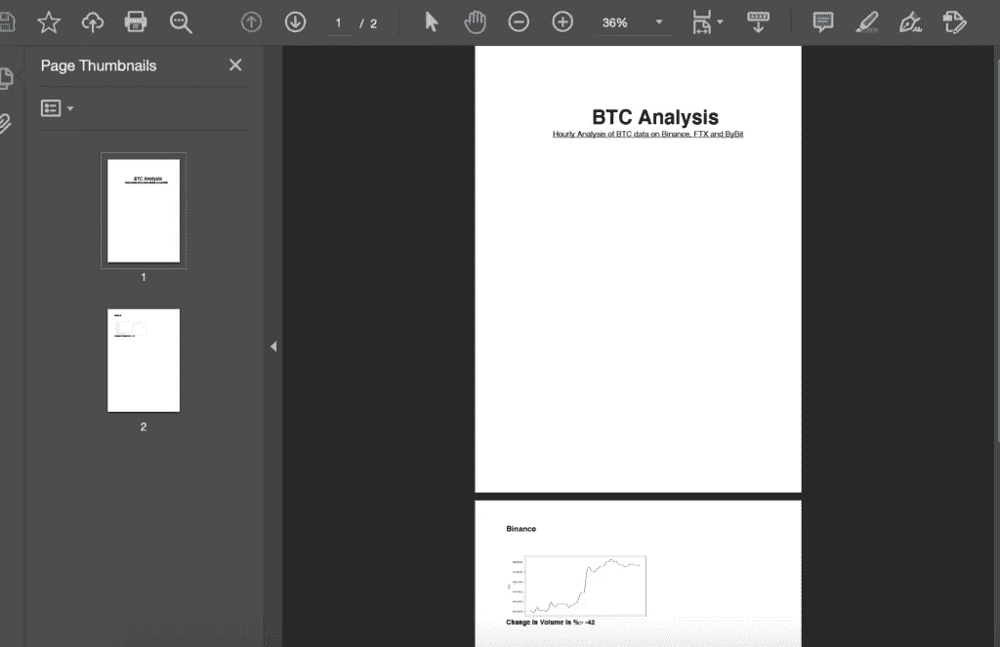
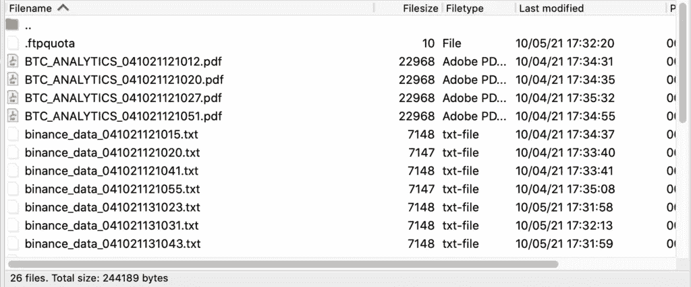

# 使用 Apache Airflow ETL 获取和分析 BTC 数据

> 原文：<https://itnext.io/using-apache-airflow-etl-to-fetch-and-analyze-btc-data-1adab96c410c?source=collection_archive---------1----------------------->

我暂时离开了与[区块链相关的](https://blog.adnansiddiqi.me/tag/blockchain-programming)帖子。

过去，我在这里报道过阿帕奇气流的帖子[。在这篇文章中，我将讨论如何使用](http://blog.adnansiddiqi.me/tag/airflow/) [CCXT](https://github.com/ccxt/ccxt) 库从交易所获取 BTC/美元数据，并创建用于数据分析和可视化的 ETL。我用的是[dockered](https://airflow.apache.org/docs/apache-airflow/stable/start/docker.html)版本的 Airflow。很容易设置和使用适当的不同映像来运行不同的组件，而不是一台机器的设置。这里有`docker-compose.yml`文件[但是我做了一些修改来安装自定义库。因此，建议您使用我在 Github repo 中提供的文件。在我继续之前，这里给出了作品的演示:](https://airflow.apache.org/docs/apache-airflow/stable/docker-compose.yaml)

# 达格

整个流程如下所示:

我从三个不同的交易所获取 BTC/美元数据:币安、ByBit 和 FTX。一旦数据可用，我将把所有三个源发送到下一个阶段，在这里我只提取*关闭*和*时间戳*数据，因为这些是我在下一个阶段需要的字段。从这里开始，我将分支出两个任务:一个是创建文本文件并存储数据以备后用，另一个是存储到 DB 中。3 个不同的文件然后通过 FTP 发送到服务器。然后，来自`load_data`部分的数据用于生成报告，然后将文件 FTP 到服务器。请注意，有些边框是深绿色，有些是浅绿色。深绿色表示这些任务成功执行，浅绿色表示它们仍在运行*。任务 *ftp_pdf_file* 尚未运行。在气流方面，DAG 流设置如下:*

**

*在第一阶段，所有 3 个任务并行运行，并将结果输出到`transform_data`，因此我将所有 3 个任务放在一个 Python `list`中。 **> >** 的标志是在告诉它是上游。转换后的数据被发送给`create_text_file`和`load_data`任务，它们本身是 ftp_file 和`generate_pdf_reports`任务的*上游*。注意，我在这里使用< <来定义`ftp_pdf_file`和`generate_pdf_reports`任务的上游。同样，这些任务首先被添加到 Python `list`中，然后分支到下一阶段。*

*为了将数据从一个任务传递到另一个任务，Airflow 提供了`xcom_pull`和`xcom_push`方法。 **XCom** 表示*交叉通信*。当您使用`xcom_pull`时，这意味着您正在从已经传递了 id 的任务中获取数据。例如:*

**

*在这里，我传递了三个任务的`task_id`,并分配了三个不同的变量。想知道这些 task _ ids 是在哪里定义的吗？它们被定义为`PythonOperator`。*

**

*检查任务日志`fetch_binance_ohlcv`:*

**

*我突出显示了任务的返回值。这个和另外两个任务值是`transform_data`任务中的 *xcom_pulled* 。*

*这里我还使用了两个外部组件:FTP 和数据库。您可以通过导入所需的库来使用传统的 python 代码，但是 Airflow 也提供了*挂钩*和*连接*的选项。例如，pgsql 连接如下所示:*

**

*一旦定义了连接，就可以使用 PG Hook 来执行基于 Postgres 的操作。*

**

*很酷，不是吗？不需要在代码中保存凭据。同样的事情也发生在 FTP 上。*

**

*最后，对数据进行分析，并为高管生成一份两页的 PDF 文件。*

**

*图形在 *matplotlib* 中生成，并作为嵌入图像保存在 PDF 文件中。*

**

*很甜蜜，不是吗？我应该添加 FTX 和 ByBit 的数据和图表，但我把它留给你；).还有，这不是一个沉重的数据分析。我已经给你提供了所有需要的数据。你可以玩玩`ta-lib`或者其他库，找到洞见。一切由你决定😉*

*我正在使用 *fpdf* python 库生成 pdf 文件。这就是文件通过 FTP 发送的方式。*

**

# *结论*

*在这篇文章中，您了解了如何为 ETL 创建复杂的流程，以及如何使用连接和挂钩来连接第三方工具，如 FTP、DB、AWS 等。如果使用得当，气流可能是一个非常强大的工具。像往常一样，这些代码可以在 Github 上找到。*

**原载于 2021 年 10 月 5 日*[*http://blog . adnansiddiqi . me*](http://blog.adnansiddiqi.me/using-apache-airflow-etl-to-fetch-and-analyze-btc-data/)*。**