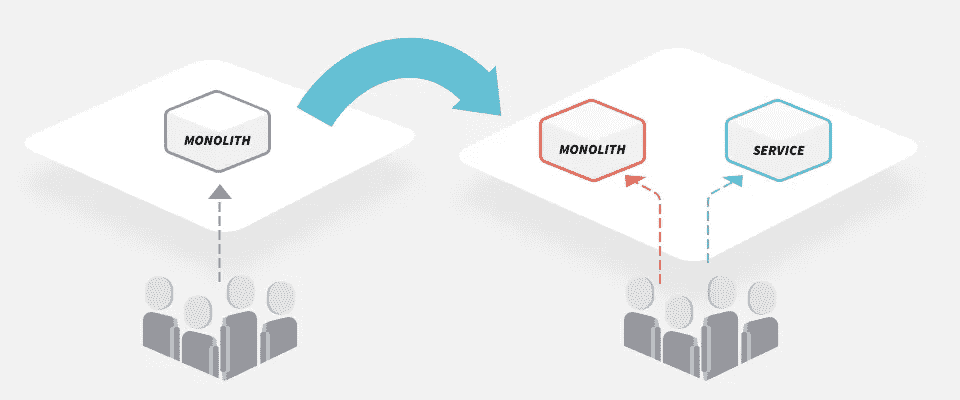
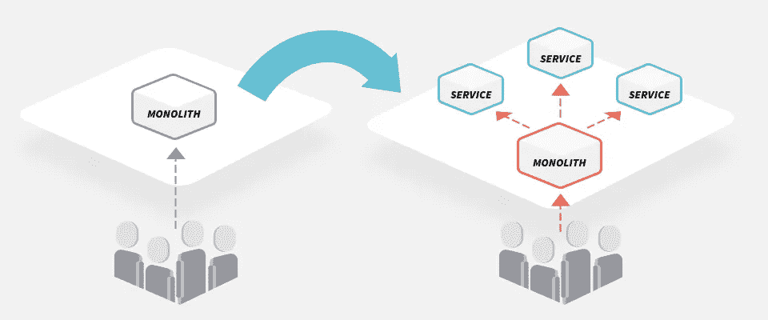
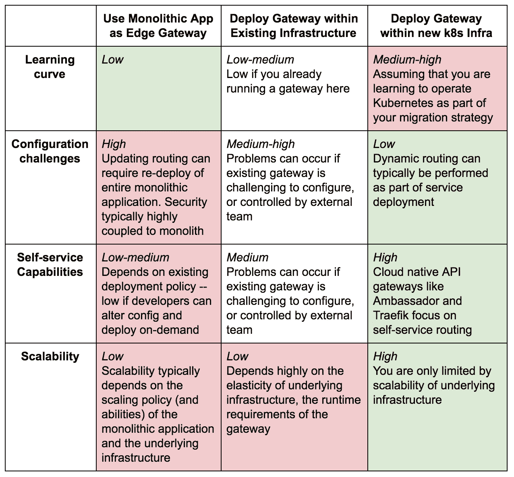
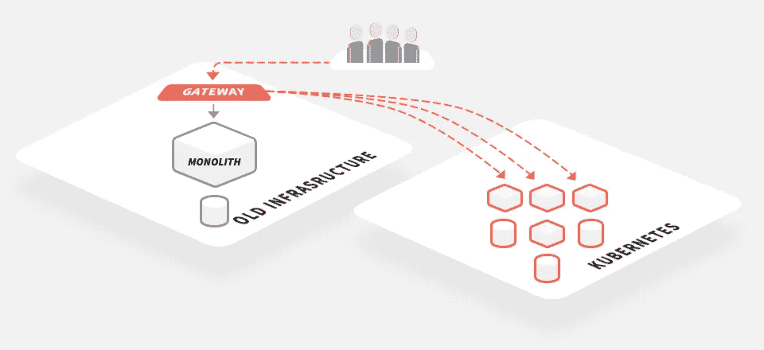
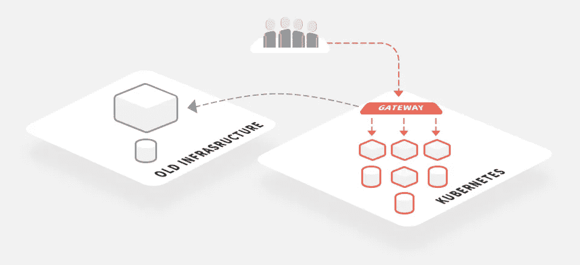
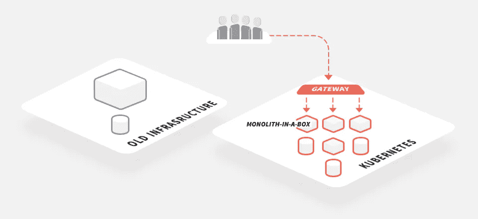

# 使用 API 网关帮助您从整体服务过渡到微服务

> 原文：<https://itnext.io/using-api-gateways-to-facilitate-your-transition-from-monolith-to-microservices-c08fe3489237?source=collection_archive---------2----------------------->

在我的咨询工作中，我遇到了许多从单一应用程序迁移到基于微服务的应用程序的工程团队。“那又怎么样？”你可能会说，“天空是蓝色的”，是的，虽然我知道这种迁移模式几乎成为老生常谈，但迁移的一些方面经常被遗忘。今天我很想谈谈其中的一个话题——边缘网关或 API 网关的角色。

# 迁移到微服务

通常在迁移开始时，显而易见的主题会受到大量关注:通过定义[领域驱动的设计](https://www.infoq.com/articles/ddd-contextmapping)激发的[有界上下文](https://martinfowler.com/bliki/BoundedContext.html)进行领域建模，创建[连续交付](https://continuousdelivery.com/)管道，自动化[基础设施供应](http://amzn.to/2Iq1HlU)，增强的[监控和日志记录](http://amzn.to/2IlxHr8)，以及加入一些闪亮的新技术( [Docker](https://www.docker.com/) ， [Kubernetes](https://kubernetes.io/) ，可能还有当前的[服务网格](https://buoyant.io/2017/04/25/whats-a-service-mesh-and-why-do-i-need-one/)或[).然而，不太明显的方面如果被忽视，会造成很多痛苦。一个恰当的例子是如何协调系统的发展和现有用户流量的迁移。虽然您希望重构现有的应用程序架构，并可能引入一些新技术，但是您不希望中断您的最终用户。](https://istio.io/)

正如我在以前的文章“持续交付:API 网关如何帮助(或阻碍)中所写的那样，像“跳舞的骨架”这样的模式可以极大地帮助证明新应用程序和基础设施的端到端可行性。然而，绝大多数潜在的客户交互都是通过系统内的单点(入口或边缘网关)进行的，因此，要对现有系统进行试验和改进，您需要在这方面投入大量的时间和精力。

# 每个(用户)旅程都从边缘开始

我显然不是第一个谈论在转向基于微服务的应用时需要有效的边缘解决方案的人。事实上，在菲尔·卡尔卡多(Phil Calcado)提出的对马丁·福勒(Martin Fowler)最初的[微服务先决条件](https://martinfowler.com/bliki/MicroservicePrerequisites.html)的扩展文章中——[卡尔卡多的微服务先决条件](http://philcalcado.com/2017/06/11/calcados_microservices_prerequisites.html)——他的第五个先决条件是“[轻松到达边缘](http://philcalcado.com/2017/06/11/calcados_microservices_prerequisites.html#5-easy-access-to-the-edge)”。Phil 根据他的经验谈到，许多组织第一次尝试在他们的 monolith 上部署新的微服务时，只是简单地将服务直接暴露在互联网上。这对于单个(简单的)服务来说可以很好地工作，但是这种方法往往不具有可伸缩性，并且还会迫使调用客户端在授权或数据聚合方面经历重重困难。

可以使用现有的整体应用程序作为网关，如果您有复杂且高度耦合的授权和身份验证代码，那么这可能是唯一可行的解决方案，直到安全组件被重构为新的模块或服务。这种方法有明显的缺点，包括要求您必须用任何新的路由信息“更新”monolith(这可能涉及完全重新部署)，以及所有流量必须通过 monolith 的事实。如果您将微服务部署到单独的新架构或平台(如 Kubernetes ),后一个问题的成本可能会特别高，因为现在进入您应用程序的任何请求都必须在接触新堆栈之前通过旧堆栈进行路由。

您可能已经在使用边缘网关或反向代理——例如 NGINX 或 ha proxy——因为在使用任何类型的后端架构时，这些都可以提供许多优势。提供的特性通常包括到多个后端组件的透明路由、头重写、TLS 终止等，以及横切关注点，而不管请求最终是如何被服务的。在这种情况下，要问的问题是，您是否希望继续将该网关用于您的微服务实现，如果您希望，是否应该以同样的方式使用它？

# 从虚拟机到容器(通过编排)

正如我在本文介绍中提到的，许多工程团队在改变应用程序架构的同时，也做出了迁移到新基础设施的决定。这样做的好处和挑战在很大程度上取决于环境，但我看到许多团队从虚拟机和纯基础设施即服务(IaaS)迁移到容器和 Kubernetes。

假设您决定将全新的微服务打包到容器中，并部署到 Kubernetes 中，您在处理边缘流量方面面临哪些挑战？本质上有三种选择，其中一种你已经读过了:

*   使用现有的整体式应用程序作为边缘网关，将流量路由到整体式应用程序或新服务。这里可以实现任何类型的路由逻辑(因为所有请求都通过 monolith 传输),并且可以在进程中调用 authn/authz
*   在您现有的基础设施中部署和运行一个边缘网关，根据 URIs 和报头将流量路由到 monolith 或新服务。Authn 和 authz 通常通过调用 monolith 或重构的安全服务来完成。
*   在您的新 Kubernetes 基础设施中部署和运行一个边缘网关，该网关基于 URIs 和报头将流量路由到 monolith 或新服务。Authn 和 authz 通常是通过调用 Kubernetes 中运行的重构安全服务来完成的。

选择在哪里部署和运行您的边缘网关需要权衡:

一旦你选择了如何实现边缘网关，下一个决定就是如何改进你的系统。概括地说，你可以尝试“扼杀”整块石头，或者你把“整块石头放在一个盒子里”并从这里开始凿掉。

# 扼杀巨石

Martin Fowler 写了一篇关于[stranger 应用程序模式](https://www.martinfowler.com/bliki/StranglerApplication.html)的很棒的文章，尽管这篇文章已经写了十多年了，但是当试图将功能从一个整体迁移到更小的服务中时，同样的指导方针也适用。该模式的核心描述了功能应该以服务的形式从整体中提取出来，这些服务通过 RPC 或类似 REST 的“[接缝](http://amzn.to/2pdQCvc)”或通过[消息和事件](https://www.infoq.com/news/2018/03/asynchronous-event-architectures)与整体进行交互。随着时间的推移，monolith 中的功能(和相关代码)被淘汰，这导致新的微服务“扼杀”现有的代码库。这种模式的主要缺点是，只要 monolith 仍然在使用，您就必须维护现有的基础设施以及您正在部署微服务的任何新平台。

Groupon 是第一批深入讨论在微服务中使用这种模式的公司之一，早在 2013 年，它就发布了“ [I-Tier:拆除整体](https://engineering.groupon.com/2013/misc/i-tier-dismantling-the-monoliths/)”。从他们的工作中可以学到很多东西，但我们绝对不需要在 2018 年编写一个定制的 NGINX 模块，就像 Groupon 最初对“Grout”所做的那样。现在现代开源 API 网关，如[大使](https://www.getambassador.io/)和 [Traefik](https://traefik.io/) 已经存在，它们使用简单的声明式配置来提供这种功能。

# 整体盒:简化连续交付

我在迁移到微服务并部署到 Kubernetes 的团队中看到的一个越来越常见的模式是我所称的“盒子里的整体”。当我们在 2015 年的 ContainerSched 会议上分享将 notonthehighstreet.com 的单片 Ruby on Rails 应用程序(被亲切地称为 [MonoNOTH](https://www.slideshare.net/dbryant_uk/containersched-2015-our-journey-to-world-gifting-domination-how-notonthehighstreetcom-embraced-docker/10) )迁移到基于微服务的架构的故事时，我和 [Nic Jackson](https://twitter.com/sheriffjackson?lang=en) 谈到了这一点。

简而言之，这种迁移模式包括将现有的整体应用程序打包到一个容器中，并像运行任何其他新服务一样运行它。如果您正在实现一个新的部署平台，比如 Kubernetes，那么您也将在这里运行 monolith。这种模式的主要好处是您的连续交付管道的均质化——每个应用程序和服务可能需要定制的构建步骤(或构建容器),以便正确编译和打包代码，但是在创建运行时容器之后，管道中的所有其他步骤都可以使用容器抽象作为部署工件。

盒中独石模式的最终目标是将您的独石部署到您的新基础设施，并逐渐将您的所有流量转移到这个新平台上。这允许您在完成整体结构的完全分解之前退役旧的基础设施。如果你遵循这种模式，那么我认为在 Kubernetes 中运行你的边缘网关更有意义，因为这是所有流量最终将被路由的地方。

# 离别的思绪

当从基于虚拟机(VM)的基础架构迁移到像 Kubernetes 这样的云原生平台时，投入时间来实施有效的边缘/入口解决方案以帮助迁移是非常值得的。您有多种选择来实现这一点:使用现有的单片应用程序作为网关；在现有基础设施中部署或使用边缘网关，在当前服务和新服务之间路由流量；或者在您的新 Kubernetes 平台中部署一个边缘网关。

在 Kubernetes 中部署边缘网关可以在实施“一体化”等迁移模式时提供更大的灵活性，并且可以更快地过渡到完全基于微服务的应用。

*本文原载于* [*getambassador.io 博客*](https://blog.getambassador.io/using-api-gateways-to-facilitate-your-transition-from-monolith-to-microservices-5e630da24717) *。*