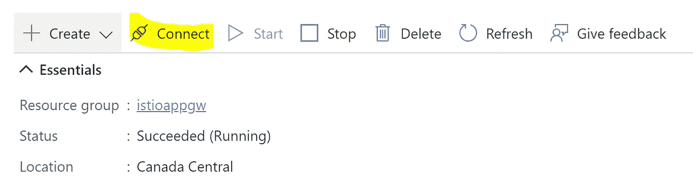
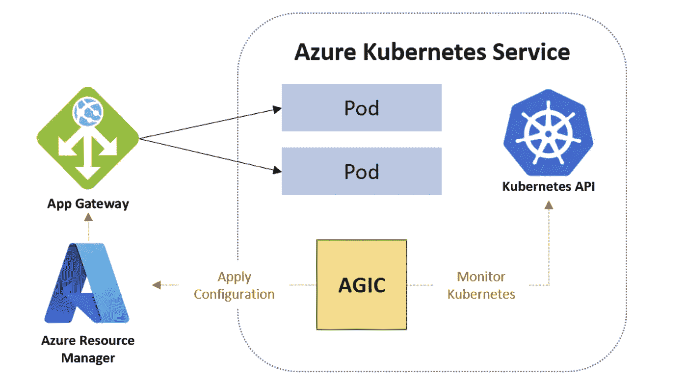
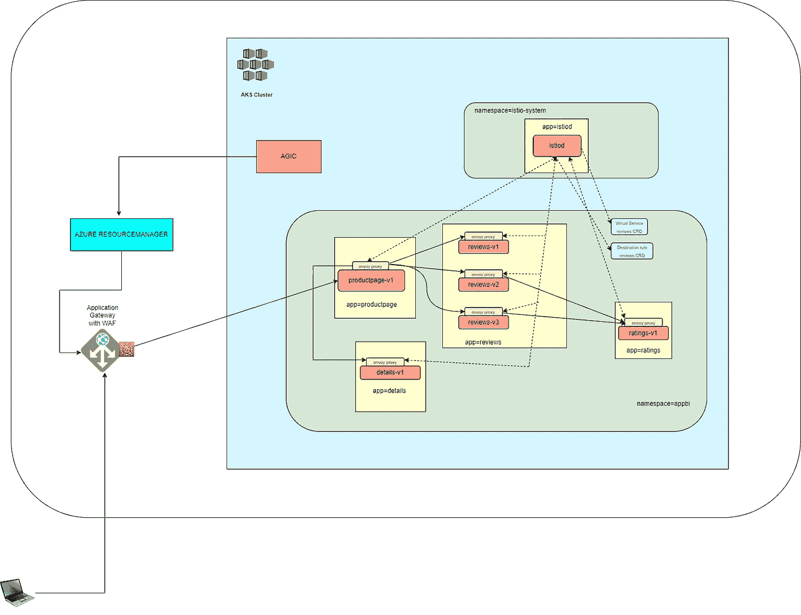

# 将 Azure 应用程序网关 WAF 与 Istio-1 一起使用

> 原文：<https://itnext.io/using-application-gateway-waf-with-istio-315b907b8ed7?source=collection_archive---------2----------------------->

# 目的

当我使用 Istio 101 撰写关于[流量管理的上一篇文章时，我想到的一件事是“你能否利用](/traffic-management-using-istio-b49663da3e8d) [Azure 应用网关 WAF](https://docs.microsoft.com/en-us/azure/web-application-firewall/ag/ag-overview) (或 [GCP 的 GCP 装甲](https://cloud.google.com/blog/products/identity-security/new-waf-capabilities-in-cloud-armor))和其他安全功能，同时不放弃 [Istio 服务网格功能](https://istio.io/latest/docs/concepts/)”

[Istio 文档](https://istio.io/latest/docs/ops/best-practices/security/#specialized-web-application-firewall-waf)指出“它们可以部署在 Istio 入口网关的前面，以规范进入网格的请求。”，所以我想通过测试来尝试一下。

**使用 Azure 应用网关入口控制器时，不能使用 Istio 入口网关。它可以存在，但流量不会通过 Istio 入口网关路由。但是您仍然可以利用与 Istio 入口网关无关的其他 Istio 服务网格功能。**

# 测试环境设置

*   使用[文档](https://docs.microsoft.com/en-us/azure/aks/learn/quick-kubernetes-deploy-portal?tabs=azure-cli)创建一个 AKS 集群。
*   使用来自[门户](https://portal.azure.com/)的说明连接到 AKS 集群



图 1

*   运行以下 shell 脚本来设置 istiod。您可以跳过设置 Istio Ingress 独立特使代理的最后 3 个命令，因为您不会使用 Istio Ingress 网关

*   运行下面的脚本来部署 BookInfo 应用程序(由 Istio 提供用于演示目的)。

*   为应用程序创建入口资源。

```
kubectl apply -f bookinfo-agic.yaml -n appbi
```

观察注释“*kubernetes.io/ingress.class: azure/应用程序网关*”被设置为将入口控制器配置为应用程序网关入口控制器。



[AGIC](https://docs.microsoft.com/en-us/azure/application-gateway/ingress-controller-overview) 通过 Kubernetes [入口资源](https://kubernetes.io/docs/user-guide/ingress/)以及服务和部署/pod 进行配置。AGIC 持续监视入口资源中配置的服务的服务端点，并运行 ARM 模板来更新应用网关配置(如果有更新)。

> 应用网关直接使用 pods 的私有 IP 与 pods 对话，不需要 NodePort 或 KubeProxy 服务。这也为您的部署带来了更好的性能。

*   按照[文档](https://docs.microsoft.com/en-us/azure/application-gateway/tutorial-ingress-controller-add-on-existing)为您创建的 AKS 集群启用 AGIC。集成成功后，您可以查看入口控制器的日志，以查看应用网关是否更新了配置。

```
kubectl logs deployment/ingress-appgw-deployment -n kube-system -f
```

此外，从 Azure 门户查看应用程序网关实例的配置。

启用 WAF(如果尚未启用)。

# 配置 Istio 特定的资源

您将为“reviews”应用程序配置虚拟服务和目标规则资源，因为它有 3 个不同的版本，并且您可以测试当请求进入服务网格时，Istio Envoy 代理是否接管。有关申请的详细信息，请参考我的[旧帖子](https://medium.com/p/b49663da3e8d)。

*   为“评论”应用程序配置虚拟服务

```
kubectl apply -f vs-reviews.yaml -n appbi
```

这将创建一个新的虚拟服务“评论”。

*   为“评论”应用程序配置目标规则

```
kubectl apply -f dr-reviews.yaml -n appbi
```

这将创建一个新的目标规则“reviews”。

# 测试

*   获取应用程序网关的公共 IP，并将其作为“bookinfo.app.io”添加到客户机上的 hosts 文件中。观察书评区显示不同的“书评”用户界面，即 v1 没有星星，v2 有黑星，v3 有红星。经常查看刷新应用程序页面时显示的 UI。
*   你可以添加故障注入(参考我的[旧帖子](/traffic-management-using-istio-b49663da3e8d)来了解这一点)，看看它如何影响应用程序。

# 入口请求流

下图显示了流量如何通过应用程序网关和服务于 web 应用程序的服务网格从客户端流向 pods。



图 2

**观察到流量直接到达 productpage 应用程序的端点 pod，并且当与 productpage 应用程序相关的 pod 尝试到达其他服务时，服务网格进入画面。**

# 结果

*   将应用网关(AGIC)与带有 Istio 服务网格的 WAF 配合使用是一种有效的配置。
*   通过这种配置，您可以充分利用这两个领域的优势。
*   该测试针对非常简单的应用程序，对于复杂的应用程序，结果可能会有所不同。

## 限制

*   **当流量通过 Istio 入口网关进入时，您将无法使用这些功能。**
*   **流量在首次接入时直接到达 pod，服务网格仅用于 pod 之间的内部通信。**

## 请阅读我的下一篇文章,在这篇文章中，我正在尝试另一种配置，你将学会如何摆脱上述限制之一