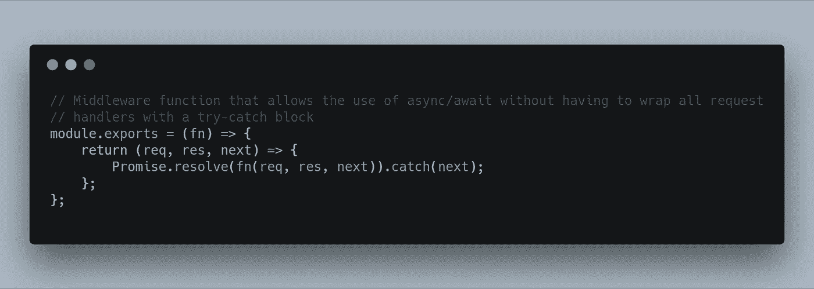

# 使用 async/await 编写更干净的路由处理程序

> 原文：<https://itnext.io/using-async-await-to-write-cleaner-route-handlers-7fc1d91b220b?source=collection_archive---------0----------------------->

> [点击这里在 LinkedIn 上分享这篇文章](https://www.linkedin.com/cws/share?url=https%3A%2F%2Fitnext.io%2Fusing-async-await-to-write-cleaner-route-handlers-7fc1d91b220b%3Futm_source%3Dmedium_sharelink%26utm_medium%3Dsocial%26utm_campaign%3Dbuffer)

自 2013 年以来，我一直在编写 Node.js 应用程序，以编写一个我从未完成的实时聊天中继应用程序。这些年来，我在大部分项目中使用 Node.js，我开发了一些看起来不会改变生活的技术，但是稍微改进了工作流。

其中一个功能是使用`async/await`。`async/await`通过保存缩进级别(臭名昭著的 JavaScript 回调地狱)给了我清理代码的能力，但也给了我控制应用程序流的能力，而不必求助于另一个缩进级别。

在我作为独立 web 开发人员的工作中，我发现自己大部分时间都在编写 RESTful APIs。为了处理一个 API 调用而执行大量异步操作的情况并不少见，因此使用承诺无疑是让事情运转的一个重要部分。

这是我的一个项目中的一个例子:

这是一个非常简单的路由处理程序，首先从数据库获取`media`对象，然后使用模板引擎呈现它们。

我的项目中最经常出现的一段代码是我的处理程序的`.catch()`部分。因为我所有的错误都是由路由链中更底层的一个(有时更多)错误处理程序来处理的，所以我需要能够将一个错误传递给`next()`方法，否则它们就不会被正确处理。

所以我有两个问题想解决:

1.  我想摆脱回调地狱(虽然，在这个例子中，这不完全是一个问题)
2.  我不想再重复自己，一遍又一遍地写同样的代码

第一个问题可以通过使用`async/await`很容易地解决，但是我仍然以下面的代码结束:

如您所见，重要的代码不再被回调分割(在请求处理程序范围内请求数据，并在`.then()`解析器回调中呈现数据)，但是我仍然有不得不一遍又一遍地重复代码的问题。

如果您的路由处理程序更加复杂，那么在您的代码中可能会出现多个`try/catch`块，同样会导致多个缩进层次，从而导致代码不那么整洁。

然后，我想出了一个非常简单的方法来解决我的问题:一个中间件函数，它允许我用 6 个额外的字符来包装我的实际路由处理程序，并且再也不用处理这个问题了！

现在，我所要做的就是将中间件包含在我的`routes/videos.js`文件中，并使用它:

现在，我的代码可能抛出的所有错误(语法错误、错误的变量名、来自外部库的异常)都将由我的错误处理程序来处理，根据我的环境设置，它可能在生产中显示一个`InternalServerError`，但在`development`中显示一个详细的错误。

希望这一小段代码可以帮助您维护一个干净的存储库。

**TL；dr 抽象，不管多小，都能改善你的代码**