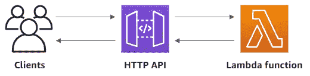
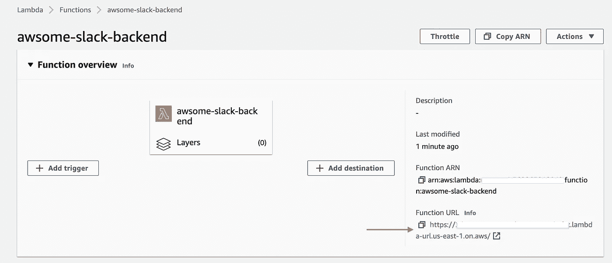
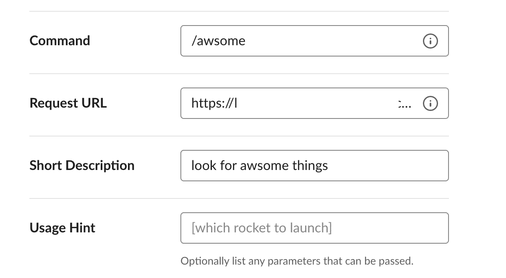
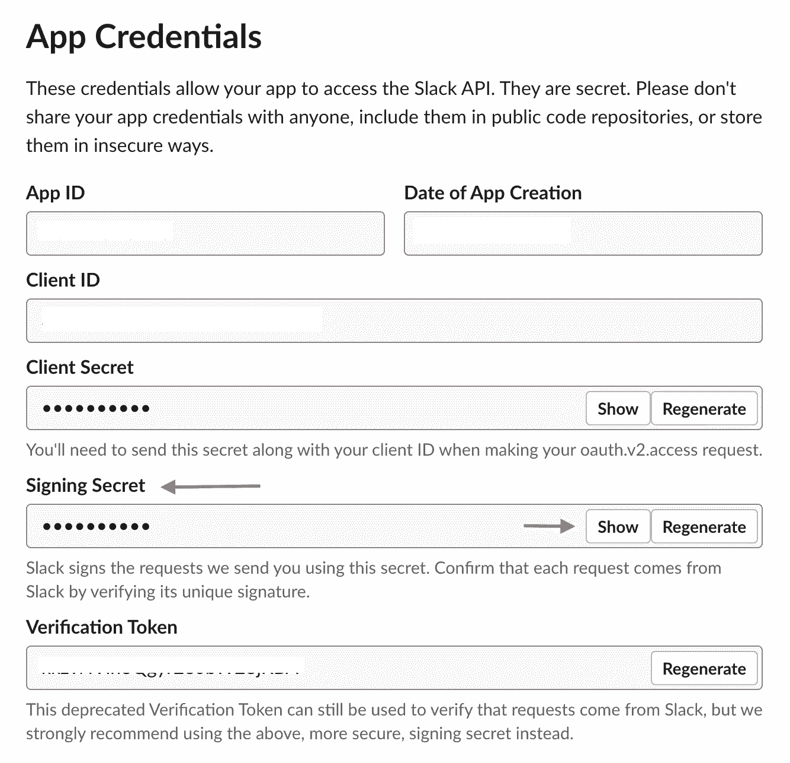
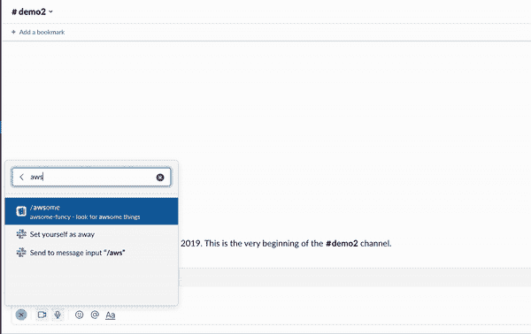

# 使用 AWS Lambda 函数 URL 构建 Slack 的无服务器后端

> 原文：<https://itnext.io/using-aws-lambda-function-url-to-build-a-serverless-backend-for-slack-a292ef355a5d?source=collection_archive---------0----------------------->

## 与 Giphy API 集成的 Slack 应用程序

AWS Lambda 和 Amazon API Gateway 的组合是一种广泛用于无服务器微服务和基于 API 的解决方案的架构。它们使开发人员能够专注于他们的应用程序，而不是花费时间配置和管理服务器。



API Gateway 是一个功能丰富的产品，包括支持不同的 API 类型(HTTP、REST、WebSocket)、多种身份验证方案、API 版本控制、canary 部署等等！但是，如果您的需求比较简单，并且您所需要的只是 Lambda 函数的 HTTP(S)端点(例如，作为一个 webhook)，那么您可以使用 [Lambda 函数 URL](https://docs.aws.amazon.com/lambda/latest/dg/lambda-urls.html)！当您创建一个函数 URL 时，Lambda 会自动生成一个惟一的 HTTP(S)端点，专门用于您的 Lambda 函数。

这篇博文用一个实际例子演示了如何使用 Lambda 函数 URL。您将构建一个 [Go Lambda 函数](https://docs.aws.amazon.com/lambda/latest/dg/lambda-golang.html)作为 [Slack](https://slack.com/) 的无服务器 webhook 后端。

这是一个分步指南，包括:

*   应用程序概述
*   配置和部署该功能(以及一些需要注意的问题！)
*   如何配置 Slack 来实现端到端集成
*   测试应用程序，玩得开心！

到本博客结束时，您应该已经配置、集成和部署了一个有用的(希望有趣？)使用 Lambda 函数 URL 的 app。在这个过程中，您将对这个特性有一个大致的了解，您可以在构建自己的解决方案时利用它！

> *代码为* [*可在 GitHub*](https://github.com/abhirockzz/awsome-slack-backend) 上获得

# 它是如何工作的


本博客中展示的示例应用程序是针对 Slack 的 [Giphy 的精简版本。(最初的)Giphy Slack 应用为一个搜索词返回一堆 gif，用户可以从中选择一个。为了简单起见，我做了一些调整，使得无服务器后端使用](https://get.slack.help/hc/en-us/articles/204714258-Giphy-for-Slack) [Giphy Random API](https://developers.giphy.com/docs/#operation--gifs-random-get) 简单地为搜索关键字返回一个(单个)随机图像。

由于该解决方案将被集成为 Slack 中的一个[斜杠命令](https://api.slack.com/interactivity/slash-commands)，最终用户(您！)将使用`/awsome <your search term>`从 Slack 工作区调用它(这里`awsome`只是 slash 命令的名称)。这反过来调用 Lambda 函数 URL(配置将在后面的博客中介绍)，它会处理剩下的事情。

例如，使用`/awsome serverless`从您的 Slack 工作区调用它将会返回一个随机的 GIF(您稍后将会尝试这个！)

以下是 Lambda 函数的功能概述:

*   Slack slash 命令调用导致一个`base64`编码的字符串有效载荷被发送到 Lambda 函数 URL——所以第一步是解码它。
*   这个函数只应该被 Slack 调用，我们需要确保我们确认了这一点。Slack 允许应用程序使用签名秘密来验证请求，从而使这成为可能——该功能只是实现了签名匹配方案的 Go 版本，此处[为](https://api.slack.com/authentication/verifying-requests-from-slack)
*   如果签名匹配成功(如果失败，我们向客户机返回一个错误)，Slack 请求被解析以提取用户发送的搜索`text`。
*   然后，使用搜索词调用 [Giphy 随机 API](https://developers.giphy.com/docs/api/endpoint#random) 。如果我们得到一个成功的响应，我们解析它并以它想要的格式发送回 Slack

最后，用户可以在他们的空闲工作区看到 GIF！

为了专注于解决方案的其他方面，我将跳过代码演练，但函数签名值得一提，它类似于您在基于 API 网关的解决方案中使用的函数签名:

```
func Funcy(r events.LambdaFunctionURLRequest) (events.LambdaFunctionURLResponse, error) {
    ...
}
```

我们正在使用[事件。LambdaFunctionURLRequest](https://pkg.go.dev/github.com/aws/aws-lambda-go/events#LambdaFunctionURLRequest) 作为输入并返回[事件。LambdaFunctionURLResponse](https://pkg.go.dev/github.com/aws/aws-lambda-go/events#LambdaFunctionURLResponse) 。在幕后，Lambda 将请求映射到事件对象，然后将其传递给函数。最后，函数响应被映射到一个 HTTP 响应，Lambda 通过函数 URL 将这个响应发送回客户机。

> *您可以在* [*文档*](https://docs.aws.amazon.com/lambda/latest/dg/urls-invocation.html#urls-payloads) 中详细阅读

那很方便，对吗？您可以使用 API 网关约定，而无需实际设置和配置！

有了这些背景信息，让我们转到部署功能的部分，并用 Slack 进行测试。但是，在此之前，请确保您已经做好以下准备:

# 先决条件

*   [创建一个 AWS 帐户](https://portal.aws.amazon.com/gp/aws/developer/registration/index.html)(如果您还没有)并登录。您使用的 IAM 用户必须有足够的权限进行必要的 AWS 服务调用和管理 AWS 资源。
*   安装和配置 [AWS CLI](https://docs.aws.amazon.com/cli/latest/userguide/install-cliv2.html)
*   [安装 Go](https://go.dev/dl/)
*   [安装 Git](https://git-scm.com/downloads)
*   [如果没有，创建一个宽松的工作空间](https://slack.com/create)。
*   创建一个 GIHPY 帐户(这是免费的！)和[创建一个 app](https://developers.giphy.com/dashboard/?create=true) 。您创建的每个应用程序都有自己的 API 密钥。

> *请记下您的 GIPHY API 密钥，因为您稍后会用到它*

克隆 Github repo 并移动到正确的目录:

```
git clone https://github.com/abhirockzz/awsome-slack-backend
cd awsome-slack-backend/function
```

> *后续步骤使用 AWS CLI —我特意使用了 AWS CLI，以便突出显示流程的特定方面。请查看* [*本教程*](https://docs.aws.amazon.com/lambda/latest/dg/urls-tutorial.html) *获取 CloudFormation 和 SAM*

# 构建、压缩和部署函数！

```
export FUNC_NAME=awsome-slack-backend
export FUNC_GO_BINARY_NAME=awsome
export ZIP_NAME=function.zipGOOS=linux go build -o $FUNC_GO_BINARY_NAME main.gozip function.zip $FUNC_GO_BINARY_NAME
```

首先，为 Lambda 创建一个 IAM 角色，并附加`AWSLambdaBasicExecutionRole`策略:

```
export ROLE_NAME=demo-lambda-roleROLE_ARN=$(aws iam create-role \
        --role-name $ROLE_NAME \
        --assume-role-policy-document '{"Version": "2012-10-17","Statement": [{ "Effect": "Allow", "Principal": {"Service": "lambda.amazonaws.com"}, "Action": "sts:AssumeRole"}]}' \
        --query 'Role.[Arn]' --output text)aws iam attach-role-policy --role-name $ROLE_NAME --policy-arn arn:aws:iam::aws:policy/service-role/AWSLambdaBasicExecutionRole
```

创建函数:

```
aws lambda create-function \
    --function-name $FUNC_NAME \
    --runtime go1.x \
    --zip-file fileb://$ZIP_NAME \
    --handler $FUNC_GO_BINARY_NAME \
    --role $ROLE_ARN
```

创建函数后，继续添加函数 URL:

```
aws lambda create-function-url-config \
    --function-name $FUNC_NAME \
    --auth-type NONE
```

> *在这个示例应用程序中，我们使用* `*NONE*` *作为认证类型。这意味着 Lambda 函数的 URL 将可以公开访问——稍后会有更多介绍*

如果您导航到 AWS 控制台并打开刚刚创建的函数，您应该会看到与其相关联的函数 URL:



让我们调用函数——复制函数 URL 并将其粘贴到浏览器中，或者使用任何其他工具(例如`curl`)

```
curl -i <FUNCTION_URL>
```

您应该得到一个带有`HTTP 403 Forbidden`状态代码的`{"Message":"Forbidden"}`响应

> *不要担心，这是意料之中的事，我想确保您遇到这个问题并了解根本原因。*

即使我们使用`NONE`作为身份验证方案，用户仍然必须拥有`lambda:InvokeFunctionUrl`权限才能成功调用函数 URL。(稍微)棘手的一点是，当你通过控制台或 AWS 无服务器应用程序模型(AWS SAM)创建一个函数 URL(使用 auth type `NONE`)时，Lambda *会自动*为你创建基于资源的策略声明(细节见[文档](https://docs.aws.amazon.com/lambda/latest/dg/urls-auth.html#urls-auth-none))。如果你直接使用 AWS CLI(就像这篇博客中一样)、AWS CloudFormation 或 Lambda API，情况就不一样了——你必须自己添加权限。

让我们这样做:

```
aws lambda add-permission \
    --function-name $FUNC_NAME \
    --action lambda:InvokeFunctionUrl \
    --statement-id FunctionURLAllowPublicAccess \
    --principal "*" \
    --function-url-auth-type NONE
```

> *要查看策略，请在 AWS 控制台中导航到您的功能:配置>权限*

再次调用该函数:

```
curl -i <FUNCTION_URL>
```

这一次，您将得到一个不同的错误，带有一个`HTTP 401 Unauthorized`状态代码。这也是意料之中的！

让我们完成剩下的配置，让事情正常运行。

# 配置时差

> *请注意，本节中的大部分说明改编自* [*时差文档*](https://api.slack.com/slash-commands#creating_commands)

首先登录你的 [Slack Workspace](https://slack.com/signin) 和[创建一个新的 Slack App](https://api.slack.com/apps/new) 。

一旦完成，创建一个斜线命令——转到你的应用程序的设置页面，然后点击导航菜单中的*斜线命令*功能。你会看到一个标有*创建新命令*的按钮，当你点击它时，你会看到一个屏幕，要求你用需要的信息定义你的新*斜线命令*。

输入所需的信息—为命令输入`/awsome`,并在请求 URL 中输入 Lambda 函数 URL



最后，将应用程序安装到您的工作区—单击导航菜单中的*基本信息*功能，选择*将应用程序安装到您的工作区*，然后单击*将应用程序安装到工作区*。这将把应用程序安装到您的 Slack 工作区，以测试您的应用程序并生成您需要与 Slack API 交互的令牌。

一旦你安装完应用程序，*应用程序凭证*就会出现在同一页面上。你需要从那里获取你的*松弛签名秘密*

> *记下你的应用签名密码，因为你以后会用到它*



# 更新功能

现在您已经有了松弛签名密钥，您还需要确保在函数中配置它。另外，不要忘记 GIPHY API 键，因为该函数需要它来调用 GIPHY REST 端点。

让我们更新函数，将这些作为环境变量包括进来:

```
aws lambda update-function-configuration \
    --function-name $FUNC_NAME \
    --environment "Variables={SLACK_SIGNING_SECRET=<enter Slack signing secret>,GIPHY_API_KEY=<enter Giphy API key>}"
```

> 示例应用程序使用 Lambda 环境变量来存储 Slack 和 GIPHY 的键——这只是为了演示。您应该使用诸如[*AWS Secrets Manager*](https://aws.amazon.com/secrets-manager)*之类的解决方案来安全地存储和管理凭证。*

# 你都准备好了！

前往您的 Slack 工作区并调用该命令。例如，要获得一个随机的猫 GIF，只需键入:

```
/awsome cat
```

我得到了这样的回应。你呢？:-)



请随意使用该应用程序！

# 打扫

完成后，删除该函数以及 IAM 策略和角色。

```
aws lambda delete-function --function-name $FUNC_NAMEaws iam detach-role-policy  --role-name $ROLE_NAME --policy-arn arn:aws:iam::aws:policy/service-role/AWSLambdaBasicExecutionRoleaws iam delete-role --role-name $ROLE_NAME
```

# 结论

您为 Slack 配置并部署了一个无服务器的后端，在这个过程中，您通过这个示例应用程序了解了 Lambda 函数 URL 的一些方面。我鼓励您探索其他功能，如 [AWS_IAM 认证](https://docs.aws.amazon.com/lambda/latest/dg/urls-auth.html#urls-auth-iam)、 [CORS 配置](https://docs.aws.amazon.com/lambda/latest/dg/urls-configuration.html#urls-cors)、[节流限制](https://docs.aws.amazon.com/lambda/latest/dg/urls-configuration.html#urls-throttling)、[监控](https://docs.aws.amazon.com/lambda/latest/dg/urls-monitoring.html)等。

编码快乐！