# 使用 AWS Lightsail 托管网站

> 原文：<https://itnext.io/using-aws-lightsail-to-host-websites-1ccfeb5597c2?source=collection_archive---------5----------------------->

## 比共享主机解决方案更经济、更快。

AWS Lightsail 使我们能够廉价地托管真正高性能的网站。加上一个好的控制面板和备份，你就有了一个快速托管的坚实基础。

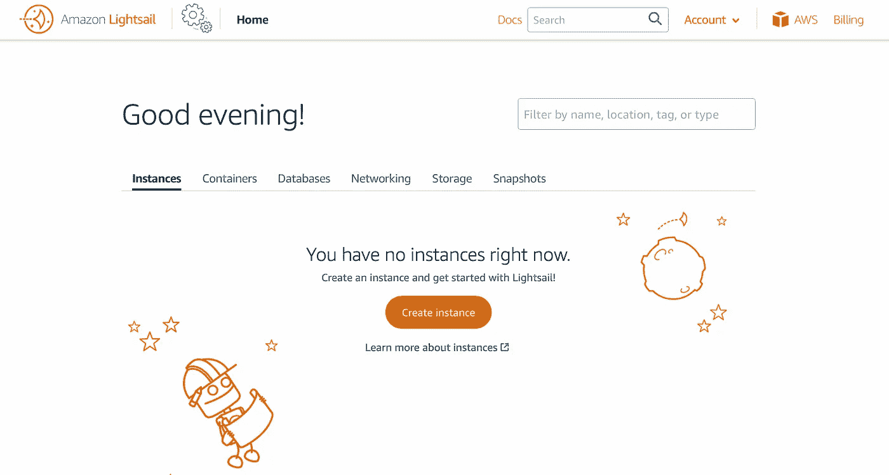

[光帆](https://lightsail.aws.amazon.com/ls/webapp/home/instances)界面

本文分为以下几章，可以随意跳过你可能已经知道的部分。

*   **1。什么是 Lightsail？**
*   **2。为什么是 Lightsail 而不是共享主机？**
*   **3。让我们谈谈控制面板**
*   **4。创建 Lightsail 实例**
*   **5。安装控制面板**
*   **6。计划自动备份**
*   **7。总结**

# 1.什么是 Lightsail？

Lightsail 是 AWS 提供的一种服务，它以一种价格将不同的服务捆绑在一起。所有软件包都包括 DNS 管理、静态 IP、EBS 存储和 EC2 实例(T2 类型)。

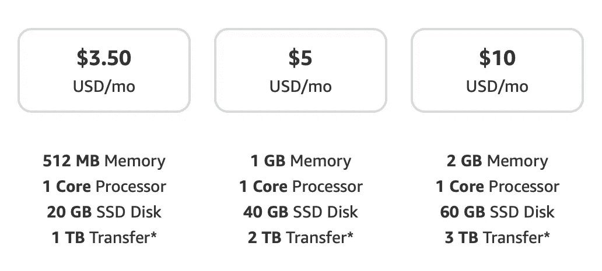

Linux 机器的入门级 Lightsail 价格，来自 [AWS Lightsail](https://aws.amazon.com/free/compute/lightsail/?trk=ps_a134p000006paVYAAY&trkCampaign=acq_paid_search_brand&sc_channel=PS&sc_campaign=acquisition_BEN&sc_publisher=Google&sc_category=Cloud%20Computing&sc_country=BEN&sc_geo=EMEA&sc_outcome=acq&sc_detail=aws%20lightsail&sc_content=Lightsail_e&sc_matchtype=e&sc_segment=495008897881&sc_medium=ACQ-P%7CPS-GO%7CBrand%7CDesktop%7CSU%7CCloud%20Computing%7CLightsail%7CBEN%7CEN%7CText&s_kwcid=AL!4422!3!495008897881!e!!g!!aws%20lightsail&ef_id=Cj0KCQjwg7KJBhDyARIsAHrAXaH5cZuPPiHc70pkmkgZk_xUpQno30f2fYGw9WhzcXBEV8WAtnq_2v4aAoTXEALw_wcB:G:s&s_kwcid=AL!4422!3!495008897881!e!!g!!aws%20lightsail)

这些套餐价格便宜。小包装每年只需 42 美元。请注意，此价格不包括备份成本，对于 20 GB SSD 存储选项，每月大约需要额外支付 1.5 美元。整个包的行为类似于 VPS。

有趣的是，AWS Lightsail 自带易于使用的界面。如果你不太熟悉 AWS，你仍然会很快习惯这个界面。

[光帆](https://lightsail.aws.amazon.com/ls/webapp/home/instances)界面

该界面允许您在引导您的同时轻松管理最重要的项目。无论是备份、IP 地址、防火墙还是存储。感谢 AWS 制作了如此简单易用的界面。

# 2.为什么是 Lightsail 而不是共享主机？

共享主机真的很方便。大多数共享主机都带有 cPanel 和自动备份。这对业主来说很方便，但对用户来说是这样吗？

我用相同的网络文件做了一个快速测试，一个在 Lightsail 上，另一个在一个流行的共享主机上。共享主机在谷歌的 PageSpeed Insights 上获得了 **64/100** 的分数。**的光帆设置**获得了惊人的 **90/100** 的成绩，总体感觉要快得多。这是因为 Lightsail 类似于 VPS，服务器本身不与其他网站共享，而在共享主机上，许多网站运行在一个虚拟机上。

现在，虽然 Lightsail 更快，但我必须警告你，你需要自己负责服务器、升级和备份。从好的方面来说，使用 AWS，您的备份将始终是安全的，并且很容易恢复。我对共享主机没有同样的感觉。如果你对电脑有点经验，这对你来说应该不会太复杂。

# 3.让我们谈谈控制面板

在我们开始设置一切之前，我们需要讨论一下控制面板。一个好的共享主机自带一个很棒的控制面板，比如 cPanel 或者 Plesk。这些都很棒，但不是免费的。

cPanel 只能使用 15 天，之后需要一个昂贵的许可证。这不是一个选项。

Plesk 对 3 个域名是免费的。如果你要在 Lightsail 上完成整个设置，3 个域名可能对你来说不够。如果是，请继续使用 Plesk，因为它很棒！事实上，AWS 附带了一个 Plesk-ready 映像，开箱即用！

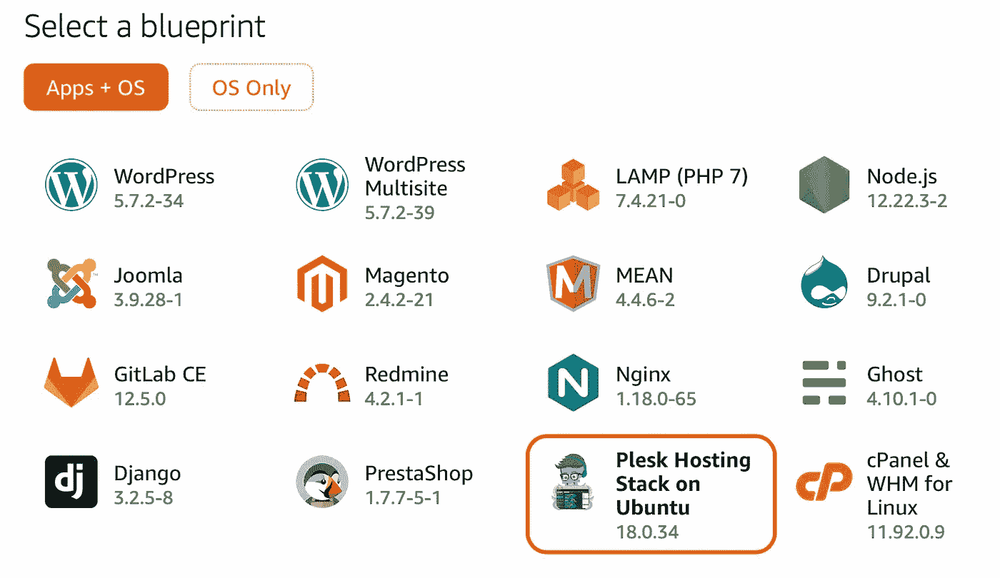

使用 AWS Lightsail 的一键式实例安装

有免费的控制面板吗？我搜索过了。这是我发现的。

*   有些控制面板很漂亮，但也有很多安全问题。这不仅仅限于免费的控制面板。
*   免费的控制面板不太可能被长期维护，因此在选择控制面板时，这始终是一个需要考虑的风险。
*   赫斯缇雅看起来像一个伟大的控制面板，它看起来很棒，它易于安装，易于使用，它感觉很强大。然而，它的社区似乎相当小。

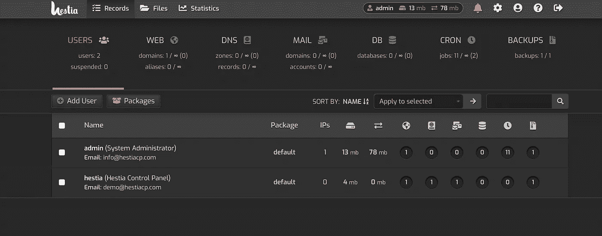

来自 [HestiaCP](http://hestiacp.com) 的演示页面

*   Froxlor 有一个更大的社区，但是在设计上看起来有点过时。它看起来仍然是较好的免费控制面板之一。

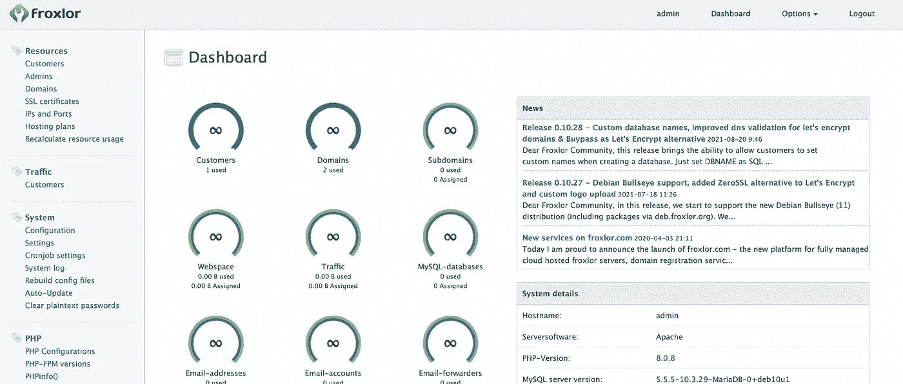

来自 [Froxlor 演示](https://froxlor.org)的 Froxlor 控制面板

*   AAPanel 是一个非常简单的面板，但是它有更多的功能，比如很容易地在你的服务器上安装 MongoDB 服务。它没有一个经销商的选项，如果这是你正在寻找的。更多的功能意味着更多的潜在安全风险。

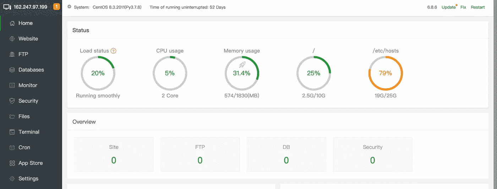

来自 [AAPanel](https://www.aapanel.com/index.html) 的 AAPanel 演示

*   CentOSWebPanel 有很多功能，让我想到 cPanel。它非常讨人喜欢，但是伴随着这么多的特性而来的总是安全风险。它确实有一个非常大的社区。他们确实开始提供收费的专业版。

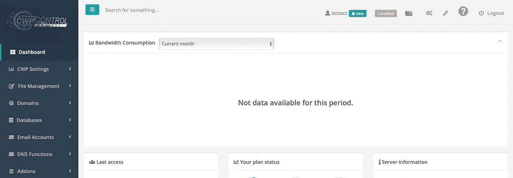

托管用户的 [CentosWebPanel](http://centos-webpanel.com)

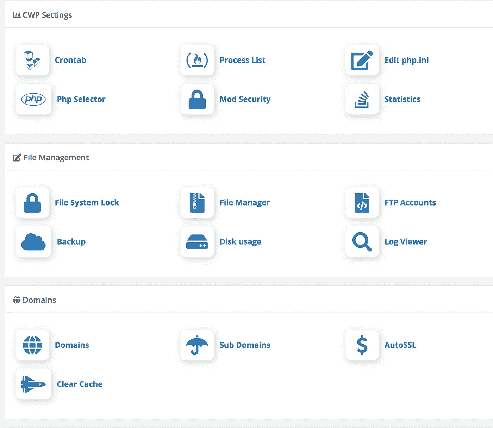

[CentOSWebPanel](http://centos-webpanel.com) 的界面还算可以辨认

我选择 HestiaCP 是因为它看起来很轻量级，但仍然提供了我需要的所有功能。您可以轻松管理 DNS 区域、虚拟主机和数据库。完美。

# 4.创建 Lightsail 实例

*   首先，在 AWS 上登录 [Lightsail。](https://lightsail.aws.amazon.com)
*   创建一个新实例，并选择符合控制面板要求的操作系统。在我们的例子中，HestiaCP 需要 Ubuntu 20。

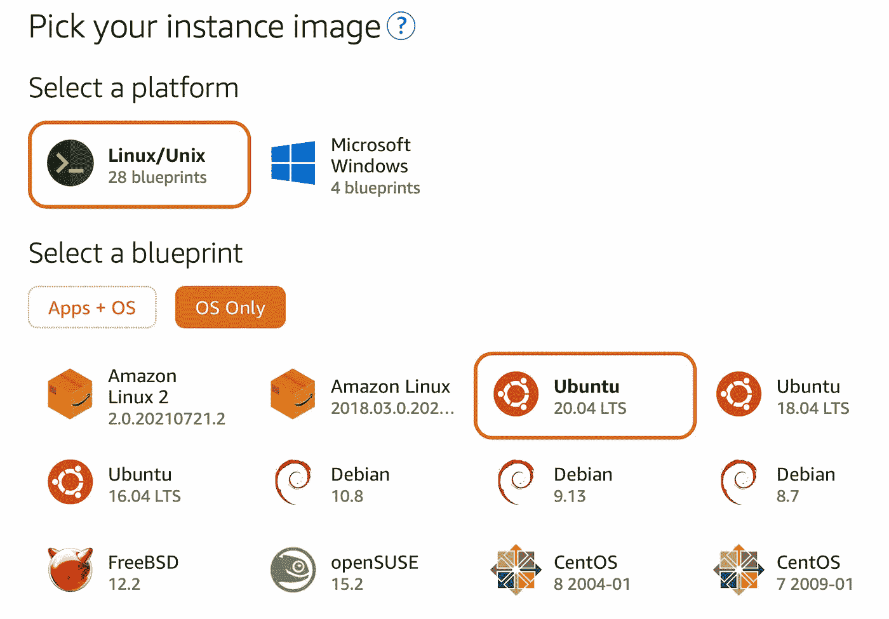

在 [Lightsail](https://lightsail.aws.amazon.com/ls/webapp/create/instance?region=eu-west-1) 中选择操作系统

*   选择一个实例计划。在我们的例子中，我们将从最便宜的选项开始，如果需要，以后从备份快照升级。

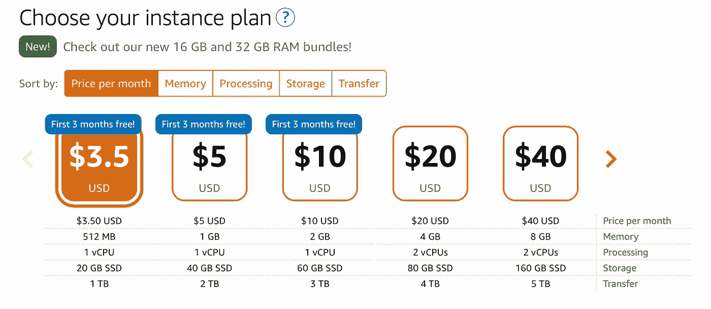

[光帆](https://lightsail.aws.amazon.com/ls/webapp/create/instance?region=eu-west-1)的计划价格

*   创建完成后，继续转到 Network 选项卡，为您的服务器分配一个空闲的静态 IP。

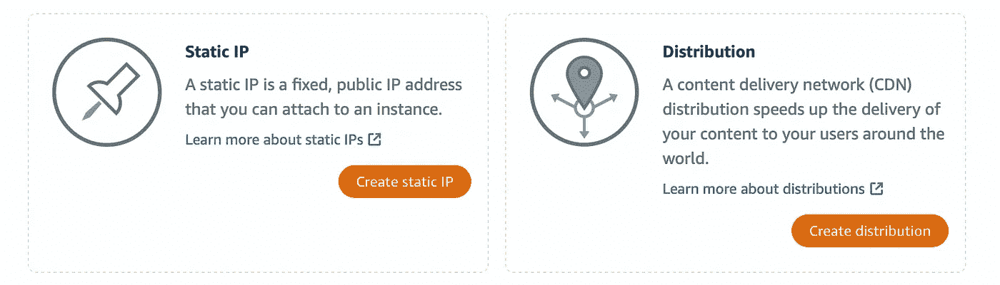

# 5.安装控制面板

*   使用 Lightsail 上的 SSH 选项连接到实例

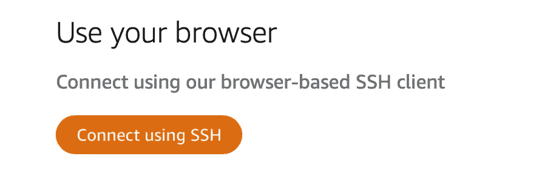

*   根据[赫斯缇雅文档](https://www.hestiacp.com)输入 2–3 个安装命令，并按照说明进行操作
*   赫斯缇雅在端口 8083 上运行，默认情况下该端口被阻止。转到 Lightsail 并为您的特定 IP 范围打开此端口。如果你是唯一一个使用控制面板的人，只为你打开它，让你的服务器更加安全。

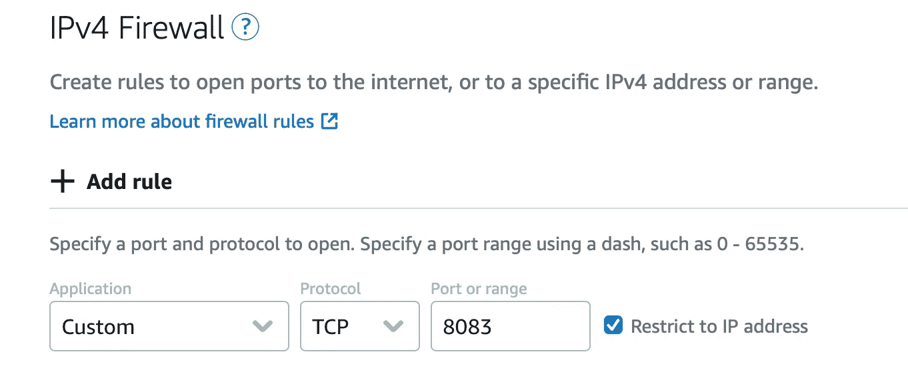

在 Lightsail 防火墙设置中打开 8083 端口

*   完成后，您将能够通过进入 [https://yourip:8083/](https://yourip:8083/) 并使用安装期间显示的用户名和密码登录来连接到赫斯缇雅面板。

如果一切顺利，你应该能看到赫斯缇雅！

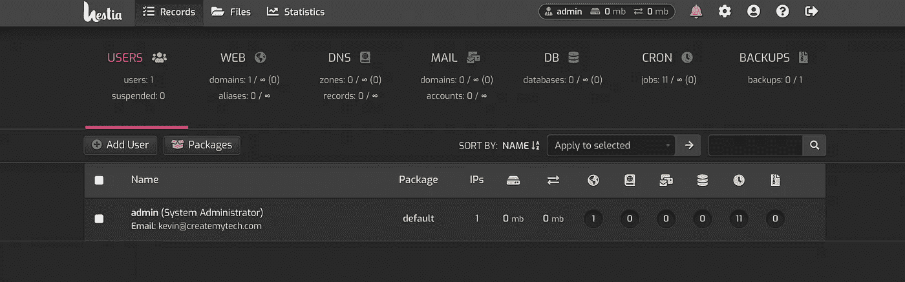

运行在最小的 Lightsail Ubuntu 软件包上的赫斯缇雅控制面板

# 6.计划自动备份

要启用自动备份，只需启用 Lightsail 实例的 backups 选项卡上的按钮即可。

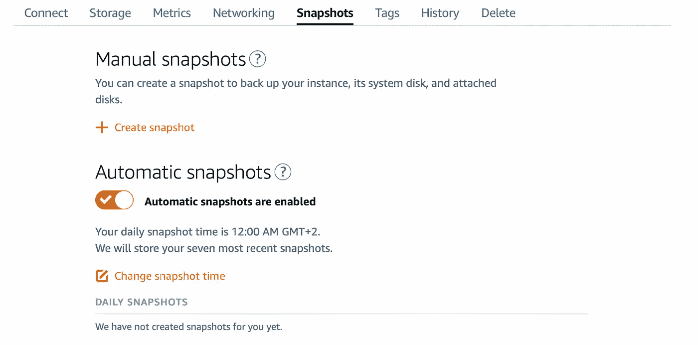

启用自动快照

请注意，无论磁盘上的数据使用情况如何，快照大小都将是实例磁盘的完整大小。如果您选择了 20GB 的 SSD 实例，快照大小将为 20GB。有趣的是，它进行了大量优化。

第二天的快照总量不会达到 20GB，而是一个增量快照，仅包括自前一天以来的更改。

一旦最早的快照被删除，必要的数据将被合并到第二早的快照上，依此类推。对于中等程度的使用，快照的总大小可能在 25–30GB 左右。这在 AWS 上每月花费大约 1.5 美元，对于具有如此耐久性的快照来说，这是不贵的。

如果有任何东西坏了，你可以很容易地回滚到以前的版本。

# 7.摘要

有了 Lightsail，我们可以购买一个负担得起的软件包，足以安装可靠、快速的网络控制面板主机。我们还讨论了这种控制面板带来的潜在安全风险。

我们还可以看到共享主机需要付出的努力。需要相当多的维护和设置。尽管如此，由于成本原因，共享主机通常太慢且过度配置，使其缺乏吸引力。

Lightsail 可以用于许多应用程序，在 AWS 上提供服务是一种非常有趣的方式！

[订阅我的媒介](https://kevinvr.medium.com/membership)到**解锁** **所有** **文章**。通过使用我的链接订阅，你是支持我的工作，没有额外的费用。你会得到我永远的感激。