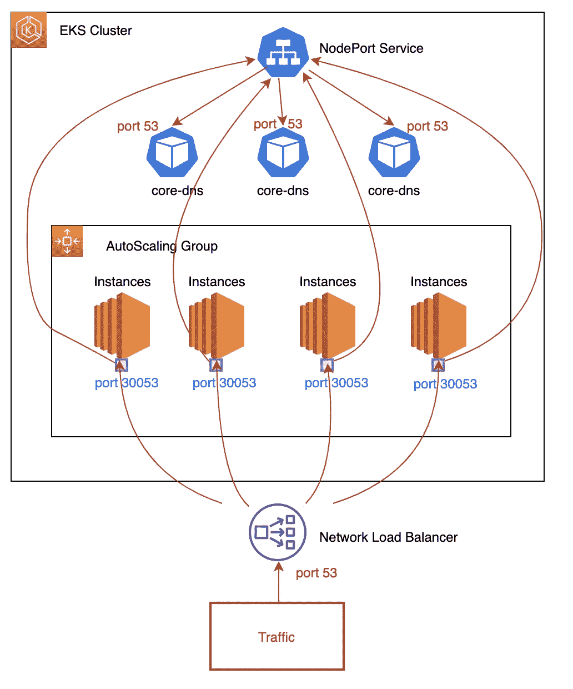
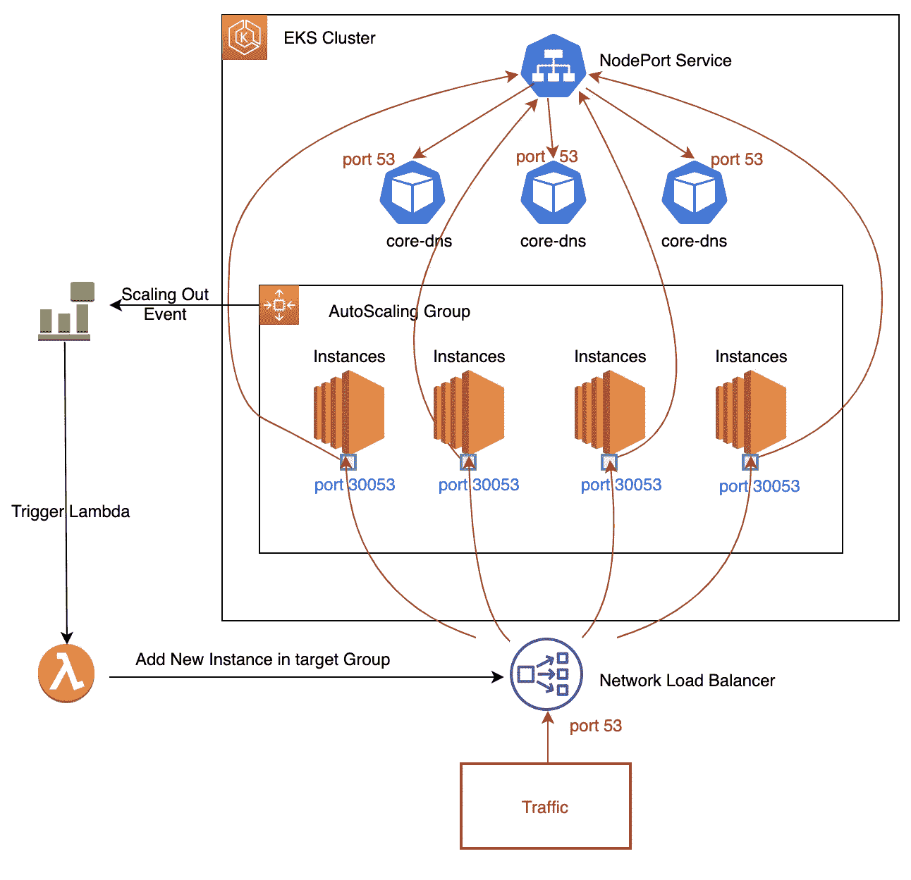

# 使用 AWS NLB 手动定位暴露 UDP 流量的 EKS 服务

> 原文：<https://itnext.io/using-aws-nlb-manually-targeting-an-eks-service-exposing-udp-traffic-17053ecd8f52?source=collection_archive---------0----------------------->

# EKS 1.16 遇到的问题

如果我们尝试为 UDP 流量创建一个类型为[网络负载平衡器](https://aws.amazon.com/elasticloadbalancing/) (NLB)的服务，我们会得到以下错误:

```
Error creating load balancer (will retry): failed to ensure load balancer for service default/test: Only TCP LoadBalancer is supported for AWS ELB
```

这是因为 UDP 对 NLB 的支持比 kubernetes 内部开发的用于创建 NLB 负载平衡器的功能更近。

本期报告了该错误: [#79523](https://github.com/kubernetes/kubernetes/issues/79523) ，目前正在由 AWS 进行调查。

我们将解决这一实际限制

# 使用节点端口 Kubernetes 服务

同时，我们可以手动配置一个 NLB 来指向我们的 EKS 实例，并配置一个 Kubernetes **NodePort** 服务来代替**负载平衡器**。

在节点端口模式下，每个实例将监听每个 EC2 实例上的预定义端口(范围在 30000–32767 之间), Kubernetes 会将流量转发到相关的 Kubernetes pods:



# 示例:使用 NLB 公开 kube-dns

例如，我们将通过手动创建的 NLB 来展示 Kubernetes core-dns pods。我们选择 core-dns，它在端口 53 上公开一个 UDP 服务。

# 创建 kubernetes 节点端口服务

这些 pod 有标签`k8s-app: kube-dns`,因此我们可以创建一个新的 NodePort 类型的服务:

```
cat << EOF > service-kube-dns-nodeport.yaml
apiVersion: v1
kind: Service
metadata:
  name: service-kube-dns-nodeport
  namespace: kube-system
  labels:
    app.kubernetes.io/name: service-kube-dns-nodeport
spec:
  type: NodePort
  ports:
    - name: dns-udp
      port: 53
      targetPort: 53
      nodePort: 30053
      protocol: UDP
    - name: dns-tcp
      port: 53
      targetPort: 53
      nodePort: 30054
      protocol: TCP
  selector:
    k8s-app: kube-dns
EOF
```

让我们将服务定义应用于 EKS 集群。

```
k apply -f service-kube-dns-nodeport.yaml
```

我们已经定义了一个 UDP 端口 30053，它将监听每个实例，并转发到端口 53 上的 kube-dns pods。

我们还定义了一个 TCP 端口 30054，NLB 将在配置 healthcheck 端口时使用该端口。

> *此服务必须部署在****kube-system****名称空间中，因为 coredns-pods 部署在那里。*

## (可选)对服务进行内部测试

在这个阶段，我们已经创建了 Kubernetes 服务，它已经在监听每个实例。在创建 NLB 之前，我们可以检查它是否在 Kubernetes 集群内部工作:

我们可以使用一个特定的 kubernetes pod[eks utils-pod](https://raw.githubusercontent.com/allamand/eksutils/master/eksutils-pod.yaml)来调试 kubernetes 中的东西。

在默认名称空间中创建 eksutils pod:

```
kubectl apply -f [https://raw.githubusercontent.com/allamand/eksutils/master/eksutils-pod.yaml](https://raw.githubusercontent.com/allamand/eksutils/master/eksutils-pod.yaml)
```

然后，我们可以在 pod 内部进行连接，看看我们是否能够基于内部服务进行 dns 解析。

在下面的例子中，对于每个 Kubernetes 节点，我请求 metrics 名称空间中的 grafana 服务。将它更改为指向集群中现有的服务。它还检查 TCP 端口 30054 上的连接

```
$ kubectl exec -n default -ti eksutils-pod zsh
eksutils@eksutils-pod $ for x in $(k get nodes -o wide | awk '{print $6}' | grep -v INTERNAL); do echo $x ; dig @$x -p 30053 grafana.metrics.svc.cluster.local ; telnet $x 30054 ; done
```

这将在端口 30053 UDP 上的每个节点上，在 metrics 名称空间中对 grafana 服务进行 dns 查找，并尝试在端口 30054 TCP 上连接每个端口。

# 创建网络负载平衡器

在 EKS 集群的同一个 vpc 中获取实例的子网

```
VPC_ID=vpc-027f50fc9d05149f0
aws ec2 describe-instances --filters Name=network-interface.vpc-id,Values=$VPC_ID \
 --query 'Reservations[*].Instances[*].SubnetId' --output text | sort | uniq -c
   5 subnet-0378859fcc9e53fa6
   5 subnet-055b4b800624d3b99
```

> *注意:只有当您的 EKS 集群有一个专用的 vpc 时，才可以这样做。如果不是这样，您需要过滤以仅匹配您想要的实例。*

首先，使用工作节点的子网创建 NLB

```
NLB_NAME=kube-dns-nlb
aws elbv2 create-load-balancer --name $NLB_NAME\
  --type network \
  --subnets subnet-0378859fcc9e53fa6 subnet-055b4b800624d3b99
```

## 为您的 NLB 创建目标群体

```
TG_NAME=kube-dns-tg
aws elbv2 create-target-group --name $TG_NAME --protocol UDP --port 30053 --vpc-id $VPC_ID \
  --health-check-protocol TCP \
  --health-check-port 30054 \
  --target-type instance
```

## 在目标组中注册实例

我们希望将属于 EKS 集群的每个节点添加为 NLB 目标组的目标。获取实例列表

```
INSTANCES=$(kubectl get nodes -o json | jq -r ".items[].spec.providerID"  | cut -d'/' -f5)
IDS=$(for x in `echo $INSTANCES`; do echo Id=$x ; done | tr '\n' ' ')
echo $IDS
```

注册实例:

```
TG_ARN=$(aws elbv2 describe-target-groups --query 'TargetGroups[?TargetGroupName==`kube-dns-tg`].TargetGroupArn' --output text)aws elbv2 register-targets --target-group-arn $TG_ARN --targets $(echo $IDS)
```

## 为目标组创建一个监听器

```
LB_ARN=$(aws elbv2 describe-load-balancers --names $NLB_NAME --query 'LoadBalancers[0].LoadBalancerArn' --output text)
echo $LB_ARNaws elbv2 create-listener --load-balancer-arn $LB_ARN \
  --protocol UDP --port 53 \
  --default-actions Type=forward,TargetGroupArn=$TG_ARN
```

检查监听器

```
aws elbv2 describe-listeners --load-balancer-arn $LB_ARN
```

检查目标的健康状况

```
aws elbv2 describe-target-health --target-group-arn $TG_ARN
```

> *应该是不健康的，直到我们配置实例的 SG。*

# 配置实例安全组

为了允许运行状况检查，我们需要允许 NLB 的 IP 访问实例的安全组中的端口 30054

从所有实例的实例 id 中获取安全组

```
SGs=$(for x in $(echo $INSTANCES); do aws ec2 describe-instances --filters Name=instance-id,Values=$x \
 --query 'Reservations[*].Instances[*].SecurityGroups[0].GroupId' --output text ; done | sort | uniq)
```

向安全组添加规则

```
for x in $(echo $SGs); do 
  echo SG=$x; 
  aws ec2 authorize-security-group-ingress --group-id $x --protocol tcp --port 30054 --cidr 192.168.0.0/16;   aws ec2 authorize-security-group-ingress --group-id $x --protocol udp --port 30053 --cidr 0.0.0.0/0 ; 
done
```

> *您可以使用*打开真实的 NLB Ip 地址，而不是从 192.168.0.0/16 打开
> 
> `*NLB_NAME_ID=$(aws elbv2 describe-load-balancers --names $NLB_NAME --query 'LoadBalancers[0].LoadBalancerArn' --output text | awk -F":loadbalancer/" '{print $2}') aws ec2 describe-network-interfaces \ --filters Name=description,Values="ELB $NLB_NAME_ID" \ --query 'NetworkInterfaces[*].PrivateIpAddresses[*].PrivateIpAddress' --output text*`

# 测试一下

一旦目标正常，您就可以测试访问了。找到您的 NLB 的 URL 并测试它的访问(确保您的端口 53 可以访问互联网)

```
LB_DNS=$(aws elbv2 describe-load-balancers --name $NLB_NAME --query 'LoadBalancers[0].DNSName' --output textecho $LB_DNS
```

用 dig 测试我们新公开域名服务器:

```
$ dig @$LB_DNS grafana.metrics.svc.cluster.local
; <<>> DiG 9.10.6 <<>> @kube-dns-nlb-a688e8ddf1200136.elb.us-east-1.amazonaws.com grafana.metrics.svc.cluster.local
; (2 servers found)
;; global options: +cmd
;; Got answer:
;; WARNING: .local is reserved for Multicast DNS
;; You are currently testing what happens when an mDNS query is leaked to DNS
;; ->>HEADER<<- opcode: QUERY, status: NOERROR, id: 53980
;; flags: qr aa rd; QUERY: 1, ANSWER: 1, AUTHORITY: 0, ADDITIONAL: 1
;; WARNING: recursion requested but not available;; OPT PSEUDOSECTION:
; EDNS: version: 0, flags:; udp: 4096
;; QUESTION SECTION:
;grafana.metrics.svc.cluster.local. IN	A;; ANSWER SECTION:
grafana.metrics.svc.cluster.local. 5 IN	A	10.100.165.230;; Query time: 98 msec
;; SERVER: 54.164.194.190#53(54.164.194.190)
;; WHEN: Wed May 13 19:27:47 CEST 2020
;; MSG SIZE  rcvd: 111
```

我们可以看到，我们能够请求我们公开的 DNS 服务器。

# 在我们的负载平衡器中自动创建目标

# 缩放实例

如果您添加一些 EKS 实例，您将需要在您的 NLB 目标组中添加这些实例，以便能够在这些实例上分散负载。

当缩小规模时，旧实例将变得不健康，它们将自动从目标组中取消注册和消失，因此在这种情况下不需要采取特定的操作。

我们想找到一种方法来自动化的插件在 NLB 的新目标时，我们正在做一个扩展。

> *我们可以配置 Amazon EC2 Auto Scaling，以便在我们的 Auto Scaling 组进行扩展时向 CloudWatch Events 发送事件。*



这里的想法是，每当我们的 EKS 集群的自动扩展组创建一个实例时，这些实例就会自动添加到 NLB 目标组中。

## 创建一个 Lambda 函数来自动添加 NLB 中的实例

创建 Lambda 函数，将通过自动缩放组添加的实例添加到 NLB 目标组

```
import json
import boto3
from pprint import pprintLbName="kube-dns-nlb" #<- change accoring to your setupprint('Loading function')elb = boto3.client('elbv2')def find_lb_arn(name):
    # describe load balancer name
    lbs_list_response = elb.describe_load_balancers(Names=[name])
    if lbs_list_response['ResponseMetadata']['HTTPStatusCode'] == 200:
        print ("LBs list: " + ' '.join(p for p in [lb['LoadBalancerName']
                                       for lb in lbs_list_response['LoadBalancers']]))
        #We have only 1 lb    
        lbArn = lbs_list_response['LoadBalancers'][0]['LoadBalancerArn']
    else:
        print ("Describe lbs failed")
    return lbArn def lambda_handler(event, context):
    print("AutoScalingEvent()")
    print("Debug Event data = " + json.dumps(event, indent=2))

    target_id = event['detail']['EC2InstanceId']
    print("We are going to add InstanceID = " + target_id)

    #Find load balancer arn
    lbArn = find_lb_arn(LbName)
    print ("lbArn="+lbArn)

    # Register targets
    targets_list = [dict(Id=target_id)]

    describe_tg_response = elb.describe_target_groups(LoadBalancerArn=lbArn)
    #pprint(describe_tg_response)
    tgId = describe_tg_response['TargetGroups'][0]['TargetGroupArn']
    print ("tgID = " + tgId) #Register target in targetGroup
    reg_targets_response = elb.register_targets(TargetGroupArn=tgId, Targets=targets_list)
    if reg_targets_response['ResponseMetadata']['HTTPStatusCode'] == 200:
        print ("Successfully registered targets")
    else:
        print ("Register targets failed")
```

> *您需要将* ***LbName*** *参数化为您想要将实例添加到*中的 NLB 的名称

为我们的 Lambda 函数创建角色

```
NAME=add-instance-to-nlb
ACCOUNT_ID=$(aws sts get-caller-identity --output text --query 'Account')
ASSUMEPOLICY=$(echo -n '{
  "Version": "2012-10-17",
  "Statement": [
    {
      "Effect": "Allow",
      "Principal": {
        "Service": "lambda.amazonaws.com"
      },
      "Action": "sts:AssumeRole"
    }
  ]
}')echo ACCOUNT_ID=$ACCOUNT_ID
echo ASSUMEPOLICY=$ASSUMEPOLICYLAMBDA_ROLE_ARN=$(aws iam create-role \
  --role-name $NAME \
  --description "Role to allow Lambda function to manage NLB targets" \
  --assume-role-policy-document "$ASSUMEPOLICY" \
  --output text \
  --query 'Role.Arn')
echo $LAMBDA_ROLE_ARN
```

将策略附加到角色

```
aws iam attach-role-policy \
  --role-name $NAME \
  --policy-arn arn:aws:iam::aws:policy/ElasticLoadBalancingFullAccessLAMBDA_POLICY=$(echo -n '{
    "Version": "2012-10-17",
    "Statement": [
        {
            "Effect": "Allow",
            "Action": "logs:CreateLogGroup",
            "Resource": "arn:aws:logs:us-east-1:'; echo -n "$ACCOUNT_ID"; echo -n ':*"
        },
        {
            "Effect": "Allow",
            "Action": [
                "logs:CreateLogStream",
                "logs:PutLogEvents"
            ],
            "Resource": [
                "arn:aws:logs:us-east-1:'; echo -n "$ACCOUNT_ID"; echo -n ':log-group:/aws/lambda/'; echo -n "$NAME"; echo -n ':*"
            ]
        }
    ]
}')
echo $LAMBDA_POLICYLAMBDA_POLICY_ARN=$(aws iam create-policy \
  --policy-name AWSLambdaBasicExecutionRole-$NAME \
  --policy-document "$LAMBDA_POLICY" \
  --output text \
  --query 'Policy.Arn')
echo $LAMBDA_POLICY_ARNaws iam attach-role-policy \
  --role-name $NAME \
  --policy-arn $LAMBDA_POLICY_ARN
```

创建 lambda 函数(我已经用前面的 Lambda 代码创建了一个 zip 文件)

```
aws lambda create-function \
    --function-name $NAME \
    --runtime python3.7 \
    --zip-file fileb://~/environment/add-instance-to-nlb.zip \
    --handler add-instance-to-nlb.lambda_handler \
    --role $LAMBDA_ROLE_ARN
```

用 json 测试来测试这个函数

```
{
  "version": "0",
  "id": "12345678-1234-1234-1234-123456789012",
  "detail-type": "EC2 Instance Launch Successful",
  "source": "aws.autoscaling",
  "account": "123456789012",
  "time": "yyyy-mm-ddThh:mm:ssZ",
  "region": "us-west-2",
  "resources": [
      "auto-scaling-group-arn",
      "instance-arn"
  ],
  "detail": {
      "StatusCode": "InProgress",
      "Description": "Launching a new EC2 instance: i-12345678",
      "AutoScalingGroupName": "my-auto-scaling-group",
      "ActivityId": "87654321-4321-4321-4321-210987654321",
      "Details": {
          "Availability Zone": "us-west-2b",
          "Subnet ID": "subnet-12345678"
      },
      "RequestId": "12345678-1234-1234-1234-123456789012",
      "StatusMessage": "",
      "EndTime": "yyyy-mm-ddThh:mm:ssZ",
      "EC2InstanceId": "i-1234567890abcdef0",
      "StartTime": "yyyy-mm-ddThh:mm:ssZ",
      "Cause": "description-text"
  }
}
```

> *你应该有一个正常的错误说明:*
> 
> `*The following targets are not valid instances: 'i-1234567890abcdef0'"*`

## 创建云观察器规则

用您需要的自动缩放组的名称修改以下事件模式规则。在我的例子中，我有 3 个自动扩展组与我的 eks 集群相关联。

```
EVENT_PATTERN=$(echo -n '{
  "source": [
    "aws.autoscaling"
  ],
  "detail-type": [
    "EC2 Instance Launch Successful"
  ],
  "detail": {
    "AutoScalingGroupName": [
      "eksctl-eksworkshop-eksctl-nodegroup-ng-spot-NodeGroup-1MCQMJAIUZCSS",
      "eks-f8b8de05-e964-8e64-5043-60449f530a2b",
      "eks-48b909fd-3aa4-c200-dcc0-cb8c5b637736"
    ]
  }
}')
echo $EVENT_PATTERN
```

创建云观察规则

```
aws events put-rule \
  --name $NAME \
  --event-pattern "$EVENT_PATTERN"
```

获取 Lambda arn

```
LAMBDA_ARN=$(aws lambda get-function --function-name $NAME --query 'Configuration.FunctionArn' --output text)
echo $LAMBDA_ARN
```

创建云观察事件规则目标

```
RULE_TARGET=$(echo -n '[
  {
    "Id": "1", 
    "Arn": "'; echo -n "$LAMBDA_ARN"; echo -n '"
  }
]')
echo $RULE_TARGET
```

将目标添加到事件规则中

```
aws events put-targets \
  --rule $NAME \
  --targets "$RULE_TARGET"
```

添加由事件触发的 Lambda 权限

```
aws lambda add-permission \
  --function-name $NAME \
  --statement-id autoscaling-event-rule \
  --action 'lambda:InvokeFunction' \
  --principal events.amazonaws.com \
  --source-arn $(aws events describe-rule --name $NAME --query 'Arn' --output text)
```

或者使用控制台:

# 测试

现在，您可以在 ASG 中测试向外扩展或缩放，或者只是终止一些实例，每次在相应的 ASGs 中创建新实例时，ASG 都会向 lambda 发送一个事件，lambda 会在 NLB 目标组中注册新实例。

如果需要使用 cli 手动添加实例，请选中此项

# 看看哪些操作会对我们的目标配置产生影响

# 升级节点组的版本

升级节点组的版本时，EKS 将启动每个实例的滚动升级。这将导致每个旧实例在被删除时从 NLB 中消失，新实例将由我们的 Cloudwatch Event + Lambda 函数自动添加

# 清除

删除目标组

```
aws elbv2 delete-target-group --target-group-arn $TG_ARN
```

删除负载平衡器

```
aws elbv2 delete-load-balancer --load-balancer-arn $LB_ARN
```