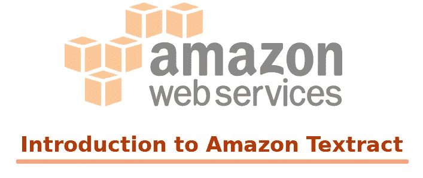
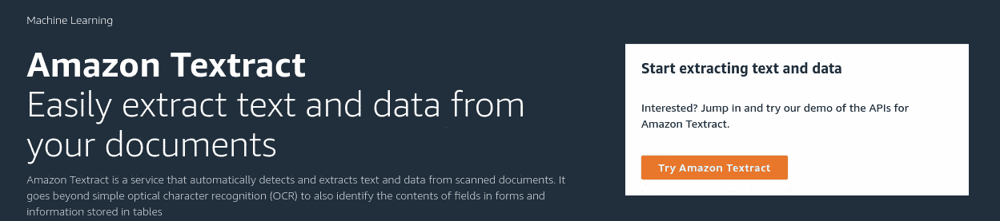
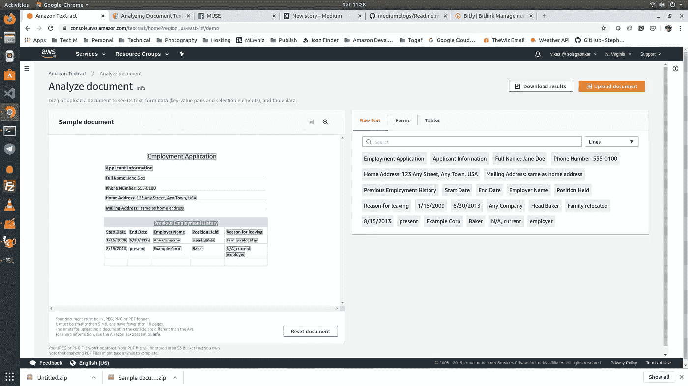
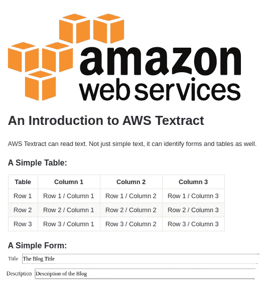
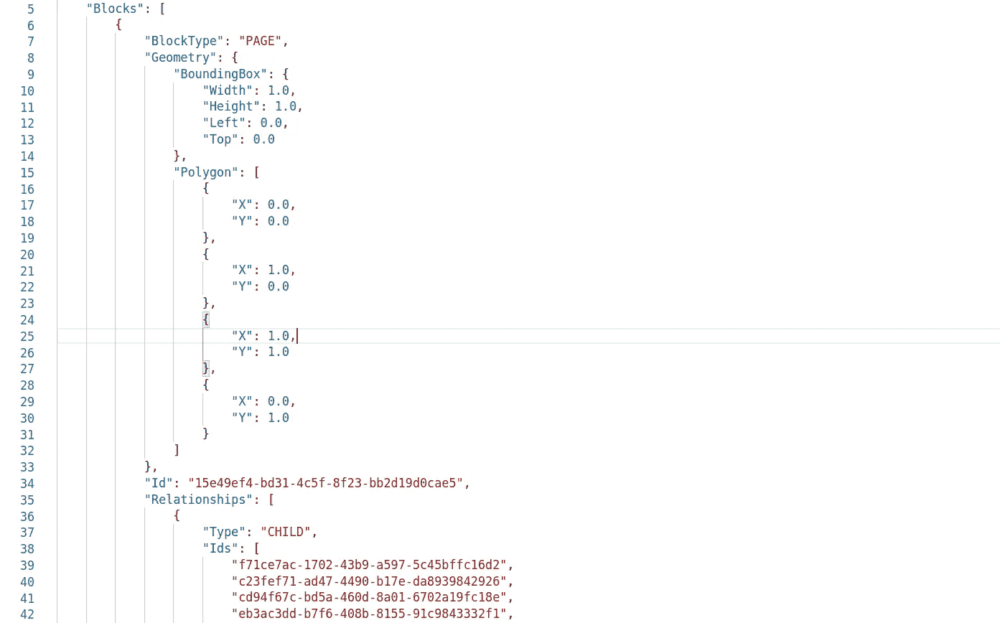
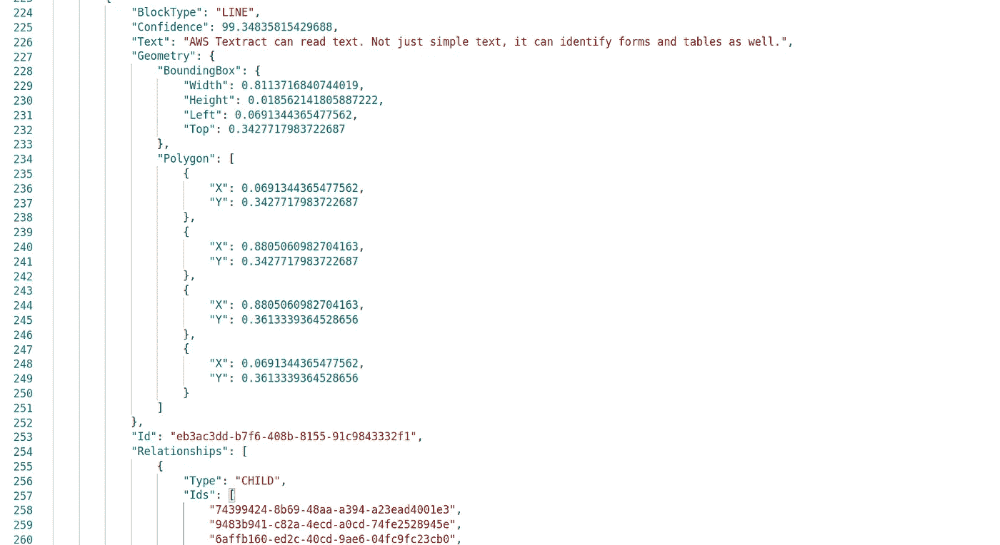
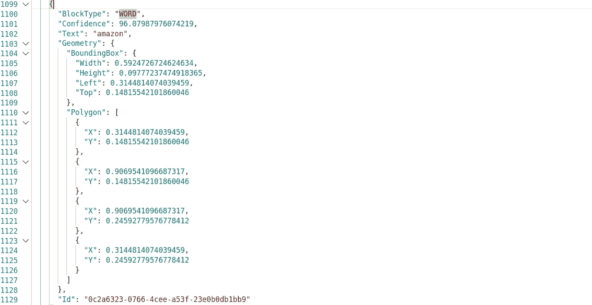
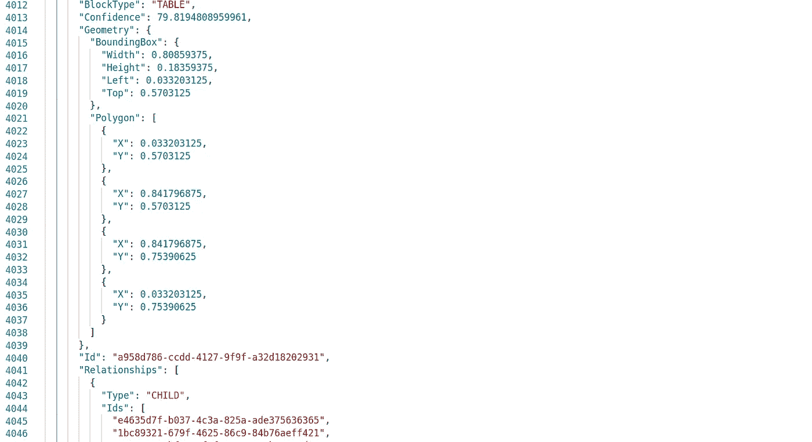
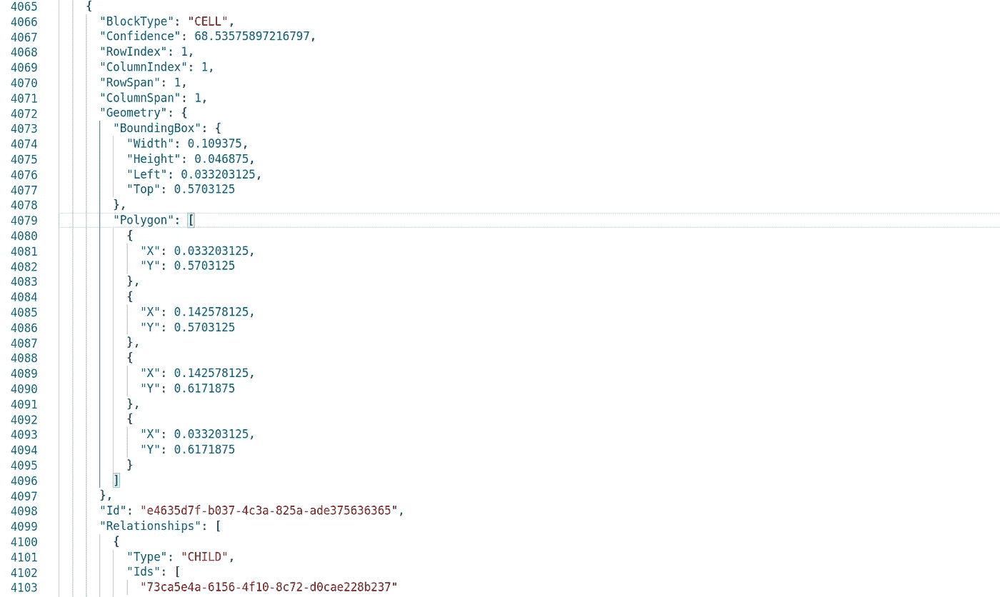
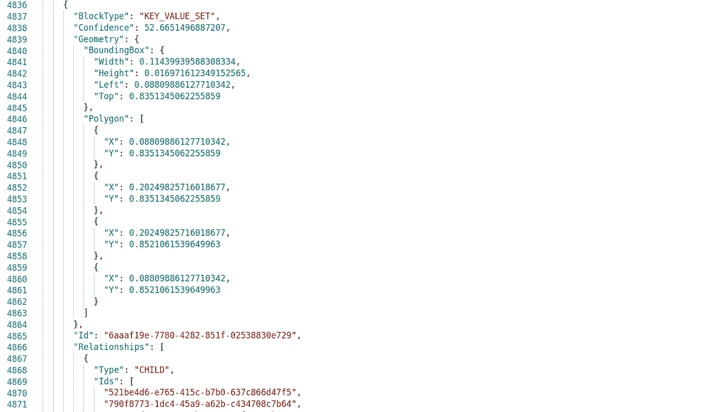

# 使用 AWS 文本摘要-提取图像中的文本

> 原文：<https://itnext.io/using-aws-textract-extract-text-in-images-c2b2f226f9db?source=collection_archive---------0----------------------->

AWS 有一系列特定于人工智能的服务，有助于加快人工智能在我们基于云的应用程序中的使用。有了这些，开发人员可以专注于业务逻辑，让亚马逊负责开发人工智能模型的完美性。

Textract 是一项 AWS 服务，可以帮助我们从图像中读取文本。它能够处理复杂的图像——只需一次 API 调用。这使得开发人员可以专注于业务逻辑，而不是纠结于算法。

让我们深入了解一下 Textract 服务。有两种方法可以访问 Textract——通过控制台和 API。当然，API 给了我们编程式的访问，让事情变得很酷。让我们看看他们中的任何一个。我们从控制台访问开始，了解正在发生的事情，然后我们进入代码，享受 Textract 的真正力量。

# AWS 控制台上的文本摘要

Amazon Textract 服务可以从 AWS 控制台找到。去 https://aws.amazon.com/textract。这将打开亚马逊 Textract 控制台。

这有一个简单的界面:

接下来，我们点击“尝试亚马逊 Textract”。这将打开文档分析器，看起来像这样:

它预装了一个样本图像分析演示。左边是图像，右边是分析。我们可以看到三个选项卡—原始文本、表单和表格。

我们可以试着点击每一个。Textract 能够识别呈现给它的图像中的单个表单和表格。当我们单击右侧面板中的单个单词、表格或表格时，图像中相应的元素会突出显示，向我们显示它在图像中出现的位置。

这就是 Textract 的妙处！只需上传一张图片，点击一个按钮，所有的图片分析和文本提取就完成了！

我们在角落里有两个按钮，上传新图像和下载分析。如果我们下载它，我们可以看到几个文件——这些文件向我们显示了图像中识别出的内容的细节。这包括一个巨大的 JSON 文件，其中包含大量关于图像的细节。

这只是惊鸿一瞥。如果我们想使用 Textract 的真正力量，我们需要代码来理解和解码那个 JSON。它携带了大量关于手边图像的信息。我们需要编写代码来理解这个 JSON。

# 代码中的文本摘要

Textract 用例的典型工作流程如下:

*   外部 API 将图像转储到 S3 桶中
*   这触发了一个 Lambda 函数，该函数使用这个图像调用 Textract API 来提取和处理文本
*   然后，这些文本被推送到 DynamoDB 或 Elastic Search 等数据库中，以供进一步分析

第一步和第三步超出了本博客的范围。让我们把重点放在第二点上。我喜欢 Python。所以我将使用 Python (Boto3)编码的 Lambda 函数来调用 Textract。你可以选择合适的。

## 图像

我们将在博客的其余部分使用下图。它有不同字体和大小的文本。它有一个表格和一个表单。部分文字有点模糊。

用于文本摘要的图像

## S3 水桶

我们首先将图像保存在 S3 桶中。让我们创建一个新的存储桶，并将测试图像上传到其中。我把 S3 桶称为“学习-文本摘要”。在其中，我添加了图像“sample-image.png”

## λ函数

接下来，我们创建一个新的 Lambda 函数——它可以调用 Textract API。为了我们。

我们为这个 Lambda 函数创建一个 IAM 角色，并赋予它所需的权限。我用这个政策来完成工作。请将 XXXXX 替换为您的帐号，以便能够使用此帐户。

我选择 Python 3.7 作为语言。有了这些，我们就可以实现 Lambda 函数了。

尝试运行此 Lambda 它会生成大量的 JSON 输出。我们可以将该文件加载到一个好的编辑器中，以查看其内容。JSON 太大，无法在此显示。你可以试着运行上面的代码来看看真实的。或者，你可以在我的 github 上查看。

这太棒了！我不知道我的图像中有这么多信息！但是这有用吗？这个难看的 JSON 文件乍一看没有多大意义。事实上，它包含了我们需要了解的关于图像的所有信息！

# 了解 Textract 响应

从代码中调用 Textract 服务很容易。重要的部分是理解 JSON 响应，并将其用于我们的业务逻辑。现在让我们试着理解它的内容。

响应主体有三个子文档。文档元数据、块和响应元数据。元数据内容非常直观，不需要任何解释。但是街区的排列是巨大的。让我们深入探讨一下。

每个块都有定义的属性— ID、块类型、几何和关系。除此之外，每种类型的块都有自己的属性。让我们来看看这个响应中的重要模块。

## 页面块

这是最重要的。文本识别的第一步是文本检测。该算法首先识别页面上有一些文本的区域。这被定义为页面。Textract 为此父元素分配一个 ID。它还提供了该区域的几何信息。这以两种形式提供

*   边界框—图像中包含该图像中所有文本的矩形区域。
*   多边形—它还确定可以覆盖页面中所有文本的最佳拟合 n 维多边形。

除此之外，它还包括一系列关系——为这个“页面”中标识的每个子元素提供一个指针

## 线块

这标识了图像中的每一行文本。这有两个附加属性:

*   文本—非常直观…它包含图像中识别的文本行。
*   置信度——这是 Textract 对给定身份的置信度的度量。在这种情况下，我们有干净的，打印文本。因此，对于所有识别出的文本，置信度都非常高。但是，有时文本是模糊的。在这种情况下，置信度相当低。作为我们业务逻辑的一部分，我们可以为置信度需求定义一个阈值。

与页面块类似，它具有提供边界框和最佳拟合多边形坐标的几何属性。

Line 元素有一个子元素列表，每个子元素定义该行中的一个单词。

## 单词块

然后，我们有了单词 blocks。与行块类似，单词块具有文本和置信度属性，这些属性提供了关于其中实际文本的信息，以及该文本标识的置信度。它还具有几何属性，给出了关于边界矩形和最佳拟合多边形的细节。

请注意，单词块是层次结构的尾部元素，因此没有任何进一步的关系。

线条和文字为我们提供了图像中的所有文本内容。其他元素为我们提供了有关其结构和相关性的更多信息:

## 数据表块

当 Textract 在图像中识别出一个表时，它会向 JSON 添加一个表块。这包括几何图形、置信度以及子元素列表——表格的单个单元格。

## 单元块

单元块包含大量信息—单元的行/列索引、行跨度/列跨度，然后是子元素—即单元中包含的单个字块。

这些信息足以重建该表。

## 键值集块

这些表单被标识为键值对。这对块标识表单中的一个条目。这里的子元素是键或值中的单个单词。

# 提取信息的代码

现在我们已经了解了 JSON 的结构，让我们来识别和处理这些元素。从上面的图像中，让我们尝试提取表单及其信息。

这会产生以下输出:

酷！不是吗？

如果您在使用这项服务时需要其他帮助，请务必联系我。