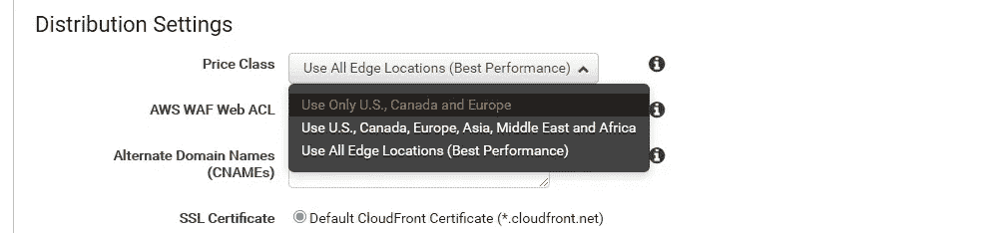

# 使用 AWS 在不到 10 分钟的时间内削减每月数据传输成本

> 原文：<https://itnext.io/using-aws-to-save-on-your-monthly-data-transfer-costs-in-less-than-10-minutes-32407e9d26bf?source=collection_archive---------0----------------------->

## 实用开发工具

## 使用 AWS Cloudfront 降低贵公司**其他**昂贵的 SaaS 服务的成本

你在有效地管理你的交通流量吗？(由[塔伦·德·圣克罗伊](https://unsplash.com/@talen?utm_source=unsplash&utm_medium=referral&utm_content=creditCopyText)在 [Unsplash](/?utm_source=unsplash&utm_medium=referral&utm_content=creditCopyText) 上拍摄)

# 向外扩展的成本可能会很高，这里介绍了如何降低第三方转移成本，从而节省一点资金

## TL；DR；

使用 AWS Cloudfront 和 Origin Request Lambda 功能降低 SaaS 传输成本。只需一点点代码，你就可以创建一个代理来装载你的第三方服务。如果这两种服务的转让价格之间有足够大的差距，这可能会为您节省一些钱。

## 一些背景…

好吧，除非你的交通流量很大，否则你可能省不了几千美元。然而，我们确实设法每月节省了几百美元，而且我们的流量也不多。我们正在使用一种我们非常喜欢的图像处理服务。这种特殊的服务有一个定价模型，它基于几个因素。其中一些很有道理，也很容易理解。其他的事情，嗯，可能有点难。

转移成本是我们考虑如何优化的成本之一，因为我们最近看到用户使用量的增加导致成本激增。我的同事想出了一个简单而出色的解决方案，我只用了几个小时就实现了。

> 当然，像我们以前使用的服务提供商需要为不断增长的流量使用支付成本。但是，如果价格涨幅大大高于下面的选择，那么它可能只是有意义的尝试。

免责声明:我敦促你做自己的计算，而不只是假设你会节省，有一些参数是独特的每种情况。我不知道你的申请，所以不要把你的 AWS 账单发给我，以防事情不尽如人意。😁

## 贮藏

我在这个问题领域花了相当多的时间，用不同的缓存技术优化流量。大多数管理 web 站点的人迟早都需要实现不同种类的缓存技术，这些 web 站点会处理各种严重的负载。

ID 85153447 Dreamstime.com 特雷西·赫布登

缓存是分层实施的，从特定应用感知的最内层到最外层，在我们的例子中，最外层是缓存来自应用堆栈的完整响应的 CDN。在本帖中，我们将重点介绍如何使用 AWS Cloudfront CDN 来缓存来自第三方 SaaS 服务的外部交付的响应。

AWS Cloudfront 在定义功能方面有一个强大的特性，可以帮助您控制服务的逻辑。在 cloudfront 的生命周期中，有四个不同的点可以操纵请求/响应流。

来源: [AWS 文档](https://docs.aws.amazon.com/lambda/latest/dg/lambda-edge.html)

在这篇文章中，我将展示如何在 node.js 中创建一个 Origin request Lambda 函数，使您能够透明地向外部 SaaS 服务代理请求。

## 设置 AWS Cloudfront CDN

为了简单起见，我们只使用现成的 cloudfront CDN。对于任何类型的实际使用，您可能希望使用自己的域，自己的 SSL 证书。

构建一个新的 cloudfront 发行版很容易，有一点需要注意的是要使用的类。如果你想在所有地区都有本地业务，价格会有所变化。我们将选择最便宜的(价格等级 100)，因为我们的用户群主要在美国和欧洲。这并不意味着我们不会为其他地区的用户提供服务，只是他们的往返路程会稍长一些，最终用户会从该特定价格级别中包含的某个地区的边缘服务器请求信息

默认设置应该适合概念验证。也许你需要改变:
**查询字符串转发和缓存**:转发全部，基于全部缓存
如果你发送查询参数给你的服务提供商。

对于这个测试发行版，我们不使用任何其他来源，但是由于 cloudfront 坚持要求您提供一个默认来源，我建议您将它指向一个空的 S3 桶作为默认内容。为生产或在现有的测试环境中进行配置，您可能已经有了一个可以使用的现有 Cloudfront 发行版。

## Cloudfront 源请求 lambda 函数

随着 cloudfront 发行版的建立，我们将转向 AWS Lambda 部分。

所有 Cloudfront lambda 函数都需要驻留在 **us-east-1** 区域，因此切换到该区域并创建一个新的 node.js 10 Lamba 函数:

保存并发布新版本。这一步很重要，因为您只能引用要在 Cloudfront 发行版中使用的 lambda 函数的已发布版本(LATEST 不工作)。

复制已发布的 arn 即
*arn:AWS:lambda:us-east-1:37119999999:function:cdn-proxy:1*

## 将λ与云锋行为联系起来

🔙回到 Cloudfront 设置:现在我们需要创建一个新的**行为**来执行我们的 Lambda 函数。如果共享发行版，您需要决定一个对您和您现有的应用程序有意义的前缀。在这个例子中，我们使用/pfix/。这需要与上面 Lambda 函数中的逻辑相匹配，因为在将请求转发到源服务器(SaaS 提供者)之前，我们会将其删除。

确保 lambda 函数的 IAM 角色也包括能够执行的必要权限。(添加 edgelamba.amazon.com 信托关系)

现在，您应该能够在 Cloudfront 中本地缓存来自您的提供商的内容，并且只有在缓存需要刷新或者由于某种原因从 Cloudfront 中被逐出时才重新请求。只需将所有指向供应商的链接替换为指向 Cloudfront 的链接，并在请求前添加您在上面选择的前缀:

对<yourdistibutionid>. cloudfront . net/pfix/resources fromsaas/的请求将从您的 SaaS 提供商处请求 URL(除了/pfix/)，然后将其保存在 Cloudfront 中以备下一次请求(不会命中您的提供商),从而节省传输费用的账单。</yourdistibutionid>

照片致谢

[https://docs . AWS . Amazon . com/Amazon cloudfront/latest/developer guide/cloudfront pricing . html](https://docs.aws.amazon.com/AmazonCloudFront/latest/DeveloperGuide/CloudFrontPricing.html)