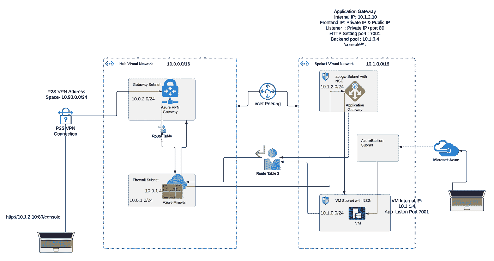
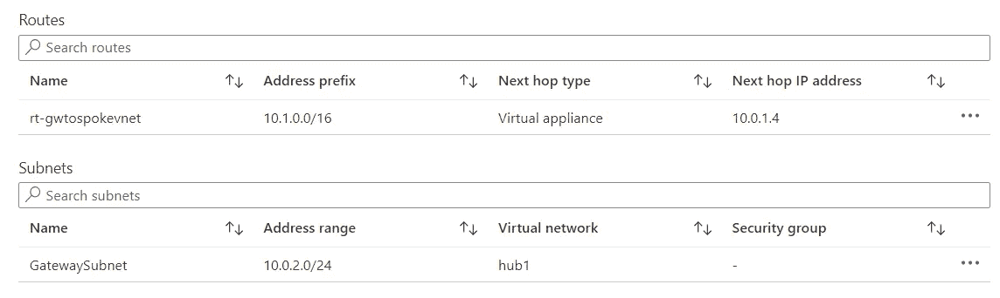
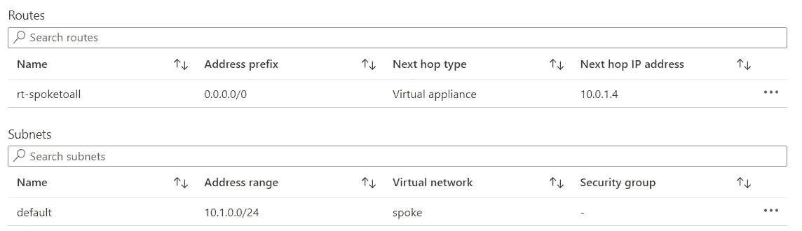
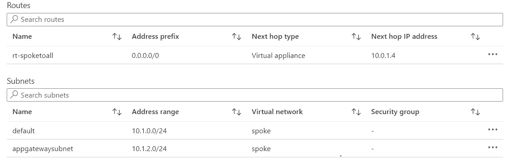
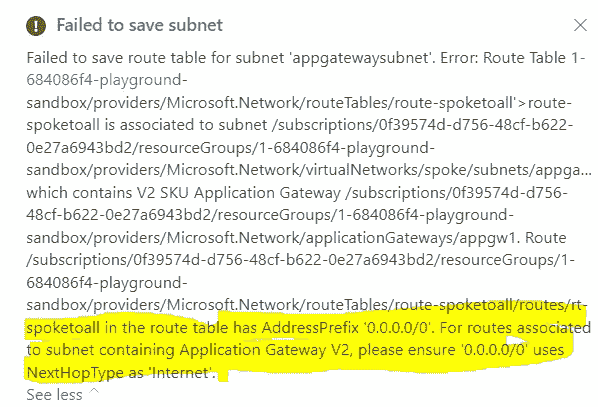
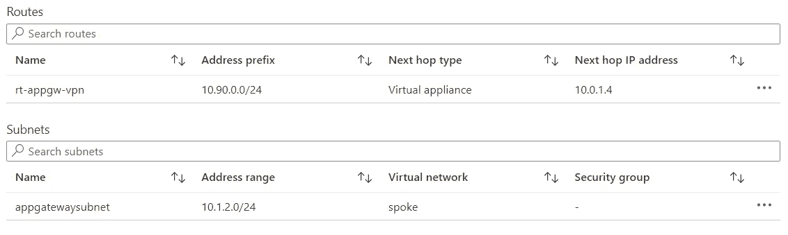

# 为内部网应用程序使用 Azure 应用程序网关

> 原文：<https://itnext.io/using-azure-application-gateway-for-an-intranet-application-9009a91621ac?source=collection_archive---------1----------------------->

# 作为负载平衡器的应用网关简介

应用程序网关是来自 Azure 的强大的 PaaS 负载平衡器。它基于 [OSI 模型第 7 层](https://www.networkworld.com/article/3239677/the-osi-model-explained-and-how-to-easily-remember-its-7-layers.html) —应用层路由。应用网关可以根据 HTTP 请求的附加属性(例如，URI 路径或主机头)做出路由决策。 [Azure 应用网关](https://docs.microsoft.com/en-us/azure/application-gateway/overview)可以做基于 URL 的路由等等。

有很多博客和文章解释了这是如何工作的，我就不赘述了 [Azure 文档](https://docs.microsoft.com/en-us/azure/application-gateway/quick-create-portal)已经涵盖的细节。我主要关注的是为需要具有 HTTP 负载平衡能力的 LB 的内部网应用程序使用应用程序网关(否则选择 [OSI 第 4 层](https://www.networkworld.com/article/3239677/the-osi-model-explained-and-how-to-easily-remember-its-7-layers.html) -TCP [负载平衡器](https://docs.microsoft.com/en-us/azure/load-balancer/load-balancer-overview))。

## 路由往来于应用网关的流量

这是促使我写这篇长文的一个原因。

1.  当我们在应用网关监听器配置中使用公共 IP 时，我们不需要手动路由流量。
2.  当我们在应用网关监听器中使用私有 IP 时，如果 VPN 网关和应用网关之间没有防火墙，我们不需要手动路由流量。
3.  **当我们在应用网关监听器中使用私有 IP 时，如果 VPN 网关和应用网关之间有防火墙，我们需要手动路由流量。**

使用多个专用网络和应用网关进行路由有时会很棘手。在本帖中，我将带您了解一个这样的案例，在 VPN 网关和应用程序网关之间有一个防火墙，而应用程序网关正在为内部应用程序路由流量(与上面的案例 3 相同)。

## 用例解释

部署在 Oracle Weblogic Server 上的 Java EE 应用程序在虚拟机上运行，该应用程序监听 HTTP 端口 7001。目标是在通过点对点 VPN 连接时使用应用网关访问应用。

以下图(一种非常常见的架构)为例:

**上图中的一些要点:**

*   内部用户使用 Azure 点到站点 VPN 进行连接。
*   集线器虚拟网络有网关子网和 AzureFirewallSubnet，而分支虚拟网络包含应用程序网关子网、堡垒子网和后端虚拟机所属的虚拟机子网。
*   中心和分支与作为网关中转的中心对等，因为它有 VPN 网关。
*   虚拟网络网关(VPN w2 SKU)具有 P2S VPN 配置。
*   可以使用堡垒服务访问虚拟机
*   应用网关配置为将 [http://10.1.2.10/console](http://10.1.2.10/console/*) 或 https://[10 . 1 . 2 . 10/console](http://10.1.2.10/console/*)(app GW 内部 IP)路由到[http://10 . 1 . 0 . 4:7001/console](http://10.1.0.4:7001/console)(VM 内部 IP)。应用程序网关图表的文本框说明了组件的配置。侦听器使用私有前端 IP。
*   离开地址前缀为 10.1.0.0/16(分支 Vnet 的 CIDR)的网关子网的流量被路由到下一跳 10.0.1.4 处的 azure 防火墙

快照 1

*   离开地址前缀为 0.0.0.0/0(所有内容)的虚拟机子网的流量被路由到下一跳 azure 防火墙 10.0.1.4

快照 2

*   防火墙有一个允许规则，允许所有端口和所有协议从源 IP 地址空间 10.90.0.0/24 到分支 vnet 地址空间 10.1.0.0/16 的流量。此外，防火墙规则是有状态的，因此从分支 vnet 到 VPN 地址空间不需要额外的规则。

这类似于通常使用的非常常见的架构(在本文中不考虑安全措施，因为这不是本文的重点)

# 选择哪个应用网关 SKU？

## **应用网关标准 v1 SKU**

对于内部应用程序，不需要公共 IP。最有可能的是，人们会倾向于选择**应用网关标准 v1 SKU** ，除非需要标准 V2 或 WAF v2 的[特性。参考](https://docs.microsoft.com/en-us/azure/application-gateway/overview-v2#feature-comparison-between-v1-sku-and-v2-sku) [Azure 文档](https://docs.microsoft.com/en-us/azure/application-gateway/features)了解 SKU 在功能和定价方面的功能和比较。

因为标准 v1 更便宜，并且需要根据 URL 路径进行 HTTP 负载平衡。SSL/TLS 在应用网关本身终止。

离开地址前缀为 0.0.0.0/0 (everything)的应用网关子网的流量被路由到下一跳 10.0.1.4 处的 azure 防火墙。

快照 3

在应用网关被提供并配置了后端之后，我们能够使用 [http://10.1.2.10/console](http://10.1.2.10/console/*) 或 https://[10 . 1 . 2 . 10/console](http://10.1.2.10/console/*)来访问应用。

在这种情况下，当 SSL 在负载平衡器处终止时，Weblogic 管理控制台的身份验证步骤需要传递一个 [**请求头(WL-代理-SSL=ON**](https://www.ateam-oracle.com/post/ssl-offloading-and-weblogic-server) **)** ，我们无法使用带有标准 v1 SKU 的 App Gateway 来完成此操作，因为标头重写在标准 v1 SKU 中不可用。

## 标准 v2 SKU

因此，标准 v1 被支持报头重写的标准 v2 SKU 所取代。[标准 v2 SKU 具有附加功能](https://docs.microsoft.com/en-us/azure/application-gateway/overview-v2#feature-comparison-between-v1-sku-and-v2-sku)。**必须为公共 IP 提供标准 v2** (即使不需要)。**因此** [**App 网关监听器被配置为使用私有前端 IP**](https://docs.microsoft.com/en-us/azure/application-gateway/application-gateway-faq#how-do-i-use-application-gateway-v2-with-only-private-frontend-ip-address) **，公共 IP 未被使用。**

在使用标准 v2 SKU 配置新的应用网关，并为路由基于 URL 的流量进行所有配置后，我测试了对应用的访问，结果**它不起作用。我可以在防火墙日志中看到访问细节。当使用公共 IP 作为监听器的前端 IP(只是作为一个测试)，访问工作，但它不能与私有 IP。**

# 错过了什么？

**如果入口流量通过 Azure 防火墙作为下一跳进行路由，那么出口流量也应该通过 Azure 防火墙作为下一跳进行路由**。看来我们错过了离开应用网关子网的流量路由。

我尝试将离开地址前缀为 0.0.0.0/0 (everything)的应用网关子网的流量路由到 10.0.1.4 的 azure 防火墙作为下一跳，当应用网关 SKU 为标准 v1 时，这种方法有效，因为我们只选择了私有 IP。但是标准 v2 应用网关子网同时具有与之关联的私有和公共 IP，因此该路由无效且不被允许。**简而言之，我们不能拥有 Snapshot3** 中的路线(如上图)。

快照 4:在 UDR 中将 0.0.0.0/0 作为 appgw 子网的地址前缀时出错

那么，我们要将离开应用程序网关子网的流量路由到哪个地址前缀，下一跳是 Azure 防火墙？**它应该回到从客户机发起连接的地方，也就是点到站点 VPN 地址空间。**

因此，我们创建了一条路由，通过地址前缀 10.90.0.0/24 将流量发送到应用网关，下一跳是 Azure 防火墙，当通过点到站点VPN 连接时会访问 URL。

快照 5

## **对某些用户还是不起作用？**

我们在虚拟网络网关中也有一个 S2S 连接(图中没有)。因此，本地用户连接到分支 Vnet，但他们无法访问该应用程序。这是因为用户通过另一个地址空间不同的 VPN 连接到本地网络。因此，我们可以编辑之前创建的路由，并将本地点对点 VPN 地址空间添加到该路由规则中