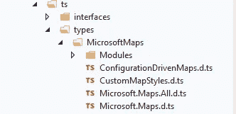
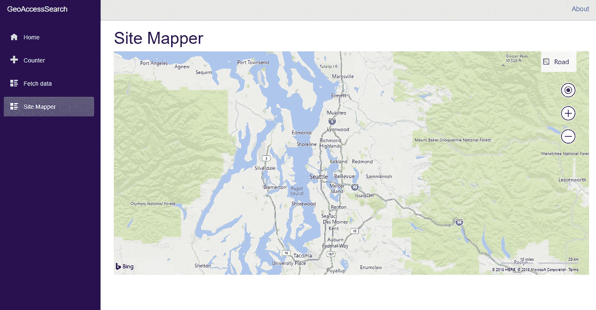
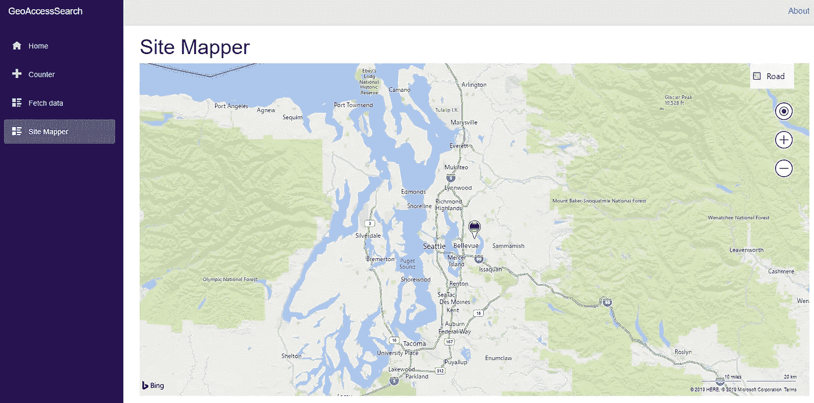
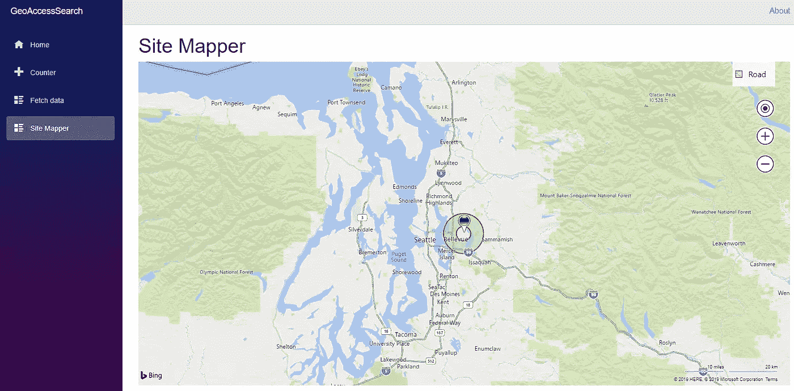

# 通过 JSInterop 和 TypeScript 在 Blazor 中使用 Bing 地图

> 原文：<https://itnext.io/using-bing-maps-in-blazor-with-jsinterop-and-typescript-90e888e0e2fd?source=collection_archive---------3----------------------->

在本文中，我们将在客户端 Blazor 应用程序中使用 Bing Maps web 控件。由于没有 Blazor 本地 Bing 地图控件，我们将使用 TypeScript 来访问 Bing 地图 API。为了与 C#中的 TypeScript 通信，我们将使用 Blazor 中的`JSRuntime`调用。


# 入门指南

本文的所有工作都是用 Visual Studio 2019 社区版 16.1 预览版 3 完成的。一切都会好的。网芯 3 预览版 4 或预览版 5。使用 Blazor(ASP.Net 核心托管)模板开始一个新项目。

要使用它，你还需要自己的 Bing 地图 API 密匙。你可以在[https://www.bingmapsportal.com/](https://www.bingmapsportal.com/)注册自己的免费钥匙。

我正在用 MVVM 做我所有的客户端 Blazor 开发。这不是本文的一部分，但是如果你想知道为什么我在我的项目视图和模型中创建文件夹，这就是原因。如果你有兴趣阅读我的布拉佐·MVVM 的文章，下面是第一篇文章的链接。

[](/a-simple-mvvm-implementation-in-client-side-blazor-8c875c365435) [## 客户端 Blazor 中一个简单的 MVVM 实现。

### 本文是我将介绍我目前计划如何创建 Blazor 客户端的系列文章的第一篇…

itnext.io](/a-simple-mvvm-implementation-in-client-side-blazor-8c875c365435) 

# 设置 Bing 地图 API

Bing Maps 8 Web API 是一个微软 Javascript API。为了让我们将要编写的类型脚本可以访问它，我们将为客户端项目的`wwwroot`文件夹中的`index.html`添加一个`<script>`标签。编辑`index.html`并在`</body>`之前添加此行:

```
<script type='text/javascript' src='https://www.bing.com/api/maps/mapcontrol?key=MyBingKey' ></script>
```

请务必编辑上面的行，用您注册时收到的实际密钥替换 MyBingKey。有了这些，Bing Maps API 就可以在你的代码中使用了。

# 设置我们的 Blazor 组件

Bing 地图需要一个`<div>`的名字来初始化自己。为了让 Bing 可以使用它，我们将向 Blazor 示例模板添加一个新组件，并将所需的< div >放入其中。对于我的项目，我新建了一个文件夹，命名为 Views，在这个文件夹中，我添加了一个新的 Razor 视图，命名为`SiteMapper.razor`。你可以使用任何你觉得舒服的名字，我的名字是特定于我正在做的一个地图项目的。在新组件中输入以下代码:

出于某种原因，设置高度为 100%不起作用，但使用视口高度相对长度可以。我们现在有一个 id 为 myMap 的`<div>`，Bing 地图可以使用它。

在我们的组件被创建之后，我们需要把它添加到`Pages`文件夹中的`NavMenu.razor`中，这样当我们启动我们的应用程序时它就会出现。我们还需要制作一份`_Imports.razor`的副本，并将其放入我们的视图文件夹中。

# 设置类型脚本

Blazor 已经编译了添加到内置客户端项目中的 TypeScript 我们只需要设置我们的文件夹结构。我们还将在项目中添加 Bing Map 8 类型脚本定义文件，以便在编辑类型脚本时为 Bing 地图提供智能感知。在我们的`wwwroot`文件夹下添加一个新文件夹，并将其命名为 ts。要获取智能感知的定义，请到这里下载定义文件:

[](https://github.com/microsoft/Bing-Maps-V8-TypeScript-Definitions) [## Microsoft/Bing-Maps-V8-TypeScript-定义

### 此项目包含 Bing Maps V8 Web 控件的 TypeScript 定义。…

github.com](https://github.com/microsoft/Bing-Maps-V8-TypeScript-Definitions) 

在你的`ts`文件夹下新建一个文件夹，命名为`types`。将刚刚下载的定义中的`types`文件夹下的所有内容复制到该文件夹中。在你的`ts`文件夹下也做一个`interfaces`文件夹，我们稍后会用到。您在 TS 下的文件夹结构将如下所示:



设置好文件夹和定义后，我们可以添加第一个 TypeScript 文件。在`ts`文件夹中添加一个新的 TypeScript 文件并将其命名为`BingTsInterop.ts`。在 TypeScript 文件中添加以下内容:

第一行是一个引用，类似于 C#中的 using 语句。它告诉我们的类型脚本关于我们可用的定义文件，并为我们提供智能感知。第 3 行声明了第 5 到 15 行定义的 BingMap 类的一个实例。该类包含一个`Map`的实例和一个构造函数，该构造函数创建一个新的地图，该地图将被放置在`myMap` div 中。构造函数还指定了一些`MapLoadOptions`，在这个例子中是地图的中心、地图类型和缩放级别。

第 17 到 19 行的`loadMap()`函数将我们的`BingMap`类的一个新实例分配给`bingMap`。这是我们想从 JSInterop 调用的函数。

# 从布拉索呼叫`loadMap()`

如果我们现在进行构建，我们会看到`BingTSInterop.ts`已经被编译来创建`BingTSInterop.js`。现在我们有了我们的输出，返回到`index.html`中，用这个标签让它对我们的应用程序可用:

```
<script src="./ts/BingTsInterop.js"></script>
```

要将所需的 C#添加到我们的组件中，让我们添加一个代码隐藏文件。在 Views 文件夹中添加一个新的 C#类，并将其命名为`SiteMapper.razor.cs`。将这个类的名字改为`SiteMapperBase`，并让它继承自`ComponentBase`。为了调用 TypeScript，我们还需要将`using MicrosoftJSInterop;`添加到 using 语句中。我们的类将看起来像这样:

到目前为止，这个类相当简单。我们有一个属性，`JSRuntime`，它已经被注入到我们的类中，我们已经重写了`OnAfterRenderAsync()`来调用`loadMap`。因为没有来自`loadMap`的返回值，所以我们使用`InvokeAsync<Task>.`，如果有返回值，我们需要指定一个合适的类型。

设置好代码后，我们可以返回到`SiteMapper.razor`并在`@page`指令下添加下面一行。

```
@inherits SiteMapperBase
```

有了它，我们后面的代码将成为我们视图的一部分，而不需要把所有东西都保存在一个文件中。此时，我们可以启动我们的应用程序了。



一旦我们的组件完成渲染，我们现在就调用我们的 TypeScript `loadMap`函数。我们可以更改地图的视图或设置，然后导航到不同的控件并返回，将再次调用`loadMap`并将其设置回默认值。

# 添加标记

现在我们有了一张地图，让我们用它做点什么吧。地图的一个常见任务是在地图上放置图钉。在 https://bingmapsv8samples.azurewebsites.net/有一个非常大的必应地图样本库。我是 SVG 模板图钉的粉丝(它看起来很干净，颜色也很容易设置),所以让我们来看看这段代码:

有一点代码，但大部分是制作 pin 的静态代码。我们最感兴趣的是第一行中对`map.getCenter()`的调用，它决定了代码样本中 pin 的位置，然后在第 10 行中颜色被设置为蓝色。如果我们可以传入位置和颜色，我们将有一个可重用的图钉。我们的目标是以一种我们可以忘记它存在的方式连接我们所有的 TypeScript，并专注于在 Blazor 中做真正的工作。为了做到这一点，我们需要一种可靠的方法将数据传入 TypeScript。

通过查看代码我们可以看出`color`是一个字符串，但是什么是`map.getCenter()`？如果我们将该函数输入到我们的 TypeScript 文件中，我们可以将鼠标悬停在它上面，并看到它返回一个`Microsoft.Maps.Location`。我们已经在`BingMap`构造函数中使用了该类型。如果我们将鼠标悬停在该类型上，我们可以看到`constructor Microsoft.Maps.Location(latitude:any, longitude:any)`，因此看起来我们需要将颜色、纬度和经度传递到 TypeScript 中以生成自定义图钉。我们如何使用 JSInterop 发送所有 3 个值？我们可以使用`args[]`将它们作为 3 个对象发送，但我有一种感觉，这会让我们的代码更难阅读。如果它们都是一个对象的成员就更好了。

# 类型脚本接口

TypeScript，就像 C#一样，允许我们编写接口在代码中作为契约使用。我们将为我们的输入创建一个 Typescript 接口，然后用 C#创建相同的数据结构，并从 Blazor 传入它。如果一切按预期运行，我们将能够在 Blazor 中创建自己的对象，并将其直接传递给 TypeScript。

转到我们之前创建的`wwwroot/ts/interfaces`文件夹，在其中创建一个新的 TypeScript 文件，并将其命名为`BingMapsInterfaces.ts`。我们之前决定需要一个字符串和一个位置，所以把这段代码放到文件中:

这是 TypeScript 接口的语法。我们首先声明一个接口并命名它，然后声明成员。除了键入语法之外，它非常接近 C#。为了使这个接口对我们的代码可用，我们将添加一个对`BingTsInterop.ts`的新引用。

```
/// <reference path="interfaces/BingMapsInterfaces.ts" />
```

该语句使得我们在`BingMapsInterfaces.ts`中创建的任何东西都可以用于我们的代码。接下来，我们将回到我们的 Blazor 代码，并创建一个匹配的类。

在客户端项目中创建一个`Models`文件夹，然后创建一个新的 C#类并将其命名为`BingMapObjects.cs`。首先我们将创建我们的`Location`类。在 Typescript 中，我们用`number`表示纬度和经度，这里我们将使用`double`。我们还将添加一个构造函数，以便在赋值时使代码更加简洁。

定义了`Location`之后，我们现在可以创建一个`Pushpin`类。这只是颜色和位置。

如果我们正确地连接了所有的东西，我们现在就可以在 Blazor 的地图上添加图钉了。回到`SiteMapper.razor.cs`，将这段代码添加到我们的`OnAfterRenderAsync`方法中:

现在在 BingTsInterop.ts 中创建`AddPushpin`函数:

我们已经创建了一个 TypeScript 函数，它接受一个`BingPin`并且没有返回值。我们可以看到，我们从 C#代码传入的位置和颜色都来自于`sitePin`。该函数的第二条语句只是将我们创建的图钉放在地图上。如果我们再次启动我们的应用程序，我们现在应该会看到一个绿色的图钉。



# 添加多边形

向地图添加多边形是另一项常见任务。如果我们在 github 知识库上查看一个基本多边形的代码示例，它看起来并不复杂:

该代码获取地图的中心，并使用另外两个点来定义一个三角形。这些点被放入`exteriorRing`。每个多边形由一个或多个环组成。第一个环是外环，它定义了多边形及其填充区域。第一个环之后的每个环都是内部环，它定义了多边形内部的区域，这些区域将成为多边形中的洞。

接下来是实际的构造函数，看起来还不错。第一个是外环，然后是填充颜色的字符串，笔画颜色的字符串和笔画粗细的数字。定义将这些信息传递给 Typescript 的接口和类应该不会太难。

向我们的 typescript 代码临时添加一个多边形构造函数，鼠标悬停在它上面会显示一些有趣的东西。

```
constructor Microsoft.Maps.Polygon(rings: Microsoft.Maps.Location[] | Microsoft.Maps.Location[][], options?: Microsoft.Maps.IPolygonOptions)
```

看起来第一个参数可以是一个环，也可以是一组环(一个环是一个位置[])。options 参数也不是必需的，但是我们会提供它，因为我们想使用它。如果我们要定义一个允许一个或多个环的接口，我们必须将其定义为`Microsoft.Maps.Location[][]`，即使我们只传递一个环。返回到`BingMapsInterfaces.ts`并添加此代码来定义我们选项的接口:

这只是我们想要提供的三个选项的直接列表。接下来，我们可以定义想要从 Blazor 传入的实际多边形对象:

如前所述，我们总是要使用多环语法，即使我们只传递一个环。

有了这样定义的接口，将我们的多边形添加到地图上的函数变得非常短。返回 BingTsInterop.ts 并添加此函数:

我们只需要调用构造函数，并把它推到地图上，我们就完成了。

# 围成一个圈

一些业务需求需要编写代码来创建一个以指定点为圆心、直径大约为 10 英里的圆。在本文中，我们将使用该代码，而不是手动选择点。在`Models`文件夹中创建一个新类`MapCircle.cs`,并粘贴以下代码:

这段代码使用数学方法在一个中心点周围画出一个圆。靠近底部的循环使用 3 作为间隔，因此一个圆仅由 120 个点组成，而不是 360 个点。该数字可以根据分辨率或性能的需要而提高或降低。

我们现在必须返回到 BingMapsObjects.cs，并在那里添加类以匹配我们的 TypeScript 接口。查看类型脚本，我们的 C#类看起来像这样:

这是 1 对 1 的映射，应该在我们调用 JSInterop 时工作。现在剩下的就是添加代码来创建我们的多边形到`SiteMapper.razor.cs`。以下是所有需要的代码:

这段代码首先声明一个新的`Polygon`，然后为环声明一个`List<Location[]>`。`List<T>`更容易操作，有方便的`.ToArray()`方法。在第 3 行，我们调用`DrawMapCircle`并添加这个圆作为我们的第一个(外部)环。在第 4 行到第 6 行，我们画了一个更小的圆，反转它的方向，然后添加它作为第二个环。如果内部环的方向与外部环的方向相反，它将无法正确渲染。第 7 行将我们的`List`环变成了`Array`。剩下的代码实例化`PolygonOptions`并设置我们想要传入的值。最后，第 13 行调用我们在 TypeScript 中创建的`AddPolygon`方法。如果我们现在运行我们的应用程序，我们应该在地图上看到一个甜甜圈形状。



# 包扎

在这篇文章中，我们第一次看到在客户端 Blazor 应用程序中使用 Bing Maps 8 web 控件。我们从获得一个 API 键开始，并使 API 对我们的代码可用。接下来，我们设置了 Typescript 文件夹，并添加了 Bing 映射类型定义，为 TypeScript 中的 Bing 提供了智能感知。最后，我们经历了如何初始化地图，并添加图钉和多边形。在这个过程中，我们还介绍了如何使用 Typescript 接口将数据从 C#干净地传递给 TypeScript。

Bing Maps 8 API 还有更多的东西，我们只是触及了表面。下一次我们可能会讨论 API 的其他功能，或者我们可能会深入 Bing Maps REST API。如果你有任何问题或意见，可以留在这里或在 Twitter 上联系我@LouisHendricks。