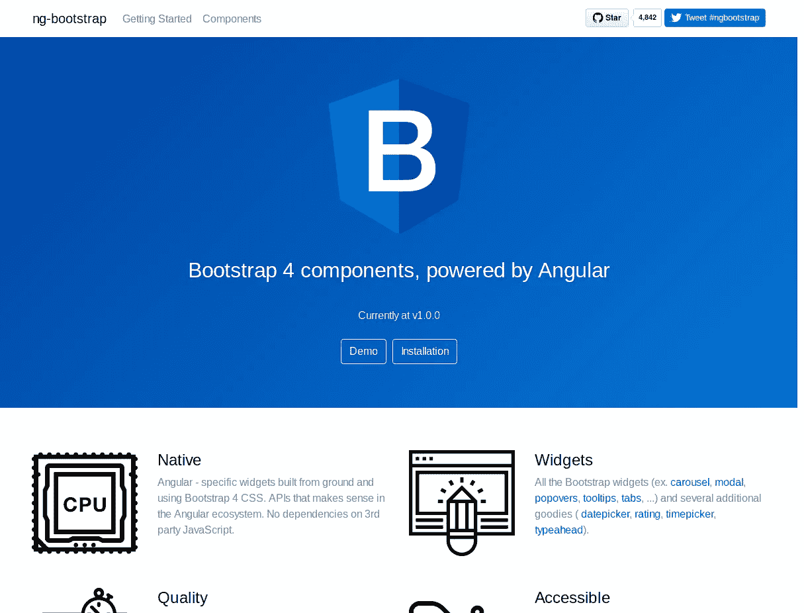
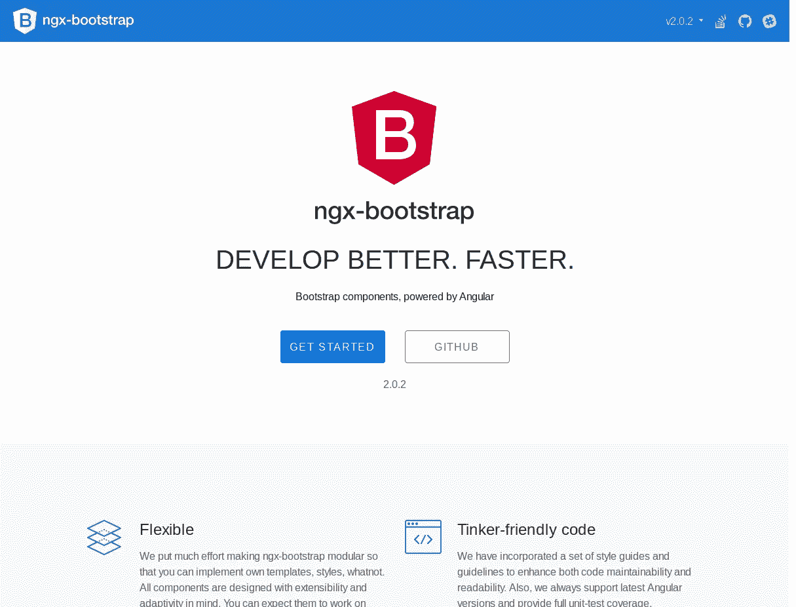

# 如何将引导程序添加到 Angular 14

> 原文：<https://itnext.io/using-bootstrap-4-with-angular-4-5-73e6637fb57f?source=collection_archive---------4----------------------->

Bootstrap 是最流行的 HTML 和 CSS 框架，用于轻松构建响应性布局，无需对 CSS 有深入的了解(但需要自定义 CSS 来定制您的设计，并使其不同于其他 Bootstrap 风格的网站，除非您使用的是专门为您开发的 BS 主题)。

Bootstrap 5 是最新版本，它为框架带来了许多新的强大特性。

Angular 14 最近发布了许多新功能。在本教程中，我们将看到如何使用 Bootstrap 来设计使用 [Angular 14 框架](https://webtips101.com/whats-new-angular-14/)构建的网站。我们将看到如何使用`ng-bootstrap` vs. `ngx-bootstrap`包，并使用 Angular CLI 生成一个全新的项目，来轻松集成这两者。

因此，让我们从安装 [Angular CLI](https://cli.angular.io/) 开始，以防它尚未安装在您的系统上。

转到您的终端或命令提示符，然后运行以下命令来安装最新版本的 CLI

```
$ npm install -g @angular/cli@latest
```

这将全局安装 CLI，因此根据您的 *npm* 配置，您可能需要添加 *sudo* (用于管理员访问)。

安装完成后，您将拥有 *ng* 实用程序。让我们用它来生成一个新的 Angular 14 项目。

这将为项目生成目录结构和必要的文件，并将安装依赖项。

接下来，在新创建的项目的根文件夹中导航

然后，您可以使用`ng serve`命令提供您的 Angular 14 应用程序:

您的应用将从`[http://localhost:4200/](http://localhost:4200/)`开始提供服务

有多种方法可以将引导程序添加到 Angular 中，我们将在本教程中实现其中一种。

现在回到你的终端，然后通过 npm 安装 Bootstrap 5

```
$ npm install --save bootstrap
```

这也将把*引导程序*添加到`package.json`中。

Bootstrap 4 资产安装在`node_modules/bootstrap`文件夹中，所以你需要在你的应用主 HTML 文件的头部包含 CSS 文件，或者在`style.css`中包含一个 *@import*

```
@import "~bootstrap/dist/css/bootstrap.css"
```

请注意，Bootstrap 5 并不依赖于 jQuery，只需要普通的 javascript 。

现在，如果您需要 Bootstrap 5 的完整功能，该怎么办呢？

你有不同的方法包括使用`.angular-cli.json`文件中的脚本数组来包含`bootstrap.js`，这是不推荐的

```
"scripts": [ "../node_modules/bootstrap/dist/js/bootstrap.js" ],
```

将[引导程序包含在 angular](https://efficientcoder.net/add-bootstrap-angular-14/) 中的另一个更好的替代方法是使用为了使引导程序与 angular 无缝工作而创建的组件库，如`ng-bootstrap`或`ngx-bootstrap`



> *我的项目应该添加 bootstrap.js 还是 bootstrap.min.js？不，ng-bootstrap 的目标是完全取代组件的 JavaScript 实现。也不应该包含其他依赖项，如 jQuery 或 popper.js。这是不必要的，可能会干扰 ng-bootstrap 代码* [*Source*](https://ng-bootstrap.github.io/#/getting-started)

因此，首先您需要使用以下命令从 npm 安装这个库:

```
npm install --save @ng-bootstrap/ng-bootstrap
```

完成安装后，您需要导入主模块。

```
import {NgbModule} from '@ng-bootstrap/ng-bootstrap';
```

接下来，您需要将导入的模块添加到您的应用程序根模块中

```
import {NgbModule} from '@ng-bootstrap/ng-bootstrap'; @NgModule({ declarations: [/*...*/], imports: [/*...*/, NgbModule.forRoot()], /*...*/ }) export class AppModule { }
```

请注意`ng-bootstrap`需要 Bootstrap 5 CSS 文件存在。

您可以将它添加到`.angular-cli.json`文件的样式数组中，如下所示:

```
"styles": [ "styles.css", "../node_modules/bootstrap/dist/css/bootstrap.css" ],
```

现在，您可以在 Angular 14 应用程序中使用 Bootstrap 5。

你可以通过这个[链接](https://ng-bootstrap.github.io/#/components/accordion/examples)找到所有可用的组件。

你也可以使用`ngx-bootstrap`库



简单地回到你的终端，确保你在 Angular 14 项目中，然后运行下面的命令来安装`ngx-bootstrap`

```
npm install ngx-bootstrap --save
```

您还需要 Bootstrap 5 CSS 文件。在 Angular 14 应用程序的`<head>`中添加以下代码行，其中包括来自 CDN 的引导程序:

```
<link href="https://maxcdn.bootstrapcdn.com/bootstrap/5.0.0/css/bootstrap.min.css" rel="stylesheet">
```

您也可以从 npm 安装 bootstrap，并使用前面的方法来包含 CSS 文件(通过`angular-cli.json`文件中的样式数组)

```
"styles": [ "../node_modules/bootstrap/dist/css/bootstrap.min.css", "styles.css" ],
```

接下来打开`src/app/app.module.ts`并添加

```
import { BsDropdownModule} from 'ngx-bootstrap/dropdown'; import { AlertModule } from 'ngx-bootstrap'; /*...*/ @NgModule({ /*...*/ imports: [BsDropdownModule.forRoot(),AlertModule.forRoot(), /*...*/ ], /*...*/ })
```

这是一个导入两个组件 *BsDropdownModule* 和 *AlertModule* 的例子。

您需要以同样的方式为每个想要使用的组件导入模块。

`ngx-bootstrap`在每个自己的模块中提供每个 BS 组件，因此您只需导入您需要的组件。这样你的应用会更小，因为它只捆绑了你实际使用的组件。

您可以从[文档](https://valor-software.com/ngx-bootstrap/#/getting-started)中找到所有可以使用的组件

# 结论

在本文中，我们已经看到了在 Angular 14 应用程序中包含 Bootstrap 5 的不同方式:使用来自 npm 的原始 Bootstrap 5 资产，使用`ng-bootstrap`库，最后使用`ngx-library`。

如果你想比较`ng-bootstrap`和`ngx-library`，最重要的一点是`ngx-library`如何为组件使用单独的模块来减少最终的应用程序大小。