# 在外部系统中使用 Box UI 元素

> 原文：<https://itnext.io/using-box-ui-elements-in-outsystems-bbf2806101ec?source=collection_archive---------6----------------------->

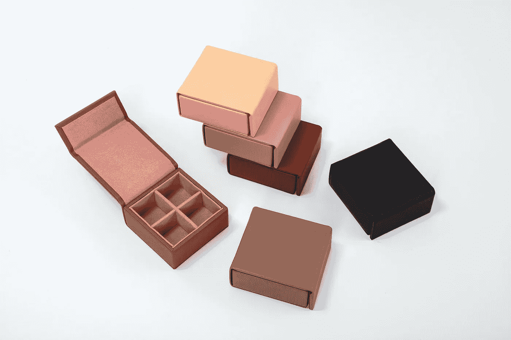

[言承旭](https://unsplash.com/@mountyanzhi?utm_source=unsplash&utm_medium=referral&utm_content=creditCopyText)在 [Unsplash](https://unsplash.com/s/photos/box?utm_source=unsplash&utm_medium=referral&utm_content=creditCopyText) 上拍照

Box.com 最近发布了 [Box UI Elements](https://developer.box.com/guides/embed/ui-elements//) 的 [v15](https://github.com/box/box-ui-elements/releases/tag/v15.0.0) ，所以让我给你介绍一下你可以在 [forge](https://www.outsystems.com/forge/component-overview/13069/box-ui-elements) 中找到的 Box UI Elements OutSystems 库。

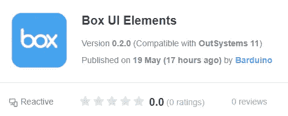

> Box UI 元素是预构建的 UI 组件，允许开发人员将主 Box web 应用程序的元素添加到他们自己的应用程序中。它们可以用来浏览、上传、预览和选择存储在 Box 上的内容，并且可以作为 React 组件和框架无关的 JavaScript 库使用。

如果你想完全控制与 Box 的交互，你应该使用 [Box REST API](https://developer.box.com/reference/) 。

然而，如果你正在寻找一种简单的方法来集成你的 web 应用程序和 Box，允许你的用户与他们的 Box 文件进行交互，这些 UI 元素可以快速实现这一点。

## 安全前沿和中心

请注意，您必须将访问令牌传递给这些组件，并且必须考虑安全性。

如果您的应用程序使用 OAuth 2.0 并对用户进行身份验证，那么权限属于用户本身。这意味着用户将无法使用这些组件做任何他们无法通过 Box.com 做的事情。即便如此，您也应该将令牌范围限制在适当的级别。

如果您的应用程序正在使用 JWT，那么访问令牌可能拥有比您打算用于这些组件的权限更多的权限。

无论哪种方式，都建议您**将访问令牌向下扫描**到该用途的权限级别。更多信息[点击这里](https://developer.box.com/guides/authentication/tokens/downscope/)。

所以让我们看看有什么可用的。

## 内容浏览器

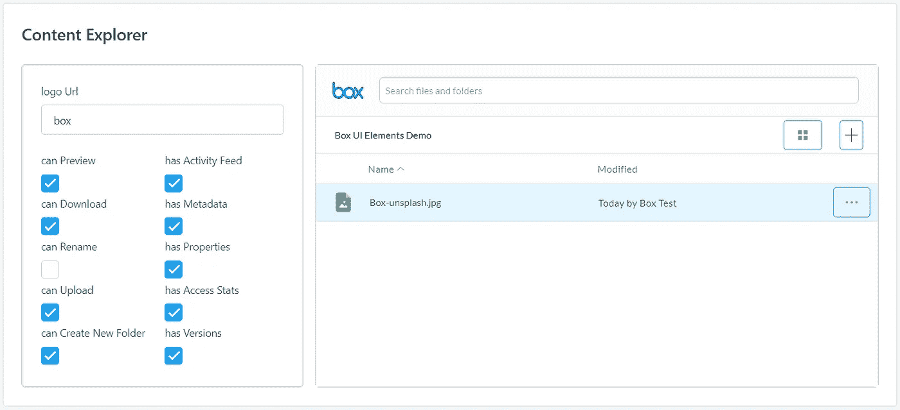

内容浏览器是一体化组件。它可以浏览、搜索、预览、下载、上传和创建新文件夹。

它还支持在预览文件时显示文件的哪些信息。

要使用它，你只需要几样东西:

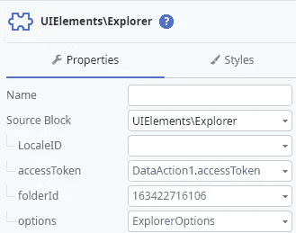

Locale:该组件可以本地化，并支持许多地区。然而，它需要完全重装。

访问令牌:从 API 获取一个。

文件夹:组件的初始文件夹和根文件夹。用户不能在此文件夹上导航。

选项:有大量的选项可以设置，详情请查看源代码。

## 试映

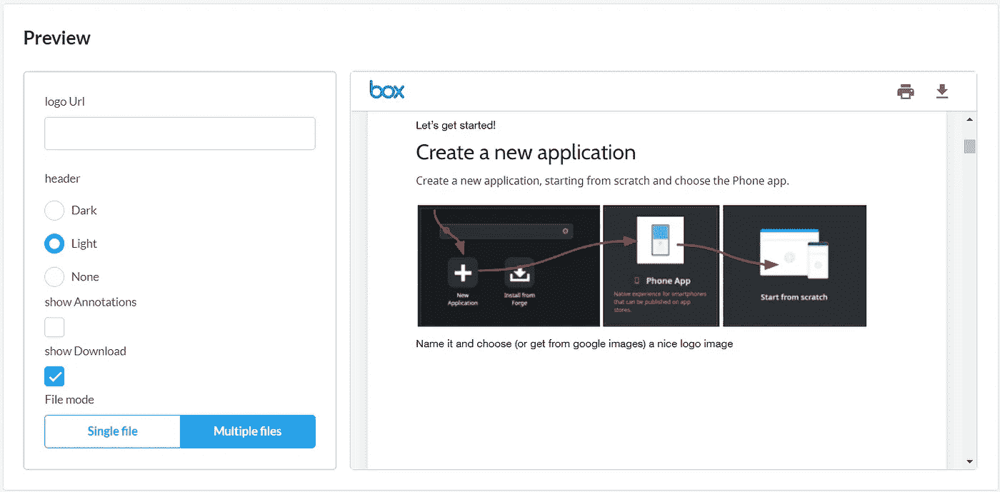

这是盒子收藏中最强大的组件之一。它可以预览 120 多种文件类型，包括大多数文档和图像格式、高清视频、3D 模型、360 度图像和 360 度视频。你可以在这里找到支持的文件类型的完整列表。

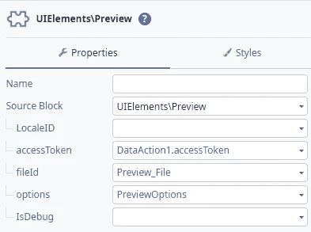

输入参数类似于 Explorer 元素，您可以指定要显示的文件 id。

或者，您可以指定一个文件 id 数组，用户可以像浏览画廊一样浏览列表。

## 补充报道

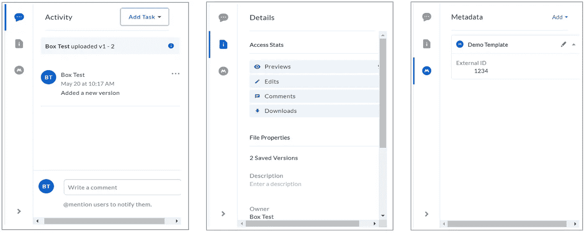

通常嵌入在浏览器中，可以在独立模式下使用。这个组件将显示一个文件的数据。

它可以显示活动，细节，元数据，甚至方块技能。

在文件预览旁边使用它，或者直接传递文件 id。

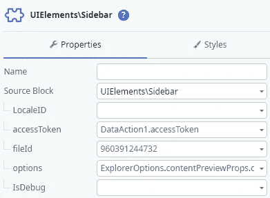

## 上传者

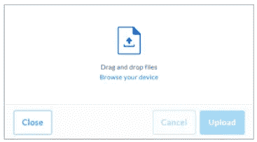

这个组件允许你嵌入一个上传部件，上传文件到一个文件夹中。

用户可以选择文件或使用拖放上传。大型文件将通过[分块上传](https://developer.box.com/reference/post-files-upload-sessions/) API 上传。

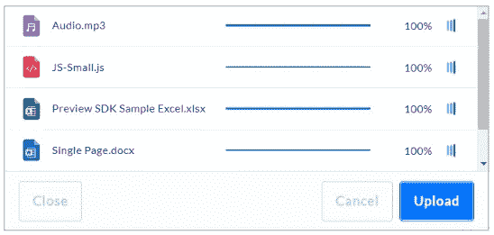

它为每个文件提供了一个很好的进度指示器。

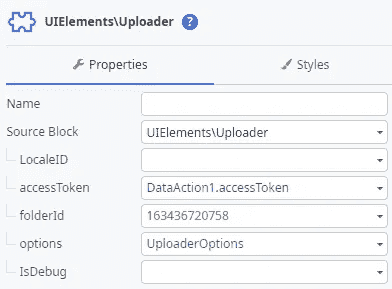

## 采摘者

此组件将允许您添加从框中选择文件和文件夹的支持。

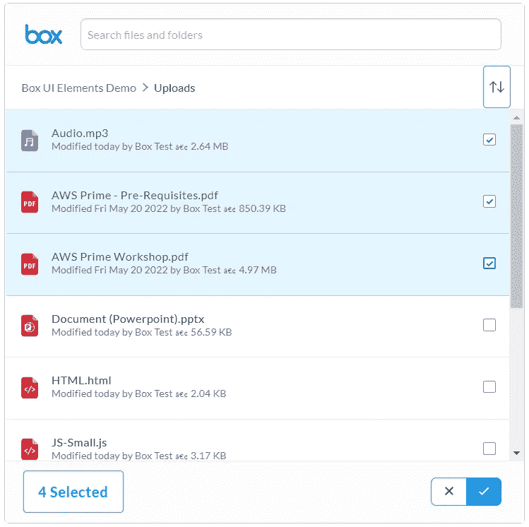

可以选择多个文件

用户可以选择文件或文件夹，当列表太长时，即使他们在文件夹之间导航或浏览页面，他们的选择也将被保留。

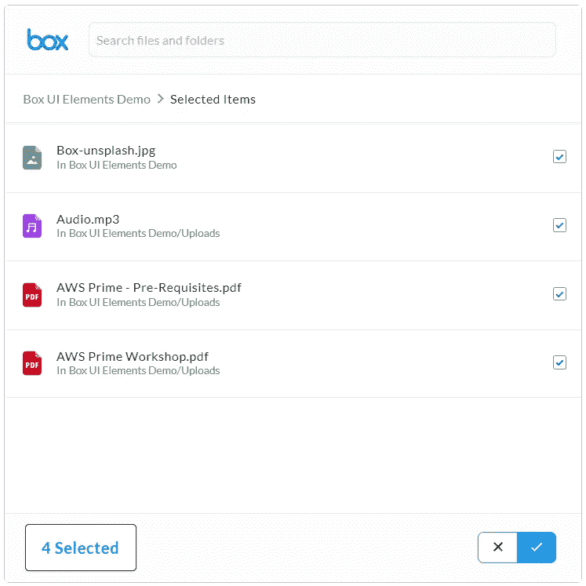

即使当导航到另一个文件夹时

## 把所有的放在一起

您可以任意组合使用 Box UI 元素，因为它们都只需要一个文件夹或文件标识。这些 id 可以作为对文档的引用存储在数据库中，可以从 API 中获取，也可以由用户选择。

用例非常广泛，这将在需要将用户文件上传到特定文件夹、允许用户快速确认文档中的信息或从 box 文件夹中挑选一组文档的应用程序中很好地工作。

我在所有文档管理中都看到了这种用法，例如，费用、合同审查、文档审批等。

一如既往，这在 [forge](https://www.outsystems.com/forge/component-overview/13069/box-ui-elements) 中可用，你可以试用一个[示例应用](https://rb-demos.outsystemscloud.com/BoxUIElementsTDD/)来演示如何使用这些组件。

现在你需要做的就是构建一些应用程序。